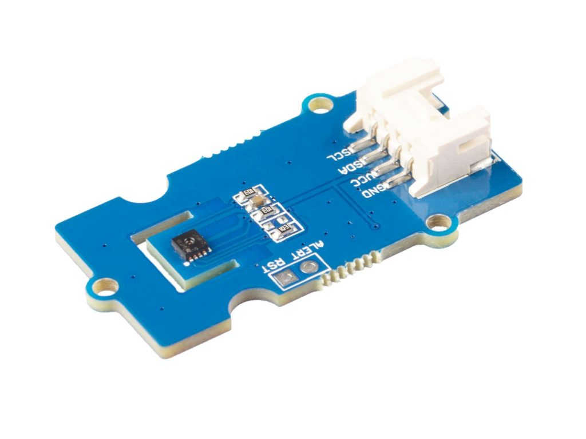
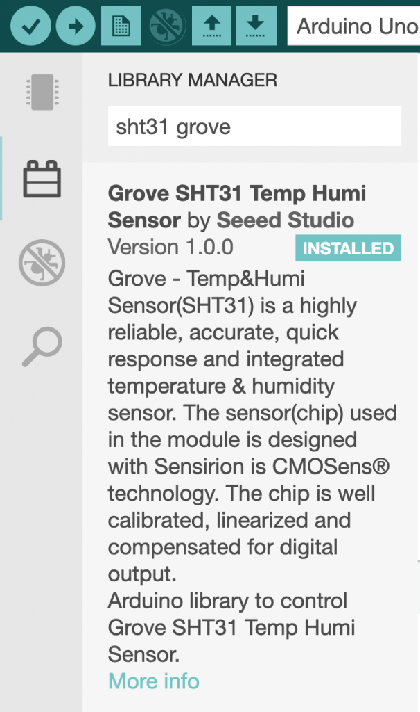
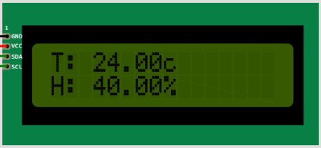
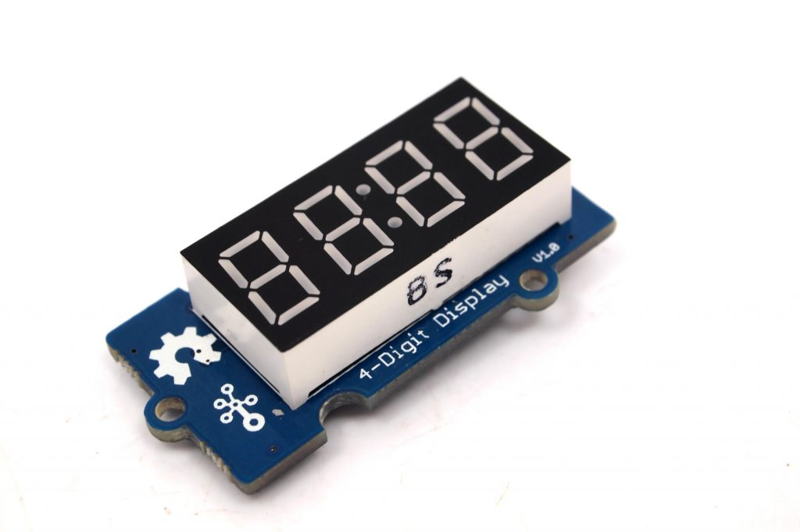
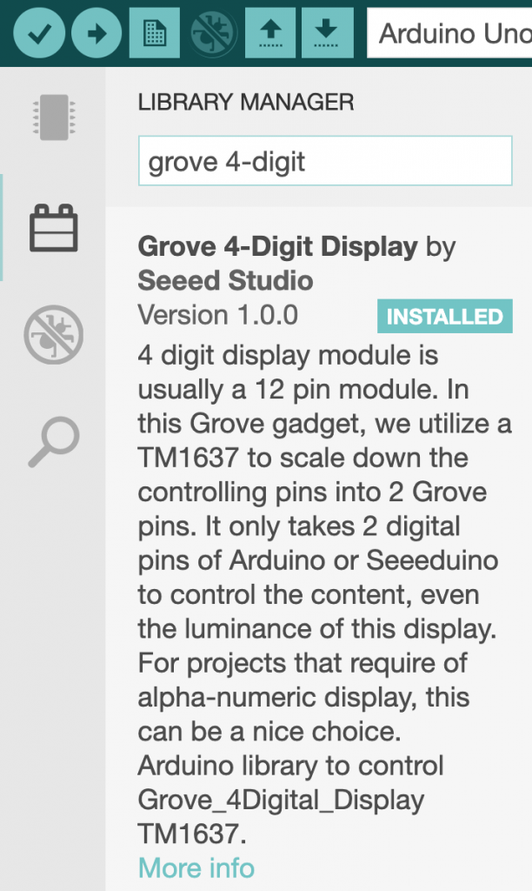
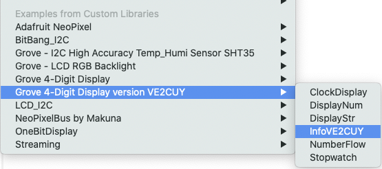
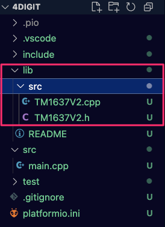
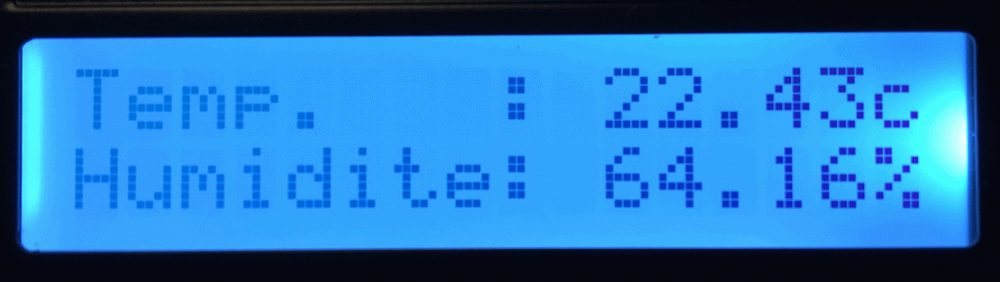
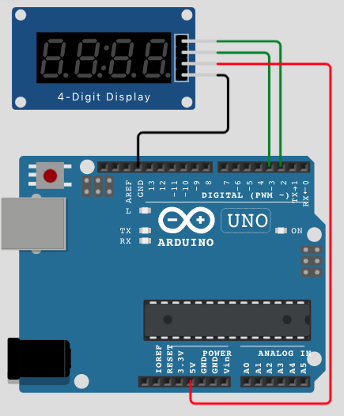

# SHT31 et TM1637

19 février 2025 - R/vision du 2025.12.12

# 1 – Le module humidité et température – SHT31

**Grove – I2C High Accuracy Temp&Humi Sensor ([SHT31](https://www.seeedstudio.com/Grove-I2C-High-Accuracy-Temp-Humi-Sensor-SHT35.html))**




## Type de connexion: I2C

---

## 1.1 – Description

Le module SHT31 propose deux capteurs en un; un capteur de température et un capteur d'humidité relative.

Ce capteur peut-être utilisé pour lire en temps réel la température et l'humidité d'une pièce.

**Note**: Il ne doit pas être exposé directement aux aléas du climat extérieure.

---

## 1.2 – Installation de la librairie

Comme pour les autres modules complexes de Grove, il faut installer une librairie de support pour le capteur SHT31.

Cette librairie est disponible directement à partir de l'option librairie de l'IDE 2.x d'Arduino ou de PlatformIO.



```
; platformio.ini
lib_deps = 
	seeed-studio/Grove SHT31 Temp Humi Sensor@^1.0.0
```

---

## 1.3 – Utilisation de la classe SHT31

### 1.3.1 – Librairie et déclaration et d'un objet de type SHT31

```
// Inclure la librairie pour I2C (le capteur SHT31 est de type I2C)
#include <Wire.h>
// Inclure la librairie pour le capteur de température et d'humidité SHT31
#include "SHT31.h"

// Déclarer un objet de type SHT31 pour pouvoir interagir avec le capteur à partir des méthodes 
// et des propriétés de la classe SHT31

SHT31 sht31;  // Déclaration 

// NOTE:  Il est aussi possible de déclarer un objet de la façon suivante:
SHT31 sht31 = SHT31();  // déclaration et création (instanciation)
```

### 1.3.2 – Initialiser un objet de type SHT31, la méthode *begin*()

```
 sht31.begin();
```

### 1.3.3 – Obtenir des valeurs de lecture de la température, la méthode *getTemperature*()

```
float temperature = sht31.getTemperature();
```

### 1.3.4 – Obtenir des valeurs de lecture de l'humidité, la méthode *getHumidity*();

```
float hum = sht31.getHumidity();
```

## 1.3.5 – Laboratoire


<br>


Écrire un programme qui affiche la température et l'humidité, captées par le module SHT31, dans la console série.

L'affichage est actualisé à toutes les trois secondes.

Voici un exemple du résultat souhaité:

```
Début du programme ...

La température actuelle est de 23.79C
L'humidité est à 63.33%
```

---

Variation, la fonction round(unFloat) permet d'arrondir un nombre et de laisser tomber sa partie décimale. Modifier le programme du labo 3.5 pour afficher que la partie entière de la température et de l'humidité.

## 1.3.6 – Laboratoire


<br>


Reprendre le labo précédent en y ajoutant l'affichage sur LCD.

---

## 1.4 – Lecture de la température sous Wokwi

### 1.4.1a – Code source

```
#include "DHT.h"
#include <Streaming.h>

#define DHTPIN            2     // Broche de connexion du capteur de température
#define UN_TI_MOMENT      500
#define VITESSE_UART      9600

#define MSG_DEBUT       "Début du programme de test de la DHT22"
#define MSG_TEMPERATURE "Température = "
#define MSG_HUMIDITE    ", Humidité = "   

// variable de contrôle du capture temp/hum.
DHT dht(DHTPIN, DHT22);

void setup() {
  Serial.begin(VITESSE_UART);
  Serial << MSG_DEBUT; 
  dht.begin();
}

void loop() {
  Serial << MSG_TEMPERATURE << dht.readTemperature() << "c";
  Serial << MSG_HUMIDITE << dht.readHumidity() << "%" << endl;
  // Attendre un ti moment ;-)
  delay(UN_TI_MOMENT);
}
```

### 1.4.1b – Code source – Anglais/Français

```
#define FRANCAIS        1
#define ANGLAIS         2
#define LANGUE          FRANCAIS

#include "DHT.h"
#include <Streaming.h>

#define DHTPIN            2     // Broche de connexion du capteur de température
#define UN_TI_MOMENT      500
#define VITESSE_UART      9600

#if (LANGUE == FRANCAIS)
  #define MSG_DEBUT       "Début du programme de test de la DHT22"
  #define MSG_TEMPERATURE "Température = "
  #define MSG_HUMIDITE    ", Humidité = "   
#endif

#if (LANGUE == ANGLAIS)
  #define MSG_DEBUT       "Start of test program for the DHT22"
  #define MSG_TEMPERATURE "Temperature = "
  #define MSG_HUMIDITE    ", Humidity = "  
#endif

// variable de controle du capture temp/hum.
DHT dht(DHTPIN, DHT22);

void setup() {
  Serial.begin(VITESSE_UART);
  Serial << MSG_DEBUT; 
  dht.begin();
}

void loop() {
  Serial << MSG_TEMPERATURE << dht.readTemperature() << "c";
  Serial << MSG_HUMIDITE << dht.readHumidity() << "%" << endl;
 // Attendre un ti moment ;-)
  delay(UN_TI_MOMENT);
}
```

### 1.4.2 – Schéma électronique Wokwi

```
{
  "version": 1,
  "author": "Alain Boudreault",
  "editor": "wokwi",
  "parts": [
    { "type": "wokwi-arduino-uno", "id": "uno", "top": 121.17, "left": 11.36, "attrs": {} },
    { "type": "wokwi-dht22", "id": "dht1", "top": -40.74, "left": 156.36, "attrs": {} }
  ],
  "connections": [
    [ "dht1:VCC", "uno:5V", "red", [ "v0.44", "h-178.66", "v267.43", "h185.24" ] ],
    [ "dht1:GND", "uno:GND.1", "black", [ "v25.91", "h-76.58" ] ],
    [ "dht1:SDA", "uno:2", "green", [ "v17.8", "h67.11" ] ]
  ]
}
```

Version Wokwi disponible [ici](https://wokwi.com/projects/345799457851310676)

---

## 1.5 – Utilisation d'une macro pour remplacer une fonction.

```
#include "SHT31.h"
SHT31 sht31;   

#ifdef ...
  #define lectureTemperature()    getTemperature()
#else
  #define lectureTemperature()    readTemperature()
#endif

void setup() {
   sht31.begin;
   float temperature = sht31.lectureTemperature();
}
```

---

## 1.6 – Labo: Application universelle (Arduino IDE/Wokwi)


<br>

Écrire une application universelle – C-A-D que l'application roule aussi bien sur Wokwi que sur Arduino IDE – qui affiche la température et l'humidité sur un LCD I2C 16×2.

## 1.6.2 – Version alternative du labo

* Écrire une application qui affiche la température et l'humidité sur un RGB\_LCD Grove
* Avec le potentiomètre, permet d'ajuster la vitesse d'affichage à l'écran de 100 à 1000 millisecondes.
  + La valeur du délai doit être affichée sur les quatre dernières positions de la deuxième ligne du LCD en utilisant le format 0000.



---

# 2 – Le module [4-Digit Display](https://wiki.seeedstudio.com/Grove-4-Digit_Display/) – TM1637



## Type de connexion: digitale (2 gpio)

---

## 2.1 – Description

Ce module permet un affichage alpha numérique à partir de 7 segments de type LED. Il est habituellement utilisé pour l'affichage des nombres de 0 à 9. Il peut aussi être employé pour présenter certain caractères alphabétiques.

Il faut habituellement 7 signaux digitaux pour contrôler un seul affichage 7 segments. Le module Grove en possède 4, ce qui amène le nombre de signaux à 14 (certains signaux sont réutilisés, par multiplexage, entre les affichages).

Étant donné le nombre restreint de GPIO disponible sur l'Arduino Uno, le module Grove 4-Digit display utilise la puce [TM1637](https://www.mcielectronics.cl/website_MCI/static/documents/Datasheet_TM1637.pdf) pour réduire ce nombre à 2 GPIO. Il faudra donc installer une [librairie](https://www.arduino.cc/reference/en/libraries/tm1637/) pour piloter cette puce.


## 2.2 – Installation des librairies

**ATTENTION**: **Ne pas installer cette version de la librairie mais plutôt celle qui est proposée à l'étape 2.2.2.**



**NOTE**: Les méthodes de la classe TM1637 de Grove sont limités en fonctionnalités. Une librairie alternative, qui supporte le module Grove est celle de Avishorp.

Voici la dépendance à utiliser sous PlatformIO:

```
lib_deps = smougenot/TM1637@0.0.0-alpha+sha.9486982048
```

[Lien vers la librairie](https://github.com/Seeed-Studio/Grove_4Digital_Display/archive/master.zip)

Tester avec l'exemple infoVE2CUY




---

## 2.2.1 – Installation manuelle d'une librairie

### 2.2.1.1 – Localiser, télécharger et installer une librairie

**Localiser**

Par exemple, librairie pour le module [TH06](https://github.com/Seeed-Studio/Grove_Temper_Humidity)

**Télécharger**


**Installer**

Décompresser le fichier Zip et déplacer dans le dossier '***libraries***' d'Arduino:

* Sous Windows: ***Mes Documents/Arduino/libraries***
* Sous MacOS: ***User/Documents/Arduino/libraries***
* Sous Linux: ***/home/user/Arduino/libraries***

---

## 2.2.2 – Installer la librairie TM1637V2 adaptée par VE2CUY

[Lien vers la librairie](https://github.com/ve2cuy/ve2cuy-Grove_4Digital_Display_V2)

---

## 2.2.2.1 – 👉 Installer la librairie sous PlatformeIO

* Créer un dossier 'src' sous le dossier 'lib' du projet
* Y copier les fichiers de la librairie (.cpp, .h, …)
* **NOTE**: Chaque librairie doit-être placée dans un dossier différent. Voir l'exemple du fichier README dans le dossier 'lib'.



---

## 2.3 – Utilisation de la classe TM1637V2

### 2.3.1 -Utilisation de la librairie et déclaration d'un objet de type TM1637V2

```
#include "TM1637V2.h"

// Définitions des broches pour la TM1637
// La puce TM1637 nécessite deux broches pour fonctionner.
// Note:  Le connecteur D6 du Hat Grove donne accès aux broches 6 et 7
const int CLK = 6;  // Broche utilisée pour la synchronisation entre TM1637 et Arduino
const int DIO = 7;  // Broche utilisée pour le transfert des données.

// Création d'un objet de type TM1637 à partir du constructeur de la classe
TM1637V2 tm1637(CLK, DIO);
```

**NOTE**: Il est possible d'utiliser tous les connecteurs **D2..D8** du Hat de Grove. Ils proposent tous deux broches GPIO par connecteur. Il suffit de renseigner correctement les constantes **CLK** et **DIO**.

🛑 **Par contre, le connecteur digital suivant ne sera plus disponible pour le montage.**

Par exemple,

Un module TM1637 connecté sur D6 occupera un des circuits de D7 ce qui invalidera son utilisation.

---

### 2.3.2 – Initialiser un objet de type TM1637 et renseigner l'intensité

```
// Initialiser l'objet tm1637 
tm1637.init();
// Ou bien .begin() disponible dans la version Ve2cuy de la librairie.

// Renseigner l'intensité d'affichage
// BRIGHT_TYPICAL = 2, BRIGHT_DARKEST = 0, BRIGHTEST = 7;
// Ou bien ECRAN_FAIBLE, ECRAN_MOYEN, ECRAN_FORT dans la version V2.
tm1637.set(ECRAN_FORT);
```

### 2.3.3. – Afficher un nombre sur le module 4-Digit, la méthode displayNum()

```
int   unEntier = 123;
float pi       = 3.1415;
// Afficher sans la partie décimale.
tm1637.displayNum(pi);    // Affiche: 3
delay(1500);

// Afficher une décimale (sans point ou virgule).
tm1637.displayNum(pi, 1); // Affiche: 31
delay(1500);

// Afficher deux décimales - (affiche un ':' comme séparateur).
tm1637.displayNum(pi, 2); // Affiche: 3:14
delay(1500);

// Afficher un nombre négatif.
tm1637.displayNum(unEntier * -1);
delay(1500);

// Afficher un nombre négatif sans signe.
tm1637.displayNum(-555, 0, false);
```

### 2.3.4 – Afficher les multiples de 2, par multiplication

```
#include "TM1637V2.h"

const int CLK = 6, DIO = 7;

TM1637V2 tm1637(CLK, DIO);

void setup() {
    tm1637.init();
    tm1637.set(7);  // Intensité maximum
} // setup

void loop() {
    static int nombre = 2;
    tm1637.displayNum(nombre);
    nombre *= 2;
    if (nombre > 8192) {
        while(true);  // Boucle sans fin ...
    } // if
    delay(500);
} // loop
```

### 2.3.5 – Afficher les multiples de 2, par décalage des bits vers la gauche

```
void loop() {
    static int nombre = 1;
    tm1637.displayNum(nombre);
    nombre <<= 1;  // Décaler (shift) les bits de 'nombre' d'une position vers la gauche
    if (nombre > 8192) {
        nombre = 2;
    }
    delay(500);
}
```

### 2.4 – Afficher des chaines de caractères, la méthode displayStr()

```
#include "TM1637V2.h"
#define DELAI_ENTRE_LES_EXEMPLES  2000
#define DELAI_FIN                 500

// Définition des broches pour la TM1637
const int CLK = 6, DIO = 7;
TM1637V2 tm1637(CLK, DIO);

void setup() {
    tm1637.init();
    tm1637.set(BRIGHT_TYPICAL);

    Serial.begin(9600);
    Serial.println(tm1637.info());
   
    tm1637.displayStr("toto");
    delay(DELAI_ENTRE_LES_EXEMPLES);

    // loop
    tm1637.displayStr("Bonjour 420-1C4", 300);  // 500 est la valeur par défaut
    delay(DELAI_ENTRE_LES_EXEMPLES);

    // ON
    tm1637.displayStr("0N");
    delay(DELAI_ENTRE_LES_EXEMPLES);

    // OFF
    tm1637.displayStr("0FF");
    delay(DELAI_ENTRE_LES_EXEMPLES);
}

void loop() {
    // Effacer l'affichage
    tm1637.clearDisplay();
    delay(DELAI_FIN);
    tm1637.displayStr("Fin");
    delay(DELAI_FIN);
}
```

---

## 2.5 – Laboratoire (40 minutes)


<br>


* Écrire une application qui affiche, sur le module **4-digit** de Grove, sous forme de chaine de caractères, la **température** et **l'humidité** en respectant la forme suivante:

**T-99c – H-99p**

* L'affichage doit être réactualisé continuellement.
* Le délai déplacement des caractères vers la gauche doit-être fixé à 333 millisecondes.

**Astuces**

* Utiliser la fonction ***sprintf***() pour construire le message à afficher.
* Utiliser la fonction ***round***() pour convertir les **float** en **int**. Rappel, **sprintf**() d'Arduino ne supporte pas le type **float**.
* Il est possible de souffler délicatement sur le capteur pour faire varier les valeurs de température et humidité.

## Défi facultatif supplémentaire (20 minutes)

Le module **4-Digit** ne supporte pas l'affichage de '.' ou ',' et la fonction **sprintf** d'Arduino ne supportent pas les **float**.

Il n'est donc pas possible d'afficher les décimales de la température ou de l'humidité.

**Modifier** l'application précédente pour afficher sur le ***rgb\_lcd*** les informations suivantes:

```
Ligne 1: Temp.   : 99,99c
Ligne 2: Humidite: 99,99%
```

**Astuces**

* La fonction [**dtostrf**()](https://www.programmingelectronics.com/dtostrf/) permet de convertir un float en chaine de caractère.
* Pour insérer le caractère '%' avec sprintf(), il faut le doubler « %% ».

Par exemple,

```
char resultat[17];  // Longueur d'une ligne du LCD + 1
float humidite = 45.55;
char chaine[6]; // Variable pour convertir le float. 6 = Longueur totale de la chaine + 1
dtostrf(pi,5,2,chaine); // 5 = longueur du nombre incluant le point, 2 = le nombre de décimales

sprintf(resultat, "Humidite = %s%%", chaine);  // Va produire:  Humidite = 45.55%
```

* Autre possibilité pour la conversion, utilisation de la librairie Streaming.

**Résultat**



---

## 2.6 – TM-1637 sur Wokwi



```
// Exemple d'un compteur TM1637 7 Segments sur Wokwi 

#include <TM1637.h>. // Grove 4-Digit Display à ajouter de le gestionnaire de lib.

const int CLK = 2;
const int DIO = 3;

TM1637 tm(CLK, DIO);

void setup() {
  tm.init();
  tm.set(BRIGHT_TYPICAL);
}

unsigned int counter = 0;

void loop() {
  tm.display(0, (counter / 1000) % 10);   // Afficher les milliers
  tm.display(1, (counter / 100) % 10);    // Afficher les centaines
  tm.display(2, (counter / 10) % 10);     // Afficher les dizaines
  tm.display(3, counter % 10);            // Afficher les unités

  counter++;
  if (counter == 10000) {
    counter = 0;
  }

  delay(100);
}
```

---

## Crédits

*Document rédigé par Alain Boudreault © 2021-2026*  
*Version 2025.12.12.1*  

*Contenu par [VE2CUY](http://ve2cuy.com/blog)*
