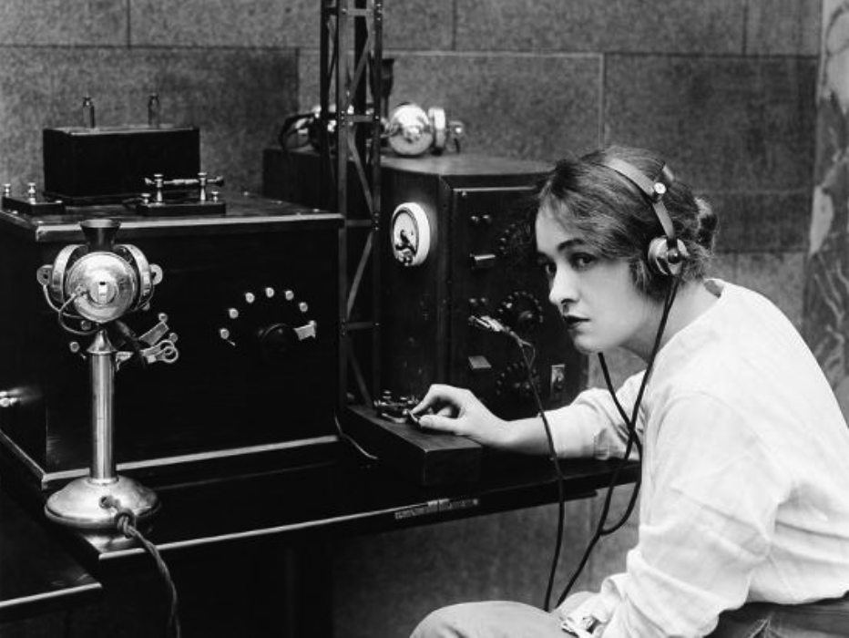
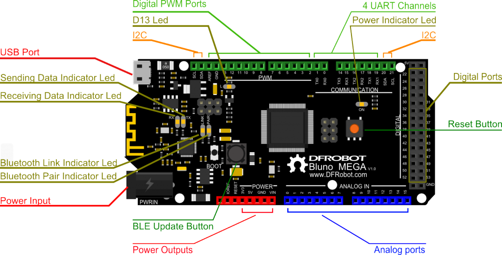
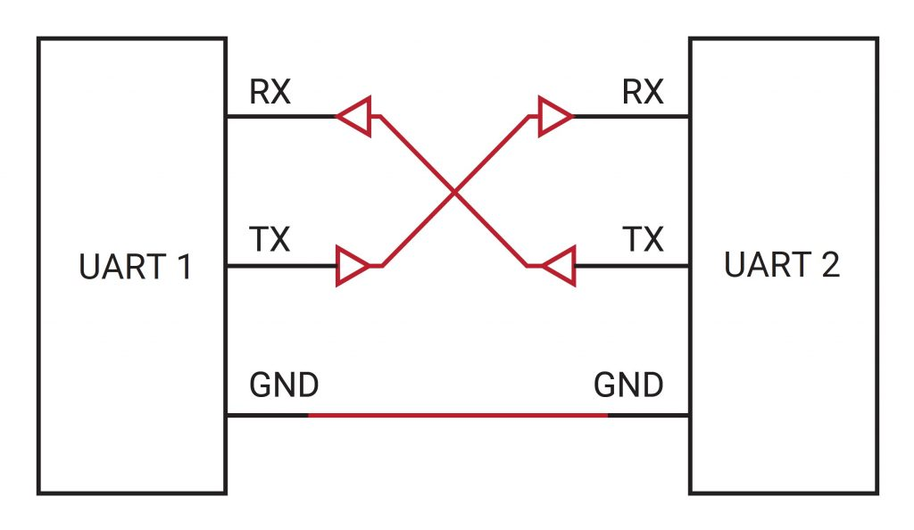
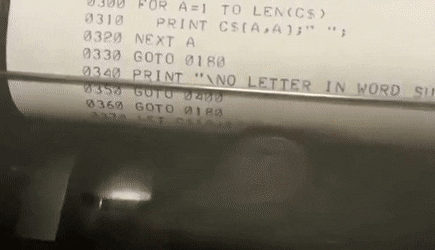
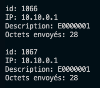
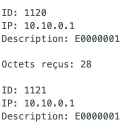

# Écoute-moi, j'aimerais te parler

24 mars 2025

## Communication entre deux Arduino



---

## 1 – Mise en situation

Dans les exemples suivants, nous verrons comment transmettre des informations d'un ***Arduino*** vers un autre en utilisant le protocole série (**UART** / **RS-232** / **COM PORT**).

Le protocole série utilise deux broches pour l'échange des données; une broche pour la réception (**RX**) et une broche pour la transmission (**TX**)

Dans le cas d'un Arduino Uno ces broches sont **D0 (RX0)** et **D1 (TX0)**.

**L'Arduino Uno ne possède qu'un seul port série.**

De plus, si nous utilisons la console série pour y afficher des messages alors le port série du **UNO** ne sera pas disponible pour le transfert d'information vers d'autres appareils.

**Ce n'est pas le cas pour tous les Arduino**.

Par exemple, l'**Arduino Mega** propose 4 ports séries (UART0-UART3).




---

### 1.1 – Simulation d'un port série via la librairie SotfwareSerial

Il est possible d'utiliser des broches digitales standards pour reproduire le comportement et les fonctions d'un port UART en utilisant la librairie ***SotfwareSerial***. Cette librairie est disponible par défaut dans l'environnement de ***Arduino IDE***, c-a-d, qu'il n'est pas nécessaire de l'installer.

---

### 1.2 – Connexion de deux appareils pour la communication via UART

Si nous désirons relier deux appareils ensemble qui utiliseront leur port UART pour la communication, il faut relier la broche RX du premier sur la broche TX du deuxième. Puis la broche TX du premier sur la broche RX du deuxième.



Avec l'utilisation du Grove Hat, il sera possible d'inverser les broches RX/TX dans les paramètres de configurations du port UART logiciel.

Par exemple, deux Arduino UNO reliés par un câble sur le port D4 du Hat Grove pourront être configurés de la façon suivante:

```
SoftwareSerial portSerieTransmetteur(4, 5); // RX, TX
SoftwareSerial portSerieRecepteur(5, 4);    // RX, TX
```

---

## 2a – Communication entre deux Arduino via UART physique

**NOTE**: Pour l'exemple suivant, il est important d'utiliser le câble avec les fils blanc et jaune inversés.

Il faut relier le Mega et le Uno de la façon suivante:

* Le port UART0 du Uno branché sur
* le port UART2 du Mega

### 2a.1 – Le code du transmetteur (UNO)

```
/*
  Relier deux Arduino via le port UART physique
  Code du transmetteur - sur le UNO
  NOTE: Il est important d'utiliser le câble avec les fils blanc et jaune inversés
  */

#include <Arduino.h>
#include "rgb_lcd.h"
#include "Streaming.h"

#define UART_RX             6
#define UART_TX             7
#define UART_VITESSE        9600
#define MAX_NB_ALEATOIRE    99
#define UNE_SECONDE         1000
#define LCD_DEUXIEME_LIGNE  1
#define LCD_NB_LIGNE        2
#define LCD_NB_COL          16
#define transmetteur        Serial

rgb_lcd lcd;

//--------------------------------------------------------
void setup() {
  // port natif utilisé pour la transmission vers le Mega
  transmetteur.begin(UART_VITESSE); 
  lcd.begin(LCD_NB_COL,LCD_NB_LIGNE);
  lcd.print("Transmetteur");
} // setup()

//--------------------------------------------------------
void loop() {
   // Transmettre un code à chaque seconde  
   // générer un nombre entre 0 et MAX_NB_ALEATOIRE - 1
   byte unCode = random(MAX_NB_ALEATOIRE); 
   transmetteur.write(unCode);
   lcd.setCursor(0, LCD_DEUXIEME_LIGNE);
   lcd << "Envoi de: " << unCode;
   delay(UNE_SECONDE);
} // loop()

/*
[env:uno]
platform = atmelavr
board = uno
framework = arduino
lib_deps =
  seeed-studio/Grove - LCD RGB Backlight @ ^1.0.2
  mikalhart/Streaming @ ^1.0.0
*/
```

**NOTE** **—>** : Il est préférable que les deux Arduino ne soient pas reliés ensemble lors du téléversement vers le UNO. Le port '***Serial0***' sert à programmer les Arduino.

---

### 2a.2 – Le code du récepteur (MEGA)

```
#include <Arduino.h>
/*
 Code du récepteur - sur le Mega
*/

#define UART_VITESSE        9600
// Le RX du UNO doit être connecté au TX du MEGA et TX -> RX
// Utiliser le cable avec les fils jaune et blanc inversés
// Connecter le UNO sur le port Serial2 du MEGA
#define recepteur           Serial2 

//--------------------------------------------------------
void setup() {
  Serial.begin(UART_VITESSE);
  Serial.println("Démarrage du récepteur...");
  recepteur.begin(UART_VITESSE);
}

//--------------------------------------------------------
void loop() {  
  byte unCode;
  if (recepteur.available()) {
    unCode = recepteur.read();
    // afficher la valeur du byte reçu
    Serial.print("Code recu = ");
    Serial.println(unCode);
   } // si byte disponible sur le UART
}
```

---

## 2a.3 – Laboratoire


<br>

A – Il faut modifier le code précédent pour permettre une transmission/réception de 115200 bauds.

Est-ce que le montage fonctionne à cette vitesse? Si oui, Est-ce que la réception est fidèle?

B – Et pour une vitesse de 256000 bauds?

---

## 2b – Connexion via SoftwareSerial

Pour le prochain laboratoire, il faut relier un **Arduino Mega** et un **Arduino UNO** en plaçant un câble entre les les connecteurs **D6 (UNO) et D10 (MEGA)**. Nous utiliserons une connexion UART simulée par logiciel en utilisant la librairie '***SoftwareSerial***'.

Rappel, il faut inverser les signaux:

```
SoftwareSerial portSerieTransmetteur(6, 7); // RX, TX
SoftwareSerial portSerieRecepteur(11, 10);  // RX, TX
```

### 2b.1 – Code source du transmetteur – le UNO

```
/*
  Relier deux Arduino via le port UART physique
  Code du TRANSMETTEUR - sur le UNO
*/

#include <Arduino.h>
#include "rgb_lcd.h"
#include "Streaming.h"
#include <SoftwareSerial.h>

#define UART_RX             6
#define UART_TX             7

#define UART_VITESSE        9600
#define MAX_NB_ALEATOIRE    99
#define UNE_SECONDE         1000
#define LCD_DEUXIEME_LIGNE  1
#define LCD_NB_LIGNE        2
#define LCD_NB_COL          16

rgb_lcd lcd;
SoftwareSerial transmetteur(UART_RX, UART_TX); // RX, TX

//--------------------------------------------------------
void setup() {
  Serial.begin(UART_VITESSE); // Disponible pour les traces dans cet exemple!
  Serial << "Démarrage du transmetteur..." << endl;

  transmetteur.begin(UART_VITESSE); 
  lcd.begin(LCD_NB_COL,LCD_NB_LIGNE);
  lcd.print("Transmetteur");
} // setup()

//--------------------------------------------------------
void loop() {
   // Transmettre un code à chaque seconde  
   // générer un nombre entre 0 et MAX_NB_ALEATOIRE - 1
   byte unCode = random(MAX_NB_ALEATOIRE); 
   Serial << "Envoi de: " << unCode << endl;
   transmetteur.write(unCode);
   lcd.setCursor(0, LCD_DEUXIEME_LIGNE);
   lcd << "Envoi de: " << unCode;
   delay(UNE_SECONDE);
} // loop()
```

### 2b.2 – Code source du récepteur – Le Mega

```
/*
 Code du RECEPTEUR - sur le Mega
*/

#include <Arduino.h>
#include <SoftwareSerial.h>

#define UART_VITESSE        9600
// Le UNO et le MEGA sont reliés par les ports D6/D7 <-> D11/D10
// ATTENTION aux ports disponibles sur le MEGA pour SoftwareSerial  
#define UART_RX             10 
#define UART_TX             11

SoftwareSerial recepteur(UART_TX, UART_RX); // l'inverse du transmetteur

// --------------------------------------------------------
void setup() {
  Serial.begin(UART_VITESSE);
  Serial.println("Démarrage du récepteur...");
  recepteur.begin(UART_VITESSE);
}

// --------------------------------------------------------
void loop() {  
  byte unCode;
  if (recepteur.available()) {
    unCode = recepteur.read();
    // afficher la valeur du byte reçu
    Serial.print("Code recu = ");
    Serial.println(unCode);
   } // si byte disponible sur le UART
}
```

Résultat:

```
Démarrage du récepteur...
Code recu = 82
Code recu = 64
Code recu = 87
...
```

---

**NOTE IMPORTANTE:**

L'**Arduino MEGA** ne permet pas d'implémenter le **UART**, via la librairie ***SoftwareSerial***, en mode réception sur toutes ses broches. Il faut se limiter aux broches suivantes:

* **10, 11, 12, 13, 14, 15, 50, 51, 52, 53, A8 (62), A9 (63), A10 (64), A11 (65), A12 (66), A13 (67), A14 (68) et A15 (69).**

Par contre, en mode transmission, il n'y a pas cette contrainte.

Il n'y pas non plus de contraintes si nous utilisons les ports natifs **UART** du **MEGA**.

De plus, sur certains **Arduino**, la vitesse **MAXIMUM** de transmission est limitée à **57600bps**.

---

Documentation de la classe **::** [SoftwareSerial](https://docs.arduino.cc/learn/built-in-libraries/software-serial)

---

## 2.5 – Laboratoire



Il faut modifier les vitesses de transmission/réception de l'exemple précédent à 115 200 bauds et tester le système.

**Question**: Est-il toujours fonctionnel?

Et pour **57600**?

---

## 2.6 – Laboratoire


<br>

Il faut relier les deux Arduino par leur port natif **UART**; 1) Mega sur Serial3 et 2) UNO sur Serial.

**Note**: Il ne faut plus afficher dans la console série du projet UNO, seulement sur l'écran LCD.

**Question**: Est-ce que le système est toujours fonctionnel? Si non, il faut expliquer pourquoi.

```
// Exemple d'initialisation du UART no 3 sur le MEGA:
Serial3.begin(9600);
```

---

## 3 – Transmission d'une chaine de caractères

La méthode Serial.print() est utilisée pour envoyer une chaine de caractères, de la même façon que nous affichons dans le terminal série.

Pour la réception, nous utiliserons le méthode [Serial.readString()](https://www.arduino.cc/reference/fr/language/functions/communication/serial/readstring/).

### 3.1 – Code source du transmetteur (UNO)

```
/*
  Laboratoire 3: Réception/transmission d'une chaine de caractères
  Code du TRANSMETTEUR - sur le UNO
*/

#include <Arduino.h>
#include "rgb_lcd.h"
#include "Streaming.h"
#include <SoftwareSerial.h>

#define UART_RX             6
#define UART_TX             7

#define UART_VITESSE        9600
#define UNE_SECONDE         1000
#define LCD_DEUXIEME_LIGNE  1
#define LCD_NB_LIGNE        2
#define LCD_NB_COL          16

rgb_lcd lcd;
SoftwareSerial transmetteur(UART_RX, UART_TX); // RX, TX

const String messages[] = {
  "Haddock", 
  "Tournesol", 
  "Dupond et Dupont", 
  "Tintin",
  "Milou",
  "Bachi-bouzouk",
  "Boit-sans-soif",
  "Brontosaure",
  "Calembredaine",
  "Cataplasme",
  "Clysopompe",
  "Cornemuse",
  "Cornichon",
  "Cyclotron"
};

//--------------------------------------------------------
void setup() {
  Serial.begin(UART_VITESSE); // Disponible pour les traces dans cet exemple!
  Serial << "Démarrage du transmetteur..." << endl;
  Serial << "Il y a " << sizeof(messages) / sizeof(messages[0]) << " messages disponibles." << endl;  
  transmetteur.begin(UART_VITESSE); 
  lcd.begin(LCD_NB_COL,LCD_NB_LIGNE);
  lcd.print("Transmetteur");
} // setup()

//--------------------------------------------------------
void loop() {
   // Envoyer un message aléatoire à toutes les secondes:
   byte unCode = random(sizeof(messages) / sizeof(messages[0]));
   transmetteur.print(messages[unCode]);
   Serial << "Envoi du message suivant: " << messages[unCode] << endl;
   lcd.setCursor(0, LCD_DEUXIEME_LIGNE);
   lcd << "Envoi du msg: " << unCode << " ";
   delay(UNE_SECONDE * 2);
} // loop()
```

Résultat:

```
Démarrage du transmetteur...
Il y a 14 messages disponibles.
Envoi du message suivant: Brontosaure
Envoi du message suivant: Cataplasme
Envoi du message suivant: Boit-sans-soif
...
```

### 3.2 – Code source du récepteur (MEGA)

```
/*
 Laboratoire 3: Réception/transmission d'une chaine de caractères
 Code du récepteur (MEGA)
 Version chaine de caractères
*/

#include <SoftwareSerial.h>
#include "Streaming.h"

// Le RX du UNO doit être connecté au TX du MEGA et TX -> RX
// Il faut donc inverser les signaux:
#define UART_RX             10
#define UART_TX             11
#define UART_VITESSE        9600
#define UNE_SECONDE         1000

SoftwareSerial recepteur(UART_TX, UART_RX); // RX, TX

// --------------------------------------------------------
void setup() {
  Serial.begin(UART_VITESSE);
  Serial.println("Démarrage du récepteur...");
  // Initialiser le port serie 'SoftwareSerial'
  recepteur.begin(UART_VITESSE);
}

// --------------------------------------------------------
void loop() {  
  String unMessage;
  if (recepteur.available()) {
    // delay(50); // attendre la réception des données
    Serial << "Il y a " << recepteur.available() << " octets disponibles." << endl; 
    unMessage = recepteur.readString();
    // afficher les données lues
    Serial << "Message recu = " << unMessage << endl;
  } // si données disponibles sur le UART
}
// Fin du code
```

Résultat:

```
Démarrage du récepteur...
Il y a 2 octets disponibles.
Message recu = Cornemuse
Il y a 1 octets disponibles.
Message recu = Tournesol

// Note: Nous allons insérer un petit délai pour permettre au message d'être entièrement reçu.

  if (recepteur.available()) {
    delay(50); // attendre la réception des données

// Résultat:
Démarrage du récepteur...
Il y a 7 octets disponibles.
Message recu = Haddock
Il y a 13 octets disponibles.
Message recu = Calembredaine
```

---

## 3.5 – 💡 Transmission d'une structure de données

Étant donné la structure suivante:

```
struct lesDonnees {
  int id;  // Occupe 2 octets en mémoire.
  char ip[16];
  char description[10];
};  // longueur de la structure = 28 octets

// Définir un objet de type structure
lesDonnees mesDonnees = {1, "10.10.0.1", "E0000001"};
```

Voici un exemple de transmission d'une structure de données entre deux Arduino reliés par un port UART (UART2 du MEGA) et un SoftwareSerial (UNO).l

### 3.5.1 – Le transmetteur – (UNO sur SoftwareSerial:D6/D7)

```
/*
    Arduino UNO 
    Le transmetteur, via SoftwareSerial sur D7 et D6
*/

#include <Arduino.h>
#include <SoftwareSerial.h>
#include "Streaming.h"

#define DELAI_ENTRE_TRANSMISSION  1000

// Définir les pins pour la communication SoftwareSerial
SoftwareSerial lienAvecRecepteur(7, 6); // RX, TX

// ATTENTION: Le buffer de Serial à un maximum de 64 octets.
struct lesDonnees {
  int id;
  char ip[16];
  char description[10];
};
// Définir un objet de type structure
lesDonnees mesDonnees = {1, "10.10.0.1", "E0000001"};

// ----------------------------------------------------------------
void setup() {
  // Initialiser la communication série avec l'ordinateur
  // Pour les traces au moniteur
  Serial.begin(9600);
  
  // Initialiser la communication SoftwareSerial vers le récepteur
  lienAvecRecepteur.begin(57600);
  
  Serial << "Démarrage de la transmission des données...\n";
} // setup

// ----------------------------------------------------------------
void loop() {
  static int compteur=0;
  mesDonnees.id = compteur++;
  Serial << "\nid: " << mesDonnees.id << "\nIP: " << mesDonnees.ip << "\nDescription: " << mesDonnees.description << endl;
  // Envoyer les données via SoftwareSerial
  // (byte*)&mesDonnees -> passe la localisation de la structure en mémoire,
  // et indique de la traiter comme une série d'octets
  lienAvecRecepteur.write((byte*)&mesDonnees, sizeof(mesDonnees));
  Serial << "Octets envoyés: " << sizeof(mesDonnees) << endl;

  // À l'occasion, simuler une erreur de transmission
  // avec une autre transmission sans délai, de mesDonnees-1.
  if (random(0, 100) < 10) {
    lienAvecRecepteur.write((byte*)&mesDonnees, sizeof(mesDonnees)-1);
    Serial << "Erreur de transmission: " << sizeof(mesDonnees)-1 << " octets envoyés.\n";
    delay(DELAI_ENTRE_TRANSMISSION); 
  } // Ce qui va totaliser 55 (27+28) octets coté récepteur, au lieu de 28 octets

  // Attendre un peu avant de renvoyer les données
  // Si ce délai est trop court, il risque d'avoir une congestion à niveau du récepteur.
  // Faites des tests de fiabilité.
  delay(DELAI_ENTRE_TRANSMISSION); // 1 seconde d'attente
} // loop
```



```
// Et dans le cas d'une erreur:
Erreur de transmission: 27 octets envoyés.
```

### 3.5.2 – Le récepteur (MEGA sur UART2)

```
/*
    Arduino MEGA
    Le récepteur via UART2 (Serial2)
*/

#include <Arduino.h>
#include "Streaming.h"
#define leTransmetteur Serial2

// Définir la structure des données
// NOTE: tampon maximum en réception UART 64 octets
struct lesDonnees {
  int id;
  char ip[16];           // Taille maximale de l'IP en format texte
  char description[10];  // Taille maximale de la description
};

lesDonnees mesDonnees;

// ----------------------------------------------------------------
void setup() {
  // Initialiser la communication série avec l'ordinateur
  Serial.begin(9600);
  
  // Initialiser la communication Serial2 (Mega utilise Serial2 pour la communication avec le transmetteur)
  leTransmetteur.begin(57600);

  Serial << "Réception des données...\n";
}

// ----------------------------------------------------------------
void loop() {
  if (leTransmetteur.available()) {
    // Attendre un peu, pour laisser le temps aux info d'arriver
    delay(100);
    Serial << "\nOctets reçus: " << Serial2.available() << endl;
 
    // Vérifier si des données sont disponibles sur Serial2
    if (leTransmetteur.available() == (int) sizeof(mesDonnees)) {
      // Lire les données reçues
      leTransmetteur.readBytes((char*)&mesDonnees, sizeof(mesDonnees));

      // Afficher les données reçues
      Serial << "\nID: " << mesDonnees.id << "\nIP: " << mesDonnees.ip 
            << "\nDescription: " << mesDonnees.description << endl;
    } else {
      Serial << "Données incomplètes ou erronées.\n";
      while(leTransmetteur.available()) {
        leTransmetteur.read(); // Vider le tampon de réception
      } 
    } // if sizeof(mesDonnees)
  } // if available()
} // loop()
```



---

```
// En cas d'une erreur:
Octets reçus: 55
Données incomplètes ou erronées.
```

---

## 3.6 – Laboratoire important 😉 (40 minutes)


<br>

À partir des éléments suivants:

* Un Arduino UNO : Le transmetteur
  + avec un module RTC sur I2C
* Un Arduino MEGA : Le récepteur
  + avec un 4Digit display sur D6

Le transmetteur envoie vers le récepteur, à raison d'une fois par 900ms, l'heure en utilisant la structure de données suivante:

```
struct Temps {
  uint8_t heure;
  uint8_t minute;
  uint8_t seconde;
};

struct lesDonnees {
  int id;
  char ip[16];           // Taille maximale de l'IP en format texte
  char description[10];  // Taille maximale de la description
  Temps heure;
}; // 31 octets 

// Exemple d'utilisation
lesDonnees mesDonnees = {1, "10.10.0.1", "E0000001", {0, 0, 0}};
```

Le récepteur affiche l'heure (**HH:MM**) reçue sur le **4digit** display et les informations suivantes sur le moniteur série:

```
Octets reçus: 31

ID: 1363
IP: 10.10.0.1
Description: E0000001
Heure 22:25:03
```

👉 Le caractère '**:**', du **4Digit,** doit clignoter aux **500ms**, en traitement **non bloquant**.

**NOTE**: Vous pouvez travailler à partir du code source de **3.5**

**ATTENTION** d'afficher correctement la valeur '0' -> 00:01

```
#include <TM1637V2.h> 
...
```

---

## 3.7 – Laboratoire (30 minutes)


<br>

Ajout d'une propriété pour l'**état des capteurs** du **UNO** et d'un délai de **5 secondes** pour la transmission des données.

Étant donné les déclarations suivantes:

```
enum EtatAppareils {
  APP_LED1                 =     0b1 << 0, // 0000 0001
  APP_LED2                 =     0b1 << 1, // 0000 0010
  APP_RELAI                =     0b1 << 2, // 0000 0100
  APP_MOUVEMENT            =     0b1 << 3, // 0000 1000
  APP_MOUVEMENT_ARME       =     0b1 << 4, // 0001 0000
  APP_BOUTON_PANIQUE       =     0b1 << 5, // 0010 0000
  APP_RETRO_LCD            =     0b1 << 6, // 0100 0000
};

const char * texteAppareils[] = {
  "LED1",
  "LED2",
  "RELAI",
  "Mouvement",
  "Alarme",
  "Panique",
  "Rétro LCD"
};

struct Appareils{
  unsigned int  etatAppareils;  // 2 octets
};

struct lesDonnees {
  int id;
  char ip[16];           // Taille maximale de l'IP en format texte
  char description[10];  // Taille maximale de la description
  Temps heure;
  Appareils etats; 
}; // 33 octets

// Et la déclaration:
lesDonnees mesDonnees = {1, "10.10.0.1", "E0000001", {0, 0, 0}, {0b01010101}};
```

👉 Modifier le labo précédent pour produire le résultat suivant au niveau du récepteur:

```
Réception des données...

------------------------------------
ID: 134
IP: 10.10.0.1
Description: E0000001
Heure 00:03:28
Etat appareils: 1001111
Appareil: LED1:                 🟢
Appareil: LED2:                 🟢
Appareil: RELAI:                🟢
Appareil: Mouvement:            🟢
Appareil: Alarme:               🔴
Appareil: Panique:              🔴
Appareil: Rétro LCD:            🟢

Octets reçus: 33
```

---

### 🧨 Défi supplémentaire pour 3.7

Au niveau du transmetteur UNO, générer un valeur aléatoire pour 'Appareils etats' à chaque transmission.

---

## 4 – Exemple d'un système d'alarme à 2 Arduino


**NOTE**: Cet exemple est plus ou moins pertinent pour les sessions **H25-H26**.

---

### 4.1 – Fichier d'entête

```
/*
    Fichier:  code.alarme.h
    Auteur:   Alain Boudreault
    Date:     2021.11.21
    ---------------------------------------------------------
    Description:  Définir un type enum à utiliser pour les
                  différents états du système d'alarme.

                  Note: Inclure ce fichier dans le dossier de
                        votre projet.

                        Puis, programmer la syntaxe suivante 
                        pour utiliser ce type:

                        codesAlarme code;
                        ...
                        code = evenement_systeme_enligne;
    ---------------------------------------------------------
    M-A-J: 2022.11.11 A.B. - Ajout de 'evenement_nb_codes'
    ---------------------------------------------------------
*/

// S'assurer que ce fichier ne sera inclus qu'une seule fois lors de la compilation du projet
#ifndef LES_CODES_ERREUR_H
#define LES_CODES_ERREUR_H
enum codesAlarme {
  evenement_temperature_depassee,
  evenement_dectection_mouvement,
  evenement_code_invalide,
  evenement_code_valide,
  evenement_alarme_active,
  evenement_alarme_inactive,
  evenement_systeme_enligne,
  evenement_nb_codes
};

#endif // LES_CODES_ERREUR_H_ _
```

---

### 4.2 – Code source du transmetteur

```
/*
    Simulation d'un système d'alarme UNO, qui envoie des événements
    à une centrale de controle (MEGA) via le protocole UART.

    Le UNO est connecté par son port D8 au port UART2 du MEGA.

    Étant donné que le UNO n'a qu'un seul port UART et qu'il est utilisé
    pour déboger l'application, la librairie 'SoftwareSerial' est utilisée
    pour simuler un port UART à partir d'une GPIO.

*/

#include <SoftwareSerial.h>
#include "code.alarme.h"
#include "rgb_lcd.h"
#include "Streaming.h"


rgb_lcd lcd;

// Le RX du UNO doit être connecté au TX du MEGA et