# 2025.ES

# Épreuve synthèse Volet A


---

## Énoncé du projet ESH25 – Version 1.1.5

### Pondération: 30% Remise: Partie 1 – semaine 13 – 27 avril, 16h00

---

### ES-Volet B – Examen (20%), 15 mai NOTE: Il faut rendre les kits Arduino pour obtenir une copie d'examen.

---

**Le mardi 8 mai**, présentation de votre partie 1 à l'enseignant – **présence obligatoire**

---

**NOTE**: Il faut remettre la partie 1 à temps sinon les défis ne seront pas corrigés.  
  
Remise: Partie 2 – semaine 15 – 14 mai, 23h59

---

## Résumé

### Voici un bref résumé des tâches à réaliser dans ce projet:

* Relier physiquement deux Arduino (**UNO:D8.D9** -> **MEGA:UART2**) via le protocole UART.
* Ajouter des instructions, au projet 01 (TP1), pour la transmission de l'état des différents capteurs vers le MEGA.
* Programmer une interface utilisateur sur le MEGA.
* Du MEGA, recevoir les données du UNO pour les traiter et les afficher.
* Du MEGA, transmettre les données vers un service WEB de stockage (**ESPWifi:UART3**).
* En option, activer les fonctions Wifi en utilisant un module d'identification par radiofréquence (IRF)  (**RFID:UART1)**.

---

## 1 – Contexte de réalisation

### Considérant,

* Du temps en laboratoire à partir de la semaine 10,
* Un Arduino Uno ([projet 01 – complété](https://ve2cuy.com/420-1c4/index.php/2025-tp-01/)),
* Un Arduino Mega,
* De la compilation conditionnelle pour des messages diagnostiques,
  + #ifdef …
* [Des structures de données](https://ve2cuy.com/420-1c4/index.php/structures-et-enumeration/),
  + Pour la représentation d'un système,
  + Pour l'envoi et la réception de données entre les systèmes,
* Des énumérations sous C/C++,
  + Gestion des messages,
* [L'envois de messages entre un UNO et un MEGA](https://ve2cuy.com/420-1c4/index.php/ecoute-moi-jaimerais-te-parler/),
  + Via UART,
  + En utilisant une validation simple sur la longueur des messages,
* [Un module Grove Wifi](https://ve2cuy.com/420-1c4/index.php/grove-uart-wifi-v2/), la librairie WiFiEsp et une API WEB,
  + [Faire le suivi des systèmes en](http://esh25.ve2cuy.com),
    - Envoyant l'état du système, périodiquement, sur un serveur Web,
* [Des opérations sur les bits](https://ve2cuy.com/420-1c4/index.php/operations-sur-les-bits/),
  + Pour la gestion de l'état des appareils,
* Un code source:
  + Normalisé,
  + Documenté,
  + Optimisé (mémoire, ressource),
* [L'utilisation de méthodes non bloquantes](https://ve2cuy.com/420-1c4/index.php/operations-non-bloquantes/),
  + millis(),
  + Interruptions (bouton de panique) en défi,
    - Dans ce cas, il faut utiliser la broche D2 pour le bouton et déplacer la DEL sur D7 et m'indiquer dans l'entête du UNO que vous avez relevé le défi.
* Le respect du devis.

---

## 2 – Description du système

Lors du **projet 01**, nous avons implémenté la partie '**À domicile**' d'un système d'alarme permettant de contrôler et de mesurer différents appareils y étant connectés et d'afficher, dans le terminal série, leurs états ou valeurs.

Par exemple, afficher si un **interrupteur**, une **DEL** ou un **détecteur de mouvement** était activé.

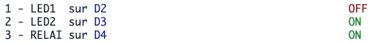

De plus, des informations tel que, **date**, **heure**, **température**, **humidité**, **temps écoulé** sont aussi mesurées, traitées et affichées.

---

Nous voici maintenant rendu à l'étape 2 (**projet de session**) de développement du projet: 👉 relier le système d'alarme (le **UNO**) à une centrale de surveillance (le **MEGA**).

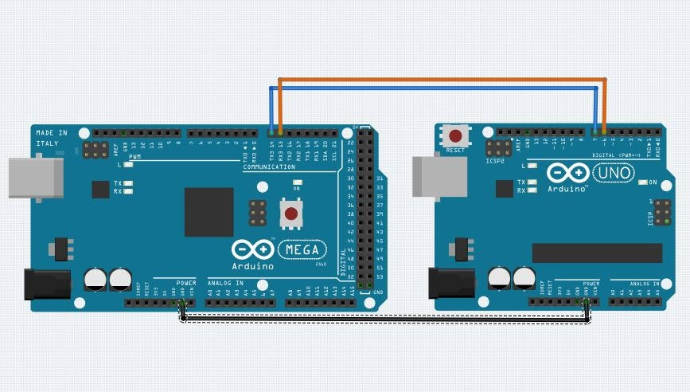

Une connexion série (**UART**) sera utilisée pour transférer les différents états et valeurs des appareils du système d'alarme, vers la centrale.

Ce transfert vers la centrale sera réalisé en boucle, à raison d'environ **une transmission à la seconde**.

Une transmission/réception simple, **avec une validation** sur la longueur du message, sera implémentée entre les deux systèmes.

Le Mega reçoit les données, les valide, les affiche dans le terminal et finalement, transmet, à chaque minute, les informations vers une base de données du Web.

**NOTE**: Pour un produit réel, il faudrait développer un protocole de communication entre les deux systèmes, pour assurer l'intégrité des données. Par contre, ceci déborde des objectifs de notre cours.

---

## 2.1 Voici une représentation du système


---

## 2.2 Démonstration vidéo du projet

[Vidéo de démonstration](https://ve2cuy.com/420-1c4/wp-content/uploads/2025/04/Enregistrement-decran-le-2025-04-02-a-11.45.35.mov)

**NOTE**: Les événements n'apparaissent pas automatiquement sur la page Web car elle est rechargée aux 10 secondes.

---

## 2.5 – Travail préliminaire – Actualiser le code UNO

### À réaliser avant de programmer le MEGA

👉 Il faut modifier le projet du **UNO** (TP01.P2) pour y ajouter les éléments permettant de transmettre, à chaque seconde, les données du système vers la station MEGA. Voir les informations sur les structures de données à la **section 4**.

De plus, **il faut changer la fonctionnalité de lecture du potentiomètre** (valeur entre 1 et 10), qui devient la durée de l'alarme lors d'une détection de mouvement ou suite à l'utilisation du bouton de panique

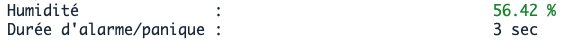

**Il faut aussi ajouter les sections suivantes:**

* un **compteur** pour le nombre de messages envoyés vers le MEGA, incluant la valeur binaire de l'état des appareils (capteurs) – voir l'image ci-dessus,
* en option (boni 0.5 point), **implémenter une interruption matériel pour le bouton de panique**.
  + Voir le document [suivant](https://ve2cuy.com/420-1c4/index.php/operations-non-bloquantes/)
* en option (boni 1.5 point), utilisation du capteur « **BME280** » au lieu de « **SHT31** »
  + Ce capteur retourne, en plus de la température et l'humidité, la pression atmosphérique et l'altitude.
  + IMPORTANT, voir 8.12
  + Il faut modifier la fonction '*preparerRequetePourAPI*' pour y ajouter les deux valeurs suivantes:
    - pre (pour la pression atmosphérique)
    - alt (pour l'altitude)

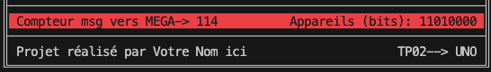

---

Voici l'écran du UNO, version TP02:

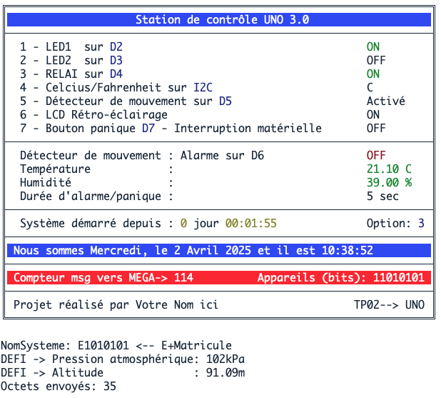

**NOTE**: Les messages au bas de l'interface servent de traces diagnostiques et sont facultatifs.

---

**RAPPEL**: 👉 Le **UNO** ne possède qu'un seul port UART. Solution: la librairie '[SoftwareSerial](https://ve2cuy.com/420-1c4/index.php/ecoute-moi-jaimerais-te-parler/)' pour la liaison avec le MEGA . **IMPORTANT**, IL FAUT UTILISER LES BROCHES **8 ET 9 du UNO** pour la connexion série, reliées au port **UART2 du MEGA**.

```cpp
SoftwareSerial lienAvecRecepteur(9, 8); // RX, TX
...
lienAvecRecepteur.begin(57600);  // 57600 est la vitesse maximum recommandée!
```

---

## 3 – Partie 1 – Station de contrôle (MEGA) Date de remise: Semaine 12-13 NOTE: Cette section sera corrigée en même temps que la partie 2. Il n'y aura pas de solutionnaire disponible avant la remise finale.

---

La station de contrôle (Arduino **MEGA**), sur réception d'un message de longueur valide – *sizeof(Systeme)* – du UNO, traitera les données reçues et les affichera dans le format suivant:

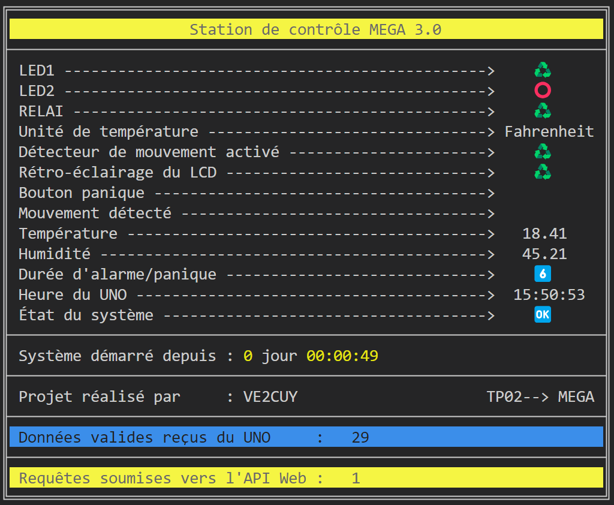

**NOTE**: Les symboles 🆘,6️⃣,♻️, ⭕, … sont des caractères emojis, accessibles sous Windows via les touches '**WIN et ;**'. Ces caractères sont implémentés dans le terminal de PlatformIO. Par contre, il est possible qu'à l'occasion le rendu ne soit pas parfait.

**NOTE**: Dans cette partie du projet, la section en jaune au bas de l'écran, **n'est pas à faire**.

---

## 4 – Les structures de données

Pour la préparation de l'envoi des données du système UNO, il faut utiliser les structures de données suivantes:

* **EtatAppareils**: Une énumération sur les différents bits d'un entier non signé
  + Seulement les huit premiers seront utilisés
* **Evenements**: Une énumération des différents types d'événements pouvant être envoyés vers le MEGA
* **Appareils**: Une structure de données décrivant:
  + L'état des appareils du UNO
  + La température
  + L'humidité
  + **En option** (défi) la pression atmosphérique et l'altitude
  + La durée de l'alarme dans le cas d'une détection de mouvement
* **Systeme**: Une structure de données décrivant:
  + Le nom du système (Votre matricule précédé d'un 'E')
    - Par exemple: E12345678
  + Une variable de type Appareils
  + Un code de message (Evenements)
  + L'heure du RTC du UNO.

**NOTE IMPORTANTE**: Le symbole 👉 indique un élément prescrit (obligatoire).

---

### 👉 Voici les déclarations à utiliser dans votre projet:

```cpp
enum EtatAppareils {
  APP_LED1                 =     0b1 << 0, // 0000 0001
  APP_LED2                 =     0b1 << 1, // 0000 0010
  APP_RELAI                =     0b1 << 2, // 0000 0100
  APP_MOUVEMENT            =     0b1 << 3, // 0000 1000
  APP_MOUVEMENT_ARME       =     0b1 << 4, // 0001 0000
  APP_BOUTON_PANIQUE       =     0b1 << 5, // 0010 0000
  APP_RETRO_LCD            =     0b1 << 6, // 0100 0000
  APP_UNITE_TEMP           =     0b1 << 7  // 1000 0000
};

enum Evenements {
  evenement_statut_appareils,         // 0
  evenement_temperature_depassee,     // 1
  evenement_detection_mouvement,      // 2
  evenement_bouton_panique,           // 3
  evenement_systeme_enligne,          // 4
  evenement_changement_etat,          // 5
  evenement_UNO_non_connecte,         // 6
  evenement_nb_codes                  // 7  
};

#define MAX_CAR_NOM_SYSTEME 10

struct Appareils{
    unsigned int  etatAppareils;  // Traitement sur les bits.  // 2 octets
    float         temperature;                                 // 4 octets
    float         humidite;                                    // 4 octets
    int           dureeAlarme;                                 // 2 octets 

    // -->> EN OPTION:
    // uint32_t      pressionAtmospherique;                    // 4 octets 
    // float         altitude;                                 // 4 octets
  };
  
struct Systeme {
    // ATTENTION de ne pas dépasser 9 caractères pour le nom du système!!!
    char        nomSysteme[MAX_CAR_NOM_SYSTEME];  // 10 octets
    Evenements  codeMessage;                      //  2 octets NOTE: Côté UNO, ce contenu n'est pas traité.
    byte        heure;                            //  1 octet
    byte        minute;                           //  1 octet
    byte        seconde;                          //  1 octet
    Appareils   appareils;                        // 12 octets
  };
```

👉 La communication entre les deux microcontrôleurs sera réalisée en utilisant les apprentissages du document suivant : [Communication entre deux Arduino](https://ve2cuy.com/420-1c4/index.php/ecoute-moi-jaimerais-te-parler/)

---

### Préparation des données coté UNO

Pour économiser sur les données envoyées sur le port série, l'état de tous les appareils est stocké dans une seule variable entière.

**INDICE**: Voici comment renseigner la variable:

```cpp
  // Allumer les différents bits de 'etats' en fonction de l'état des appareils
  etats |= digitalRead(LED01) ? APP_LED1 : 0;
  etats |= digitalRead(LED02) ? APP_LED2 : 0;
  etats |= digitalRead(RELAI) ? APP_RELAI : 0;
  etats |= mouvementDetecte ? APP_MOUVEMENT : 0;
  etats |= boutonPanique ? APP_PANIQUE_DECLENCHE : 0;
  etats |= retroEclairage ? APP_RETRO_LCD : 0;
  etats |= detecteurDeMouvement  ? APP_MOUVEMENT_ARME : 0;
  etats |= affichageCelcius  ? APP_UNITE_TEMP : 0;

// Le résultat sera placé dans la propriété 'Systeme.appareils.etatAppareils'
```

---

## 5 – Explication des éléments d'interface de l'écran du MEGA

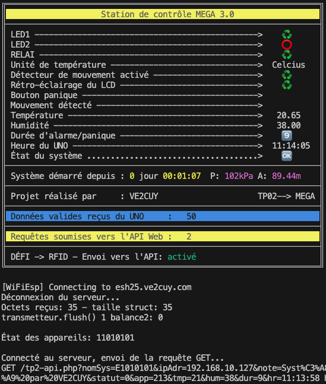

**NOTE**: Les messages au bas de l'interface servent de traces diagnostiques et sont facultatifs.

---

### 5.1 – La fonction afficherTexteAvecRemplissage()

👉 Il faut programmer une fonction qui permet d'afficher un texte à l'écran, à la position XY et qui complète la ligne, sur une longueur de n, avec un caractère. Si le caractère n'est pas précisé à l'appel alors '-' sera utilisé.

### Voici son prototype et des exemples de son utilisation:

```cpp
void afficherTexteAvecRemplissage(const char* texte, int longueur, int posX, int posY, char caractere = '-');

// Et des exemples d'utilisation:
afficherTexteAvecRemplissage("LED1", LONGUEUR_LIGNE_POINT, POS_X, LIGNE_TEXTE_LED1,'=');
afficherTexteAvecRemplissage("LED2", LONGUEUR_LIGNE_POINT, POS_X,LIGNE_TEXTE_LED2);
afficherTexteAvecRemplissage("RELAI", LONGUEUR_LIGNE_POINT, POS_X,6,LIGNE_TEXTE_RELAI, '*');
afficherTexteAvecRemplissage("Unité de température", LONGUEUR_LIGNE_POINT, POS_X,LIGNE_TEXTE_TEMP, ' ');
afficherTexteAvecRemplissage("Détecteur de mouvement activé", LONGUEUR_LIGNE_POINT, POS_X,LIGNE_TEXTE_MOUVEMENT);
```

Ce qui produira le résultat suivant:

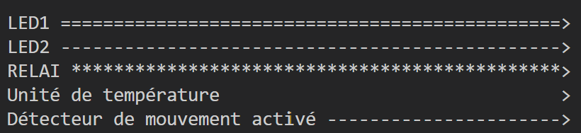

---

### 5.2 – Affichage de la durée de l'alarme

Les émojis 1️⃣ à 🔟 sont utilisés pour l'affichage de la durée de l'alarme.


ASTUCE:

```cpp
const char * graphDigits[] = {"", "1️⃣", "2️⃣", "3️⃣", "4️⃣", "5️⃣", "6️⃣","7️⃣", "8️⃣","9️⃣", "🔟"};
```

---

### 5.3 – Affichages des valeurs et états

Rappel, les valeurs et états du système proviennent du UNO. Nous les avons reçus via la communication UART. Ils devraient être stockés dans un variable de type 'Systeme'.

Pour les appareils de type ON/OFF, comme les LEDs le relai, le détecteur de mouvements, l'unité C/F, …, les informations seront stockés au niveau des bits de la propriété '***etatAppareils***'.

Pour connaitre l'état de la LED1, il suffit de vérifier si le premier bit de la propriété est à ON.

### Voici un exemple d'affichage selon l'état d'un bit

```cpp
void afficherSymboleSelonEtat(int posX, int posY, bool etat, const char * symboleON, const char * symboleOFF)
{
 ...
} // afficherSymboleSelonEtat


void actualiserEtatDesAppareils()
{
  uint8_t etats = unSysteme.appareils.etatAppareils;
  afficherSymboleSelonEtat(COLONNE_ETAT,LIGNE_LED1, (unSysteme.appareils.etatAppareils & APP_LED1), _ON , _OFF ); // Nous testons ici le bit 0
  afficherSymboleSelonEtat(COLONNE_ETAT,LIGNE_LED2, (unSysteme.appareils.etatAppareils & APP_LED2), _ON , _OFF ); // Nous testons ici le bit 1
  ...
} // actualiserÉtatDesAppareils
```

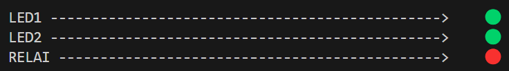

---

### 5.9 – Voici quelques définitions utiles

```cpp
#define _ON                           "♻️"  // ou "🟢" Selon votre préférence
#define _OFF                          "⭕"  // ou "🔴" Selon votre préférence
#define FAHRENHEIT                    "Fahrenheit"
#define CELCIUS                       " Celcius  "
#define SOS                           "🆘" // À utiliser en cas de panique ou de mouvement, sinon afficher deux espaces '  '
const char * etatSysteme[] =         {"🥵", "ℹ️", "😡","💀", "🆘", "🆗"}; // Détails à suivre ...
```

---

## 5.10 – Défi optionnel (1 point boni)

Animer les lignes 'Bouton de panique' et 'Mouvement détecté' en cas d'activité.

[Vidéo animation](https://ve2cuy.com/420-1c4/wp-content/uploads/2025/04/Enregistrement-decran-le-2025-04-02-a-11.24.04.mov)

---

## Validation des données reçues du UNO

👉 Il est primordial de mettre en place une mécanique de validation des données reçues du UNO avant le traitement et ou l'affichage.

Nous assumerons que les données sont valides seulement si le nombre d'octets reçus est égal à la taille de la structure 'Systeme'.

### Voici un exemple de validation des données reçues du UNO

```cpp
  // Validation coté MEGA
  // Vérifier si des données sont disponibles sur le port du transmetteur
  if (transmetteur.available() == sizeof(unSysteme)) {  // NOTE: unSysteme est une variable de type 'Systeme'
    // Si le bon nombre d'octets reçues, lire les données
    transmetteur.readBytes((char*)&unSysteme, sizeof(unSysteme)); // (char*) indique de traiter 'unSysteme' comme une suite d'octets.
    // Afficher/traiter les données reçues
    ...
  } else {
    // Sinon, effacer le buffer de réception    
    while (transmetteur.available()) {
      transmetteur.read(); // Lire et ignorer les données du buffer
    }
  }
```

---

## Ligne de statut de réception

Il faut incrémenter et afficher un compteur à chaque réception validée.  
Par exemple, l'image suivante indique que le MEGA a reçu 4076 transmissions de longueur valide.


---


---

## Partie 2 – Transmission des données vers le Web Date de remise: Semaine 15

---

## 6 **–** DESCRIPTION

Dans la partie 2 du projet, il faut envoyer les informations reçus par la station de surveillance (le MEGA) vers une base de données accessible via le module Grove WiFi et le réseau Internet.

**NOTE**: Nous avons pratiqué cette fonctionnalité dans le laboratoire '[Le module Wifi](https://ve2cuy.com/420-1c4/index.php/grove-uart-wifi-v2/)'.

---

**Directive de branchement** du module Wifi

👉 Le module ESPWifi doit être connecté au port UART3 du MEGA.

---

**6.1** – Il est possible de consulter le contenu de cette base de donnée à partir de l'URL suivante: <http://esh25.ve2cuy.com> ou bien [ici](http://esh25.ve2cuy.com/index2.php), pour plus de détails,

Ce qui devrait afficher ceci:

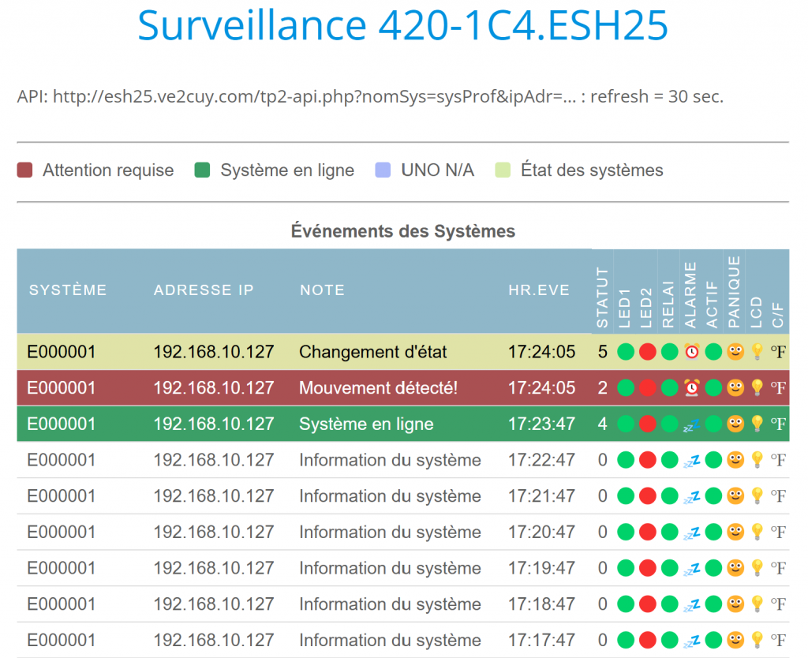

---

## 7 – Utilisation de l'API

L'API est disponible via l'URL suivante <http://esh25.ve2cuy.com/tp2-api.php>.

C'est une API simple, qui permet d'ajouter des enregistrements à une base de données.

Pour ajouter les informations reçus par le MEGA à cette base de données, il suffit de construire une adresse Web avec les différentes informations du système.

---

**ASTUCE 1:** Passer du réseau Wifi Cégep à celui de la maison lors de la compilation:

```cpp
#ifdef CEGEP
char ssid[] =  "CSTJ-UBI-D136";      
char pass[] =  "unMotDePasse";     
#else
char ssid[] = "MON-WIFI-MAISON";
char pass[] = "unMotDePasse";    
#endif
```

**ASTUCE 2**: Passer du Wifi cégep au Wifi maison sans avoir à recompiler le programme:

```cpp
char ssid[20];
char pass[20];

// Sélectionner le réseau Wifi à utiliser
char optionWifi = 0;
terminal << "1) Wifi Cegep, 2) Wifi maison? : ";

while (terminal.available() == 0); // Attendre une touche du clavier ...

optionWifi = terminal.read();

if (optionWifi == '1') {
 strcpy(ssid, "CSTJ-UBI-D136");
 strcpy(pass,"motDePasse"); 
} else {
  strcpy(ssid, "Wifi-Maison");
  strcpy(pass,"motDePasse"); 
}
```

---

### 7.1 – Fonction pour préparer et encoder l'URL de la requête GET

La fonction suivante met en forme correctement les différents paramètres à soumettre à L'API.

```cpp
// -------------------------------------------------------------------------------------------------------
// Auteur:      Alain Boudreault
// Cible:       Vous pouvez utiliser cette fonction dans votre projet.
// Description: Sert à construire la requête GET qui sera utilisée vers L'API web.
// ATTENTION:   Ne pas modifier cette fonction sinon l'API va refuser votre requête.
// -------------------------------------------------------------------------------------------------------
void preparerRequetePourAPI(
// -------------------------------------------------------------------------------------------------------
  char *buffer,           // Pour recevoir le texte de la requête GET vers l'API.
  int tailleBuffer,       // Taille du buffer servant à recevoir le texte de la requête GET vers l'API
  Systeme unSysteme,      // Une structure représentant les données reçus du UNO.  Voir 'struct Systeme'.
  Evenements codeEvent,   // Code d'événement, Voir 'enum Evenements' pour les codes disponibles.
  const char * uneNote,   // Un texte quelconque.  Ce texte sera stocké dans la base de données de l'API.
  const char * adresseIP  // À vous de construire une chaine représentant l'adresse IP du votre module Wifi.
)
// -------------------------------------------------------------------------------------------------------
{
// Voir WiFi.localIP() pour l'adresse IP du module Wifi.
 
   snprintf(buffer, tailleBuffer, 
    "GET /tp2-api.php?nomSys=%s&ipAdr=%s&note=%s&statut=%d&app=%d&tmp=%d&hum=%d&dur=%d&hr=%02d:%02d:%02d HTTP/1.1", 
    unSysteme.nomSysteme, 
    adresseIP,
    // urlEncode(messages[code]).c_str(), 
    urlEncode(uneNote).c_str(),                                   // &note=
    codeEvent,                                                    // &statut=       
    unSysteme.appareils.etatAppareils,                            // &app=
    int(round(unSysteme.appareils.temperature)),                  // &tmp=  NOTE: Conversion en int car snprinf ne supporte pas les float sous Arduino.
    int(round(unSysteme.appareils.humidite)),                     // &hum=
    unSysteme.appareils.dureeAlarme,                              // &dur=
    int(unSysteme.heure),                                         // $hr=00:00:00
    int(unSysteme.minute),
    int(unSysteme.seconde)
    );
} // preparerRequetePourAPI
```

L'utilisation de cette fonction pour former l'URL vers l'API devrait produire une chaine comme:

```
GET /tp2-api.php?nomSys=E000001&ipAdr=192.168.10.127&note=VE2CUY&statut=4&app=209&tmp=20&hum=45&dur=6&hr=18:36:23 HTTP/1.1
```

👉 **NOTE IMPORTANTE**: Si le nom du système ne correspond pas à un numéro de matricule valide, précédé de 'E', la requête sera rejetée par l'API.

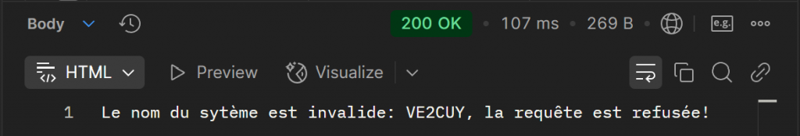

De plus, l'API ignore les requêtes qui excèdes un maximum de **20 requêtes en 5 minutes**. Donc, attention de ne pas envoyer des messages inutilement vers l'API.


Exemple de validation du nom du système en php:

```php
// Vérifier que le nom du système est valide:
$nomSysteme= "A1234567";
$tableauMatricules = ["E0000001", "!VE2CUY!", "E1010101", "..."];
if (in_array($nomSysteme, $tableauMatricules)) {
    echo "La requête est acceptée";
} else {
    echo "La requête est refusée!";
}

// Vérifier que le maximum de requêtes n'a pas été dépassé en 5 minutes:
$sql = "SELECT COUNT(*) as total FROM tbl_sys WHERE nomDuSysteme = ? AND TIMESTAMPDIFF(MINUTE, date, NOW()) <= 5";
if ( $total > 20 ) alors grrr ... ;-(
```

---

## 7.2 – Rappel – Postman pour tester les requêtes

```
# Voici une requête valide:
esh25.ve2cuy.com/tp2-api.php?nomSys=VE2CUY&ipAdr=254.192.250.127&note=Syst%C3%A8me%20de%20surveillance%20par%20VE2CUY&statut=4&app=84&tmp=18&hum=46&dur=6&hr=13:37:36
```

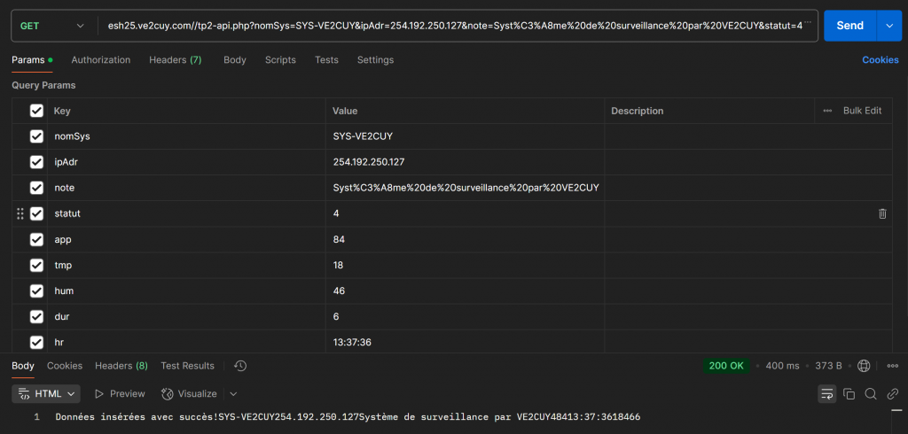

---

## 8 – Ce qui doit être réalisé dans cette partie

### 8.1 – evenement\_systeme\_enligne

Lorsque le MEGA reçoit le **premier message** du UNO, il doit envoyer une requête de type '***evenement\_systeme\_enligne***' vers l'API. Ce qui devrait afficher la ligne suivante sur la page de consultation des événements systèmes:

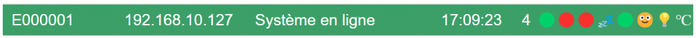

**NOTE**: Les événements sont renseignés par le paramètre 'Evenements codeEvent' de la fonction 'preparerRequetePourAPI'.

---

### 8.2 – evenement\_statut\_appareils

À chaque minute, **mais pas plus**, le MEGA doit envoyer une requête de type '***evenement\_statut\_appareils***' vers l'API. Ce qui devrait afficher la ligne suivante sur la page de consultation des événements systèmes:

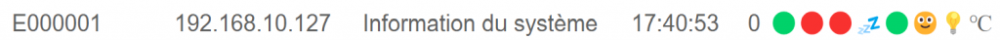

Un clic sur la ligne affichera plus de détails sur le système:

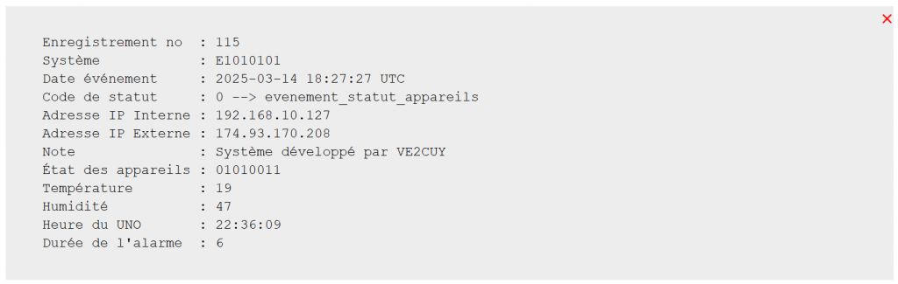

---

### 8.3 – evenement\_changement\_etat

À la réception des informations du UNO, il faut vérifier s'il y a eu un changement sur un des bits de la propriété '**etatAppareils**' par rapport à la réception précédente. Si c'est le cas, le MEGA doit envoyer une requête de type '***evenement\_changement\_etat***' vers l'API. Ce qui devrait afficher la ligne suivante sur la page de consultation des événements systèmes:

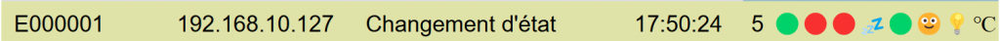

Dans cet exemple, LED1 était à OFF à la lecture précédente. Il est passé à ON (via le menu 1 du UNO) donc la requête '***evenement\_changement\_etat***' a été envoyée.

```cpp
// Par exemple,
sendInfoTOWebAPI(evenement_changement_etat);
```

---

### 8.4 – evenement\_dectection\_mouvement

Si le détecteur de mouvement a été déclenché, le MEGA doit envoyer, **immédiatement**, une requête de type '***evenement\_detection\_mouvement***' vers l'API. Ce qui devrait afficher la ligne suivante sur la page de consultation des événements systèmes:

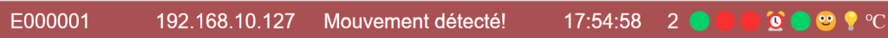

**ATTENTION**, il est **IMPORTANT** de ne pas renvoyer ce message avant que le détecteur de mouvements soit retourné à l'état OFF au moins une fois. Si votre logique ne fait que vérifier si le bit de l'appareil mouvement est ON, alors la requête risque d'être envoyée à chaque réception des données du UNO (aux secondes) ce qui aura comme conséquence de voir vos requêtes bloquées par l'API pendant un certain temps.

```cpp
// Par exemple,
  static bool messageUrgent = true;
  // Envoyer immédiatement les données vers l'API sur détection de mouvements
  // NOTE: Il faut envoyer ce message qu'une seule fois pendant la durée de l'événement.
  if ((unSysteme.appareils.etatAppareils & APP_MOUVEMENT)) {
      if(messageUrgent) {
        sendInfoTOWebAPI(evenement_detection_mouvement);
        messageUrgent = false;
    }
  } else {
    messageUrgent = true;
  }
```

---

### 8.5 – evenement\_bouton\_panique

Idem que 8.4.

---

### 8.6 – evenement\_temperature\_depassee

Si la valeur de la température est >= à 24c, le MEGA doit envoyer, **immédiatement**, une requête de type '***evenement\_temperature\_depassee***' vers l'API. Ce qui devrait afficher la ligne suivante sur la page de consultation des événements systèmes:


**ATTENTION**, il est **IMPORTANT** de ne pas renvoyer ce message avant que la température soit retournée à < 24. Si votre logique ne fait que vérifier si la température est >= 24, alors la requête risque d'être envoyée à chaque réception des données du UNO (aux secondes) ce qui aura comme conséquence de voir vos requêtes bloquées par l'API pendant un certain temps.

```cpp
// Par exemple,        
static float temperaturtePrecedante = unSysteme.appareils.temperature;

if (unSysteme.appareils.temperature > TEMPERATURE_MAXIMUM && temperaturtePrecedante <= TEMPERATURE_MAXIMUM ) {
   sendInfoTOWebAPI(evenement_temperature_depassee);
   temperaturtePrecedante = unSysteme.appareils.temperature;
}
```

---

### 8.7 – evenement\_UNO\_non\_connecte

Si le MEGA ne reçoit aucun message du UNO pendant **5 minutes**, il faut envoyer une requête de type '***evenement\_UNO\_non\_connecte***' vers l'API. Ce qui devrait afficher la ligne suivante sur la page de consultation des événements systèmes:

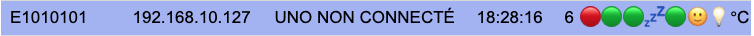

La requête sera transmisse à chaque période de 5 minutes, tant que le UNO sera hors ligne.

```cpp
// Par exemple,
if (aucune_reception_depuis_5_minutes){
   sendInfoTOWebAPI(evenement_UNO_non_connecte);
}
```

---

### 8.8 – 4Digit display

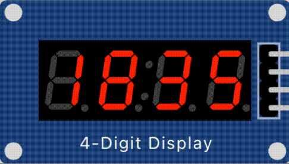

Connecté sur D6 et D7 du Mega, le 4Digit affiche l'heure reçue du UNO et le symbole ':' change d'état (ON/OFF) à chaque 1/2 seconde.

---

### 8.9 – NEOPixel

Connecté sur D4 et D5 du Mega, le NEOPixel affiche une animation différente selon les événements suivants:

* *evenement\_detection\_mouvement*:
  + r = 255; g = 0; b = 0;
* *evenement\_changement\_etat*:
  + r = 255; g = 255; b = 0;
* *evenement\_statut\_appareils* :
  + r = 0; g = 0; b = 255;

**ATTENTION**: L'animation doit-être de courte durée sinon il y aura perte de données au niveau de la réception en provenance du UNO.

---

### 8.10\* – RFID (BONI)

Un capteur RFID, connecté sur UART1 du MEGA, permet d'activer/désactiver l'envoi de messages vers l'API Web. Il y a un document de référence –> [ici](https://ve2cuy.com/420-1c4/index.php/capteur-rfid/).

Pour relever ce défi, il faut emprunter un capteur et une carte.

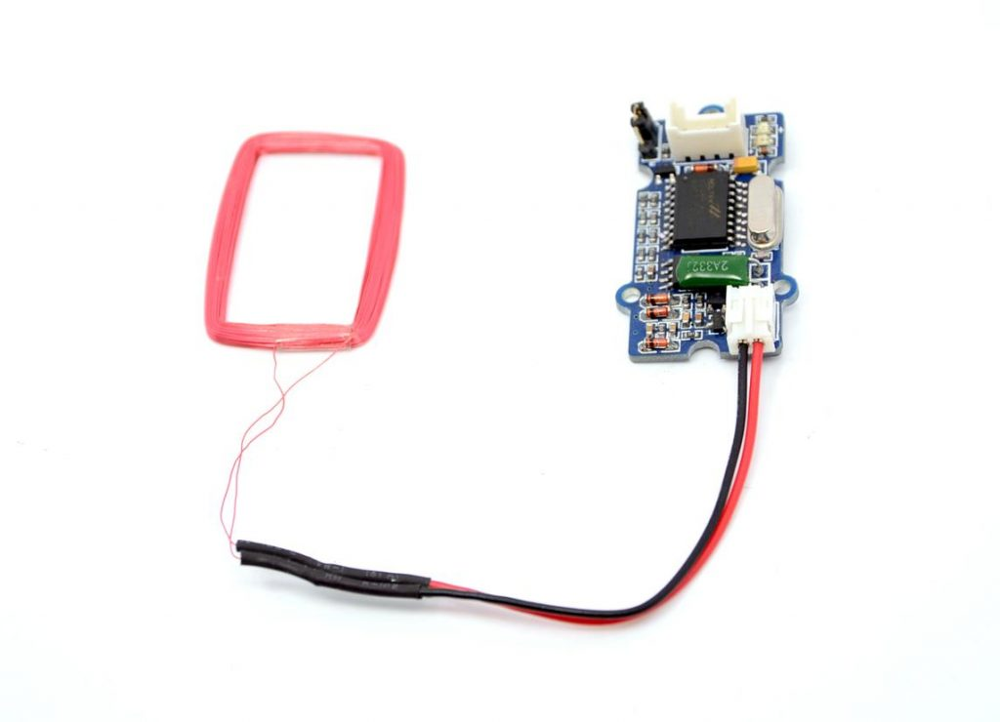

**NOTE**: Le capteur vient avec une clé à code unique ayant le format suivant: 'OctetDépart6900E6C9BBFDOctetFin. Il faut extraire les octets de buffer+1 à buffer-1.

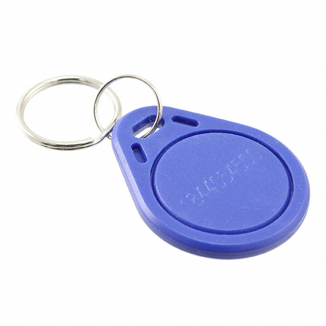

Le système doit reconnaitre, comme valide, la clé que vous avez et la mienne qui possède le numéro suivant: **6A001BD067C6**.

Il faut ajouter la ligne suivante à l'interface utilisateur de la station MEGA:

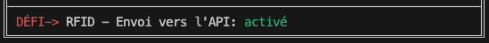

Il y a trois valeurs possibles comme état:

* **activé**
* **désactivé**
* CARTE INVALIDE

---

### 8.11 – Statut de transmission vers l'API Web

Il faut ajouter la ligne suivante à l'interface utilisateur de la station MEGA:

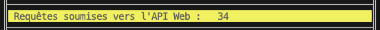

---

### 8.12 – Envoi de pression/altitude vers l'API (BONI)

Pour obtenir le point boni pour le traitement de la pression atmosphérique et l'altitude, il faut que ces informations soient envoyées vers l'API Web.

Pour ce faire, il faut modifier la fonction '***preparerRequetePourAPI***', pour y ajouter les deux valeurs suivantes:

* pre
* alt

Voici une URL valide:

```
GET /tp2-api.php?nomSys=!VE2CUY!&ipAdr=192.168.1.191&note=exemple&statut=4&app=23&tmp=22&hum=42&dur=7&hr=17:10:43&pre=99=&alt=175 HTTP/1.1
```

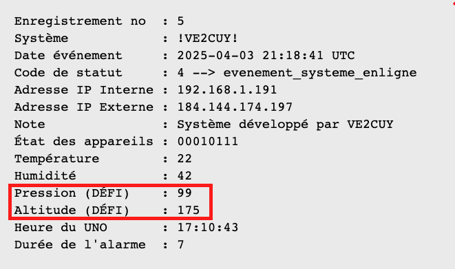

---

## Grille de correction

**NOTE**: Les défis doivent-être réalisés sans l'aide de l'enseignant.

| No. | Description | Note | Boni |
| --- | --- | --- | --- |
| **UNO** | Ajout des éléments de la section 2.5 | 3 |  |
|  | Transmission des données vers la centrale. | 2 |  |
| Défi optionnel | Remplacer le capteur de température par [bmp280](https://wiki.seeedstudio.com/Grove-Barometer_Sensor-BMP280/) et ajouter pression et altitude aux données transmises. **Important**, voir 8.12 |  | 1.5 |
| Défi optionnel | Interruption matériel pour le bouton de panique Dans ce cas, il faut utiliser la broche D2 pour le bouton et déplacer la DEL sur D7. |  | 0.5 |
| **Présentation** | Présentation de votre partie 1 – Pénalité de 20% en cas d'absence |  |  |
| **MEGA – P1** | Fonctionnalité, optimisation du code source et documentation | 4 |  |
|  | Aucun message de type 'Warning' à la compilation | 2 |  |
| 5 | Éléments d'interface | 2 |  |
| 5.1 | fonction afficherLigne | 2 |  |
|  | Réception et traitement des données reçues du UNO | 2 |  |
| 5.10 Défi optionnel | Animation des lignes 'Bouton de panique'  et 'Mouvement détecté' |  | 1 |
| Partie 2 |  |  |  |
|  | Traitement correct de l'adresse IP –> vers API | 1 |  |
| 8.1 | evenement\_systeme\_enligne –> vers API | 1 |  |
| 8.2 | evenement\_statut\_appareils –> vers API | 1 |  |
| 8.3 | evenement\_changement\_etat –> vers API | 2 |  |
| 8.4 | evenement\_dectection\_mouvement –> vers API | 2 |  |
| 8.5 | evenement\_bouton\_panique –> vers API | 1 |  |
| 8.6 | evenement\_temperature\_depassee –> vers API | 1 |  |
| 8.7 | UNO non relié au MEGA –> vers API | 1 |  |
| 8.8 | Heure sur 4Digit | 1 |  |
| 8.9 | Animation des événements sur NEO-Pixel | 2 |  |
| 8.10 Defi optionnel | Lecteur de carte magnétique RFID activé/désactivé –> API |  | 1 |
| REMISE | Un fichier .zip incluant les deux projets et le fichier workspace de vscode | 1 |  |
|  |  | 30 |  |
|  |  |  |  |
|  | Total | 30/30 | 4 |

---

## Crédits

**Document rédigé par Alain Boudreault © 2021-2026**
**Version 2025.03.15.01 - Révision 2025.12.12.1**

*Contenu par [VE2CUY](http://ve2cuy.com/blog)*