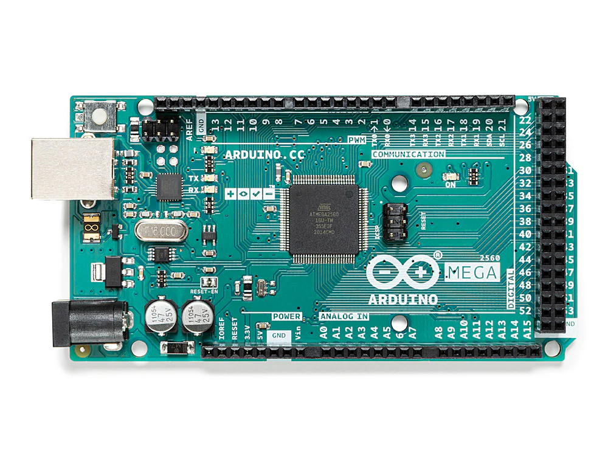
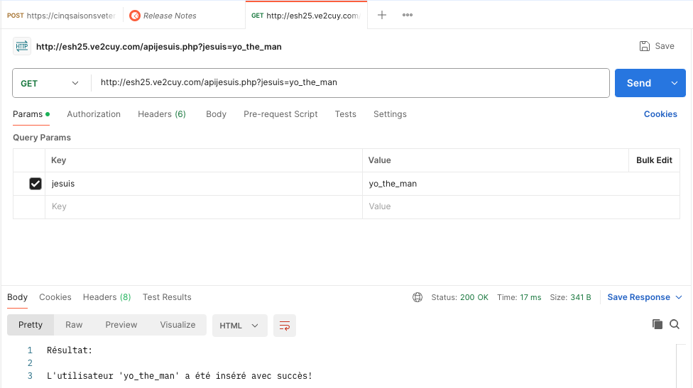
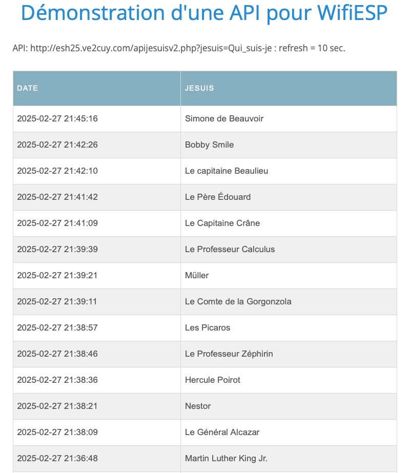
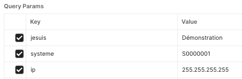
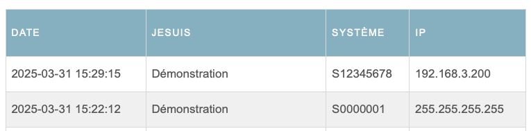

# Grove – UART Wifi V2

20 février 2025

## 1 – Grove – UART Wifi V2


Le module Grove – UART WiFi est un dispositif qui utilise le SoC ESP8285, très populaire dans l'IoT. Il dispose d'une pile de protocoles TCP/IP intégrée, ce qui permet à votre microcontrôleur de se connecter facilement aux réseaux WiFi avec peu de code.   
  
Chaque module ESP8285 est déjà programmé avec un firmware utilisant des commandes AT, ce qui permet de le contrôler en envoyant des commandes simples. Ce SoC inclut des sécurités comme WEP, WPA/WPA2, TKIP, AES et WAPI, et peut agir comme un point d'accès WiFi avec DHCP. Il peut aussi rejoindre un réseau WiFi existant et a des adresses MAC et IP réglables.

---

## 2 – ESP8285

L'ESP8285 est un système sur puce (SoC) basé sur un microcontrôleur à faible consommation, développé par Espressif Systems. Il est principalement utilisé dans des applications IoT (Internet des Objets) grâce à ses capacités Wi-Fi intégrées. Voici ses principales caractéristiques :

1. **Wi-Fi intégré** : L'ESP8285 dispose d'une connectivité Wi-Fi intégrée, ce qui permet de se connecter facilement aux réseaux sans fil sans avoir besoin de modules externes.
2. **Processeur puissant** : Il utilise un processeur Tensilica Xtensa LX3, avec une fréquence d'horloge pouvant atteindre 160 MHz, ce qui le rend capable de gérer des applications exigeantes.
3. **Mémoire** : L'ESP8285 dispose de 1 Mo de mémoire flash intégrée pour stocker le firmware et les données, ce qui permet de réduire la taille du matériel et les coûts.
4. **Protocoles de sécurité** : Il prend en charge plusieurs protocoles de sécurité Wi-Fi, tels que WEP, WPA/WPA2, AES et TKIP, ce qui le rend adapté pour des applications nécessitant des connexions sécurisées.
5. **Mode point d'accès (AP) et station (STA)** : Il peut fonctionner en tant que point d'accès pour créer un réseau Wi-Fi ou se connecter à un réseau Wi-Fi existant en tant que station.
6. **Bas coût et faible consommation d'énergie** : Le ESP8285 est très abordable et consomme peu d'énergie, ce qui le rend idéal pour des applications portables ou autonomes qui nécessitent une longue durée de vie sur batterie.
7. **Facilité de programmation** : L'ESP8285 est souvent utilisé avec des environnements de développement comme Arduino ou ESP-IDF (Espressif IoT Development Framework), ce qui facilite sa programmation et son intégration dans divers projets IoT.

En résumé, l'ESP8285 est un SoC puissant et économique, parfait pour des projets connectés nécessitant Wi-Fi et faible consommation d'énergie.

---

## 3 – Connexion – Port série (UART)

Le module Grove Wifi doit-être connecté à un des ports séries du microcontrôleur à une vitesse de 115200 bauds.

Si nous utilisons un Arduino Uno, nous sommes limité à un seul port série (via D0 et D1). S'il est utilisé pour afficher des messages au terminal alors il n'y aura pas de connexion possible pour le module Grove Wifi.

Au contraire, si nous utilisons le port série pour y connecter le module Wifi alors celui-ci ne pourra pas être utilisé pour de l'affichage au terminal.

Il est possible d'utiliser la librairie SoftwareSerial pour simuler un port série à partir de deux broches digitals mais sur un Arduino Uno, la communication sera instable à la vitesse de 115200 baud.

---

## 3.1 – Solution: Arduino Mega

### Arduino Mega – 4 ports UART



---

## 4 – Expérimentation

Nous utiliserons la librairie 'WiFiEsp de bportaluri' pour piloter le module Grove Wifi V2

4.1 – Dépendance PlatformIO:

```
lib_deps = bportaluri/WiFiEsp@^2.2.2

monitor_filters = send_on_enter
monitor_echo = yes
```

---

## 4.1 – Les commandes <AT>

**Contrôle du module WifiESP directement en envoyant des commandes <AT>.**

```
/*
  ESP8266 AT Command Tester
  
  Ce programme permet de tester les commandes AT de l'ESP8266
  en utilisant un module ESP8266 connecté au port Serial1.

  Voici les commandes AT les plus courantes:
  - AT        : test de communication
  - AT+GMR    : affiche la version du firmware
  - AT+CWLAP  : scan des réseaux wifi
  - AT+CWJAP="SSID","password" : connexion à un réseau wifi
  - AT+CIFSR  : affiche l'adresse IP de l'ESP8266 et l'adresse MAC
  
  NOTE: AJOUTER LES LIGNES SUIVANTES DANS LE FICHIER platformio.ini
  
    monitor_filters = send_on_enter
    monitor_echo = yes
*/

#include <Arduino.h>
#define VITESSE_MONITEUR  9600
#define VITESSE_ESP8266   115200
#define DELAI_BUFFER      500

void setup()
{
  Serial.begin(VITESSE_MONITEUR);     // Pour afficher les messages dans le moniteur série
  Serial1.begin(VITESSE_ESP8266);     // Pour communiquer avec l'ESP8266
  Serial.println("\nTester des commandes AT avec un ESP8266");
  Serial.println("\nEntrez une commande AT ou un message à envoyer à l'ESP8266");
  Serial.println("\nExemple: AT, AT+GMR, AT+CWLAP, AT+CWJAP=\"SSID\",\"password\", AT+CIFSR\n\n: ");
} // Fin de la fonction setup

void loop()
{
  if(Serial1.available())  // Vérifie si l'ESP8266 a envoyé des données
  {
    while(Serial1.available())
    {
      char c = Serial1.read();  // lit les données de l'ESP8266
      Serial.write(c);          // affiche les données dans le moniteur série
    }
  }

  if(Serial.available())
  {
    delay(DELAI_BUFFER);  // Attendre DELAI_BUFFER pour recevoir toutes les données
    // Lire les données du moniteur série et les stocker dans une chaîne de caractères
    String cmd = "";
    while(Serial.available())
    {
      cmd += (char)Serial.read();
    }
    // Envoyer la commande AT à l'ESP8266
    Serial1.println(cmd); 
  }
} // Fin de la fonction loop
```

–> [Documentation Grove](https://wiki.seeedstudio.com/Grove-UART_Wifi_V2/#wifi-at-commands)

**NOTE**: Programmer une application Web complète à partir de séquences AT est un processus lourd et complexe. Heureusement, il existe des librairies facilitant la tâche.

---

## 4.2 – LIB WifiEsp – Afficher les réseaux disponibles

**Contrôle du module WifiESP en utilisant la librairie 'WiFiEsp'.**

```
/*
 WiFiEsp exemple: Recherche des réseaux Wifi disponibles

 Auteur: Alain Boudreault
 Date:   2025.02.20
 ----------------------------
 Description:

 Ce programme recherche et affiche, aux DELAI_RECHERCHE_RESEAUX millisecondes,
 l'adresse MAC du module Wifi et recherche les réseaux Wifi disponibles.

  Le module ESP8266 est connecté à un Arduino Mega 2560 sur Serial1

  platformio.ini:
  [env:megaatmega2560]
  platform = atmelavr
  board = megaatmega2560
  framework = arduino
  monitor_speed = 115200
  lib_deps = 
    bportaluri/WiFiEsp@^2.2.2  
*/

#include <Arduino.h>
#include "WiFiEsp.h"

// Déclaration des constantes
#define VITESSE_SERIE           115200
#define DELAI_RECHERCHE_RESEAUX 10000
#define SECONDE                 1000

// Déclaration des fonctions
void afficherAdresseMAC();
void listerReseaux();
void afficherTydeDeCryptage(int thisType);

void setup() {
  Serial.begin(VITESSE_SERIE);   // Pour les messages de debug
  Serial1.begin(VITESSE_SERIE);  // Pour les commandes AT du module ESP8266
  Serial.println(F("\n\nExemple WiFiEsp: Recherche des réseaux Wifi disponibles\nAuteur: Alain Boudreault\nDate:   2025.02.20\n----------------------------\nDescription:\n\nCe programme recherche et affiche, aux DELAI_RECHERCHE_RESEAUX millisecondes,\nl'adresse MAC du module Wifi et recherche les réseaux Wifi disponibles.\n\nLe module ESP8266 est connecté à un Arduino Mega 2560 sur Serial1\n\n"));

  delay(SECONDE);
  WiFi.init(&Serial1);    // initialisation de la communication avec le module ESP8266


  Serial.println(F("\nInitialisation du module ESP8266..."));

  // Vérification de la présence du module ESP8266
  if (WiFi.status() == WL_NO_SHIELD) {
    Serial.println(F("Module ESP8266 non détecté."));
    while (true);  // Ne pas continuer
  }

  afficherAdresseMAC();      // Affichage de l'adresse MAC du module ESP8266
} // Fin de la fonction setup()

void loop()
{
  // Recherche des réseaux disponibles
  Serial.println("\n----------------------------------");
  Serial.println("Recherche des réseaux disponibles:");
  Serial.println("----------------------------------\n");
  listerReseaux();
  delay(DELAI_RECHERCHE_RESEAUX);
} // Fin de la fonction loop()

void afficherAdresseMAC()
{
  // Obtenir l'adresse MAC du module ESP8266
  byte mac[6];
  WiFi.macAddress(mac);
  
  // print MAC address
  char buf[20];
  snprintf(buf, sizeof(buf) ,"%02X:%02X:%02X:%02X:%02X:%02X", mac[5], mac[4], mac[3], mac[2], mac[1], mac[0]);
  Serial.print("\nMAC adresse: ");
  Serial.println(buf);
} // Fin de la fonction afficherAdresseMAC()

void listerReseaux()
{
  // Recherche des réseaux disponibles
  int numSsid = WiFi.scanNetworks();
  if (numSsid == -1) {
    Serial.println("Impossible de scanner les réseaux disponibles");
    while (true);
  }

  // Affichage du nombre de réseaux disponibles
  Serial.print("Nombre de réseaux disponibles: ");
  Serial.print(numSsid);
  Serial.println("\n");

  // Affichage des réseaux disponibles et de leur force de signal
  for (int reseauCourant = 0; reseauCourant < numSsid; reseauCourant++) {
    Serial.print(reseauCourant);
    Serial.print(") ");
    Serial.print(WiFi.SSID(reseauCourant));
    Serial.print("\tSignal: ");
    Serial.print(WiFi.RSSI(reseauCourant));
    Serial.print(" dBm");
    Serial.print("\tCryptage: ");
    afficherTydeDeCryptage(WiFi.encryptionType(reseauCourant));
  }
} // Fin de la fonction listerReseaux()

void afficherTydeDeCryptage(int thisType) {
  // Tester le cryptage et afficher son type
  switch (thisType) {
    case ENC_TYPE_WEP:
      Serial.print("WEP");
      break;
    case ENC_TYPE_WPA_PSK:
      Serial.print("WPA_PSK");
      break;
    case ENC_TYPE_WPA2_PSK:
      Serial.print("WPA2_PSK");
      break;
    case ENC_TYPE_WPA_WPA2_PSK:
      Serial.print("WPA_WPA2_PSK");
      break;
    case ENC_TYPE_NONE:
      Serial.print("None");
      break;
  }
  Serial.println();
} // Fin de la fonction afficherTydeDeCryptage()

// Fin du programme
```

---

## 5 – Utilisation d'une API Web

**API = interface de programmation d'application**

```
// Utilisation de l'API

http://esh25.ve2cuy.com/apijesuis.php?jesuis=yo_the_man
```

**NOTE**: À tester avec Postman



Le résultat est disponible [ici](http://esh25.ve2cuy.com/jesuisv2.php)

---



---

## 6.1 – Voici un exemple d'une requête vers l'API

Résumé des étapes pour l'envoi d'une requête Web de type GET à partir de la classe WiFiEspClient:

* Créer un objet de type **WiFiEspClient**
* Initialiser la connexion vers le module Wifi
  + **WiFi.init**(&Serial1)
* Établir la connexion Wifi
  + **WiFi.begin**(ssid, pass)
* Établir la connexion au serveur Web
  + **client.connect**(server, 80)
* Préparer la requête Web
  + snprintf(buffer, sizeof(buffer), « GET /apijesuis.php?jesuis=%s&param2=.%s HTTP/1.1 » …
* Soumettre la requête Web
  + **client.println**(buffer); **client.println**(« Host: esh25.ve2cuy.com »);

**Le fichier main.cpp**

```
/*
URLEncode: https://github.com/plageoj/urlencode
WiFiEsp by bportaluri
lib_deps = 
	bportaluri/WiFiEsp@^2.2.2
	plageoj/UrlEncode@^1.0.1
*/

#include "main.h"

char ssid[] = "Le nom du routeur WIFI";      
char pass[] = "Le mot de passe";     
int status = WL_IDLE_STATUS;     // the Wifi radio's status
char buffer[200];
char server[] = "esh25.ve2cuy.com";

const char* messages[] = {  "Je suis celui qui est...", // 0
                            "Rien à ajouter"        // 1
                      };          

// Initialize the Ethernet client object
WiFiEspClient client;

void setup()
{
 
  Serial.begin(SERIAL_BAUD_RATE);        // initialize serial for debugging
  Serial1.begin(WIFI_BAUD_RATE);         // initialize serial for ESP module
  WiFi.init(&Serial1);                   // initialize ESP module  // initialize ESP module

  if (WiFi.status() == WL_NO_SHIELD) {
    Serial.println("Module WiFi non détecté!");
    // Ne pas continuer
    while (true);
  } 

  while ( status != WL_CONNECTED) {
    Serial.print("Tentative de connexion au WPA SSID: ");
    Serial.println(ssid);
    // Connect to WPA/WPA2 network
    status = WiFi.begin(ssid, pass);
  }

  Serial.println("Système connecté au réseau!");
  printWifiStatus();
  Serial.println();
  Serial.println("Connexion au serveur...");
 
} // setup()

void loop()
{
  // Au besoin, afficher la réponse à la requête GET:
  while (client.available()) {
    char c = client.read();
    Serial.write(c);
  }

  if (!client.connected()) {
    Serial.println();
    Serial.println("Déconnexion du serveur...");
    client.stop();

  }

  sendInfoTOWebAPI();
  delay(DELAI_ENTRE_REQUETES);

  while(true);  // Ne plus rien faire ...

} // loop()

void sendInfoTOWebAPI(){
  // Si la connexion au serveur est établie, envoyer la requête GET
  // avec les paramètres nomSys, ipAdr, note et statut
  // La requête GET doit avoir la forme suivante:
  // http://esh25.ve2cuy.com/apijesuis.php?jesuis=UN_TEXTE

  if (client.connect(server, 80)) { // Ouvrir un socket de connexion
    Serial.println("Connecté au serveur, envoi de la requête GET...");
  

    snprintf(buffer, sizeof(buffer), 
      "GET /apijesuis.php?jesuis=%s HTTP/1.1", 
      urlEncode(messages[0]).c_str());

    Serial.println(buffer);                         // Afficher la requête sur le terminal
    client.println(buffer);                         // Transmettre la requête,
    client.println("Host: esh25.ve2cuy.com");       // vers le serveur web
    client.println();
    client.stop();                                 // Fermer le socket de connexion
  }

} // sendInfoTOWebAPI()

void printWifiStatus()
{
  Serial.print("SSID: ");
  Serial.println(WiFi.SSID());

  IPAddress ip = WiFi.localIP();
  Serial.print("Adresse IP:");
  Serial.println(ip);

  long rssi = WiFi.RSSI();
  Serial.print("Force du signal Wifi (RSSI):");
  Serial.print(rssi);
  Serial.println(" dBm");
}
```

**Le fichier main.h**

```
#include <Arduino.h>
#include "WiFiEsp.h"
#include <UrlEncode.h>
#include "secrets.h"

#define SERIAL_BAUD_RATE        115200
#define WIFI_BAUD_RATE          115200
#define DELAI_ENTRE_REQUETES    5000

void sendInfoTOWebAPI();
void printWifiStatus();
```

**Le fichier secrets.h**

```
# Placer ici le nom du réseau et le mot de passe ...
SID = CSTJ-UBI-D136
PWS = ##12345678 // ## + 1
```

**Le résultat**

```
[WiFiEsp] Initializing ESP module
[WiFiEsp] Initilization successful - 2.2.1

Tentative de connexion au WPA SSID: Routeur15
[WiFiEsp] Connected to Routeur15
Système connecté au réseau!
SSID: Routeur15
Adresse IP: 192.168.1.103
Force du signal Wifi (RSSI): -382 dBm

--> Le serveur Web n'est plus connecté.
[WiFiEsp] Connecting to esh25.ve2cuy.com

Connecté au serveur, envoi de la requête GET...
GET /apijesuis.php?jesuis=Je%20suis%20celui%20qui%20est... HTTP/1.1

Voici la réponse du serveur: 

HTTP/1.1 200 OK
Date: Mon, 31 [WiFiEsp] TIMEOUT: 224

# NOTE:  Le code de statut de réponse HTTP 200 OK indique la réussite d'une requête.
```


---

## LABORATOIRE (30 minutes)


<br>

À partir de l'exemple précédent, modifier le code source pour que l'application, en utilisant l'adresse API:

**http://esh25.ve2cuy.com/apijesuislabo.php?..&..&**

envoie les paramètres suivants:



**NOTE**: Il faut renseigner une chaine de caractères à partir des informations numériques de l'adresse IP retournées par la méthode **WiFi.localIP()**.

Les informations correctement envoyées sont affichées via ce lien

<http://esh25.ve2cuy.com/jesuisv2labo.php>



Dans le cas d'une **URL** mal formée, le serveur web retourne le message suivant:

```
Les champs jesuis, systeme et IP doivent être fournis.
```

**Recommandation**: Tester votre URL dans Postman.

---

## Crédits

**Document rédigé par Alain Boudreault © 2021-2026**
**Version 2025.03.15.01 - Révision 2025.12.12.1**

*Contenu par [VE2CUY](http://ve2cuy.com/blog)*