# Électronique – Concepts de base

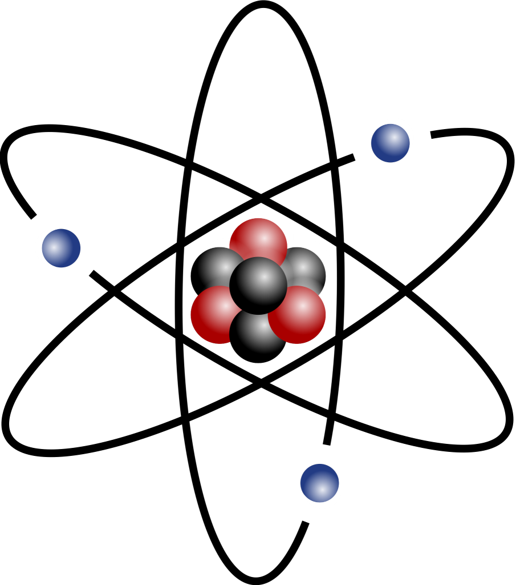

## Document en cours de rédaction …

## Contenu

1. Qu'est ce que l'électricité
2. La couche de valence et l'électron libre
3. Conducteurs et isolants
4. Courant continu et alternatif
5. Tension, Courant, Puissance et Résistance
6. La loi d'Ohm
7. Les composants électroniques de base
8. Étude de la fiche technique d'une Diode émettrice de lumière (DEL)
9. Calcule d'une résistance de limitation de courant pour une DEL

---

## 1 – Qu'est ce que l'électricité

Nous vivons dans un univers où toute la matière est constituée d'atomes.

Des atomes d'hydrogène, d'hélium, de carbone, de cuivre, …

La structure d'un atome ressemble à un système solaire avec une étoile au centre, le noyau et des planètes qui tournent autour, des électrons.

Le noyau est constitué de neutrons (sans charge électrique) et de protons (de charge positive), sauf dans le cas d'un atome d'hydrogène où le noyau est constitué d'un seul proton.

Les électrons sont de charge négative.

Dans un atome de charge électrique neutre (nous verrons plus tard que l'électron peut quitter l'orbite du noyau), les particules chargées sont en équilibres, pour chaque  proton il y a un électron.

Par exemple pour le cuivre, un matériau que nous allons utiliser en laboratoire pour faire circuler l'électricité, il y a 29 protons et 29 électrons.

D'ailleurs, le nombre de protons détermine la place qu'occupe un atome dans le tableau périodique des éléments.

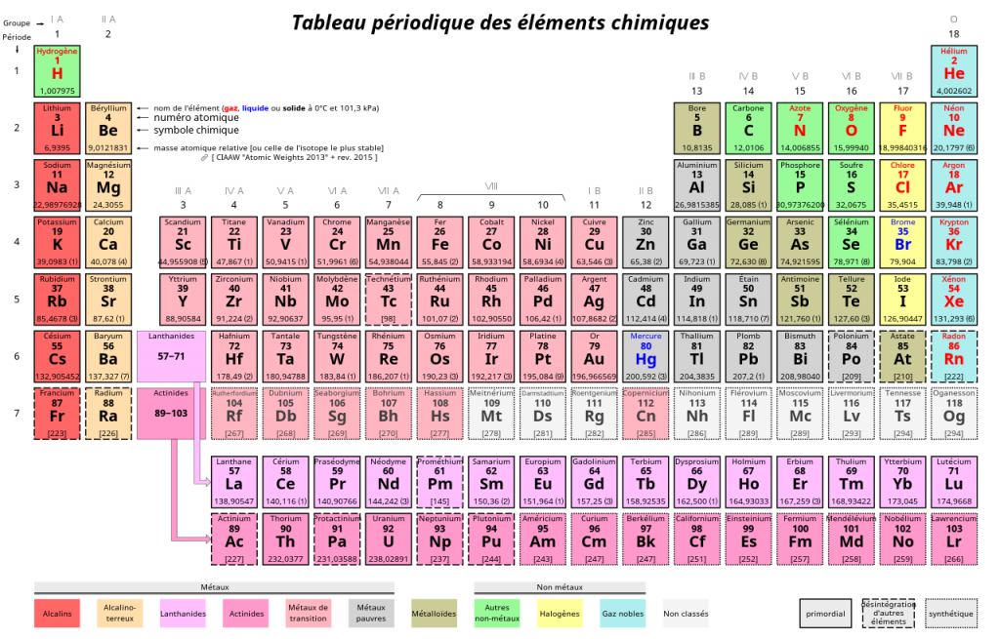

**Note**: Les protons et les électrons sont chargés différemment et comme dans le cas des aimants, les pôles différents s'attirent.

---

## 2 – La couche de valence et l'électron libre

La couche de valence d'un atome est sa dernière couche électronique qui sera, selon le type d'atome, partiellement ou totalement remplie d'électrons.

Plus un électron est éloigné du noyau et moins il sera maintenu en place par l'attraction de ce dernier.

Sous l'effet d'une réaction chimique ou d'un champ magnétique, l'électron peu s'échapper de son orbite et passer à un autre atome.

➡️ Et c'est ainsi qu'un système **produira de l'énergie électrique**.

Dans les centrales électriques, l'électricité est produite en utilisant le principe de déplacement des électrons par un champ magnétique.

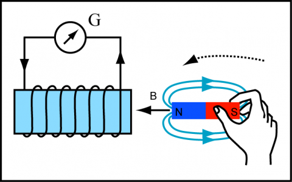

Sous l'effet d'un champ magnétique, l'électron pourra alors sauter à l'atome suivant. Les électrons déplacés à la centrale électriques ***ne sont pas ceux qui alimenteront les appareils électriques de votre maison***.

L'électron n'a fait qu'un tout petit pas. Par contre, étant chargé (négativement) à L'IDENTIQUE que l'électron de valence de l'atome receveur, cet électron sera à sont tour éjecté vers un autre atome. Comme pour les aimants, les charges identiques se repoussent.

Cette réaction peut-être représentée par le pendule de Newton:

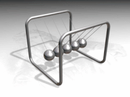

Donc, par exemple, les électrons qui alimenteront la lumière du plafond sont ceux présents dans le filament de l'ampoule électrique. Il est à noter que cette réaction en chaine se propage presqu'à la vitesse de la lumière.

---

## 3 – Conducteurs/Isolants

### 3.1 – Les conducteurs

Certain atomes sont constitués d'une couche de valence où les **électrons sont FAIBLEMENT liés au noyau**, comme par exemple les métaux; **or, argent, aluminium, cuivre**.

Les électrons auront une propension aux déplacements entre atomes.

Les matériaux constitués de ces atomes feront de **bons conducteurs d'électricité**.

### 3.2 – Les isolants

Certains matériaux sont formés d'atomes qui n'ont que des **électrons qui sont FORTEMENT liés au noy**au, comme par exemple; **céramique, mica, verre, air**.

Ces électrons ne quitteront pas l'orbite du noyau et par conséquent, ne permettront pas la production ou la transmission d'énergie électrique.

Les matériaux constitués de ces atomes feront de **bons isolants au courant électrique**.

---

## 4 – Type de courant – Continu/alternatif

Il est possible de produire de l'électricité de deux façons,

A – Par réaction chimique (Pile, batterie, …).

Dans ce cas, une réaction chimique crée un débalancement d'électrons entre deux solutions. Lors de la mise en circuit d'un tel système, la partie hautement chargée en électrons va vouloir se rééquilibrer avec la partie la moins chargée et les électrons vont circuler dans une seule direction: du trop plein (chargée -) vers la zone en manque d'électrons (chargée +). Ce déplacement d'électrons va continuer tant que persistera un déséquilibre. Lorsque le système aura atteint l'équilibre, la pile sera vide (épuisée). **Étant donné que les électrons se déplacent dans une seule direction, on parle de courant (des électrons) continu**.

B – Par induction magnétique

Dans une centrale électrique, l'électricité est produite en exposant des conducteurs (habituellement des fils de cuivres) à la rotation d'un aimant.

Tantôt les électrons seront soumis au pole + de l'aimant et se déplaceront vers une direction, tantôt ils seront exposés au pole – de l'aimant et ils se déplaceront dans la direction opposée.

L'énergie électrique produite sera en alternance continuelle du sens de direction des électrons. Selon les régions du monde, cette alternance sera de 60 ou de 50 fois par seconde.

Le courant électrique va varier comme les vagues sur l'océan.

**On parle alors de courant alternatif**.

**NOTE**: En courant alternatif, les électrons se déplacent très lentement, à peine de quelques centièmes de millimètre par seconde. N'oublions pas que ce sont les électrons présents dans les matériaux de nos appareils qui les font fonctionner ?.

---

## 5 – Tension (Volt), Intensité (Ampère), Puissance (Watt) et Résistance

En électricité, nous décrivons les systèmes en termes de tension, intensité, puissance et résistance.

### 5.1 – Le volt, ou la tension électrique

« Le **volt (E)** est l'unité de mesure de la tension électrique dans un circuit entre un point A et un point B, obtenue avec un appareil appelé voltmètre. C'est à **Alessandro Volta**, physicien italien et inventeur de la pile électrique, que l'on doit ce nom.

Le volt traduit la force électromotrice et la différence de potentiel (tension) entre deux points d'un circuit.

En clair ? Le courant électrique est un déplacement d'électrons. Pour les faire se déplacer, il faut un générateur de courant qui va créer un déséquilibre de charge (différence de potentiel) afin d'attirer et de repousser les électrons. Ce déséquilibre de charge est appelé « tension électrique ».  » ref. edf.fr

### 5.2 – L'ampère, ou l'intensité électrique

« L'**ampère (I ou A)** est l'unité de mesure de l'intensité d'un courant électrique, c'est-à-dire le flux d'électrons dans un conducteur. C'est **André-Marie Ampère**, l'inventeur de l'électro-aimant, qui a donné son nom à cette unité.

On peut comparer le déplacement des électrons dans un circuit à celui de l'eau dans un tuyau : l'intensité, exprimée en ampères, c'est le débit d'eau. Sur le tableau électrique de notre installation à la maison, les fusibles ou disjoncteurs différentiels indiquent l'intensité : 10, 20 ou 32 ampères. Si la puissance électrique demandée est supérieure au flux d'électrons disponible, l'installation disjoncte. » ref. edf.fr

### 5.3 – Le watt, ou la puissance électrique

« Le **watt (W)** est l'unité de mesure de la puissance électrique. Soit la quantité d'énergie pendant un temps donné, En général 1 seconde. Le terme vient du nom de l'ingénieur écossais **James Watt** à l'origine du développement de la machine à vapeur.

En électricité, puissance = tension x intensité. Si l'on prend l'image d'un tuyau d'eau, la puissance électrique serait équivalente à la pression dans le tuyau quand le robinet est fermé (tension) multiplié par le débit d'eau quand le robinet est ouvert (intensité).

Le **kilowatt (kW)**, soit 1 000 watts, est généralement utilisé pour décrire la puissance électrique des moteurs, électriques ou thermiques.

Le **mégawatt (MW)**, soit un million de watts, désigne des unités de production électrique. Une éolienne déploie une puissance d'environ 1 MW, tandis qu'une centrale hydro-électrique comme celle de [Robert Bourassa](https://fr.wikipedia.org/wiki/Liste_des_centrales_hydroélectriques_au_Québec) (La Grande-2) atteint en général une puissance autour de 5 616 MW. Soit 5.6 GW (gigawatts).

Quand il s'agit de mesurer la consommation d'électricité des habitations, on parle dans ce cas de watts-heure ou plus couramment de kWh (kilowatts-heure). » ref. edf.fr

### 5.4 – La résistance électrique

« La résistance (R) électrique traduit la propriété d'un composant à s'opposer au passage d'un courant électrique (l'une des causes de perte en ligne d'électricité). Elle est souvent désignée par la lettre **R** et son unité de mesure est l'ohm(symbole : **Ω**). Elle est liée aux notions de résistivité et de conductivité électrique.

La résistance est responsable d'une dissipation d'énergie sous forme de chaleur. Cette propriété porte le nom d'effet Joule. Cette production de chaleur est parfois un effet souhaité (résistances de chauffage), parfois un effet néfaste (pertes Joule) mais souvent inévitable. » ref. Wikipédia

En laboratoire, nous utiliserons les résistances pour LIMITER l'intensité du courant **électrique** dans un circuit.

---

## 5.5 – Résumé des termes électriques et de leur symbole

| Nom | Description | Unité | Symbole |
| --- | --- | --- | --- |
| **Tension** | Différence de potentiel entre deux points | Volt | E (V) |
| **Intensité** | Flux d'électrons dans un conducteur | Ampère | I (A) |
| **Puissance** | Quantité d'énergie pendant un temps donné | Watt | W (P) |
| **Résistance** | Opposition au passage d'un courant électrique | Ohm | R (Ω) |

---

## 6 – La loi d'Ohm

La loi d'Ohm (du physicien [Georg Ohm](https://en.wikipedia.org/wiki/Georg_Ohm)) postule qu'un courant passant dans un conducteur est directement proportionnel au voltage entre deux points.

Cette relation peut être décrite par l'expression suivante :

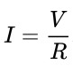

Par exemple, un tension électrique de **1 V**olt (V) passant dans une résistance de **1 Ohm** **(R)** générera une intensité électrique de **1 Ampère (I)** : ***1V/1R = 1 I***.

Voici un tableau présentant toutes les formules de la loi d'Ohm:

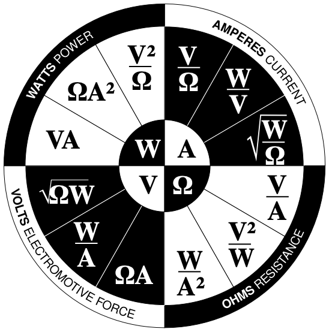

By Per Mejdal Rasmussen – Own work, inspired by Teaching Ohm's Law to Techs by Daniel Sullivan, CC BY-SA 3.0, https://commons.wikimedia.org/w/index.php?curid=48171195

\*\* **Note: La tableau utilise les symboles internationaux. Dans ce cas, I est équivalent à A.**

---

## 6.1 – Quelques exemples de calcules à partir de la loi d'Ohm

6.1.1 – Un grille pain, fonctionnant sur 120 Volts et consommant 10 Ampères produira 1200 Watts d'énergie (puissance).

**W = V\*A, 120 \* 10 = 1200 W**.

6.1.2 – Quelle sera la résistance de l'élément chauffant du grille pain pour produire une intensité de 10 Ampères sous une tension électrique de 120 volts?

R = V/A donc,

R = 120V/10A

R = 12 **Ω**

6.1.3 – Quelle résistance devront nous utiliser sous une tension électrique de 5 Volts pour produire un courant électrique de 0,02 A (peut-être représenté par 20ma pour milliampère – conversion google: milliampère en ampère)?

R = V/A donc,

5V/0,02 = 250 **Ω**

6.1.4 – Quel est le voltage requis pour produire 10W d'énergie dans une résistance de 2K**Ω** (2000 **Ω**)?

V = SQR(R\*W) donc,

SQR(10\*2000) = 141,42 Volts

---

[Outil de calcul en ligne](https://ohmslawcalculator.com/ohms-law-calculator)

---

## 6.2 – Laboratoire: Application de la loi d'ohm

### Solutionnez les systèmes suivants:

1. Quelle est la résistance à utiliser dans un circuit de 3.3 Volts pour limiter le courant (I) à 30 mA?
2. Quelle sera la valeur en watts (puissance) d'un circuit de 50 volts avec une résistance de 100 Ohms?
3. Pour une LED avec un voltage d'avant (forward voltage) de 2.2 volts et une valeur maximum de 50 mA, quelle sera la résistance à utiliser avec la LED dans un circuit de 5 volts?

---

## 7 – Les composants électroniques de base

---

| ID | | Symbole | Image | Fonction |
| --- | --- | --- | --- | --- |
| 1 | Résistance |  | 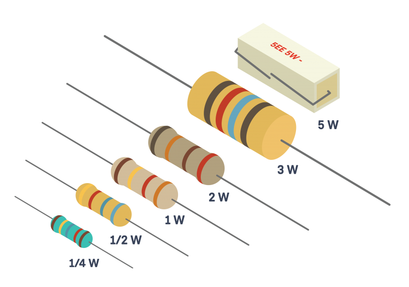 | Limiter le passage d'un  courant électrique. |
| 2 | Condensateur |  | 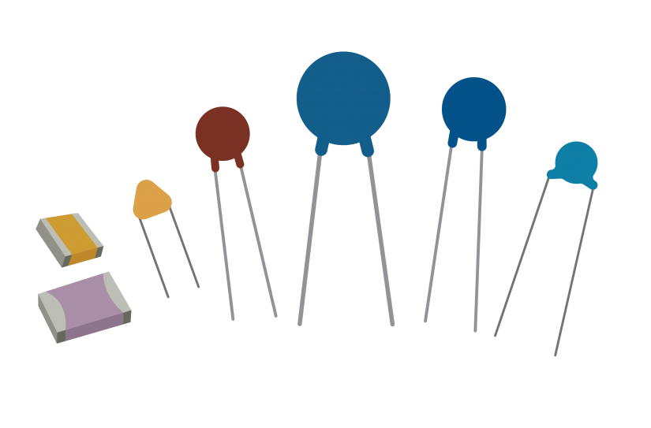 | Bloquer le passage d'une tension continue.  Peut aussi servir à filtrer ou  à stabiliser une tension  électrique. |
| 3 | Diode |  |  | Permet la circulation du  courant électrique dans une seule direction. |
| 4 | Diode E.L. |  | 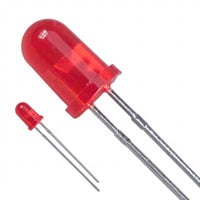 | Produire des photons à partir d'un courant électrique. |
| 5 | Transistor |  | 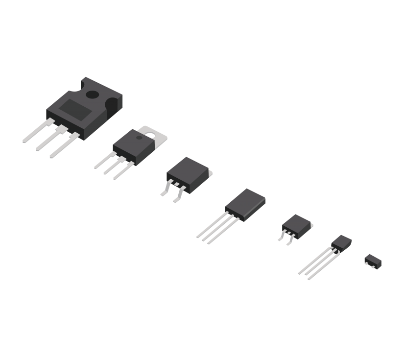 | Permet l'amplification d'un signal électrique.   Peut aussi servir d'interrupteur électronique. |
| 6 | Alimentation continue |  | | |
| | Alimentation alternative |  | | |
| | Mise à la masse (ground) |  | | |
| | Interrupteur |  | | |
| | Interrupteur momentané |  | | |
| | Transformateur |  | 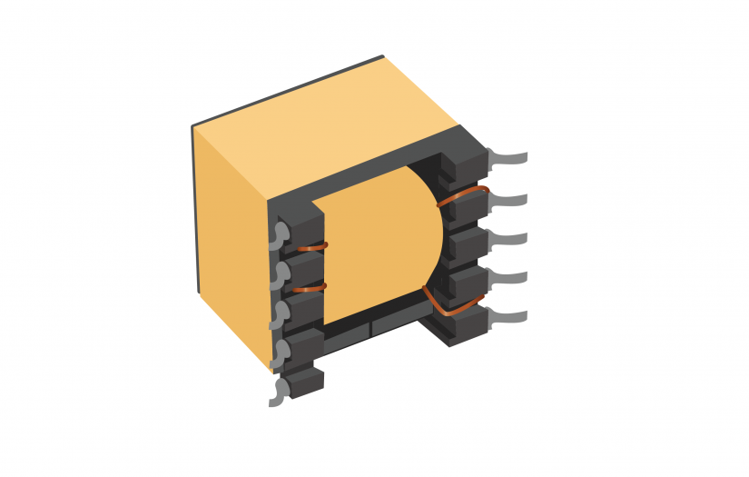 | Réduire ou augmenter la tension électrique (volts). |
| | Inducteur |  | | Stabiliser l'intensité (courant) électrique. |
| | Relai électromagnétique | 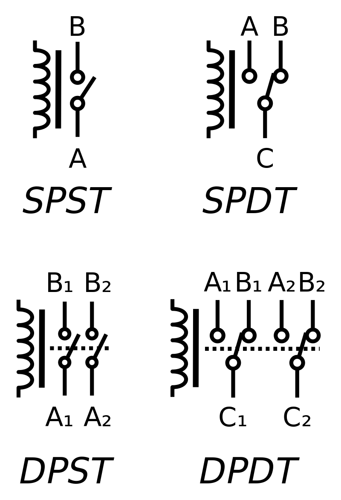 | | |
| | Diode photo sensible |  | | |
| | Fusible |  | | |
| | |  | | |
| | Resistance photo sensible |  | 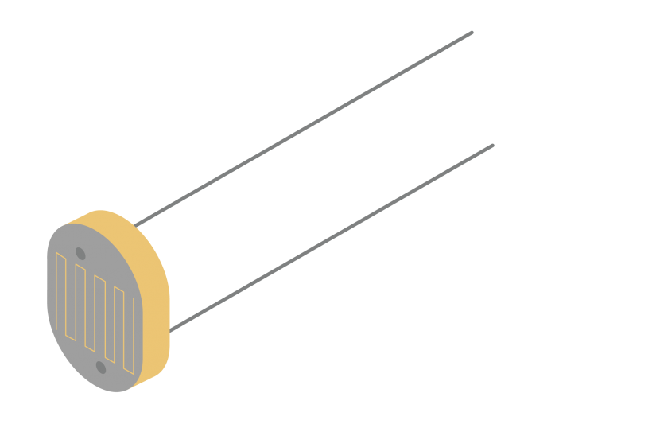 | Limiter le passage d'un  courant électrique en  fonction de l'intensité d'une source lumineuse. |

[Référence](https://en.wikipedia.org/wiki/Electronic_symbol)

---

## 8 – Étude de la fiche technique d'une Diode émettrice de lumière (DEL)

<https://www.jameco.com/webapp/wcs/stores/servlet/ProductDisplay?catalogId=10001&langId=-1&storeId=10001&productId=697522>

---

## 9 – Calcule d'une résistance de limitation de courant pour une DEL

---

[Outil de calcul en ligne](https://ohmslawcalculator.com/led-resistor-calculator)

---

## Crédits

**Document rédigé par Alain Boudreault © 2021-2026**
**Version 2025.03.15.01 - Révision 2025.12.12.1**

*Contenu par [VE2CUY](http://ve2cuy.com/blog)*