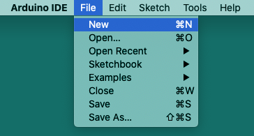
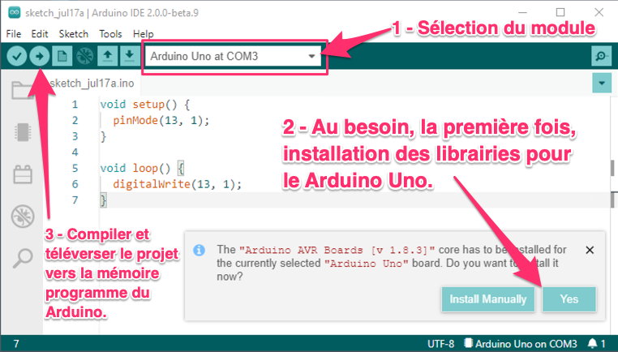
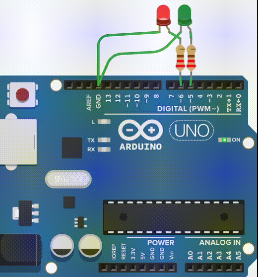

**Voici la conversion du contenu en Markdown GitHub avec la syntaxe demandée pour les images.**  
Toutes les images utilisent `` et conservent leur nom original.

---

# Arduino – Hello world!
17 juillet 2021

  

## Contenu
- Création d’un projet Arduino
- Code de départ, les fonctions *setup()* et *loop()*
- Configuration des broches du MCU: la fonction *pinMode()*
- Lecture/Écriture à partir d’une broche digitale: la fonction *digitalWrite()*
- Écriture de la mémoire programme du Arduino
- La fonction *delay()*
- Exemple d’une **DEL** qui clignote
- Documentation du code
  - Standard
  - Doxygen
- Utilisation de MACROs (constantes)

---

## 1 – Allumer la DEL sur D13

En utilisant un module *Arduino Uno*, l’*IDE Arduino* et quelques *instructions en langage C*, nous allons changer l’état (ON/OFF) de la DEL reliée à la broche digitale 13.

**Action 1.1** – Créer un nouveau projet Arduino IDE  


**Action 1.2** – Analyser le code de départ  


**Action 1.3** – Insérer les lignes avec *pinMode()* et *digitalWrite()*  


```c
void setup() {
  pinMode(13, 1);
}
void loop() {
  digitalWrite(13, 1);
}
```

**Action 1.6** – Compiler et téléverser le projet  


**Action 1.7** – Observer le résultat  


---

## 2 – Utilisation de la fonction *delay()*

**Action 2.2** – Faire clignoter la DEL

```c
void setup() {
  pinMode(13, 1);
}
void loop() {
  digitalWrite(13, 1);
  delay(500);
  digitalWrite(13, 0);
  delay(500);
}
```

Compiler et téléverser :  


Résultat :  


---

## 3 – Documentation du code

Exemple classique avec commentaires :

```c
// Projet: Introduction à Arduino
// Auteur: Alain Boudreault
// Date: 2021.07.17

void setup() {
  pinMode(13, 1); // OUTPUT
}

void loop() {
  digitalWrite(13, 1); // ON
  delay(500);
  digitalWrite(13, 0); // OFF
  delay(500);
}
```

---

## 4 – Utilisation de MACROs

```c
#define DEL_ROUGE 13
#define SORTIE 1
#define ALLUMER 1
#define ETEINDRE 0
#define DELAI 500

void setup() {
  pinMode(DEL_ROUGE, SORTIE);
}

void loop() {
  digitalWrite(DEL_ROUGE, ALLUMER);
  delay(DELAI);
  digitalWrite(DEL_ROUGE, ETEINDRE);
  delay(DELAI);
}
```

---

## 5 – Laboratoire

**5.1 – Laboratoire 01**  


**5.2 – Laboratoire 02**  


---


## Crédits

*Document rédigé par Alain Boudreault © 2021-2026*  
*Version 2025.12.11.1*  

*Contenu par [VE2CUY](http://ve2cuy.com/blog)*

