# Introduction aux microcontrôleurs

*Date: 13 juillet 2021 - Révision du 2025.12.10*

## Objectif de la lecture

À la fin de cet **atelier**, nous devrions être capable d'expliquer ce qu'est un **microcontrôleur**, d'utiliser le vocabulaire qui le définit, d'identifier ses domaines d'application, de reconnaître ses apparences physiques, de déchiffrer un diagramme de définition de bloc qui le décrit, de nommer ses fonctionnalités techniques et d'**identifier** les outils matériels et logiciels nécessaires à sa **programmation**.

Finalement nous ***comprendrons***, je l'espère, la place qu'occupe le projet **Arduino** dans cet espace plus que fascinant.

*A.B. aka ve2cuy*

---

## Contenu

1. **Définition d'un microcontrôleur (MCU pour *microcontroller unit*)**
2. **Exemples d'utilisation d'un MCU**
3. **Sommaire des fonctionnalités d'un MCU**
4. **Apparence physique de boitiers de MCU**
5. **Quelques microcontrôleurs populaires**
6. **Anatomie d'un microcontrôleur (ATmega328P)**
   1. Acronymes couramment utilisés avec les MCU
   2. Spécifications de l'ATmega328P
   3. Diagramme de définition de bloc de l'ATmega328P
   4. Identification des broches de l'ATmega328P
7. **Outils et langages de programmation des microcontrôleurs**
   1. Langages: C, C++, assembleur, librairies, portabilité
   2. Les programmateurs matériels dédiés
   3. Les environnements de développement propriétaires
      * Microchip Studio for AVR
      * MPLAB® X IDE (PIC)
      * STM32CubeIDE
      * ESP-IDF
      * Arduino IDE
8. **Programme d'amorçage (BootLoader)**
9. **Le projet Arduino.cc**
   1. Historique
   2. Le matériel
   3. Les outils logiciels

---

## 1 – Définition d'un microcontrôleur

Que nous en soyons conscient ou pas, les *microcontrôleurs (MCU)* sont omniprésents dans notre vie de tous les jours.

Ce sont des microprocesseurs, *généralement beaucoup moins puissants, rapides et énergivores que ceux présents dans nos ordinateurs personnels*, spécialisés dans la communication avec le monde extérieur.

**Un microcontrôleur est un circuit intégré (CI) qui contient tous les éléments nécessaires pour exécuter des tâches de traitement informatique. Contrairement à un ordinateur classique, qui utilise des composants séparés pour le processeur, la mémoire et les entrées/sorties, le microcontrôleur intègre tous ces éléments dans une seule puce. Cela le rend compact, économique et adapté à des applications spécifiques dans des systèmes embarqués.**

Un microcontrôleur se compose typiquement de plusieurs éléments:

* Un processeur central (CPU) qui exécute les instructions
* De la mémoire pour stocker les données et le programme (RAM et ROM)
* Des interfaces d'entrée/sortie (I/O) pour interagir avec le monde extérieur (capteurs, actionneurs, affichages, etc.)
* Des périphériques intégrés comme des temporisateurs, des convertisseurs analogique-numérique (ADC), et des communications série (comme I2C, SPI, ou UART)

Toutes ces fonctionnalités peuvent se retrouver dans un module physique aussi petit que ceci:

Les microcontrôleurs sont utilisés dans une vaste gamme d'applications comme les appareils ménagers, les véhicules, les jouets électroniques, les systèmes de contrôle industriels, et de nombreux autres dispositifs où des fonctions spécifiques sont automatisées.

---

**Plus précisément, ils peuvent intégrer, dans un même boîtier (puce/circuit intégré/IC), les fonctionnalités suivantes:**

* CPU
* Mémoire programme (FLASH)
* Mémoire vive (SRAM)
* Mémoire permanente (EEPROM)
* Mémoire morte (ROM/FLASH/BOOTLOADER)
* Circuits d'entrées/sorties (I/O)
* Circuits de communication (I2C, UART/USART, SPI, USB, CAN)
* Capteurs/Comparateurs
* Conversion de signaux analogiques <-> digitaux (DAC/ADC)
* Modulation de largeur d'impulsion (PWM)
* Minuteurs/Compteurs (Timers/Counters)
* Gestion des interruptions matérielles/logicielles (INT)
* Détection de blocages de code (WatchDog)
* Détection d'une chute de tension de l'alimentation électrique (Brown-out/BOD)

> Note: Ces termes et acronymes seront expliqués un peu plus loin.

Les microcontrôleurs sont aussi parfois appelés 'System on a Chip' ou **SoC**.

---

## 2 – Exemples d'utilisation

Nous retrouvons les microcontrôleurs dans une multitude d'appareils électroniques tels que:

| Appareil | Image |
|----------| ----- |
| Four micro-ondes | 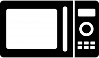  |
| Thermostat intelligent |  |
| Manette de jeux |  |
| Clavier d'ordinateur |  |
| Souris d'ordinateur | 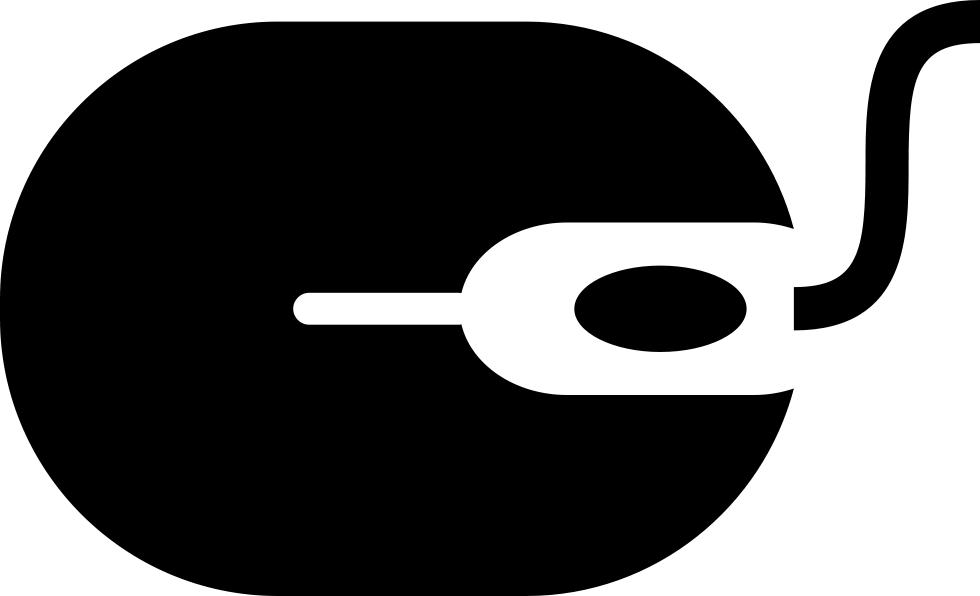 |
| Voiture |  |
| Plateforme de prototypage |  |
| Ligne de montage industrielle |  |

*Tableau 01*

Ils sont aussi présents dans des objets comme les jouets, les appareils électroménagers, les téléphones cellulaires, les routeurs Wifi, les tablettes électroniques, etc.

**Bref, ils sont omniprésents dans notre univers d'appareils électroniques** 😊.

---

## 3 – Sommaire des fonctionnalités d'un MCU

La fonction première d'un microcontrôleur est de proposer des méthodes d'acquisition et d'interaction avec le monde extérieur.

Comme par exemple:

* **Lecture (acquisition de l'état) d'un capteur**
  + Température
  + Pression atmosphérique
  + Humidité relative
  + Position GPS
  + Détection d'une source lumineuse (IR, RGB, etc.)

* **Lecture d'un état logique (0/1, ON/OFF, etc.)**
  + Interrupteur
  + Niveau maximum/minimum d'un réservoir
  + Présence d'un signal électrique
  + Détection d'une porte ouverte dans un système d'alarme
  + Lecture des contrôles d'une manette de jeu

* **Lecture d'un état analogique**
  + Utilisation d'un potentiomètre (gradateur)
  + Acquisition d'un niveau sonore
  + Acquisition de l'intensité d'une source de lumière
  + Lecture de l'état d'un appareil 0-10 volts (standard de contrôle d'appareils analogiques)

* **Renseigner un état analogique**
  + Varier l'intensité d'une source de lumière
  + Varier l'intensité d'un signal sonore
  + Produire des sons complexes
  + Programmer la vitesse de rotation d'un moteur

* **Contrôle d'objets externes**
  + Allumer/éteindre une Diode Émettrice de Lumière (DEL/LED)
  + Contrôler un relais électromécanique
  + Activer une sirène sonore
  + Transmettre un signal électromagnétique
  + Consommer une unité de stockage externe (FLASH Mem)
  + Afficher sur un écran LCD/OLED

> Note: Ceci n'est qu'une petite partie des fonctionnalités des microcontrôleurs. Nous présenterons ultérieurement une liste plus exhaustive.

---

## 4 – Apparence physique des MCUs

Les ***microcontrôleurs*** sont habituellement disponibles sous la forme d'un unique ***circuit intégré (IC)*** adoptant un des boîtiers suivants:

| Acronyme | Description | Image |
|----------|-------------| ------------ |
| **DIP** | Dual Inline Package |  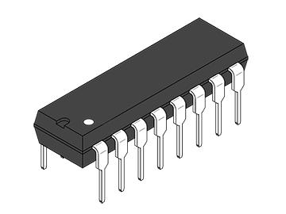  |
| **SOIC** | Small Outline Integrated Circuit | 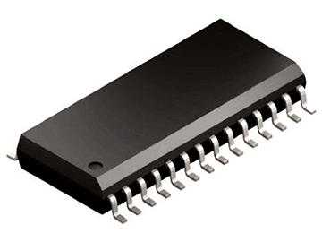  |
| **QFP/TQFP** | (Thin) Quad Flat Package |   |
| **PGA** | Pin Grid Array |   |
| **BGA** | Ball Grid Array | 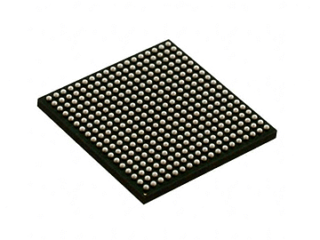  |
| **MLP** | Micro Leadframe Package | 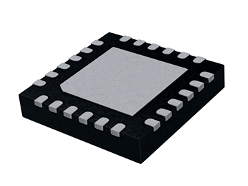  |

*Tableau 02*

Par exemple, le microcontrôleur présent sur une des plateformes de prototypage que nous utiliserons dans le cadre de ce cours est le ATmega328P de type DIP et il ressemble à ceci:

[Référence](https://en.wikipedia.org/wiki/List_of_integrated_circuit_packaging_types)

---

## 5 – Quelques microcontrôleurs populaires

De nombreuses entreprises fabriquent des microcontrôleurs proposant des fonctionnalités dans des formats de traitements de 8 à 32 bits, avec des vitesses de traitement multiples, un grand choix de formats de mémoire (RAM/FLASH, etc.), un nombre variable de lignes et de protocoles de communication avec le monde extérieur.

Au niveau des microcontrôleurs grand public, s'adressant aux enthousiastes de l'informatique et de l'électronique, nommons les entreprises et les microcontrôleurs suivants:

| Entreprise | Microcontrôleurs populaires | NB bits | Logo |
|------------|----------------------------|---------|-------------|
| **Atmel** * La série de MCU AVR *Achetée par Microchip en 2015 | ATtiny85 ATmega32U4 **ATmega328P** (Arduino Uno) **ATmega2560** (Arduino Mega) | 8 8 8 8 | 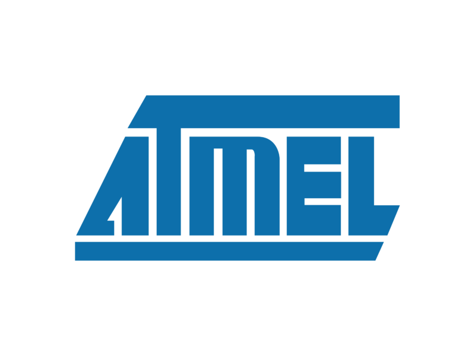 |  
| **Microchip** La série de MCU PIC | PIC16F877A PIC18F4550 | 8 8 | 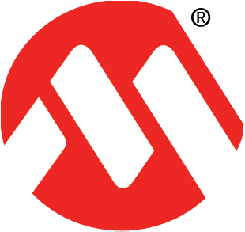 |
| **Espressif** La série de MCU ESP | ESP8266 ESP32 | 32 32 |  |
| **STMicroelectronics** La série de MCU STM32 | STM32F103C8T6 | 32 |  |
| **Raspberry Pi** | RP2040 | 32 |  |

*Tableau 03*

> Note: Dans nos apprentissages pratiques (laboratoires), nous utiliserons principalement les puces **ATmega328P**, disponible sur l'Arduino Uno, et **ATmega2560** disponible sur l'Arduino Mega.

---

## 6 – Anatomie d'un microcontrôleur (ATmega328P)

Pour être en mesure de bien comprendre les différentes fonctions d'un microcontrôleur, commençons par apprivoiser le vocabulaire les définissant.

| Nom* | Description |
|------|-------------|
| **MCU** | *MicroController Unit* |
| **INPUT** | Signal d'entrée |
| **OUTPUT** | Signal de sortie |
| **IO** | *Input/Output* – Entrée/Sortie |
| **GPIO** | *General Purpose Input/Output* – Entrée/sortie à usage général Représente une broche, d'un microcontrôleur, qui peut adopter un nombre varié de fonctionnalités. Par exemple, pour une même broche: lecture digitale, écriture analogique, interruption matérielle, PWM, etc. |
| **Digital IO** | Entrée/Sortie digitale Ne peut prendre que deux états, 0/1, On/Off, 0Volt/[3.3,5]Volts |
| **Analog IO** | Entrée/Sortie analogique Peut prendre une multitude d'états. Par exemple, lire la valeur d'un gradateur (potentiomètre). |
| **Kilo** | Multiplicateur * 1000 Note, en informatique, parce que les CPU calculent en base 2, 1 Kilo Octets (Ko) vaut 1024 Octets. 2¹⁰ = 1 024 |
| **MHz** | Mégahertz – Millions de cycles (impulsions) par seconde |
| **SDRAM** | Mémoire vive statique |
| **EEPROM** | *Electrically-Erasable Programmable Read-Only Memory* Mémoire morte effaçable électriquement et programmable |
| **I2C** | Prononcé *eye-square-see* (en anglais) pour '*Inter-Integrated Circuit*' Protocole de communication privilégié pour le contrôle des différents capteurs et objets reliés au microcontrôleur. Il ne requiert que deux connexions électriques, SDA et SCL |
| **SDA** | *Serial Data Line* – Ligne de données bidirectionnelle Utilisé dans le cadre d'une connexion I2C pour l'échange d'information. |
| **SCL** | *Serial Clock Line* – Ligne d'horloge de synchronisation bidirectionnelle Utilisé dans le cadre d'une connexion I2C pour synchroniser les échanges entre le microcontrôleur (master) et les périphériques (slaves). |
| **CLK** | Horloge (habituellement du CPU). Détermine la cadence d'exécution des instructions du programme. |
| **XTAL** | Cristal Une composante, interne ou externe, qui vibre lorsqu'on y applique une tension électrique et qui permet d'alimenter l'horloge d'un CPU. |
| **ADC** | *Analog to Digital Converter* Convertisseur Analogique à Numérique (CAN*) |
| **DAC** | *Digital to Analog Converter* Convertisseur Numérique à Analogique (CNA) |
| **PWM** | *Pulse Width Modulation* – Sortie à modulation de largeur d'impulsion Permet de simuler la gradation d'un signal à partir d'une sortie digitale en variant la durée des états ON et OFF. Par exemple, modifier l'intensité d'une diode émettrice de lumière (DEL/LED) |
| **Timer Counter** | Minuteur/Compteur (À compléter) |
| **UART USART** | *Universal Synchronous/Asynchronous Receiver Transmitter* Protocole de communication privilégié pour relier le microcontrôleur à un ordinateur pour sa programmation via un BootLoader. Peut aussi servir à la communication entre des microcontrôleurs ou un microcontrôleur et des périphériques tel qu'un écran LCD. C'est un protocole qui est supporté par tous les systèmes d'exploitation de PC. Sous Windows, cette interface est identifiée par COMn (COM1, COM2, etc.), sous MacOS et Linux par /dev/tty* |
| **Boot Loader** | Petit programme de démarrage, installé dans la mémoire FLASH d'un microcontrôleur, habituellement dans les premiers 2Ko, et qui permet sa programmation, via le UART, sans avoir à utiliser des programmeurs matériels propriétaires coûteux. Les microcontrôleurs des modules Arduino possèdent un Bootloader. |
| **SPI** | *Serial Peripheral Interface* SPI est un protocole de communication en mode série synchronisé performant, lorsque plusieurs capteurs sont connectés à un système. Plusieurs capteurs utilisent ce mode de communication. Par exemple, carte SD, module RFID, radio 2.4GHz, etc. Par contre, un nombre plus élevé de signaux doivent être utilisés: SCK, CS, MOSI et MISO. |
| **ISP ICSP** | *In-System Programming, In-Circuit Serial programming* ICSP est une fonctionnalité, via un connecteur électronique qui expose les signaux SPI, qui permet aux microcontrôleurs d'être (re)programmés alors qu'ils sont déjà en place dans le système électronique ou la plateforme de prototypage qu'ils doivent piloter. Ceci évite d'avoir besoin de programmer le microcontrôleur en dehors du circuit à l'aide d'un programmateur dédié. Dans le cas du Arduino, cette interface permet de programmer le BootLoader. |
| **USB** | *Universal Serial Bus* |
| **CAN** | *Controller Area Network* Protocole de communication utilisé principalement dans l'industrie automobile. |
| **INT** | Interruption logicielle ou matérielle Permet de réagir (associer des instructions) de façon asynchrone à un événement. Par exemple, à la fin d'un minuteur ou au changement d'état d'une des GPIO. |

*Tableau 04 – À compléter…*

\*INT – À ne pas confondre avec le type 'int' en C.

> Le tableau précédent présente une grande quantité d'informations.
>
> Le but ici n'est pas de mémoriser toutes ces données mais d'y être exposé une première fois.
>
> Au courant du cours, plusieurs de ces éléments seront revus.

---

### 6.1 – Spécifications du ATmega328P

Fort de nos nouveaux acronymes, examinons maintenant les spécifications techniques du microcontrôleur ATmega328P.

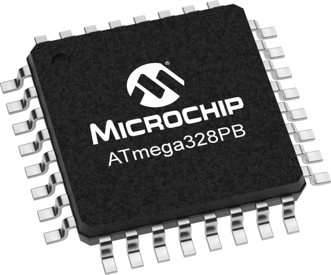

| Nom | Valeur | Description |
|-----|--------|-------------|
| 1) Type de mémoire programme | Flash | |
| 2) Taille de la mémoire programme | 32 Kilo octets | 32768 octets |
| 3) Vitesse du CPU | 20 MHz (1)* | 1 instruction par cycle 20 MIPS (théorique) |
| 4) SRAM (mémoire vive) | 2048 Octets | Utilisée pour les données, variables, etc. |
| 5) EEPROM | 1024 Octets | Mémoire non volatile pour les données |
| 6) Communication externes | 1-UART 2-SPI 1-I2C | |
| 7) Capture Comparaison PWM | 1 1 6 | À compléter |
| 8) Convertisseur A/D | 6 | |
| 9) Minuteur/compteur | 2 x 8-bit 1 x 16-bit | 8 bits -> 0..255 16 bits -> 0..65535 |
| 10) Nombre de comparateurs | 1 | Inclus au point 7 |
| 11) Température de fonctionnement | -40 to 85 °C | |
| 12) Plage d'alimentation (volts) | 1.8 à 5.5 | |
| 13) Nombre de broches | 32 | Sur le boîtier DIP |
| 14) GPIO | 23 *(2) | Entrée/sortie à usage général PB0..PB7, PC0..PC6, PD0..PD7 |

*Tableau 05*

> \*(1) – La vitesse de l'horloge de l'Arduino Uno est de 16MHz. Donc, le CPU du ATmega328P va exécuter environ 16 MIPS.
>
> \*(2) – L'Arduino Uno n'expose pas toutes les GPIO de l'ATmega328P. Les signaux disponibles sous Arduino Uno seront présentés plus tard.
>
> Note: Un **comparateur analogique** peut être utilisé pour déclencher une interruption matérielle dans le cas où le voltage à l'entrée d'une broche dépasse le voltage à l'entrée d'une autre broche.

---

### 6.2 – Diagramme de définition de bloc de l'ATmega328P

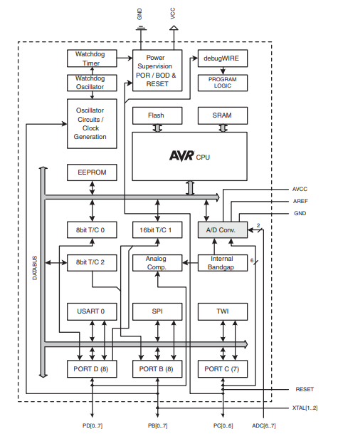

---

### 6.3 – Identification des broches de l'ATmega328P

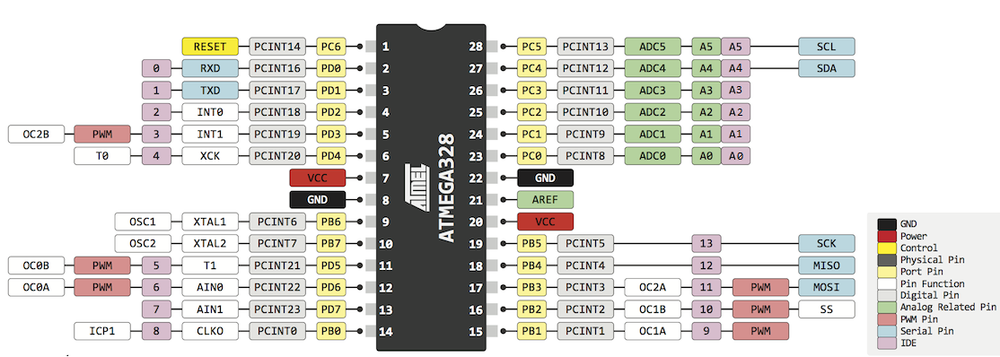

[Atmel-ATmega328P_Datasheet](http://ve2cuy.com/420-1c4/wp-content/uploads/2021/07/Atmel-7810-Automotive-Microcontrollers-ATmega328P_Datasheet.pdf)

---

## 7 – Programmation d'un microcontrôleur

Les fabricants de MCU proposent des solutions propriétaires pour la programmation des MCU, c'est-à-dire, des méthodes et outils pour développer, compiler, épurer, télécharger et tester les applications dans les MCU.

Ces solutions sont habituellement composées des éléments suivants:

* Plateformes de prototypage
* Programmateurs matériels et protocoles
* Environnements intégrés de développement (IDE)
* Langages de programmation, librairies et outils

### 7.1 – Plateformes de prototypage

Une plateforme de prototypage est une plaquette électronique qui reçoit un MCU donné et qui permet d'expérimenter avec ce dernier. Par exemple, voici une des plateformes de prototypage de la cie Microchip pour leurs MCU 8 bits:

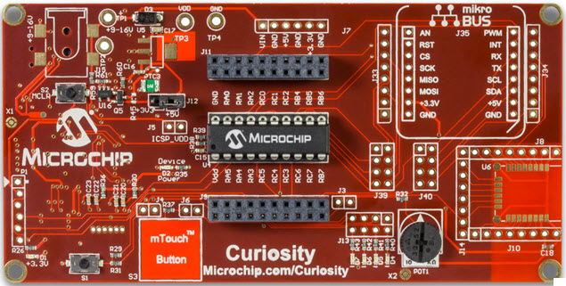

*Curiosity Development Board*

[Référence](https://www.microchip.com/DevelopmentTools/ProductDetails/PartNO/DM164137#additional-summary)

---

### 7.2 – Programmateurs et débogueur en circuit de MCU

Un programmateur de MCU est habituellement un module électronique qui relie la plateforme de prototypage du MCU, via le connecteur **ICSP**, à un ordinateur personnel par l'entremise d'un port USB. Il sera piloté soit à partir de l'IDE, d'une application distincte fenêtrée ou à partir de la ligne de commande du système d'exploitation hôte.

En bref, il est utilisé pour transférer une application (micro-code) vers la mémoire programme du MCU.

Il sert aussi à déboguer l'application en temps réel ou en pas à pas.

Voici une liste de programmateurs/débogueurs populaires:

| Fabricant | Programmateur | Description | Image |
|-----------|---------------|-------------|-------|
| **Microchip** | **PICkit 3** | Pour la programmation des séries PIC (16F, 18F, etc.) [Environ **40$**] |  |
| **Microchip** | **PICkit 4** | Pour la programmation des séries PIC (16F, etc.), AVR (ATmega328P, ATmega1280, etc.) [Environ **125$**] | 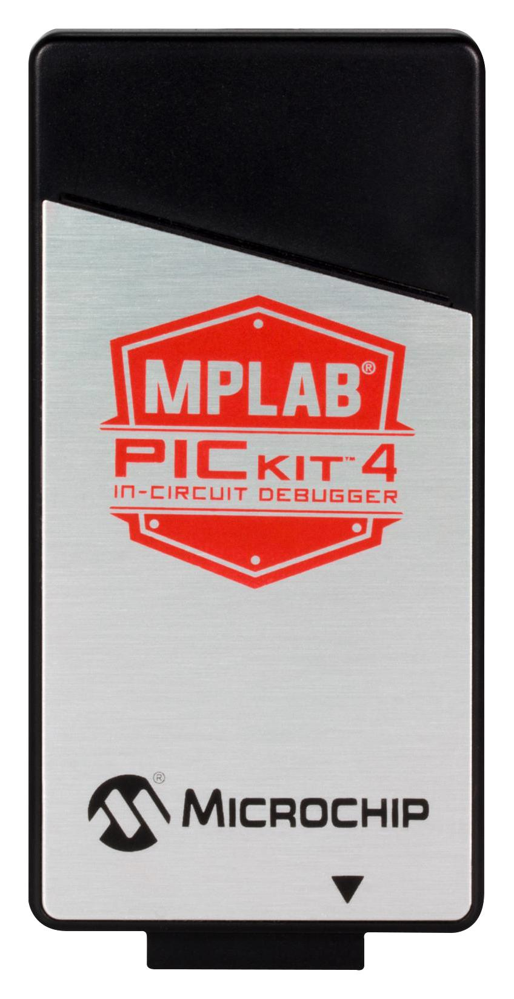 |
| **Atmel** | **Atmel AVRISP STK500** | Pour la programmation de la série AVR (ATmega328P, etc.) [Environ **40$**] | 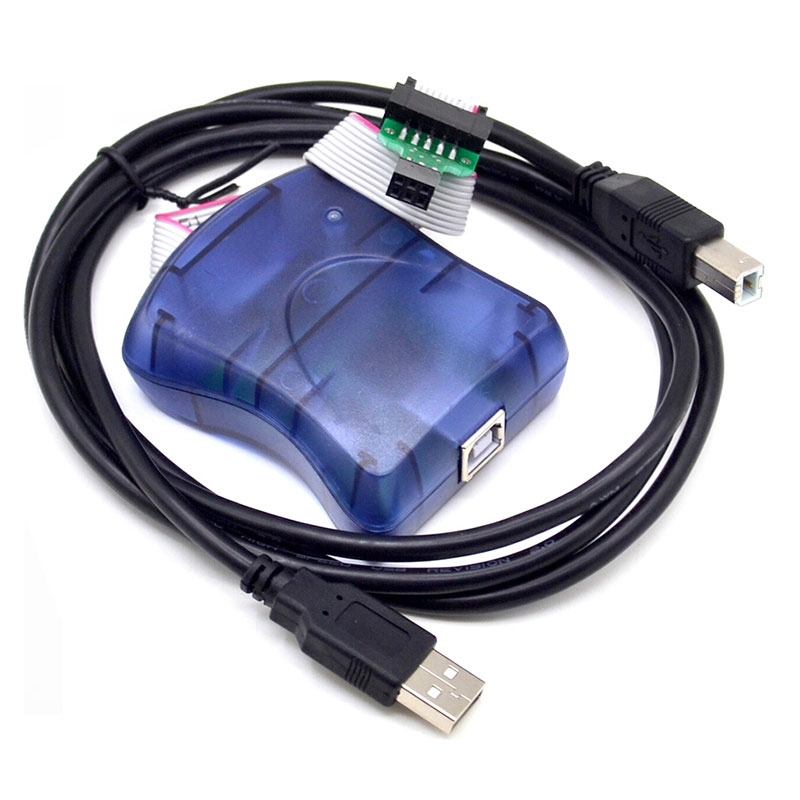 |
| **STMicroelectronics** | **ST LINK V2** | Pour la programmation de la série STM32 [Environ **10$**] |  |
| **Générique Chinois** | **XGecu TL866II Programmer PLUS** | Pour la programmation d'un vaste ensemble de MCU, FLASH, EEPROM, etc. [Environ **75$**] | 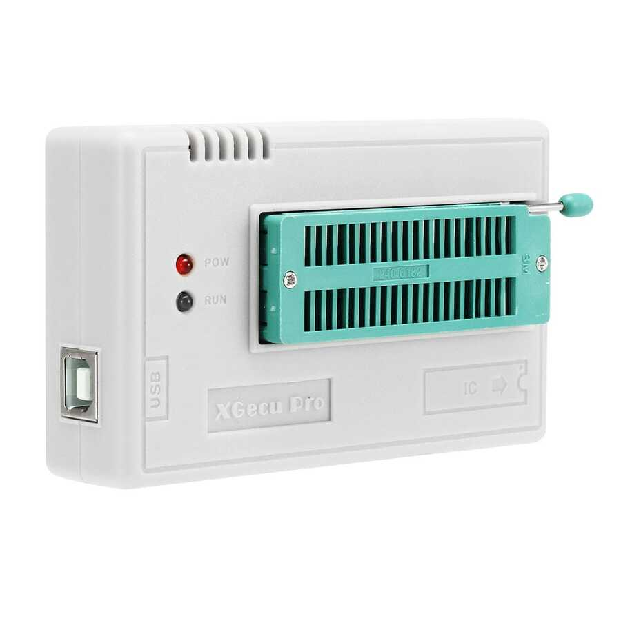 |

*Tableau 06*

👉 Voici un exemple d'une programmation '**en circuit**' d'un PIC 16F, en utilisant le programmateur PICkit 3, sur une plaquette de prototypage:

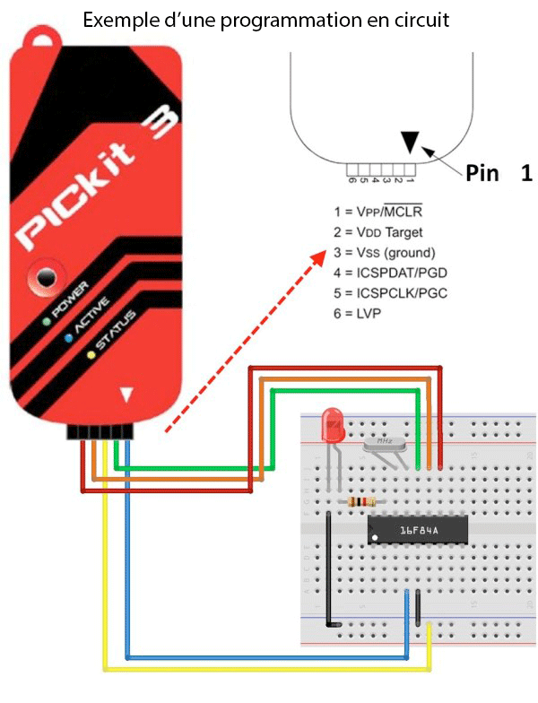

---

### 7.3 – Les environnements de développement (IDE/IPE) propriétaires

Plusieurs concepteurs de MCU proposent des compilateurs, environnements de développement, librairies de code, des outils matériels et logiciels pour le développement de systèmes (embarqués) à partir de leurs MCU.

Les IDE sont habituellement disponibles gratuitement. Par contre, certaines fonctions avancées, comme par exemple, *un compilateur qui optimise le code*, peuvent comporter un coût d'achat.

À ces coûts, il faudra ajouter l'acquisition d'un programmateur de MCU compatible et d'une plateforme de prototypage.

Note: Ces outils produisent des systèmes qui ne sont pas ou peu transportables d'un MCU d'un fabricant vers un autre.

Par contre, ils permettent de développer des systèmes hautement optimisés.

Il faudra aussi tenir compte des investissements en temps et en ressources humaines pour maîtriser une solution donnée.

Voici un aperçu de quelques IDEs disponibles:

| Solution | Capture d’écran de l’IDE |
|----------|--------------------------|
| **Microchip Studio for AVR*** *(Anciennement Atmel Studio) Version Windows seulement Pour MCU de type **AVR** (Atmega) [Disponible ici](https://www.microchip.com/en-us/development-tools-tools-and-software/microchip-studio-for-avr-and-sam-devices) | 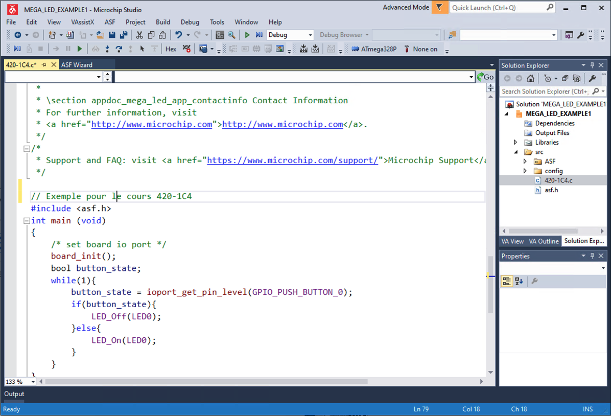 |
| **MPLAB® X IDE** Version Windows, MacOS et Linux Pour MCU de type **PIC** [Disponible ici](https://www.microchip.com/en-us/development-tools-tools-and-software/mplab-x-ide) | 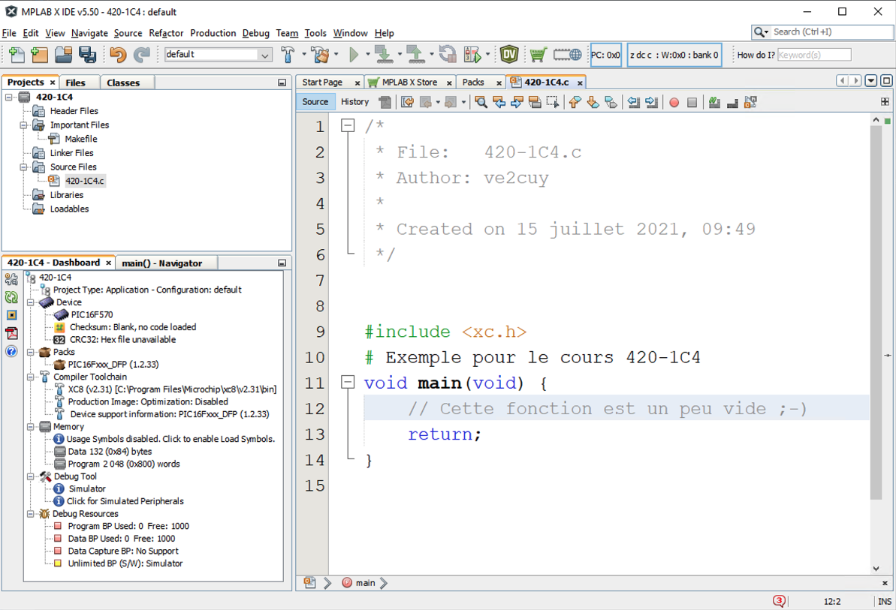 |
| **STM32CubeIDE** Version Windows, MacOS et Linux Pour MCU de type **STM32** [Disponible ici](https://www.st.com/en/development-tools/stm32cubeide.html) | 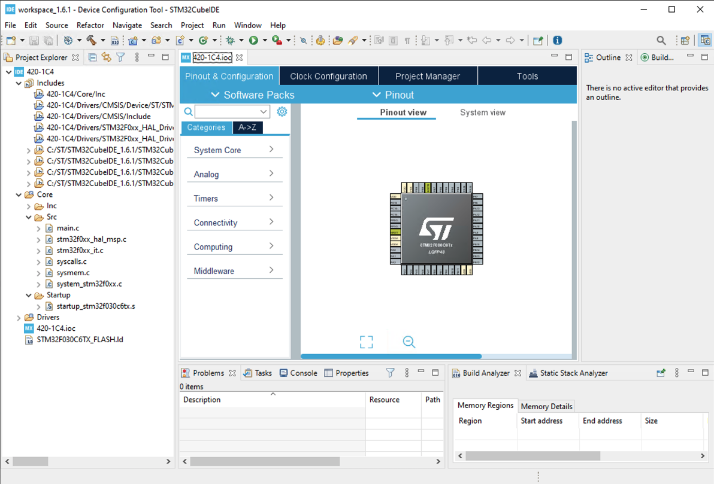 |
| **ESP-IDF** Version Windows, MacOS et Linux Pour MCU de type **ESP** (ESP32, ESP8266) NOTE: S'utilise à partir de la ligne de commandes. [Disponible ici](https://docs.espressif.com/projects/esp-idf/en/latest/esp32/get-started/index.html#get-started-get-esp-idf) | 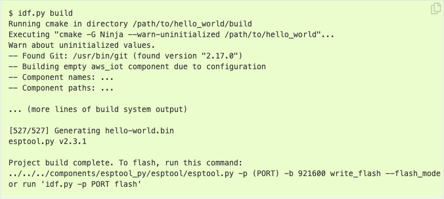 |
| **Arduino IDE** Environnement de développement pour une **multitude de MCU**s et de plateformes de prototypage. Version Windows, MacOS et Linux [Disponible ici](https://www.arduino.cc/en/software) |  |
| **PlatformIO** Environnement de développement pour une **multitude de MCU**s et de plateformes de prototypage. Sous VS Code  | 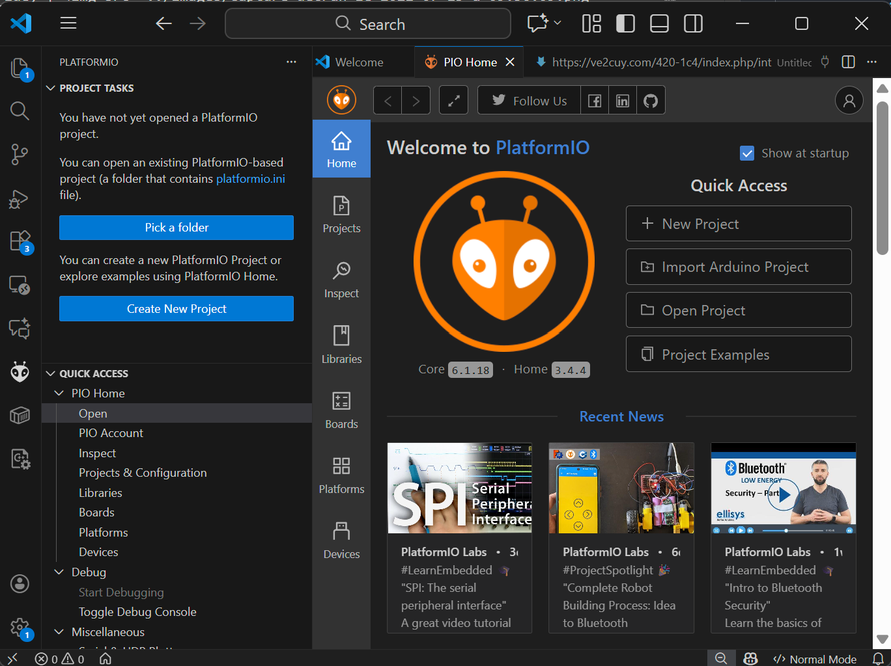 |

*Tableau 07*

### 7.4 – Langages utilisés pour la programmation des MCUs

Les langages les plus utilisés pour le développement d'applications pour les MCU sont:

* C
* C++
* Java
* Assembleur

Avec certains MCUs, il est aussi possible de les programmer en MicroPython (ESP), en PBasic (BASIC Stamp) ou en Spin (Propeller de Parallax).

Dans le cadre de ce cours, nous utiliserons le langage C(++).

---

## 8 – Programme d'amorçage (BootLoader)

Une façon d'expliquer le rôle du 'bootloader' d'un MCU est de poser la question suivante: pourquoi ne puis-je pas programmer mon MCU directement à partir de mon PC?

Et bien, la réponse simple à cette question est que les ordinateurs personnels ne proposent pas, par défaut, les protocoles et signaux (SPI, MOSI, MISO, etc.) nécessaires à leur programmation.

Quels sont les ports de branchement disponibles de facto sur un PC? Le port USB et UART via RS232 (COMn) sur les modèles plus anciens.

Nous pourrions alors utiliser le port USB pour programmer les MCU, mais la plupart des MCU ne proposent pas cette interface car coûteuse à implémenter et nécessite une horloge de 48MHz, elle aussi plus coûteuse à incorporer.

Les MCU proposent presque tous une interface USART. Ce type d'interface, qui permet de transmettre des octets en trames de bits, est aussi disponible sur les PC depuis la première parution de l'IBM PC en 1981 et, une interface logicielle est disponible sur tous les systèmes d'exploitation modernes. Sous Windows, on y réfère par les pilotes de communication COM1, COM2, etc.

**De retour au bootloader**

Le bootloader est un petit programme qui est enregistré, par exemple pour le ATmega328P, dans les premiers 2Ko de mémoire programme du MCU.

À priori, il ne fait rien d'autre que de passer la main au programme de l'utilisateur lors du démarrage ou de la réinitialisation du MCU.

L'astuce ici est d'y placer une petite application, maximum de 2Ko, qui analyse, au démarrage, si une séquence 'magique' d'instructions est reçue sur le port du UART, indiquant que nous désirons réécrire le programme de l'utilisateur.

Les plateformes de prototypage, comme les cartes Arduino, utilisent cette approche pour la programmation des MCUs. L'avantage est qu'il est possible d'expérimenter avec un MCU sans l'achat de programmateurs matériels.

Il y a un léger désavantage: lors du démarrage, le code du bootloader attend quelques instants pour la réception, ou pas, de la séquence de programmation de la mémoire programme, ce délai sera passé au démarrage du programme principal.

**Note**: Il faut absolument un programmateur matériel, ou un autre MCU, pour inscrire du code dans la zone mémoire réservée au BootLoader.

**Voilà, nous voilà maintenant renseigné sur le rôle du BootLoader 😊!**

---

## 9 – Le projet Arduino.cc

Qu'est-ce qu'Arduino?

*L'Arduino utilisé dans ce cours*

**Voici un extrait de l’article de wikipédia:**

Arduino est la marque d’une plateforme de prototypage open-source qui permet aux utilisateurs de créer des objets électroniques interactifs à partir de cartes électroniques matériellement libres sur lesquelles se trouve un microcontrôleur (d’architecture Atmel AVR comme l’Atmega328p, et d’architecture ARM comme le Cortex-M3 pour l’Arduino Due).

Les schémas de ces cartes électroniques sont publiés en licence libre. Cependant, certaines composantes, comme le microcontrôleur par exemple, ne sont pas sous licence libre.

Le microcontrôleur est préprogrammé avec un bootloader de façon qu’un programmateur dédié ne soit pas nécessaire.

Le logiciel de programmation des modules Arduino, dont l’interface, appelée Arduino IDE, est une application Java, libre et multi-plateforme dérivée de Processing servant d’éditeur de code et de compilateur, et qui peut transférer le firmware et le programme au travers de la liaison série (RS-232, Bluetooth ou USB selon le module). Il est également possible de se passer de l’interface Arduino, et de compiler et téléverser les programmes via l’interface en ligne de commande7.

Le langage de programmation utilisé est le C++

---

## Crédits

*Document rédigé par Alain Boudreault © 2021-2026*  
*Version 2025.12.11.1*  
*Site par ve2cuy*
