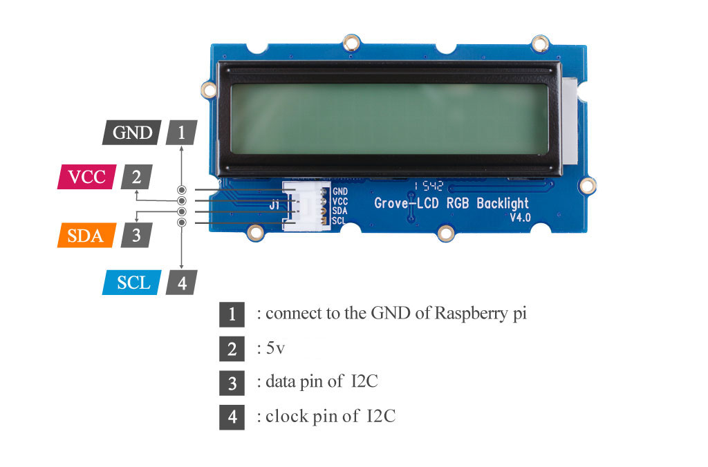
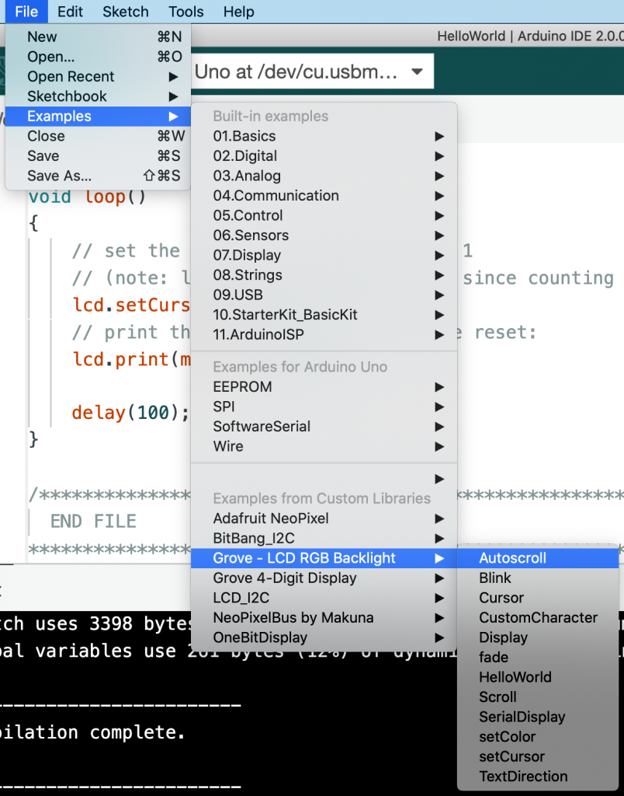
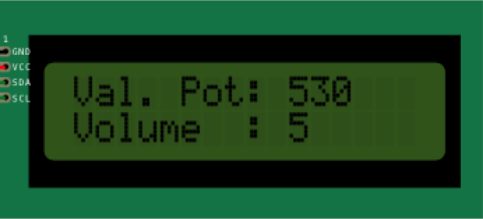
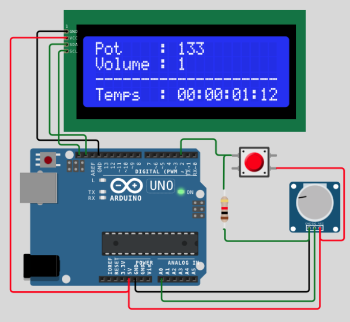
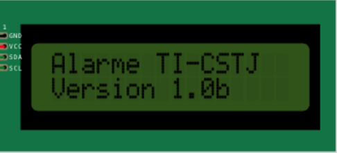
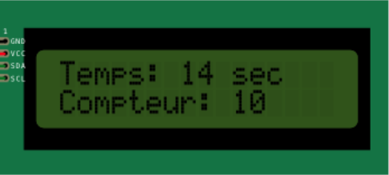
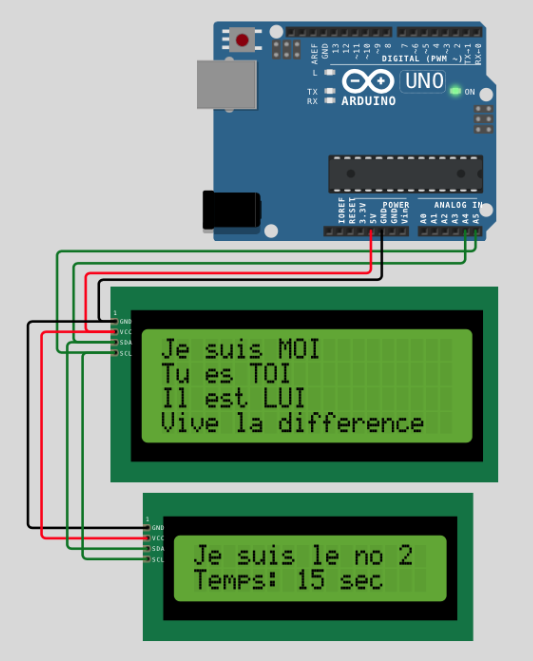
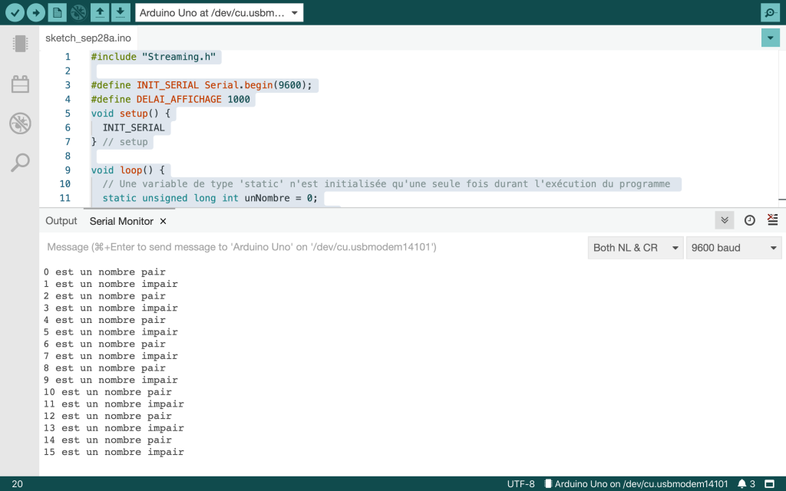
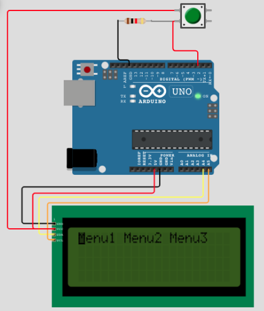

# Grove – Module LCD-RGB i2c

29 septembre 2022




## Type de connexion: I2C (4 adresses)

---

## Identification des broches I2C sur le Arduino Uno

**SDA** = A4  
**SCL** = A5


---

## Contenu

* Installer une librairie
  + Streaming
  + rgb\_lcd
* Utilisation de l'écran LCD
  + rgb\_lcd.**begin**(col, ligne)
  + rgb\_lcd.**clear**()
  + rgb\_lcd.**print**()
  + rgb\_lcd.**setRGB**(r,g,b)
  + rgb\_lcd.**setCursor**(col, lig)
* Afficher sur LCD avec les **IO Streams**
* Compilation conditionnelle **ifdef, ifndef, if, endif**
* Mise en forme d'une chaine de caractères
  + Tableau de caractères '**char chaine[n];**'
  + la fonction **sprintf()**
    - Les instructions de formatage (**%d, %u, %s**, …)
      * Fixer le nombre de caractères à afficher (**%9d, %05d, %2.4f**, …)
    - Contraintes Arduino pour le type '**float**', solution avec IO Stream
* Obtenir le nombre de millisecondes depuis le démarrage de l'Arduino
  + La fonction **millis()**
    - Contrainte du type '**int**' sur 16 bits pour stocker la valeur de **millis()**
      * Solution: les types '**unsigned**' et '**long**'
* Division avec **modulo** (%)
  + Déterminer un choix possible de trois en utilisant un bouton momentané et % 3.
  + L'opérateur ternaire (max = a < b ? b : a)
  + Traiter le choix dans une structure **switch { case :}**
  + Utilisation du type **enum** pour rendre le code plus résilient à la compilation.

---

## [Référence wiki](https://www.seeedstudio.com/Grove-LCD-RGB-Backlight.html)

---

## 1 – Installation de la librairie


---

## 2 – Exploration des exemples installés avec la librairie




---

## 3 – Afficher un texte sur l'écran LCD-RGB de Grove

```
// Inclure les fonctions (librairie) du LCD
#include "rgb_lcd.h"                

/*****************************************/
#define   UNE_SECONDE           1000
#define   LCD_NB_LIGNE          2
#define   LCD_NB_COLONNE        16
#define   LCD_LIGNE2            1
#define   LCD_PREMIERE_COLONNE  0
/*****************************************/

// Définir une variable globale* pour gérer le LCD - 
// * Explications en classe
rgb_lcd lcd;                                            
                                                        
void setup() {                    

    // Définir les specifications du LCD (16 colonnes, 2 lignes)  
    lcd.begin(LCD_NB_COLONNE,                     
              LCD_NB_LIGNE);                            

    // Aficher sur le LCD
    lcd.print("Bonjour 420 ;-)");                       
    delay(UNE_SECONDE);

    // Déplacer le curseur du LCD sur la ligne 1, colonne 0
    lcd.setCursor( LCD_PREMIERE_COLONNE , LCD_LIGNE2 ); 
    lcd.print("Objets connectes");                      

} // setup()

void loop() {}
```

---

## 3.1 – Afficher sur fond de couleur avec le temps qui passe

```
// Inclure les fonctions du LCD
#include "rgb_lcd.h"

// Définir un objet LCD (rgb_lcd).  
// Il servira à contrôler l'écran LCD.
rgb_lcd lcd;

const int colorR = 255;  // Intensité de rouge
const int colorG = 255;  // Intensité de vert
const int colorB = 255;  // Intensité de bleu

void setup() 
{
    // Initialiser le LCD en précisant le nb de lignes (2) de colonnes (16).
    lcd.begin(16, 2);
    
    // Renseigner la couleur de fond de l'écran LCD.
    lcd.setRGB(colorR, colorG, colorB);
    
    // Afficher un message sur l'écran LCD
    lcd.print("Bonjour 420 ;-)");

    delay(1000);
}

void loop() 
{
    // Placer le curseur sur la deuxième ligne, première colonne.
    // Ligne 1 = 0, Colonne 1 = 0
    lcd.setCursor(0, 1);
    // Afficher le nombre de secondes depuis le démarrage de l'application.
    // Note: La fn millis() retourne le nombre de ms écoulées depuis le début de l'application.
    lcd.print(millis()/1000);

    // Arrêter le programme pendant une seconde
    delay(1000);
}
```

3.2 – Analyser et comprendre toutes les lignes du code source.

3.3 – Tester l'application.

---

## DOC11.3.4 – Laboratoire (durée 10 minutes)


<br>

Modifier le code précédent pour:

* afficher le texte sur un **fond jaune**,
* le message « **Temps ecoule** » sur la **deuxième ligne** du LCD,
* dans **loop()**, placer la valeur de la fonction **millis()** dans une variable de type '**int**' nommée '**temps**'
* Afficher la valeur de la variable '**temps**' sur la **première ligne** du LCD,
* **Retirer** le délai dans la fonction **loop**()

**Note**: Qu'arrive t'il à la valeur de la variable 'temps' lorsque le nombre est supérieur à 32,767?

---

## DOC11.3.5 – Laboratoire (durée 30 minutes)


<br>

Écrire un programme qui affiche la valeur d'un potentiomètre, connecté sur la broche de votre choix, sur l'écran LCD, sur fond bleu pale, en respectant le format suivant:

```
Val. Pot: [0..1023]
Volume  : [0..10]
```



La valeur du pot doit être affichée en temps réel. C-a-d, si vous tournez le Pot alors sa valeur change à l'écran.

De plus, il faut afficher un niveau de volume, à partir de la valeur du potentiomètre, entre 0 et 10, **Note**: Utiliser la fonction map() pour ramener la valeur du Pot entre 0 et 10.

**NOTE**: Il ne **FAUT PAS** réafficher les textes « **Val. Pot:** » et « **Volume :** » dans la fonction ***loop()***. De plus, il faut effacer l'espace qu'occupaient les valeurs POT et Volume à l'itération précédente.

---

### DOC11.3.5.b – En défi supplémentaire:

1. Un **bouton** qui permet d'**allumer et éteindre** le rétro éclairage du LCD
2. Afficher le temps qui passe en **jours:heures:minutes:secondes**



La solution est [ici](https://wokwi.com/projects/344083019861066324).

---

## DOC11.3.6 – Laboratoire (durée 30 minutes)


<br>

Écrire un programme qui affiche sur l'écran LCD, le temps qui passe et le nombre de fois que le bouton (D2) est appuyé.

Voici un aperçu de l'écran de départ:

```
Ligne1: Alarme TI-CSTJ
Ligne2: Version 1.0b
```



délai de **3 secondes** suivi de :

```
Ligne1: Temps: 0 sec  
Ligne2: Compteur:  9999999
```



**NOTE**: Il ne faut pas réafficher tout le texte sur le LCD, seulement le contenu de compteur et temps. Indice: **setCursor()**.

**Défi supplémentaire**, continuer à afficher le temps qui passe même si le bouton est enfoncé ?.

---

## 4 – Utilisation d'un LCD sur Wokwi


[Voir la documentation Wokwi](https://docs.wokwi.com/parts/wokwi-lcd1602)

```
/*
   Exemple d'utilisation d'un LCD sur Wokwi

   Connexion des broches:

   LCD.SDA  ->  Uno.A4
   LCD.SCL  ->  Uno.A5
   LCD.GND  ->  Uno.GND
   LCD.VCC  ->  Uno.5V

   **Voir 'Arduino Uno pinout' pour référence.
*/

#include <LiquidCrystal_I2C.h>
  LiquidCrystal_I2C ecranLCD(LCD_ADRESSE_I2C,LCD_NB_COLONNE,LCD_NB_LIGNE); 

/*****************************************/
#define   BOUTON                2
#define   BOUTON_DELAI_REBOND   5
#define   DELAI_MSG_DEBUT       3000
#define   LCD_DELAI             50
#define   LCD_NB_LIGNE          2
#define   LCD_NB_COLONNE        16
#define   LCD_LIGNE2            1
#define   LCD_PREMIERE_COLONNE  0
#define   LCD_POSITION_COMPTEUR 10
#define   LCD_ADRESSE_I2C       0x27
/*****************************************/


void setup() {
  pinMode(BOUTON, INPUT);
  ecranLCD.begin(LCD_NB_COLONNE, LCD_NB_LIGNE);
  ecranLCD.print("Debut du projet");
  // Placer le curseur au début de la ligne no 2
  // Écrire votre prenom
  ecranLCD.setCursor(LCD_PREMIERE_COLONNE, LCD_LIGNE2);  
  ecranLCD.print("Version 1.0beta");
  delay(DELAI_MSG_DEBUT);
  ecranLCD.clear();  // Effacer l'écran
  ecranLCD.print("Alarme TI-CSTJ");
  ecranLCD.setCursor(LCD_PREMIERE_COLONNE, LCD_LIGNE2); 
  ecranLCD.print("Compteur: ");
} // setup()

void loop() {
  static unsigned int compteurBouton = 0;
  int etatBouton = digitalRead(BOUTON);
  delay(BOUTON_DELAI_REBOND);  // debounce du bouton
  ecranLCD.setCursor(LCD_POSITION_COMPTEUR, LCD_LIGNE2); 
  ecranLCD.print(compteurBouton);
  
  if ( etatBouton == HIGH) {
      compteurBouton++;
      while (digitalRead(BOUTON)) ;
      delay(BOUTON_DELAI_REBOND);
  }

} // loop()
```

## 4.1 – Schéma électrique de 4.0 sur Wokwi

```
{
  "version": 1,
  "author": "Anonymous maker",
  "editor": "wokwi",
  "parts": [
    { "type": "wokwi-arduino-uno", "id": "uno", "top": 81.25, "left": -2.09, "attrs": {} },
    {
      "type": "wokwi-pushbutton",
      "id": "btn1",
      "top": -4.65,
      "left": 191.37,
      "attrs": { "color": "green" }
    },
    {
      "type": "wokwi-resistor",
      "id": "r1",
      "top": 21.93,
      "left": 100.76,
      "attrs": { "value": "1000" }
    },
    {
      "type": "wokwi-lcd1602",
      "id": "lcd1",
      "top": -165.75,
      "left": -26.9,
      "attrs": { "pins": "i2c" }
    }
  ],
  "connections": [
    [ "btn1:2.l", "uno:2", "green", [ "h-0.07", "v18.52", "h55.44" ] ],
    [ "uno:5V", "btn1:1.l", "red", [ "v24.7", "h-184.65", "v-16.33" ] ],
    [ "r1:1", "uno:GND.1", "green", [ "v22.14", "h27.61" ] ],
    [ "r1:2", "btn1:2.l", "green", [ "v0" ] ],
    [ "lcd1:SCL", "uno:A5.2", "green", [ "h-42", "v98.6", "h137.19" ] ],
    [ "lcd1:SDA", "uno:A4.2", "green", [ "h-52.33", "v114.74", "h167.43", "v85.56", "h0.74" ] ],
    [ "lcd1:GND", "r1:1", "black", [ "h-67.08", "v152.92" ] ],
    [ "lcd1:VCC", "btn1:1.l", "red", [ "h-60.44", "v8.44" ] ]
  ]
}
```

[Exemple du projet sur Wokwi](https://wokwi.com/projects/340721126724338259)

---

## 4.1.2 – Exemple d'un projet avec deux LCD I2C sur wokwi



[Voir le projet](https://wokwi.com/projects/344165366237233746)

Pour avoir accès au projet, il faut cliquer sur l'image 🙂.

**NOTE**: Pour renseigner l'adresse I2C du deuxième LCD, il faut ajouter l'attribut suivant au schéma json:

```
"attrs": { "i2c-address": "0x26" }
```

---

## 4.2 – Projet universel avec #ifdef

```
#define WOKWI

/*****************************************/
#define   BOUTON                2
#define   BOUTON_DELAI_REBOND   5
#define   DELAI_MSG_DEBUT       3000
#define   LCD_DELAI             50
#define   LCD_NB_LIGNE          2
#define   LCD_NB_COLONNE        16
#define   LCD_LIGNE2            1
#define   LCD_PREMIERE_COLONNE  0
#define   LCD_POSITION_COMPTEUR 10
#define   LCD_ADRESSE_I2C       0x27
/*****************************************/

#ifdef WOKWI
#include <LiquidCrystal_I2C.h>
  LiquidCrystal_I2C ecranLCD(LCD_ADRESSE_I2C,LCD_NB_COLONNE,LCD_NB_LIGNE);   
#else
#include "rgb_lcd.h"  
  rgb_lcd ecranLCD;    
#endif


void setup() {
  pinMode(BOUTON, INPUT);
  ecranLCD.begin(LCD_NB_COLONNE, LCD_NB_LIGNE);
  ecranLCD.print("Debut du projet");
  // Placer le curseur au début de la ligne no 2
  // Écrire votre prenom
  ecranLCD.setCursor(LCD_PREMIERE_COLONNE, LCD_LIGNE2);  
  ecranLCD.print("Version 1.0beta");
  delay(DELAI_MSG_DEBUT);
  ecranLCD.clear();  // Effacer l'écran
  ecranLCD.print("Alarme TI-CSTJ");
  ecranLCD.setCursor(LCD_PREMIERE_COLONNE, LCD_LIGNE2); 
  ecranLCD.print("Compteur: ");
} // setup()

void loop() {
  static unsigned int compteurBouton = 0;
  int etatBouton = digitalRead(BOUTON);
  delay(BOUTON_DELAI_REBOND);  // debounce du bouton
  ecranLCD.setCursor(LCD_POSITION_COMPTEUR, LCD_LIGNE2); 
  ecranLCD.print(compteurBouton);
  
  if ( etatBouton == HIGH) {
      compteurBouton++;
      while (digitalRead(BOUTON)) ;
      delay(BOUTON_DELAI_REBOND);
  }

} // loop()
```

---

## 4.3 – lcd\_rgb : IO Stream et [sprintf](https://fr.wikipedia.org/wiki/Printf)()

Utilisation de la librairie Streaming.h (Attention, sur Wokwi il faut ajouter la librairie au projet via le panneau Library Manager )

**4.3.1** – Installer la librairie ([Streaming by Mikal Hart](https://github.com/janelia-arduino/Streaming))

**4.3.2** – Exemple d'utilisation de la librairie Streaming:

```
/*
    Utilisation du lcd_rgb avec un IO-Stream
*/

// Inclure les fonctions de le LCD
#include "rgb_lcd.h"
#include <Streaming.h> 

#define ECRAN_NB_LIGNES     2
#define ECRAN_NB_COLONNES   16

// Définir une chaine de caractères
char message[17] = "Bonjour Le Monde";

// Définir un objet de type rgb_lcd
rgb_lcd ecran;

void setup() {
  ecran.begin(ECRAN_NB_COLONNES, ECRAN_NB_LIGNES);
  ecran << message;

}

void loop() {}
```

---

## 4.4 – La fonction C sprintf()

Référence sur [Wikipedia](https://fr.wikipedia.org/wiki/Printf#sprintf)

La fonction **sprintf()** – de la librairie <stdio.h> – permet d'insérer, dans une chaine de caractères, plusieurs éléments de type différents. On parle ici d'interpolation de chaîne.

Un peu à la manière de :

**'Volume: ' + valeurVolume + ', Température: ' + valeurTemperature + 'c'** ,

pour produire le résultat suivant:

```
 Volume: 8, Température: 22c
```

Pour arriver à ce résultat avec **sprintf()**, il faut utiliser la syntaxe suivante:

```
#define NB_MAX_DE_CARACTERES   81  
{
  char uneVariablePourPlacerLeResultat[NB_MAX_DE_CARACTERES;
  int volume = 8;
  double temp = 22.2
  // %n permet d'insérer une variable dans la chaine
  sprintf(uneVariablePourPlacerLeResultat, "Volume: %d, Température: %fc", volume, temp);
}
```

**NOTE IMPORTANTE**: La fonction **sprintf()** peut provoquer un débordement de la mémoire. Il est fortement recommandé d'utiliser la fonction **snprintf()**.

---

### 4.4.1 – Tableau des symboles d'insertion

```
Format Sortie                                               Exemple
d & i  Signed decimal integer                               420
u      Unsigned decimal integer                             47235
o      Unsigned octal                                       610
x      Unsigned hexadecimal integer                         7fa
X      Unsigned hexadecimal integer (uppercase)             7FA
f      Decimal floating point, lowercase                    392.65
F      Decimal floating point, uppercase                    392.65
e      Scientific notation (mantissa/exponent), lowercase   3.9265e+2
E      Scientific notation (mantissa/exponent), uppercase.  3.9265E+2
g      Use the shortest representation: %e or %f.           392.65
G      Use the shortest representation: %E or %F            392.65
a      Hexadecimal floating point, lowercase               -0xc.90fep-2
A      Hexadecimal floating point, uppercase               -0XC.90FEP-2
c      Character                                            a
s      String of characters                                 420-1C4
p      Pointer address                                      b8000000
n      Nothing printed.
```

## 4.4.2 – Exemple à réaliser sur Wokwi

Voir [ici](https://wokwi.com/projects/344179892553777747) pour le projet sur Wokwi

```
// Solution du laboratoire: DOC11.3.5

#include <LiquidCrystal_I2C.h>

#define LCD_LIGNE_NO_1                0
#define LCD_LIGNE_NO_2                1
#define LCD_DEBUT_LIGNE               0
#define LCD_NB_LIGNE                  4
#define LCD_NB_COLONNE                20
#define DELAI_MSG_OUVERTURE           1000
#define LCD_ADRESSE_I2C               0x27
#define NOM_PROJET                    "Labo DOC11.4.4.2"
#define VERSION_PROJET                "sprintf et snprintf"
#define LONGUEUR_MSG                  LCD_NB_COLONNE + 1

LiquidCrystal_I2C ecranLCD(LCD_ADRESSE_I2C,LCD_NB_COLONNE,LCD_NB_LIGNE);
char msg[LONGUEUR_MSG];

void setup() {
  ecranLCD.begin(LCD_NB_COLONNE, LCD_NB_LIGNE);
  ecranLCD.print(NOM_PROJET);
  ecranLCD.setCursor(LCD_DEBUT_LIGNE, LCD_LIGNE_NO_2);
  sprintf(msg, "%s", VERSION_PROJET);
  ecranLCD.print(msg);
  delay(DELAI_MSG_OUVERTURE);
  ecranLCD.clear();
} // setup()

void loop() {

  static int compteur = 0;
  int temperature = 22;
  String moi = "moi moi";  // char moi[] = "moi moi";
  float pi = 3.141592;

  // Exemple 01

  ecranLCD.setCursor(LCD_DEBUT_LIGNE, LCD_LIGNE_NO_1);
  sprintf(msg, "c: %d, t: %d", compteur++, temperature);
  ecranLCD.print(msg);
  ecranLCD.setCursor(LCD_DEBUT_LIGNE, LCD_LIGNE_NO_2);
  sprintf(msg, "Je suis %s", moi.c_str());
  ecranLCD.print(msg); 


  // Exemple 02 - Forcer des espaces à gauche
  /*
  ecranLCD.setCursor(LCD_DEBUT_LIGNE, LCD_LIGNE_NO_1);
  sprintf(msg, "c: %5d, t: %d", compteur++, temperature);
  ecranLCD.print(msg);
  */


  // Exemple 03 - Forcer des 0 à gauche
  /*
  ecranLCD.setCursor(LCD_DEBUT_LIGNE, LCD_LIGNE_NO_1);
  sprintf(msg, "c: %05d, t: %d", compteur++, temperature);
  ecranLCD.print(msg);
  */

  // Exemple 04 - Les nombres réels
  // La fonction sprintf de Arduino IDE ne supporte pas les nombres réels (float, double)
  /*
  ecranLCD.setCursor(LCD_DEBUT_LIGNE, LCD_LIGNE_NO_1);
  sprintf(msg, "PI = %f", pi);
  ecranLCD.print(msg); 
  */

  // Voici une solution
  /*
    ecranLCD.setCursor(LCD_DEBUT_LIGNE, LCD_LIGNE_NO_1);
    #define LONGUEUR_CHAINE 8
    #define NB_DECIMALES    6
    char szF[LONGUEUR_CHAINE + 1];
    dtostrf( pi, LONGUEUR_CHAINE, NB_DECIMALES, szF );
    sprintf( msg, "PI = %s", szF );
    ecranLCD.print(msg); 
  */
} // loop()
```

— > Référence pour la fonction [dtostrf()](https://www.programmingelectronics.com/dtostrf/)

---

## 4.5 – Exemples d'interpolation avec d'autres langages.

```
// Exemple en C#
var nom = "Toto Labrosse";
Console.WriteLine("Bonjour, {0}! nous sommes le {1}, et il est {2:HH:mm} présentement", nom, date.DayOfWeek, date);
Console.WriteLine("Bonjour, {nom}! nous sommes le {date.DayOfWeek}, et il est {date:HH:mm} présentement");

//  Exemple en php
<?php
  $nom = "Toto Labrosse";
  echo "Bonjour $nom"; 
?>

// Exemple en JavaScript depuis ES6
const age = 99
console.log(`J'ai ${age} an(s)`)

// Exemple en Python 3.6+
nom = 'Toto Labrosse'
programme = 'Python'
print(f'Bonjour {nom}! Ceci est écrit en {programme}')
```

---

## 5.0.5 – Compilation conditionnelle

```
#define MACRO

#ifdef MACRO

  Inclure ceci seulement si MACRO est définie

#endif /* MACRO */


// -------------------------------------------

#ifdef ABCD
    std::cout << "1: yes\n";
#else
    std::cout << "1: no\n";
#endif


// -------------------------------------------

#ifndef MACRO

  Inclure ceci seulement si MACRO n'est pas définie

#endif /* MACRO */


// -------------------------------------------

#define CLIENT 2

#if (CLIENT == 2)
    const byte port_porte = 3;
#else
    const byte port_porte = 2;
#endif
```

**Voici un exemple:**

```
#include "Streaming.h"

#define CLIENT 1

#if (CLIENT == 2)
    const byte port_porte = 3;
#else
    const byte port_porte = 2;
#endif

void setup() {
  Serial.begin(9600);
  Serial << "port_porte = " << port_porte << endl;
}

void loop() {}
```

## 5.1 LCD – clear, setCursor et sprintf partie 2.

```
/*
    Utilisation du lcd_rgb avec un IO-Stream
*/

// Inclure les fonctions i2C
#include <Wire.h>
// Inclure les fonctions de le LCD
#include "rgb_lcd.h"
#include <Streaming.h> 

#define DEBUG

#define ECRAN_NB_LIGNES     2
#define ECRAN_NB_COLONNES   16

// Définir une chaine de caractères
char message[80];
char ligne_lcd[17];

// Définir un objet de type rgb_lcd
rgb_lcd ecran;

void setup() {
  int   i   = 99;
  float pi  = 3.14;
  char  c   = '@';
  char  texte[] = "Une chaine";
  Serial.begin(9600);

  ecran.begin(ECRAN_NB_COLONNES, ECRAN_NB_LIGNES);
#ifdef DEBUG
  Serial << "Début du programme\n\n";
#endif
  ecran << "i=" << i;
  ecran << ", pi=" << pi;
  // Déplacer le curseur à la ligne 2, colonne 1
  ecran.setCursor(0, 1);
  ecran << "c=" << c;
  // Attendre 2 sec puis effacer l'écran
  delay(2000);
  ecran.clear();
  ecran << texte;
  // Déplacer le curseur à la ligne 2, colonne 1
  ecran.setCursor(0, 1);
#ifdef DEBUG
  // Sous Arduino, sprintf n'implémente pas les float.
  sprintf(message, "i = %d, pi = %f, c = %c, texte = %s", i, pi, c, texte);
  Serial << message;
#endif

  unsigned int entierNonSigne = 0b10101010101010;
  sprintf(message, "entierNonSigne : %u, hex : %x, HEX : %X, Octal = %o", entierNonSigne , entierNonSigne, entierNonSigne, entierNonSigne);
  Serial << endl << endl << message;

}

void loop() {}
```

---

## 5.2 – millis() et aligner à droite avec sprintf

```
/*
    Utilisation du lcd_rgb avec un IO-Stream
*/

// Inclure les fonctions i2C
#include <Wire.h>
// Inclure les fonctions de le LCD
#include "rgb_lcd.h"

// #define DEBUG

#define ECRAN_NB_LIGNES       2
#define ECRAN_NB_COLONNES     16
#define POSITION_MILLISECONDE 07

// Définir une chaine de caractères
char ligneTexte[17];

// Définir un objet de type rgb_lcd
rgb_lcd ecran;

void setup() {
  ecran.begin(ECRAN_NB_COLONNES, ECRAN_NB_LIGNES);
}

void loop() {
  ecran.setCursor(POSITION_MILLISECONDE, 0);
  // %9 = 9 car minimun pour l'impression de la valeur
  // lu = entier long, non signé
  sprintf(ligneTexte, "%9lu", millis()); 
  ecran.print(ligneTexte);
  ecran.setCursor(POSITION_MILLISECONDE, 1);
  // %09 = 9 car minimun pour l'impression de la valeur, complété par des zéros à gauche.
  sprintf(ligneTexte, "%09lu", millis()); 
  ecran.print(ligneTexte);
}
```

---

## 5.3 – Changer la direction de l'affichage du LCD

```
#include <Wire.h>
#include "rgb_lcd.h"

rgb_lcd lcd;

int unCaractere = 'a';

void setup() 
{
    // Définir la taille de l'écran
    lcd.begin(16, 2);
    // afficher le curseur
    lcd.cursor();
}

void loop() 
{
    // changer la direction d'affichage si 'm':
    if (unCaractere == 'm') 
    {
        // afficher de roite à gauche
        lcd.rightToLeft();
    }
    // changer la direction d'affichage si 's':
    if (unCaractere == 's') 
    {
        // afficher de gauche à droite
        lcd.leftToRight();
    }
    // Si 'z' alors reset
    if (unCaractere > 'z')
    {
        // aller à (0,0):
        lcd.home();
        // Recommencer avec 'a'
        unCaractere = 'a';
    }
    // Afficher le car
    lcd.write(unCaractere);
    // Attendre un peu
    delay(500);
    // Incrémenter la valeur du caractère
    unCaractere++;
}
```

---

## 5.4 – Déplacer le texte gauche<–>droite

```
#include <Wire.h>
#include "rgb_lcd.h"

#define TEXTE           "Bonjour 420 ;-)"
#define LONGUEUR_TEXTE  15
#define LARGEUR_ECRAN   16 
#define DELAI_CAR       150
#define DELAI_CYCLE     1000

rgb_lcd lcd;

void setup() {
    lcd.begin(LARGEUR_ECRAN, 2);
    lcd.print(TEXTE);
    delay(DELAI_CYCLE * 2);
}

void loop() {
    // Déplacer le texte vers la gauche
    for (int position = 0; position < LONGUEUR_TEXTE; position++) {
        // Déplacer de un car vers la gauche
        lcd.scrollDisplayLeft();
        delay(DELAI_CAR);
    }

    for (int position = 0; position < LONGUEUR_TEXTE + LARGEUR_ECRAN ; position++) {
        // Déplacer de un car vers la droite
        lcd.scrollDisplayRight();
        delay(DELAI_CAR);
    }

    // Replacer le texte au début de l'écran
    for (int position = 0; position < LARGEUR_ECRAN; position++) {
        lcd.scrollDisplayLeft();
        delay(DELAI_CAR);
    }

    delay(DELAI_CYCLE);
}
```

---

## 5.5 – LCD : AutoScroll

```
#include <Wire.h>
#include "rgb_lcd.h"

rgb_lcd lcd;

char message[]      = "La voix des Misterons";
int longueurMessage = 21;

void setup()
{
    lcd.begin(16, 2);
}

void loop()
{
    lcd.setCursor(0, 0);
    // Imprimer les car '0' à '9'
    for (int caractere = 0; caractere < 10; caractere++)
    {
        lcd.print(caractere);
        delay(300);
    }

    lcd.setCursor(16,1);
    // Activer le scroll automatique
    lcd.autoscroll();
 
    // Parcourir tous les caractères du message
    for (int caractere = 0; caractere < longueurMessage; caractere++)
    {
        // Afficher le caractère courant de la chaine
        lcd.print(message[caractere]);
        delay(200);
    }
    // désactiver le scroll automatique
    lcd.noAutoscroll();

    // Effacer l'écran
    lcd.clear();
}
```

---

## 5.6 – LCD : Caractères personnalisés

```
#include <Wire.h>
#include "rgb_lcd.h"

rgb_lcd lcd;

// make some custom characters:
byte heart[8] = {
    0b00000,
    0b01010,
    0b11111,
    0b11111,
    0b11111,
    0b01110,
    0b00100,
    0b00000
};

byte smiley[8] = {
    0b00000,
    0b00000,
    0b01010,
    0b00000,
    0b00000,
    0b10001,
    0b01110,
    0b00000
};

byte frownie[8] = {
    0b00000,
    0b00000,
    0b01010,
    0b00000,
    0b00000,
    0b00000,
    0b01110,
    0b10001
};

byte armsDown[8] = {
    0b00100,
    0b01010,
    0b00100,
    0b00100,
    0b01110,
    0b10101,
    0b00100,
    0b01010
};

byte armsUp[8] = {
    0b00100,
    0b01010,
    0b00100,
    0b10101,
    0b01110,
    0b00100,
    0b00100,
    0b01010
};


void setup() 
{

    lcd.begin(16, 2);
   
    // create a new character
    lcd.createChar(0, heart);
    // create a new character
    lcd.createChar(1, smiley);
    // create a new character
    lcd.createChar(2, frownie);
    // create a new character
    lcd.createChar(3, armsDown);
    // create a new character
    lcd.createChar(4, armsUp);
    // set up the lcd's number of columns and rows:
    
    
    lcd.setCursor(0, 0);
    // Print a message to the lcd.
    lcd.print("J'");
    lcd.write((unsigned char)0);
    lcd.print(" Arduino! ");
    lcd.write(1);
}

void loop() 
{
    // read the potentiometer on A0:
    int sensorReading = analogRead(A0);
    // map the result to 200 - 1000:
    int delayTime = map(sensorReading, 0, 1023, 200, 1000);
    // set the cursor to the bottom row, 5th position:
    lcd.setCursor(4, 1);
    // draw the little man, arms down:
    lcd.write(3);
    delay(delayTime);
    lcd.setCursor(4, 1);
    // draw him arms up:
    lcd.write(4);
    delay(delayTime);
}
```

---

## 6.1 – Laboratoire


<br>


Écrire un programme qui affiche la valeur du potentiomètre (A1) à droite de la ligne 2. Utiliser la technique du padding pour assurer que la valeur occupe toujours trois espaces à l'écran.

---

## 6.2 – Laboratoire

Écrire un programme qui permet de modifier la valeur Bleu de RGB à partir du potentiomètre.

Pour **Rouge** et **Vert**, utiliser la valeur 255.

---

## 7 – Reste de la division, enum et switch

## 7.1 – Reste de la division, modulo (% n)

Le reste de la division peut être utilisé pour programmer une séquence dans une série de nombres.

Par exemple, le code suivant permet d'identifier les nombres pairs et les nombres impaires:

```
#include <Streaming.h> 
#define INIT_SERIAL Serial.begin(9600);  // Remarquer la MACRO!
#define DELAI_AFFICHAGE 1000
void setup() {
  INIT_SERIAL
} // setup

void loop() {
  // Une variable de type 'static' n'est initialisée qu'une seule fois durant l'exécution du programme 
  static unsigned long int unNombre = 0;
  Serial << unNombre << " est un nombre : ";
  
  if (unNombre % 2) {
    Serial  << "impair,\t";
  } else Serial  << "pair,  \t" ;

  Serial << unNombre << " % 2 = " << (unNombre % 2) << endl;
  unNombre++;
  delay(DELAI_AFFICHAGE);

} // loop
```

Résultat:



## 7.2 – L'opérateur ternaire

```
variable = (condition) ? expressionSiVrai : expressionSiFaux;
```

Par exemple,

```
#include "Streaming.h"

void setup() {
  Serial.begin(9600);
  boolean yo = true;
  Serial << "Start" << endl;
  Serial << (yo ? "Vrai" : "faux");
}

void loop() {
}
```

---

## 7.2.1 – Ou bedon avec l'utilisation d'une variable de type 'String'

```
String etat = yo ? "Vrai" : "faux";
Serial << etat;

// String est une classe alors plusieurs méthodes sont disponibles pour traiter la chaine.
etat.toUpperCase();
Serial << etat;
```

**NOTE**: Une variable de type '***String***' occupe plus de place en mémoire qu'un tableau de 'char' de même longueur.

```
Utilisation de la mémoire pour un programme vide:

void setup() {}
void loop()  {}

Sketch uses 444 bytes (1%) of program storage space. Maximum is 32256 bytes.
Global variables use 9 bytes (0%) of dynamic memory, leaving 2039 bytes for local variables. Maximum is 2048 bytes.

-----------

Utilisation de la mémoire pour un programme avec
char chaine[] = "abc":

Sketch uses 444 bytes (1%) of program storage space. Maximum is 32256 bytes.
Global variables use 9 bytes (0%) of dynamic memory, leaving 2039 bytes for local variables. Maximum is 2048 bytes.

-----------

Utilisation de la mémoire pour un programme avec
String chaine = "abc";

Sketch uses 1806 bytes (5%) of program storage space. Maximum is 32256 bytes.
Global variables use 29 bytes (1%) of dynamic memory, leaving 2019 bytes for local variables. Maximum is 2048 bytes.
```

---

## 7.2.2 – Afficher les nombres pair/impair en utilisant l'opérateur ternaire

```
#include "Streaming.h"

#define INIT_SERIAL Serial.begin(9600);
#define DELAI_AFFICHAGE 1000
void setup() {
  INIT_SERIAL
} // setup

void loop() {
  // Une variable de type 'static' n'est initialisée qu'une seule fois durant l'exécution du programme 
  static unsigned long int unNombre = 0;
  Serial << unNombre << " est un nombre";
  Serial << (unNombre % 2 ? " pair" : " impair");  // Quel est le prob ici?
  Serial << endl;

  unNombre++;
  
  delay(DELAI_AFFICHAGE);

} // loop
```

---

## 7.3 – L'instruction 'switch'

```
#include "Streaming.h"

void setup(){
  Serial.begin(9600);
  unsigned char option = 2;
  Serial << "Option: ";

  switch (option) {

    case 0: Serial << "1" ;break;
    case 1: Serial << "2" ;break;
    case 2: Serial << "3" ;break;

    default: Serial << "Choix invalide!";

  } // switch()

} // setup()

void loop(){}
```

---

## 7.3.1 – Version Serial et LCD

```
#include "Streaming.h"
#include "rgb_lcd.h"

rgb_lcd LCD2x16;

void setup(){
  Serial.begin(9600);
  LCD2x16.begin(16,2);
  unsigned char option = 3;
  Serial << "Option: ";
  LCD2x16 << "Option: ";
  switch (option) {

    case 0: Serial << "1";
            LCD2x16 << "1"; 
            break;

    case 1: Serial << "2"; 
            LCD2x16 << "2"; 
            break;

    case 2: Serial << "3";
            LCD2x16 << "3"; 
            break;

    default: Serial << "Choix invalide!";
             LCD2x16 << "Invalide!"; 

  } // switch()


}

void loop(){}
```

---

## 7.3.2 – Laboratoire (Durée 15 minutes)


<br>

1. Modifier le projet précédent pour que l'affichage sur le moniteur série soit conditionnel à la présence de la Macro 'SERIE'.
2. Modifier le projet précédent pour que l'affichage sur le LCD soit conditionnel à la présence de la Macro 'LCD'.

---

## 7.3.3 – Laboratoire (Durée 30 minutes)

Compléter le projet suivant, en utilisant l'instruction '***switch***' pour que la DEL clignote le nombre de fois défini par le reste de la division.

Si le macro 'DEBUG' est définie, le message suivant doit apparaitre dans le moniteur série:

**La DEL clignote n fois.**

**Note**: Si le reste de la division n'est pas entre [0..2] il faut afficher un message d'erreur dans le moniteur série.

```
/*
    Fichier:  bouton-modulo.ino
    Auteur:   Alain Boudreault
    Date:     2021.09.28
    ---------------------------------------------------------------------------
    Description: Exemple d'un projet qui tient compte de l'état précédent
                 du bouton momentané pour implémenter une rotation de choix 
                 en utilisant le reste d'une division

                 La DEL clignote une, deux ou trois fois selon le reste
                 de la division par trois du nombre de fois
                 que le bouton a été appuyé.

                 Note: Le reste de la division du compteur d'utilisation
                 du bouton retourne, dans l'ordre, les valeurs: 1,2 et 0

    ---------------------------------------------------------------------------
    M-A-J:
    --------------------------------------------------------------------------    
*/

// --------------------------
// Inclusion des librairies
#include "Streaming.h"
#include "rgb_lcd.h"

// --------------------------
// Les Macros
#define ON                              HIGH
#define OFF                             LOW
#define BROCHE_BOUTON                   4
#define BROCHE_DEL                      3
#define LCD_MSG_DIVISION                "Reste DIV/3 = "
#define LCD_POSITION_COL_RESTE_DIVISION 14
#define LCD_POSITION_LIG_RESTE_DIVISION 0
#define MAXIMUM_DELAI_BOUTON_APPUYE     500
#define NB_OPTIONS_MENU                 3

// --------------------------
// Les variables globales
unsigned long int accumulateur        = 0;      // NB fois bouton appuyé
rgb_lcd ecran;                                  // Objet pour controller le LCD


// ----------------------
void setup()
{
  Serial.begin(9600);
  Serial << "Début du programme\n-----------------------\n\n";
  ecran.begin(16,2);
  ecran << LCD_MSG_DIVISION;
  pinMode(BROCHE_BOUTON, INPUT);    
  pinMode(BROCHE_DEL, OUTPUT);
}

// ----------------------
void loop()
{
  if (digitalRead(BROCHE_BOUTON))                       // Lire le bouton
  {
    accumulateur++;                                     // Augmenter le compteur touche bouton
    ecran.setCursor(LCD_POSITION_COL_RESTE_DIVISION,    // Déplacer le curseur LCD à la position de la valeur modulo
                    LCD_POSITION_LIG_RESTE_DIVISION);
    ecran << accumulateur % NB_OPTIONS_MENU;            // Afficher le reste de la division sur le LCD
    delay(MAXIMUM_DELAI_BOUTON_APPUYE);                 // Gérer les rebonts du bouton 
  } // if digitalRead()                                  
} // loop()
```

---

## 7.4 – L'instruction 'enum'

```
#include "Streaming.h"

enum Menu {
  option1,   // vaut 0
  option2,   // vaut 1
  option3    // vaut 2
};


void setup(){
  Serial.begin(9600);

  Menu unMenu = option2;

  switch (unMenu) {

    case option2: Serial << "Option 2"; break;

    default: Serial << "Choix invalide!";
  } // switch

} // setup()

void loop(){}
```

---

## 7.4.1 – Affecter une valeur aux éléments d'un 'enum'.

```
#include "Streaming.h"

enum Menu {
  option1 = 1, 
  option2 = 2, 
  option3 = 0 
};


void setup(){
  Serial.begin(9600);

  Menu unMenu = 0;

  switch (unMenu) {

    case option1: Serial << "Option 1"; break;
    case option2: Serial << "Option 2"; break;
    case option3: Serial << "Option 3"; break;

    default: Serial << "Choix invalide!";
  } // switch

} // setup()


void loop(){}
```

```
// Exemple d'utilisation de l'instruction 'enum'
#include <Streaming.h>

enum desFruits {
  pomme,
  cerise,
  kiwi,
  banane,
  fraise = 99
};

void setup() {
  Serial.begin(115200);

  desFruits unFruit = kiwi;

  switch (unFruit) {

    case kiwi: Serial << "Je suis un kiwi ;-)"; break;

    default: Serial << "Je suis un fruit non traité";
  } // switch

  Serial << " et j'ai la valeur: " << unFruit << endl; 
} // setup()

void loop() {
  // put your main code here, to run repeatedly:

}
```

---

## 7.5 – Gestion d'un menu avec enum – sous Wokwi



```
/*
    Projet: Enum+Menu
    Auteur: Alain Boudreault
    Date:   2022.10.23
    ------------------------------------
    Description:  Exemple d'utilisation de l'instruction 'enum' pour la gestion
                  d'un menu affiché sur un LCD. 

*/

#define DEBUG
#define WOKWI
#include <Streaming.h>
#include "projet.h"       // Les 'define's du projet sont dans un fichier à part.

#ifdef WOKWI
#include <LiquidCrystal_I2C.h>
  LiquidCrystal_I2C ecranLCD(LCD_ADRESSE_I2C,LCD_NB_COLONNE,LCD_NB_LIGNE);   
#else
#include "rgb_lcd.h"  
  rgb_lcd ecranLCD;    
#endif


void setup() {
#ifdef DEBUG  
  Serial.begin(UART_VITESSE);
  Serial << "Début du projet enum+menu\n";
#endif
  pinMode(BOUTON, INPUT);
  ecranLCD.begin(LCD_NB_COLONNE, LCD_NB_LIGNE);
  ecranLCD.cursor_on();
  ecranLCD << "Ex d'un Menu";
  ecranLCD.setCursor(LCD_PREMIERE_COLONNE, LCD_LIGNE2);  
  ecranLCD << "Version 1.00";
  delay(DELAI_MSG_DEBUT);
  ecranLCD.clear();  // Effacer l'écran
  ecranLCD << "Menu1 Menu2 Menu3";
  ecranLCD.setCursor(LCD_PREMIERE_COLONNE, LCD_LIGNE1);
  ecranLCD.blink_on(); 
} // setup()

void loop() {
  static optionMenu choixMenu = menu1;
  static unsigned long compteurBouton = 0;
  
  int etatBouton = digitalRead(BOUTON);
  if ( etatBouton == HIGH) {
    delay(BOUTON_DELAI_REBOND);
    while (digitalRead(BOUTON)) ;
    delay(BOUTON_DELAI_REBOND);

    compteurBouton++;

    // Calculer le choix menu en fonction du reste d'une division par trois (3)
    // Note: Il y a trois options au Menu.
    choixMenu = compteurBouton % 3;

#ifdef DEBUG
    Serial << "\nChoix menu = " << choixMenu;
#endif
    // Afficher le choix courant sur le LCD
    ecranLCD.setCursor(LCD_PREMIERE_COLONNE, LCD_LIGNE3);                  
    ecranLCD << MSG_CHOIX_MENU_SELECTIONNE << choixMenu+1;


    // Déplacer le curseur du LCD en fonction de la sélection menu
    switch (choixMenu) {

      case menu1: ecranLCD.setCursor(MENU_POS_OPTION_1, LCD_POS_LIG_MENU);
                  break;
      case menu2: ecranLCD.setCursor(MENU_POS_OPTION_2, LCD_POS_LIG_MENU);
                  break;
      case menu3: ecranLCD.setCursor(MENU_POS_OPTION_3, LCD_POS_LIG_MENU);      
                  break;

      default: break;  // ERREUR!!!

    } // switch (choixMenu)
  } // if

} // loop()
```

Le fichier projet.h:

```
/*****************************************/
#define   UART_VITESSE          115200
#define   BOUTON                2
#define   BOUTON_DELAI_REBOND   5
#define   DELAI_MSG_DEBUT       1000
#define   LCD_DELAI             50
#define   LCD_NB_LIGNE          2
#define   LCD_NB_COLONNE        16
#define   LCD_LIGNE1            0
#define   LCD_LIGNE2            1
#define   LCD_LIGNE3            2
#define   LCD_PREMIERE_COLONNE  0
#define   LCD_POSITION_COMPTEUR 10
#define   LCD_ADRESSE_I2C       0x27
#define   LCD_POS_COL_MENU      0
#define   LCD_POS_LIG_MENU      0

#define   MENU_POS_OPTION_1     LCD_POS_COL_MENU + 0
#define   MENU_POS_OPTION_2     LCD_POS_COL_MENU + 6
#define   MENU_POS_OPTION_3     LCD_POS_COL_MENU + 12

#define   MSG_CHOIX_MENU_SELECTIONNE "Choix --> Menu"

/*****************************************/

enum  optionMenu {
  menu1,
  menu2,
  menu3
};
```

Le projet Wokwi est disponible [ici](https://wokwi.com/projects/346330484426408531)

---

## Crédits

*Document rédigé par Alain Boudreault © 2021-2026* 

*Version 2025.03.03.1 - Révision 2025.12.11.1*  
Contenu par [VE2CUY](http://ve2cuy.com/blog)