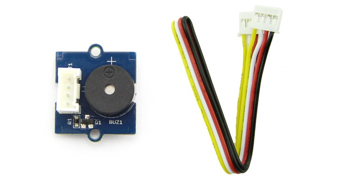
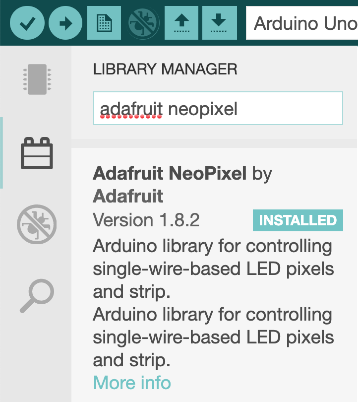

# Buzzer et RGB LED Stick

14 octobre 2021

## 1 – Le module [Buzzer](https://wiki.seeedstudio.com/Grove-Buzzer/), pour faire du bruit 😉



## Type de connexion: digitale

---

## 1.1 – Description

Le module 'Buzzer' sert à produire un son de 2300 Hz à 85 dB d'intensité.

Il n'y a pas de librairie à installer.

Il suffit d'appliquer un signal digital positif (ON) sur la broche de raccordement du Buzzer.

## 1.2 – Exemple d'utilisation

```
#define BROCHE_DU_BUZZER 5
#define DELAI            1000
void setup()
{
  pinMode(BROCHE_DU_BUZZER, OUTPUT);
}
 
void loop()
{
  digitalWrite(BROCHE_DU_BUZZER, HIGH);
  delay(DELAI);
  digitalWrite(BROCHE_DU_BUZZER, LOW);
  delay(DELAI);
}
```

---

## 2 – Le module RGB LED Stick – [WS2813](https://wiki.seeedstudio.com/Grove-RGB_LED_Stick-10-WS2813_Mini/)


## Type de connexion: digitale

---

### 2.1 – Description

Le module RGB LED Stick propose 10 DEL RGB adressable individuellement.

Il est possible de contrôler la couleur de chacun des DEL en mode RGB (255,255,255).

Il se connecte dans une GPIO en mode digitale (D2..D8).

### 2.2 – Librairie

La librairie à installer se nomme « Adafruit NeoPixel ».



[Lien de référence de la librairie](https://adafruit.github.io/Adafruit_NeoPixel/html/class_adafruit___neo_pixel.html)

👉 Dépendance sous **PlatformIO**

```
lib_deps = adafruit/Adafruit NeoPixel @ ^1.12.4
```

---

### 2.3 – Utilisation

### 2.3.1 – Allumer un DEL

```
// Constructeur:
// Adafruit_NeoPixel (uint16_t n, int16_t pin=6, neoPixelType type=NEO_GRB+NEO_KHZ800)
#include <Adafruit_NeoPixel.h>
#define PIN        5 // GPIO de connexion du LED Strip
#define NUMPIXELS 10 // Nombre de pixels disponibles

// Définir un objet de type NeoPixel
Adafruit_NeoPixel pixels(NUMPIXELS, PIN, NEO_GRB + NEO_KHZ800);

void setup() {
  pixels.begin();                                   // Initialiser le module
  pixels.clear();                                   // Éteindre tous les pixels
  pixels.setBrightness(50);                         // 0..255
  pixels.setPixelColor(5, pixels.Color(200, 0, 0)); // Configurer le pixel no 5 en rouge 200/255
  pixels.show();                                    // Actualiser, sur le module, le pixel modifié.
}

void loop() {}
```

### 2.3.2 – Allumer tous les DEL en séquence

```
#include <Adafruit_NeoPixel.h>

#define PIN           5  // GPIO de connexion de la barre de DEL
#define NUMPIXELS     10 // NB de DEL sur la barre
#define DELAYVAL      200 // Intervalle entre les DEL
Adafruit_NeoPixel pixels(NUMPIXELS, PIN, NEO_GRB + NEO_KHZ800);

void setup() {
  pixels.begin();
} // setup

void loop() {
  pixels.clear(); // Effacer tous les DEL.
  pixels.show();   // Actualiser l'affichage 

  int r = random(256);  // un nombre entre 0 et 255 pour le rouge
  int g = random(256);  // un nombre entre 0 et 255 pour le vert
  int b = random(256);  // un nombre entre 0 et 255 pour le bleu

  for(int i=0; i<NUMPIXELS; i++) { 
    pixels.setPixelColor(i, pixels.Color(r,g,b));
    pixels.show();   // Actualiser l'affichage
    delay(DELAYVAL);
  } // for

} // loop
```

### 2.3.3 – Laboratoire


<br>

Modifier le projet précédent pour qu'une fois tous les pixels allumés, les pixels s'éteignent un à la suite de l'autre, de la gauche vers la droite.

Utiliser le même délai qu'à l'étape 2.3.2.

**Indice:**

*pixels.Color(0,0,0)* pour éteindre un pixel.

Afficher la solution

```
#include <Adafruit_NeoPixel.h>

#define PIN           2 // GPIO de connexion de la barre de pixels
#define NUMPIXELS     10 // NB de pixels sur la barre
#define DELAYVAL      200 // Intervalle entre les pixels
#define COULEUR_DEL   50, 10, 20
Adafruit_NeoPixel pixels(NUMPIXELS, PIN, NEO_GRB + NEO_KHZ800);

void setup() {
  pixels.begin();
}

void loop() {
  pixels.clear(); // Effacer tous les pixels.
 
  for(int i=0; i<NUMPIXELS; i++) { 
    pixels.setPixelColor(i, pixels.Color(COULEUR_DEL));
    pixels.show();   // Actualiser l'affichage
    delay(DELAYVAL);
  }

  for(int i=0; i<NUMPIXELS; i++) { 
    pixels.setPixelColor(i, pixels.Color(0,0,0));
    pixels.show();   // Actualiser l'affichage
    delay(DELAYVAL);
  }
}
```

Masquer la solution

---

### 2.4 – Laboratoire


<br>

Écrire un programme qui allume un pixel rouge, suivi d'un pixel vert, suivi d'un pixel rouge et ainsi de suite.

Insérer un délai de 250 millisecondes entre chaque affichage.

Lorsque tous les pixels seront allumés, attendre 1 seconde puis recommencer.

**Astuce**

* for (nb pixels) {}
* % 2 pour déterminer la couleur

Afficher la solution

```
/*
    Solution du laboratoire 2.4
    Auteur:       Alain Boudreault
    Date:         2021.10.22
    Description:  Allumer une séquence de pixels rouge, vert, ...
*/

#include <Adafruit_NeoPixel.h>
#define PIN           2         // GPIO de connexion de la barre de pixels
#define NUMPIXELS     10        // NB de pixels sur la barre
#define DELAYVAL      250       // Intervalle entre les pixels
#define PIXEL_ROUGE   255,0,0   // r = 255, g = 0, b = 0
#define PIXEL_VERT    0,255,0   // r = 0, g = 255, b = 0
#define UNE_SECONDE   1000

// Création d'un objet de type Adafruit_NeoPixel pour le contrôle de la barre de pixels.
Adafruit_NeoPixel pixels(NUMPIXELS, PIN, NEO_GRB + NEO_KHZ800);

void setup() {
  pixels.begin();
} // setup

void loop() {
  pixels.clear(); // Effacer tous les pixels.
 
  for(int i=0; i<NUMPIXELS; i++) { 
    // Déterminer la couleur du pixel en fonction d'une division par 2.
    uint32_t couleur = (i % 2) ? pixels.Color(PIXEL_VERT):pixels.Color(PIXEL_ROUGE);
    pixels.setPixelColor(i, couleur);
    pixels.show();   // Actualiser l'affichage
    delay(DELAYVAL);
  } // for

  delay(UNE_SECONDE);

} // loop
```

Masquer la solution

---

### 2.5 – Laboratoire – Varier les pixels en fonction de la température


<br>

Écrire un programme qui fait varier le nombre de pixels bleus (80,106,148) et rouges (245, 22, 26) en fonction de la température du capteur SHT31.

Si la température est <= à 24c alors tous les pixels sont bleus.

À chaque tranche de 0,75c de plus, un pixel du haut passe au rouge.

Par exemple, pour 24C + 4\*0,75, les 6 premiers pixels sont bleus et les 4 derniers sont rouges.

**Note**: Utiliser un doigt sur le capteur pour faire augmenter la température.

Afficher la solution

```
/*
    Solution du laboratoire 2.5
    Auteur:       Alain Boudreault
    Date:         2021.10.22
    Description:  Varier la couleur des pixels en fonction de la température
*/
// Inclure la librairie pour I2C (le capteur SHT31 est de type I2C)
#include <Wire.h>
// Inclure la librairie pour le capteur de température et d'humidité SHT31
#include "SHT31.h"
// Inclure la librairie pour la barre de pixels
#include <Adafruit_NeoPixel.h>

#include "Streaming.h"

//#define DEBUG

#define PIN                   2           // GPIO de connexion de la barre de pixels
#define NUMPIXELS             10          // NB de pixels sur la barre
#define PIXEL_ROUGE           245,22,26   // r,g,b
#define PIXEL_BLEU            80,106,148  
#define TEMPERATURE_DE_BASE   24
#define TEMPERATURE_PALIER    0.75

// Création d'un objet SHT31 pour le contrôle du capteur de température/humidité
SHT31 capteurTemperature;  

// Création d'un objet de type Adafruit_NeoPixel pour le contrôle de la barre de pixels.
Adafruit_NeoPixel pixels(NUMPIXELS, PIN, NEO_GRB + NEO_KHZ800);

void setup() {
  Serial.begin(9600);
  capteurTemperature.begin();
  #ifdef DEBUG
  Serial << "Temperature de depart: " << capteurTemperature.getTemperature() << endl;
  #endif
  pixels.begin();
  pixels.clear(); // Effacer tous les DEL.
  pixels.setBrightness(50);
  for(int i=0; i<NUMPIXELS; i++) { 
    pixels.setPixelColor(i, pixels.Color(PIXEL_BLEU));
  } // for
  pixels.show();   // Actualiser l'affichage
} // setup

void loop() {
  uint32_t couleur;
  float temperature  = capteurTemperature.getTemperature();
  // Calculer le nombres de paliers de température supérieur à la température de base.
  int nbPixelsRouges = (temperature - TEMPERATURE_DE_BASE) / TEMPERATURE_PALIER;

  #ifdef DEBUG
  Serial << "Temp. = " << temperature << " ,NB pixels rouges = " << (nbPixelsRouges) << endl;
  delay(500);
  #endif

  // Renseigner la couleur des pixels en fonction des paliers de température
  for (int pixelCourant = NUMPIXELS; pixelCourant >= 0; pixelCourant--) {
    couleur = pixelCourant < (NUMPIXELS - nbPixelsRouges) ? pixels.Color(PIXEL_BLEU) : pixels.Color(PIXEL_ROUGE);
    pixels.setPixelColor(pixelCourant, couleur);
  } // for pixelCourant

  pixels.show();   // Actualiser l'affichage

 } // loop
```

Masquer la solution

Contenu par [VE2CUY](http://ve2cuy.com/blog)