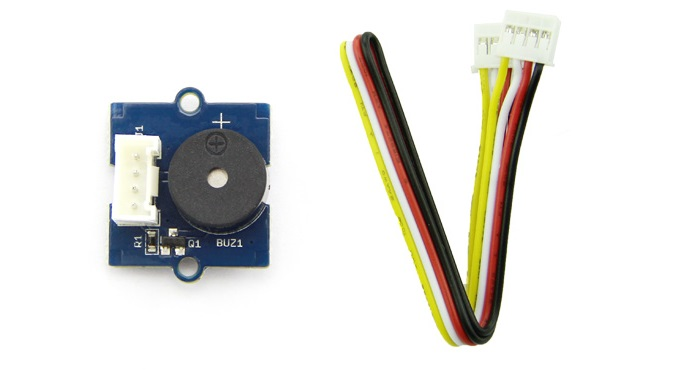
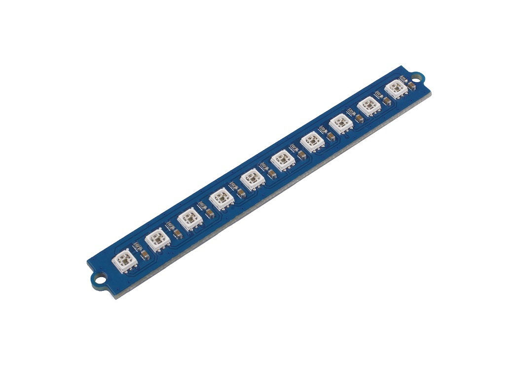
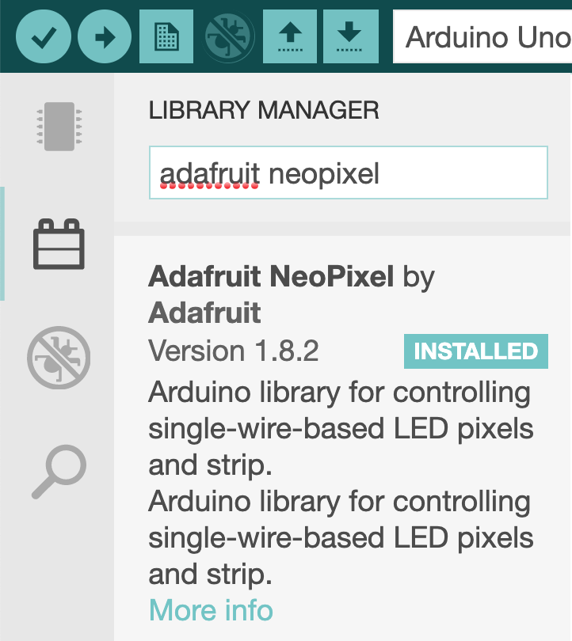

# Buzzer et RGB LED Stick

14 octobre 2021

## 1 – Le module [Buzzer](https://wiki.seeedstudio.com/Grove-Buzzer/), pour faire du bruit 😉



## Type de connexion: digitale

---

## 1.1 – Description

Le module 'Buzzer' sert à produire un son de 2300 Hz à 85 dB d'intensité.

Il n'y a pas de librairie à installer.

Il suffit d'appliquer un signal digital positif (ON) sur la broche de raccordement du Buzzer.

## 1.2 – Exemple d'utilisation

```
#define BROCHE_DU_BUZZER 5
#define DELAI            1000
void setup()
{
  pinMode(BROCHE_DU_BUZZER, OUTPUT);
}
 
void loop()
{
  digitalWrite(BROCHE_DU_BUZZER, HIGH);
  delay(DELAI);
  digitalWrite(BROCHE_DU_BUZZER, LOW);
  delay(DELAI);
}
```

---

## 2 – Le module RGB LED Stick – [WS2813](https://wiki.seeedstudio.com/Grove-RGB_LED_Stick-10-WS2813_Mini/)



## Type de connexion: digitale

---

### 2.1 – Description

Le module RGB LED Stick propose 10 DEL RGB adressable individuellement.

Il est possible de contrôler la couleur de chacun des DEL en mode RGB (255,255,255).

Il se connecte dans une GPIO en mode digitale (D2..D8).

### 2.2 – Librairie

La librairie à installer se nomme « Adafruit NeoPixel ».



[Lien de référence de la librairie](https://adafruit.github.io/Adafruit_NeoPixel/html/class_adafruit___neo_pixel.html)

👉 Dépendance sous **PlatformIO**

```
lib_deps = adafruit/Adafruit NeoPixel @ ^1.12.4
```

---

### 2.3 – Utilisation

### 2.3.1 – Allumer un DEL

```
// Constructeur:
// Adafruit_NeoPixel (uint16_t n, int16_t pin=6, neoPixelType type=NEO_GRB+NEO_KHZ800)
#include <Adafruit_NeoPixel.h>
#define PIN        5 // GPIO de connexion du LED Strip
#define NUMPIXELS 10 // Nombre de pixels disponibles

// Définir un objet de type NeoPixel
Adafruit_NeoPixel pixels(NUMPIXELS, PIN, NEO_GRB + NEO_KHZ800);

void setup() {
  pixels.begin();                                   // Initialiser le module
  pixels.clear();                                   // Éteindre tous les pixels
  pixels.setBrightness(50);                         // 0..255
  pixels.setPixelColor(5, pixels.Color(200, 0, 0)); // Configurer le pixel no 5 en rouge 200/255
  pixels.show();                                    // Actualiser, sur le module, le pixel modifié.
}

void loop() {}
```

### 2.3.2 – Allumer tous les DEL en séquence

```
#include <Adafruit_NeoPixel.h>

#define PIN           5  // GPIO de connexion de la barre de DEL
#define NUMPIXELS     10 // NB de DEL sur la barre
#define DELAYVAL      200 // Intervalle entre les DEL
Adafruit_NeoPixel pixels(NUMPIXELS, PIN, NEO_GRB + NEO_KHZ800);

void setup() {
  pixels.begin();
} // setup

void loop() {
  pixels.clear(); // Effacer tous les DEL.
  pixels.show();   // Actualiser l'affichage 

  int r = random(256);  // un nombre entre 0 et 255 pour le rouge
  int g = random(256);  // un nombre entre 0 et 255 pour le vert
  int b = random(256);  // un nombre entre 0 et 255 pour le bleu

  for(int i=0; i<NUMPIXELS; i++) { 
    pixels.setPixelColor(i, pixels.Color(r,g,b));
    pixels.show();   // Actualiser l'affichage
    delay(DELAYVAL);
  } // for

} // loop
```

### 2.3.3 – Laboratoire


<br>

Modifier le projet précédent pour qu'une fois tous les pixels allumés, les pixels s'éteignent un à la suite de l'autre, de la gauche vers la droite.

Utiliser le même délai qu'à l'étape 2.3.2.

**Indice:**

*pixels.Color(0,0,0)* pour éteindre un pixel.


---

### 2.4 – Laboratoire


<br>

Écrire un programme qui allume un pixel rouge, suivi d'un pixel vert, suivi d'un pixel rouge et ainsi de suite.

Insérer un délai de 250 millisecondes entre chaque affichage.

Lorsque tous les pixels seront allumés, attendre 1 seconde puis recommencer.

**Astuce**

* for (nb pixels) {}
* % 2 pour déterminer la couleur


---

### 2.5 – Laboratoire – Varier les pixels en fonction de la température


<br>

Écrire un programme qui fait varier le nombre de pixels bleus (80,106,148) et rouges (245, 22, 26) en fonction de la température du capteur SHT31.

Si la température est <= à 24c alors tous les pixels sont bleus.

À chaque tranche de 0,75c de plus, un pixel du haut passe au rouge.

Par exemple, pour 24C + 4\*0,75, les 6 premiers pixels sont bleus et les 4 derniers sont rouges.

**Note**: Utiliser un doigt sur le capteur pour faire augmenter la température.


---

## Crédits

**Document rédigé par Alain Boudreault © 2021-2026**
**Version 2025.02.26.01 - Révision 2025.12.12.1**

*Contenu par [VE2CUY](http://ve2cuy.com/blog)*