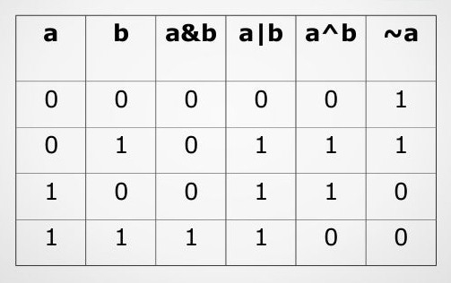
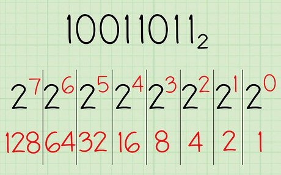
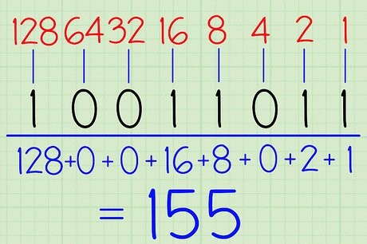
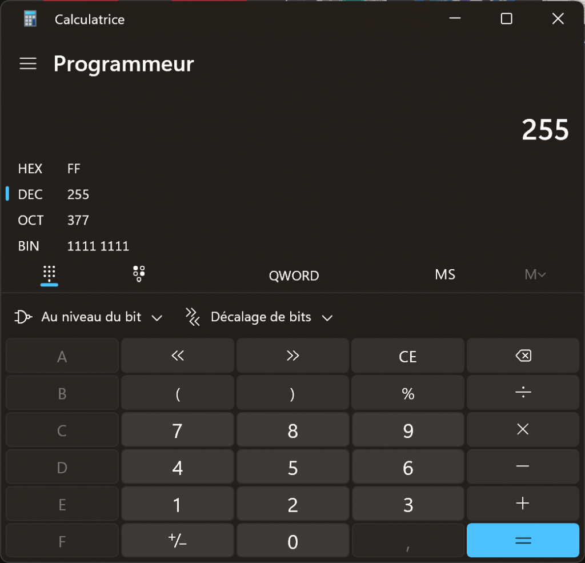

# 420-1C4 » Opérations sur les bits

Version du 27 janvier 2025 - Révision 2025.12.12


<br>

### 💡- Les opérateurs binaires (bitwise) sont utilisés pour manipuler les bits d’une variable.

---

## Voici les principaux opérateurs binaires:

### 1. **L’opérateur AND binaire ( & )**

Cet opérateur effectue une opération « **ET** » bit à bit entre deux entiers. Le résultat est 1 si les deux bits correspondants sont 1, sinon il est 0.

**Exemple :**

```cpp
#include <arduino.h>
#include <Streaming.h>
#define VITESSE_SERIAL 9600
void setup() {
    Serial.begin(VITESSE_SERIAL);
    int a = 5;   // 0101 en binaire
    int b = 3;   // 0011 en binaire
    int result = a & b;  // 0001 en binaire
    Serial << "a & b = BIN: " << _BIN(result) << " DEC: " << result << endl; // Affiche 1
}
 
void loop(){}
```

---

### 2. **L’opérateur OR binaire ( | )**

Cet opérateur effectue une opération « **OU** » bit à bit entre deux entiers. Le résultat est 1 si au moins un des deux bits correspondants est 1, sinon il est 0.

**Exemple :**

```cpp
#include <arduino.h>
#define VITESSE_SERIAL 9600
void setup() {
    Serial.begin(VITESSE_SERIAL);
    int a = 5;   // 0101 en binaire
    int b = 3;   // 0011 en binaire
    int result = a | b;  // 0111 en binaire
    Serial << "a | b = BIN: " << _BIN(result) << " DEC: " << result << endl;   // Affiche 7
}
void loop(){}
```

---

### 3. **L’opérateur XOR binaire ( ^ )**

L’opérateur « **OU exclusif** » effectue une opération bit à bit entre deux entiers. Le résultat est 1 si un seul des deux bits correspondants est 1, mais pas les deux.

**Exemple :**

```cpp
#include <arduino.h>
#define VITESSE_SERIAL 9600
void setup() {
    Serial.begin(VITESSE_SERIAL);
    int a = 5;   // 0101 en binaire
    int b = 3;   // 0011 en binaire
    int result = a ^ b;  // 0110 en binaire
    Serial << "a ^ b = BIN: " << _BIN(result) << " DEC: " << result << endl;  // Affiche 6
}
void loop(){}
```

---

### 4. **L’opérateur NOT binaire ( ~ )**

Cet opérateur effectue une **inversion** de tous les bits de l’entier. Tous les 1 deviennent des 0 et tous les 0 deviennent des 1.

**Exemple :**

```cpp
#include <arduino.h>
#define VITESSE_SERIAL 9600
void setup() {
    Serial.begin(VITESSE_SERIAL);
    int a = 5;   // 0101 en binaire
    int result = ~a;  // 1010 en binaire (en représentation complément à deux)
    // Tester avec unsigned int result
    Serial << "~a = BIN: " << _BIN(result) << " DEC: " << result << endl; // Affiche -6 (en complément à deux)
}
void loop(){}
```

---

## Table de vérité des opérateurs



---

### 5. **Les opérateurs de décalage ( << et >> )**

- **<< (décalage à gauche)** : Décale les bits d’un nombre vers la gauche, en ajoutant des zéros à droite.
- **>> (décalage à droite)** : Décale les bits d’un nombre vers la droite, en fonction du signe du nombre (pour les entiers signés).

**Exemple :**

```cpp
#include <arduino.h>
#define VITESSE_SERIAL 9600
void setup() {
    Serial.begin(VITESSE_SERIAL);
    int a = 5;   // 0101 en binaire
    int left_shift = a << 1;  // Décalage à gauche : 1010 en binaire (10 en décimal)
    int right_shift = a >> 1; // Décalage à droite : 0010 en binaire (2 en décimal)

    Serial.print("Décalage à gauche : "); Serial.println(left_shift);  // Affiche 10
    Serial.print("Décalage à droite : "); Serial.println(right_shift); // Affiche 2
}
void loop(){}
```

---

## 5.1 – Décalage et opération sur bits

```cpp
#include <arduino.h>
#define VITESSE_SERIAL 9600
#define BIT7 1 << 7 // Équivalent à #define BIT7 0b10000000
void setup() {
    Serial.begin(VITESSE_SERIAL);
    byte a = 0b10010011;   // 0101 en binaire
    // a <<= 1;  // Équivalent à a = a << 1;
    Serial.println(BIT7); 

    if (a & BIT7) {
      Serial.println("Le bit # 7 est à ON");
    } else
    {
      Serial.println("Le bit # 7 est à OFF");
    }

}
void loop(){}
```

---

### Résumé des opérateurs de bits :

| Opérateur | Signification | Exemple avec a = 5 et b = 3 |
| --- | --- | --- |
| & | AND bit à bit | a & b = 1 |
| \| | OR bit à bit | a \| b = 7 |
| ^ | XOR bit à bit | a ^ b = 6 |
| ~ | NOT (inversion des bits) | ~a = -6 |
| << | Décalage à gauche | a << 1 = 10 |
| >> | Décalage à droite | a >> 1 = 2 |

### Tableau des assignations

| Symbole | Operateur |
| --- | --- |
| &= | assignation -> bitwise AND |
| \|= | assignation -> bitwise inclusive OR |
| ^= | assignation -> bitwise exclusive OR assignment |
| <<= | assignation -> left shift assignment |
| >>= | assignation -> right shift assignment |

---

En résumé, ces opérateurs sont puissants pour manipuler directement les bits dans les programmes C, ce qui est utile dans des domaines comme la programmation système, les systèmes embarqués, ou les calculs de bas niveau.

---

## Rappel – Décimal à binaire à décimal

## Prenons la valeur binaire 0b10011011:

## Conversion vers la base 10 (décimal)



<br>


---

## Démonstration avec la calculatrice:



---

## 6 – Exemple d’implémentation des opérateurs binaires

```cpp
/*
  Projet: Opérations sur les bits
  Pour:   Le cours 420-1C4-JR: Objets connectés
  Auteur: Alain Boudreault (aka VE2CUY)
  Date:   2025.01.27
  --------------------------------------------------------------------
  Description:

    Expérimentation avec les opérateurs au niveau des bits; 
      & , | , ~ , ^ , << et >> .

  PlatformIO:

    Rappel: ctrl+alt+b = build
            ctrl+alt+u = upload
            ctrl+alt+s = serial terminal
  --------------------------------------------------------------------
  M-A-J:

  --------------------------------------------------------------------
  NOTE: Sous platformio, monitor_speed = 115200

*/

// Les déclarations
#include <projet.h>
void afficherBinaire(int nombre, byte nbBits = 8, bool ln = true);

// Début du programme
void setup() {
  Serial.begin(VITESSE_SERIAL);
    while (!Serial) {
    ; // Attendre que le port série soit connecté.
  }
  Serial.println(F("----> Début du programme\n"));
  
  // Exemple d'affichage en binaire
  exempleCompterBinaire();

  // Exemple de permutations de bits
  //shiftGauche();
  //shiftDroite();
  
  // Exemple d'opérations logiques sur les bits
  //exempleOp(AND);
  //exempleOp(OR);
  //exempleOp(XOR);
  //exempleOp(NOT); 

  // Afficher des nombres négatifs en binaire
  //exempleNegatif();

} // setup()

void loop() { // Rien à faire ici ...
}

// Implémentation des fonctions
//=================================================================
void shiftGauche(void) {
  byte nombre = 0b00000001;
  Serial.println(F("\n------------------------------------------------------------------")); 
  Serial.println(F("Démonstration d'une permutation vers la gauche avec l'opérateur << \n\n76543210\n--------"));
  afficherBinaire(nombre);
  for (int n = 1 ; n <= 7; n++) {
    afficherBinaire(nombre << n);
  }
} // shiftGauche()

//=================================================================
void shiftDroite(void) {
  Serial.println(F("\n------------------------------------------------------------------")); 
  Serial.println(F("Démonstration d'une permutation vers la droite avec l'opérateur >> \n\n76543210\n--------"));
  byte nombre = 0b10000000;
  afficherBinaire(nombre);
  for (int n = 1 ; n <= 7; n++) {
    afficherBinaire(nombre >> n);
  }
} // shiftDroite()

//=================================================================
void exempleOp(operateurBinaire op){
    
    int a         = 5;      // 0101 en binaire
    int b         = 3;      // 0011 en binaire
    int resultat  = 0;
    String strOp[]  = {"a & b", "a | b", "a ^ b ", "~a"};

    Serial.println(F("\n------------------------------------"));  
    Serial.print(F("Démonstration de "));
    Serial.print(strOp[op]);
    Serial.println(F("\n\n76543210\n--------"));  

    switch (op) {
    case AND:
      resultat  = a & b;  // // 0001 en binaire
      break;
    case OR:
      resultat  = a | b; 
      break;
    case XOR:
      resultat  = a ^ b; 
      break;
    case NOT:
      resultat  = ~a; 
      break;
    default:
      break;
    }

    afficherBinaire(a);
    if (op != NOT) afficherBinaire(b);
    afficherBinaire(resultat);  // Affiche 1
} // exempleOp()

//=================================================================
// Voici un exemple simplifié de exempleOp
void exempleAnd(void){
    Serial.println(F("\n------------------------------------"));  
    Serial.println(F("Démonstration de a & b\n\n76543210\n--------"));  
    int a         = 5;      // 0101 en binaire
    int b         = 3;      // 0011 en binaire
    int resultat  = a & b;  // 0001 en binaire
    afficherBinaire(a);
    afficherBinaire(b);
    afficherBinaire(resultat);  // Affiche 1
} //exempleAnd()

//=================================================================
void afficherBinaire(int nombre, byte nbBits, bool ln) {
  // NOTE: Utilisation des opérateurs sur les bits (>> et &)
  // pour afficher le nombre en format binaire.
  for (int i = nbBits - 1; i >= 0; i--) {
    Serial.print((nombre >> i) & 1); 
  }
  if (ln) Serial.println();
} // afficherBinaire

//=================================================================
void exempleNegatif(){
    // Afficher un nombre négatif en binaire:
    // Voir: https://fr.wikipedia.org/wiki/Compl%C3%A9ment_%C3%A0_deux
  Serial.println(F("\n------------------------------------"));  
  for (int i = -5; i < 1 ; i++) {  
  Serial.print(F("\nAffichage de : "));
    Serial.println(i);  
    afficherBinaire(i, 32);
  }
} // exempleNegatif()

//=================================================================
void exempleCompterBinaire() {
    // Compter en binaire (base 2)
    Serial.println("\n---------------------------------------"); 
    Serial.println("Démonstration d'un affichage en binaire\n\n8421\n3210\n----");
  for (int i=0; i<= 0b1111; i++) {
      afficherBinaire(i,4);
      delay(SECONDE/2);
  }
} //exempleCompterBinaire()

// FIN DU PROGRAMME
```

Fichier projet.h

```cpp
#ifndef projet_h
#define projet_h

#include <arduino.h>
#define VITESSE_SERIAL  115200
#define SECONDE         1000
enum operateurBinaire {
    AND,    // &
    OR,     // |
    XOR,    // ^
    NOT,    // ~
    GAUCHE, // <<
    DROITE  // >>
};

// NOTE: Valeur par défaut seulement dans le prototype, pas dans l'implémentation
void shiftGauche(void);
void shiftDroite(void);
void exempleOp(operateurBinaire op);
void exempleNegatif();
void exempleCompterBinaire();
#endif
```

---

## 7 – Structures et opérations sur bits

**NOTE pour H25** : Cet exemple est utile pour la réalisation du **TP02**

```cpp
#include <Arduino.h>
#include "Streaming.h"

#define APP_LED1          0b1 << 0 // 0000 0001
#define APP_LED2          0b1 << 1 // 0000 0010
#define APP_RELAI         0b1 << 2 // 0000 0100
#define APP_MOUVEMENT     0b1 << 3 // 0000 1000
#define ALARM_ARME        0b1 << 4 // 0001 0000

struct Appareils{
  byte  etatAppareils;  // Traitement sur les bits.
  float temperature;
};

struct Systeme {
  byte  codeMessage;
  byte  heure;
  byte  minute;
  byte  seconde;
  Appareils appareils;
};

const char * lesMessages[] = {
  "Information sur le système",
  "Température élevée",
  "Mouvement détecté",
  "En état de panique"
};

Systeme unSysteme = { 1, 10, 10, 59, { 0b00010001, 20.2} };

void setup() {
  Serial.begin(9600);
  Serial.println("Début du programme\n");

  if (unSysteme.appareils.etatAppareils & ALARM_ARME) {
    Serial.println("Le système d'alarme est armé");
  }

  if (unSysteme.appareils.etatAppareils & APP_LED1) {
    Serial.println("La DEL1 est ON");
  }

  if (unSysteme.appareils.etatAppareils & APP_LED2) {
    Serial.println("La DEL2 est ON");
  } else {
    Serial.println("La DEL2 est OFF");
  }
  Serial << "\nMessage reçu: " << lesMessages[unSysteme.codeMessage] << endl;
  Serial << "Il est " << unSysteme.heure << ":" << unSysteme.minute << ":" << unSysteme.seconde << endl;
}

void loop() {
  // Rien à faire ici ...
}
```

---

## 8 – LABORATOIRE – 45 minutes


<br>


**À partir des déclarations du code source précédent,**

* Ajouter un champ pour l’humidité dans la structure ‘Appareil’ 
* renseigner une valeur dans la variable ‘unSysteme.
* Remplacer les MACRO par un enum et y ajouter : 
* APP_BOUTON_PANIQUE
* APP_RETRO_LCD
* Remplacer la propriété ‘codeMessage’ par ‘codeEvenement’, de type enum, défini par:
* evenement_statut_appareils,
* evenement_temperature_depassee,
* evenement_detection_mouvement,
* evenement_bouton_panique,
* Afficher à l’écran,
* * Grace à une boucle, les instructions & et <<, un(des) tableau(x) de chaines (« LED1 », …), un minimum d’instructions;
* * Et la déclaration suivante: * *Systeme unSysteme = { evenement_detection_mouvement, 10, 10, 59, { 0b01010101, 20.2, 45.25} };*
* * L’état de tous les appareils sous la forme suivante:


**NOTE** : Il est possible de réaliser ce labo sans l’enum ‘Appareil’

👉 Voici les deux symboles: 🔴 🟢

---

## Crédits

*Document rédigé par Alain Boudreault © 2021-2026*  
*Version 2026.02.151.1*  

*Contenu par [VE2CUY](http://ve2cuy.com/blog)*
