# Introduction à PlatformIO

<p align="center">
    
</p>

## Définition

**PlatformIO** est un écosystème complet pour le développement embarqué qui s'intègre dans Visual Studio Code. C'est une plateforme professionnelle de développement qui supporte plus de 1000 cartes de développement différentes et plus de 50 plateformes, incluant Arduino, ESP32, STM32, Raspberry Pi Pico, et bien d'autres.

PlatformIO offre un environnement de développement moderne et puissant qui remplace avantageusement l'IDE Arduino traditionnel. Il combine la simplicité d'utilisation d'Arduino avec les fonctionnalités avancées d'un environnement de développement professionnel.

### Pourquoi utiliser PlatformIO plutôt que l'IDE Arduino?

PlatformIO présente plusieurs avantages significatifs par rapport à l'IDE Arduino traditionnel:

#### 1. **Éditeur de code avancé**
- **Auto-complétion intelligente**: Suggestions de code en temps réel basées sur le contexte
- **Vérification syntaxique en temps réel**: Détection des erreurs pendant la frappe
- **Navigation dans le code**: Aller à la définition, trouver toutes les références
- **Refactoring**: Renommer des variables/fonctions dans tout le projet automatiquement
- **Multi-curseurs et édition avancée**: Fonctionnalités modernes d'édition de code

#### 2. **Gestion de projet professionnelle**
- **Structure de projet organisée**: Séparation claire entre le code source (src/), les en-têtes (include/), les librairies (lib/) et les tests (test/)
- **Fichier de configuration centralisé** (platformio.ini): Toutes les configurations du projet dans un seul fichier
- **Support multi-plateformes**: Un même projet peut cibler plusieurs cartes différentes
- **Gestion des dépendances**: Installation automatique des librairies et de leurs dépendances

#### 3. **Gestion des librairies améliorée**
- **Gestionnaire de librairies intégré**: Recherche et installation simplifiées
- **Résolution automatique des dépendances**: Les librairies requises sont installées automatiquement
- **Versions spécifiques**: Possibilité de fixer une version précise d'une librairie
- **Librairies locales**: Support des librairies personnalisées dans le dossier lib/

#### 4. **Outils de débogage**
- **Débogage matériel**: Support du débogage avec points d'arrêt (selon la carte)
- **Moniteur série avancé**: Filtrage, capture, horodatage des messages
- **Analyseur logique intégré**: Pour certaines plateformes

#### 5. **Compilation et téléversement optimisés**
- **Compilation incrémentale**: Seuls les fichiers modifiés sont recompilés
- **Compilation parallèle**: Utilisation de plusieurs cœurs du processeur
- **Cache de compilation**: Accélération significative des builds successifs
- **Messages d'erreur clairs**: Meilleure identification des problèmes

#### 6. **Tests unitaires**
- **Framework de tests intégré**: Possibilité d'écrire des tests unitaires pour le code embarqué
- **Tests sur PC et sur cible**: Exécution des tests sans matériel ou sur la carte

#### 7. **Intégration continue**
- **Support CI/CD**: Compatible avec GitHub Actions, GitLab CI, Travis CI, etc.
- **Builds automatisés**: Compilation automatique à chaque commit
- **Tests automatisés**: Exécution des tests dans le pipeline CI/CD

#### 8. **Environnement professionnel**
- **Contrôle de version intégré**: Git directement dans VS Code
- **Extensions VS Code**: Accès à l'écosystème complet d'extensions
- **Thèmes et personnalisation**: Interface personnalisable selon les préférences
- **Terminal intégré**: Accès direct à la ligne de commande

#### 9. **Documentation et communauté**
- **Documentation complète**: Guides détaillés et exemples nombreux
- **Communauté active**: Forum d'entraide et support réactif
- **Mises à jour régulières**: Nouvelles fonctionnalités et corrections fréquentes

---

## Installation de l'extension PlatformIO IDE sous VS Code

PlatformIO s'installe sous VS Code en y ajoutant l'extension 'PlatformIO IDE':

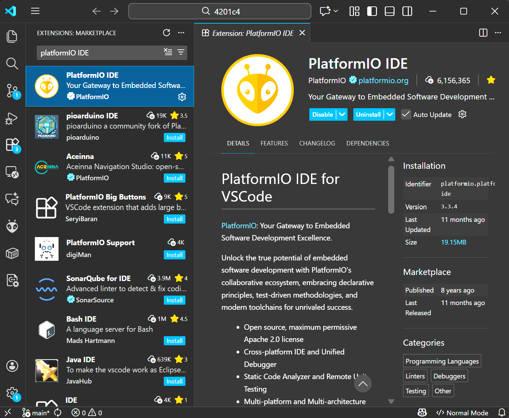

---

## 👉 Premiers pas

## 1 - Créer un nouveau projet sous PlatformIO

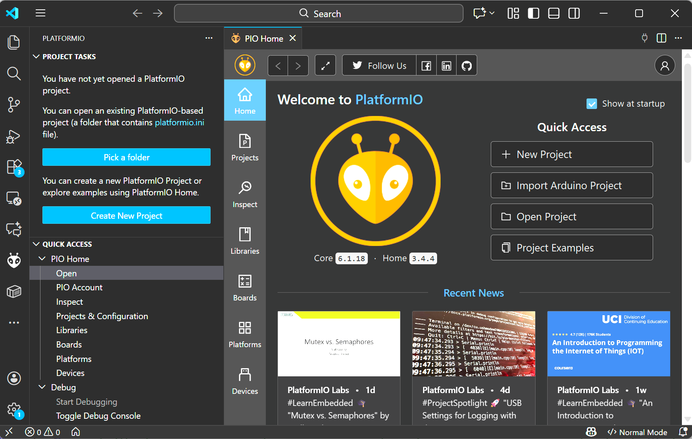

### Nommer le projet et choisir la platforme

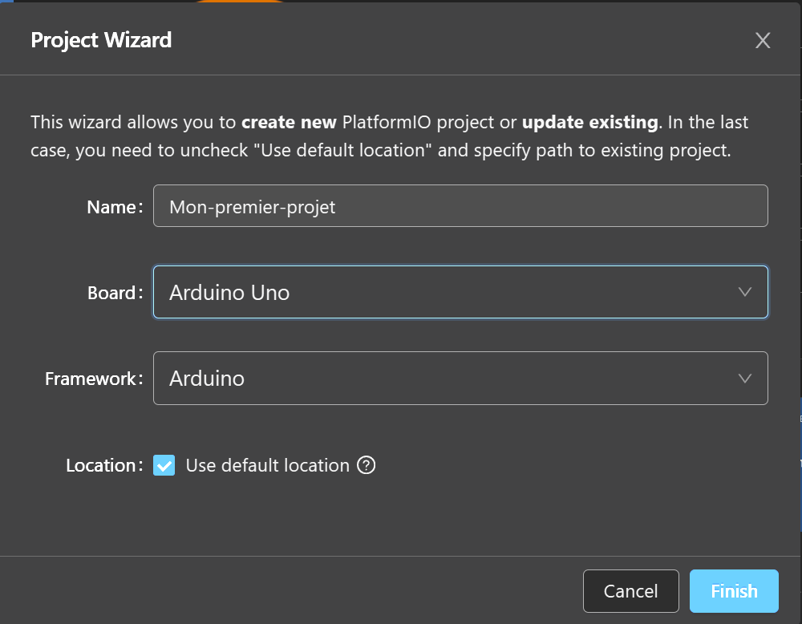

---

### 1.1 - Examiner la structure de départ

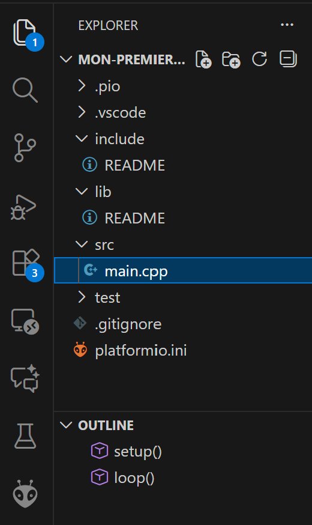

La structure d'un projet PlatformIO est organisée de manière professionnelle:

- **src/**: Contient les fichiers source (.cpp)
- **include/**: Contient les fichiers d'en-tête (.h)
- **lib/**: Pour les librairies personnalisées
- **test/**: Pour les tests unitaires
- **platformio.ini**: Fichier de configuration du projet

### 1.2 - Le fichier main.cpp


---

### 1.3 - Remplacer le code source de main.cpp par:

```cpp
#include <Arduino.h>

void setup() {
  Serial.begin(9600);
  Serial.println("Bonjour le Monde!\n");
}

void loop() {
  
  }
```


**Explication du code:**
- `#include <Arduino.h>`: Inclusion obligatoire de la librairie Arduino
- `Serial.begin(9600)`: Initialisation de la communication série à 9600 bauds
- `Serial.println()`: Affichage d'un message dans le moniteur série

💡Note: Contrairement à l'IDE Arduino qui utilise des fichiers .ino, PlatformIO utilise des fichiers .cpp standard C++. Il faut donc inclure explicitement la librairie Arduino avec `#include <Arduino.h>`.

---

## 2 - Compiler le projet:

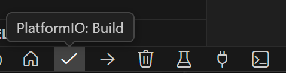

> ou -> **CTRL+ALT+B**

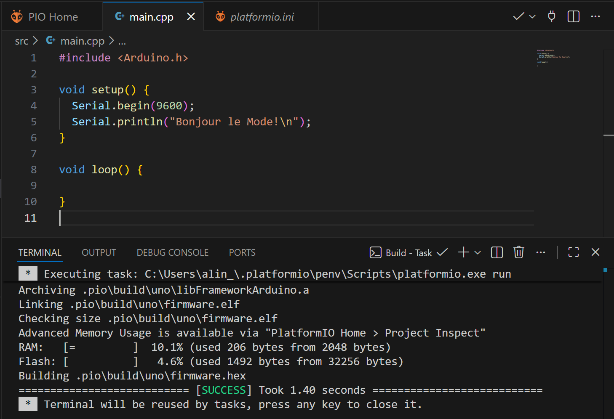

La compilation vérifie le code sans le téléverser sur la carte. C'est utile pour détecter rapidement les erreurs de syntaxe.

**Avantages de la compilation PlatformIO:**
- Plus rapide grâce à la compilation incrémentale
- Messages d'erreur plus détaillés et clairs
- Affichage de la taille mémoire utilisée (Flash et RAM) - Disponible aussi de Arduino IDE.

---

## 3 - Téléverser l'application vers le micro-contrôleur

> ou -> **CTRL+ALT+U**

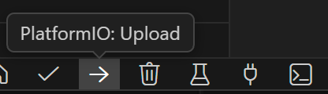

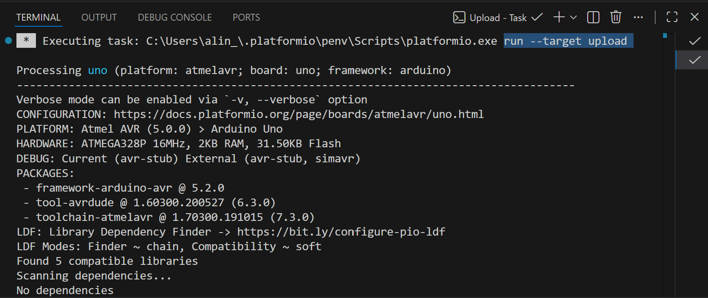

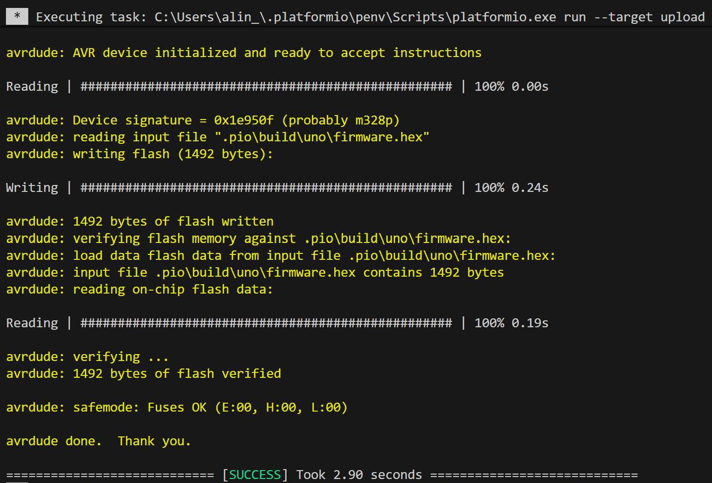

Le téléversement (upload) compile automatiquement le projet si nécessaire, puis transfert le programme vers la carte Arduino.

---

## 4 - Afficher le moniteur série (Pour les traces du programme)

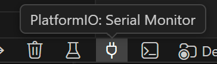

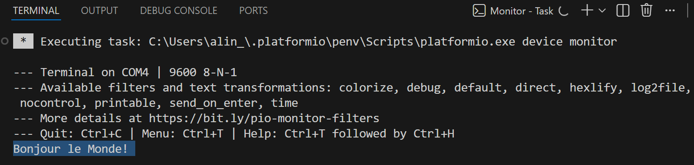

> ou -> **CTRL+ALT+S**

Le moniteur série de PlatformIO offre plusieurs avantages:
- **Diagnostic**: Afficher des traces lors de l'éxécution
- **Filtrage**: Recherche dans les messages affichés (CTRL+F)
- **Sauvegarde**: Enregistrement des logs dans un fichier, avec horodatage des messages
- - monitor_filters =
  default  
  time     
  log2file 

- **Reconnexion automatique**: Après un téléversement

---

## 5 - Hello World avec une DEL (LED)

### 5.1 – Exemple avec documentation et fichier de logs

```cpp
// -----------------------------------------------
// Projet: Introduction à Arduino
// Auteur: Alain Boudreault
// Date: 2026.01.25
// -----------------------------------------------
// Ajouter dans platformio.ini
// monitor_filters =
//  default   ; Retire les caractères de contrôle
//  time      ; Horodatage des lignes
//  log2file  ; Log les Serial.print dans le fichier “device-monitor-date-heure*.log” situé dans le dossier 'logs' du projet.

#include <Arduino.h>

void setup() {
  Serial.begin(9600)
  pinMode(13, 1); // OUTPUT
}

void loop() {
  static int i = 0;
  Serial.print("\nItération numéro: " + String(i++));  
  digitalWrite(13, 1); // ON
  delay(500);
  digitalWrite(13, 0); // OFF
  delay(500);
}
```

👉 Tester l'application et consulter le fichier 'log'

**Explication du code:**
- `pinMode(13, 1)`: Configure la broche 13 en sortie (OUTPUT = 1)
- `digitalWrite(13, 1)`: Allume la LED (HIGH = 1)
- `delay(500)`: Attend 500 millisecondes
- La LED clignote avec un cycle de 500ms allumée, 500ms éteinte

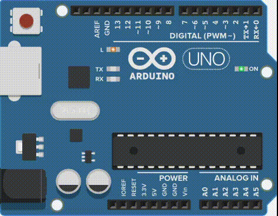


---

### 5.2 – Utilisation de MACROs

```cpp
#include <Arduino.h>

#define DEL_ROUGE 13
#define SORTIE 1
#define ALLUMER 1
#define ETEINDRE 0
#define DELAI 500

void setup() {
  pinMode(DEL_ROUGE, SORTIE);
}

void loop() {
  digitalWrite(DEL_ROUGE, ALLUMER);
  delay(DELAI);
  digitalWrite(DEL_ROUGE, ETEINDRE);
  delay(DELAI);
}
```

👉 Tester l'application

**Avantages des macros:**
- **Lisibilité améliorée**: Le code devient auto-documenté
- **Maintenabilité**: Changement facile des valeurs en un seul endroit
- **Réutilisabilité**: Les constantes peuvent être partagées entre fichiers
- **Performance**: Les macros sont remplacées lors de la compilation (pas de coût en mémoire)

**Bonnes pratiques:**
- Utiliser des noms en MAJUSCULES pour les macros
- Nommer de manière descriptive (DEL_ROUGE plutôt que D1)
- Grouper les macros liées ensemble

---

## 6 – Utilisation d'un fichier d'entête (.h)

```cpp
// Fichier include/main.h 
// Dans main.cpp, ajouter : #include "main.h"
#define DEL_ROUGE 13
#define SORTIE 1
#define ALLUMER 1
#define ETEINDRE 0
#define DELAI 500
```

**Structure recommandée du fichier include/main.h:**

```cpp
#ifndef MAIN_H
#define MAIN_H

// Définitions des broches
#define DEL_ROUGE 13

// Modes des broches
#define SORTIE OUTPUT
#define ENTREE INPUT

// États logiques
#define ALLUMER HIGH
#define ETEINDRE LOW

// Temporisations
#define DELAI 500

#endif // MAIN_H
```

**Et dans main.cpp:**

```cpp
#include <Arduino.h>
#include "main.h"

void setup() {
  pinMode(DEL_ROUGE, SORTIE);
}

void loop() {
  digitalWrite(DEL_ROUGE, ALLUMER);
  delay(DELAI);
  digitalWrite(DEL_ROUGE, ETEINDRE);
  delay(DELAI);
}
```

**Avantages de cette organisation:**
- **Séparation des préoccupations**: Configuration séparée du code logique
- **Réutilisabilité**: Le fichier .h peut être inclus dans plusieurs fichiers .cpp
- **Maintenance facilitée**: Toutes les constantes au même endroit
- **Protection contre les inclusions multiples**: Les directives `#ifndef` / `#define` / `#endif` évitent les erreurs

**Structure professionnelle complète:**

```
mon_projet/
├── platformio.ini          # Configuration du projet
├── src/
│   └── main.cpp           # Code principal
├── include/
│   ├── main.h             # Constantes et macros
│   └── fonctions.h        # Déclarations de fonctions
├── lib/
│   └── MaLibrairie/       # Librairies personnalisées
└── test/
    └── test_main.cpp      # Tests unitaires
```

---

## 7 - Configuration avancée dans platformio.ini

Le fichier `platformio.ini` permet de configurer finement votre projet:

```ini
[env:uno]
platform = atmelavr
board = uno
framework = arduino

; Configuration du port série
monitor_speed = 9600
monitor_filters = colorize

; Librairies du projet
lib_deps = 
    mikem/Streaming @ ^1.0.0
    adafruit/DHT sensor library @ ^1.4.4

; Options de compilation
build_flags = 
    -DDEBUG=1
    -DVERSION="1.0.0"

; Téléversement
upload_speed = 115200
```

**Explications:**
- `monitor_speed`: Vitesse du moniteur série
- `monitor_filters`: Ajout de couleurs dans le moniteur série
- `lib_deps`: Liste des librairies avec versions spécifiques
- `build_flags`: Définitions de macros pour la compilation
- `upload_speed`: Vitesse de téléversement (peut accélérer le processus)

---

## 8 - Raccourcis clavier utiles

| Action | Raccourci |
|--------|-----------|
| Compiler | Ctrl + Alt + B |
| Téléverser | Ctrl + Alt + U |
| Moniteur série | Ctrl + Alt + S |
| Nettoyer | Ctrl + Alt + C |
| Recherche des commandes PIO | Ctrl + Shift + P → "PlatformIO" |

---

## 9 - Conseils pour bien débuter

1. **Toujours inclure `<Arduino.h>`**: C'est obligatoire dans les fichiers .cpp (contrairement aux .ino)

2. **Organiser son code**: Utiliser les dossiers src/, include/, lib/ selon leur fonction

3. **Versionner avec Git**: PlatformIO s'intègre parfaitement avec Git

4. **Lire les messages de compilation**: Ils contiennent des informations précieuses sur l'utilisation mémoire

5. **Utiliser les constantes (MACROs) Arduino**:  `OUTPUT`, `INPUT`, `HIGH`, `LOW` préférer aux valeurs numériques

6. **Commenter son code**: Documenter les sections importantes et les choix techniques

7. **Tester régulièrement**: Compiler et téléverser fréquemment pour détecter les erreurs rapidement

8. **Explorer les exemples**: PlatformIO fournit de nombreux exemples de code

---

## Conclusion

PlatformIO représente une solution efficace pour le développement Arduino et embarqué en général. En combinant la simplicité d'Arduino avec la puissance d'un IDE professionnel, avec lequel vous êtes déjà familier (VSCode), il permet aux développeurs de créer des projets plus robustes, maintenables et évolutifs (git).

---

## Crédits

**Document rédigé par Alain Boudreault © 2021-2026**

**Version 2026.01.25.01**

*Contenu par [VE2CUY](http://ve2cuy.com/blog)*