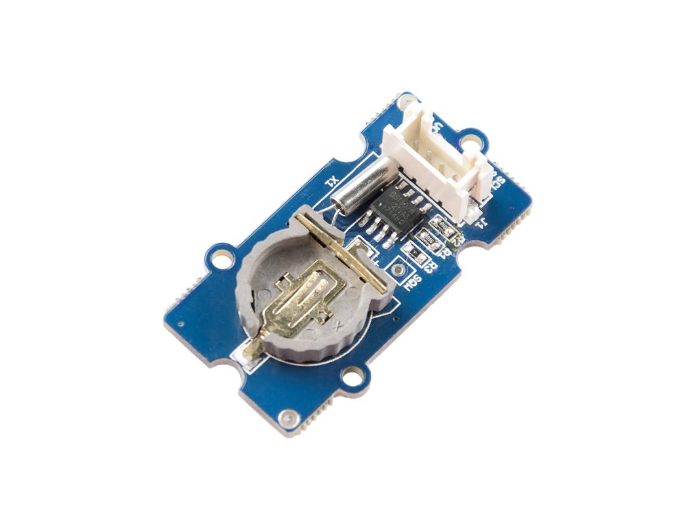
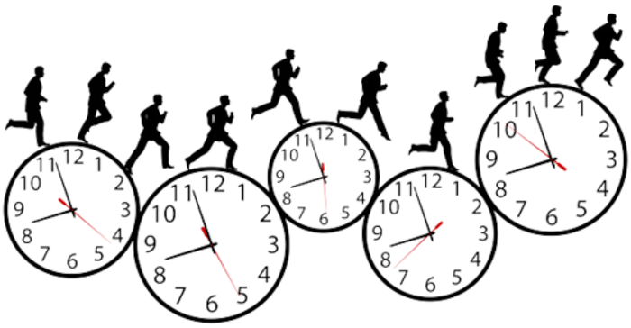
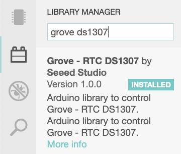
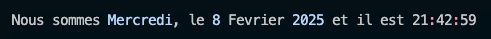
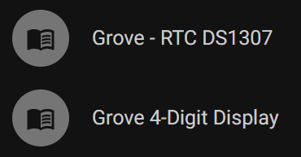

# Grove – RTC_DS1307

26 octobre 2021

# Real Time Clock – [DS1307](https://wiki.seeedstudio.com/Grove-RTC/) ou l'art de tenir le temps



## 1 – Description

Ce module permet de préserver, en temps réel, le passage du temps (année, mois, jour, heure, minute, seconde), grâce à une pile, entre les mises sous tension de l'Arduino.

Même hors tension du Arduino, le module RTC continuera de tenir compte du temps qui passe…

Il est piloté par une puce [DS1307](https://www.maximintegrated.com/en/products/analog/real-time-clocks/DS1307.html) de la compagnie Maxim.

[Référence technique](https://datasheets.maximintegrated.com/en/ds/DS1307.pdf) de la DS1307.



**Référence**: [Wiki Grove](https://wiki.seeedstudio.com/Grove-RTC/)

---

## 2 – Type de connexion: I2C

---

## 3 – Librairie à installer




---

### Voici la dépendance à utiliser sous PlatformIO:

```
lib_deps = seeed-studio/Grove - RTC DS1307@^1.0.0
```

---

## 4 – Exemples d'utilisation

### 4.1 – Renseigner le temps, puis le lire – version de départ

```
#include <Wire.h>
#include "DS1307.h"
#include "Streaming.h"

DS1307 horloge; // Définir un objet de type DS1307

void setup()
{
  Serial.begin(9600);
  Serial << "Debut du programme ...\n"; 

  horloge.begin();

  // 1 - Renseigner la date et l'heure
  // Note: À ne faire qu'une seule fois puis,
  // placer les lignes suivantes en commentaires
  horloge.fillByYMD(2025,02,26);
  horloge.fillByHMS(11,54,30);
  horloge.fillDayOfWeek(TUE);

  // 2 - Écrire le temps dans la puce RTC 
  horloge.setTime();

  // 3 - Lire le temps du RTC
  horloge.getTime();
  
  // 4 - Afficher l'heure
  Serial << "Il est " << horloge.hour << ":" << horloge.minute << ":" << horloge.second << endl;
  
} // setup

void loop() {} // loop
```

---

### 4.2 – Afficher le temps courant – version 1 (Inutilement longue)

```
#include <Wire.h>
#include "DS1307.h"
#include "Streaming.h"

DS1307 clock; // Définir un objet de type DS1307

void setup()
{
  Serial.begin(9600);
  Serial << "Debut du programme ...\n"; 
	clock.begin();
  /*
	clock.fillByYMD(2021,10,26);
	clock.fillByHMS(11,54,30);
	clock.fillDayOfWeek(TUE); 
	clock.setTime(); //Écrire le temps dans la puce RTC
  */
} // setup

void loop()
{
  AfficherLeTemps();
} // loop


// =============================================================
// Fonction: Afficher le temps dans la console série - version 1
// =============================================================
void AfficherLeTemps()
{
	clock.getTime();
	Serial.print(clock.hour, DEC);
	Serial.print(":");
	Serial.print(clock.minute, DEC);
	Serial.print(":");
	Serial.print(clock.second, DEC);
	Serial.print("	");
	Serial.print(clock.month, DEC);
	Serial.print("/");
	Serial.print(clock.dayOfMonth, DEC);
	Serial.print("/");
	Serial.print(clock.year+2000, DEC);
	Serial.print(" ");

  String nomDuJour;
	switch (clock.dayOfWeek)
	{
		case MON:
      nomDuJour = "Lundi";
		  break;
		case TUE:
		  nomDuJour = "Mardi";
		  break;
		case WED:
		  nomDuJour = "Mercredi";
		  break;
		case THU:
		  nomDuJour = "Jeudi";
		  break;
		case FRI:
		  nomDuJour = "Vendredi";
		  break;
		case SAT:
		  nomDuJour = "Samedi";
		  break;
		case SUN:
		  nomDuJour = "Dimanche";
		  break;
	}
	Serial << nomDuJour << " le " << clock.dayOfMonth << endl;
  delay(1000);
}
```

---

### 4.3 – Afficher le temps courant – version 2 (Beaucoup mieux)

```
#include <Wire.h>
#include "DS1307.h"
#include "Streaming.h"

DS1307 clock; // Définir un objet de type DS1307
// Variable utilisée par sprintf()
char chaine[80];
char* NomDesJours[] = {"", "Lundi", "Mardi", "Mercredi", "Jeudi", "Vendredi", "Samedi", "Dimanche"};

void setup()
{
  Serial.begin(9600);
  Serial << "Debut du programme ...\n"; 
	clock.begin();
  /*
	clock.fillByYMD(2021,10,26);
	clock.fillByHMS(11,54,30);
	clock.fillDayOfWeek(TUE); 
	clock.setTime(); //Écrire le temps dans la puce RTC
  */
} // setup

void loop()
{
  AfficherLeTemps();
} // loop


// =============================================================
// Fonction: Afficher le temps dans la console série - version 2
// =============================================================
void AfficherLeTemps()
{
  clock.getTime();
  // Remplacer les Serial.print par un sprintf()
  sprintf(chaine, "%02d:%02d:%02d  %02d/%02d/%02d,  ",
    clock.hour, clock.minute, clock.second, 
    clock.month, clock.dayOfMonth, clock.year+2000
  );
  Serial << chaine;

  // Remplacer le switch par un tableau de char*
  Serial << NomDesJours[clock.dayOfWeek] << " le " << clock.dayOfMonth << endl;
  delay(1000);
}
```

---

### 4.4 – Afficher le temps courant – version optimisée (Qui dit mieux?)

```
#include <Wire.h>
#include "DS1307.h"
#include "Streaming.h"

DS1307 clock; // Définir un objet de type DS1307

// Variable utilisée par sprintf()
char chaine[80];

char* NomDesJours[] = {"", "Lundi", "Mardi", "Mercredi", "Jeudi", "Vendredi", "Samedi", "Dimanche"};

void setup()
{
  Serial.begin(9600);
  Serial << "Debut du programme ...\n"; 
	clock.begin();
  /*
	clock.fillByYMD(2021,10,26);
	clock.fillByHMS(11,54,30);
	clock.fillDayOfWeek(TUE); 
	clock.setTime(); //Écrire le temps dans la puce RTC
  */
} // setup

void loop()
{
  Serial << AfficherLeTemps() << endl;
  delay(1000);
} // loop


// =============================================================
// Fonction: Forme une chaine représentant le temps courant - V3
// Retour:   Un pointeur vers une chaine de caractères décrivant
//           le temps courant.
// =============================================================
char* AfficherLeTemps()
{
  clock.getTime();
  sprintf(chaine, "%02d:%02d:%02d  %02d/%02d/%02d,  %s le %02d",
    clock.hour, clock.minute, clock.second, 
    clock.month, clock.dayOfMonth, clock.year+2000,
    NomDesJours[clock.dayOfWeek], clock.dayOfMonth
  );

  return chaine;

} // AfficherLeTemps
```

---

## 5 – Laboratoire (30 minutes) – Afficher l'heure et la date


<br>

Écrire un programme qui affiche l'heure et la date, à chaque seconde, à la position 0,0 du moniteur, en utilisant le format suivant:



Utiliser des séquences ANSI pour la couleur et le positionnement.

Il faut actualiser l'affichage à chaque seconde.

Idéalement, utiliser une méthode non bloquante pour l'affichage.

Rappel

```
#include "ANSI.h"
ANSI ansi(&Serial);
#define ANSI_ROUGE          "\033[31m"
#define ANSI_BLEU           "\033[34m"
#define ANSI_BLANC          "\033[0m"
#define CURSEUR_OFF         "\033[?25l"
```

👉 Il faut renseigner un tableau pour le nom des jours et un pour le nom des mois.

**NOTE**: En C++, il n'est pas recommandé de définir un tableau de chaines de caractères en objet muable. Il est préférable de le définir ansi:

```
const char* tableau[] = {...}
```

---

## 5.1 – Laboratoire (30 minutes) – Afficher l'heure sur 4-Digit


<br>

À partir:

* du module 4-Digit sur GPIO 8 et 9,
* et du RTC DS1307 sur I2C,

écrire un programme qui affiche l'heure en temps réel (HH:MM) sur le module 4-Digit.

Le symbole « : » du 4-Digit doit clignoter avec les secondes qui passent.

Idéalement, utiliser une méthode non bloquante pour le clignotement.

**Astuces**:

```
float heureDecimale = horloge.hour + float(horloge.minute) / 100 ;  // Convertir les minutes en décimales et + heures.
int   heureInt      = horloge.hour * 100 + horloge.minute;          // Former un grand int avec les hr+min

À chaque 500 ms, permuter l'affichage entre heureDecimale et heureInt:
   
  displayNum(heureDecimale,2);
  displayNum(heureInt);


Gérer la permutation avec une variable de type boolean.
Permuter la valeur de la variable boolean de cette façon:  tick ^= true;
```

**Autres astuces fonctionnelles avec Wokwi:**

Utilisation des méthodes ***display()*** et ***point()*** de la classe TM1637

```
  // Cette technique fonctionnera sur Wokwi ainsi qu'avec la librairie standard de la TM1637
  affichage.point(true); // Allumer le : du 4 digit, au prochain affichage
  affichage.display(0, horloge.hour / 10);  // Afficher sur le nombre de gauche, la dizaine de l'heure
  affichage.display(1, horloge.hour % 10);  // Afficher sur le nombre de gauche+1, l'unité de l'heure
  affichage.point(false); // Éteindre le : du 4 digit, au prochain affichage
```

---

# 🛑 ATTENTION - La solution est à la suite ... 


```
/*
    Solution du laboratoire: Afficher l'heure sur 4-Digit 

    Auteur: Alain Boudreault, aka VE2CUY 
    Date:   2021.10.26

    Description:  Afficher l'heure en temps réel en
                  utilisant le format HH:MM.

                  Le séparateur ':' clignote à la fréquence de 500 ms.
*/

#include <Wire.h>
#include "DS1307.h"
#include "Streaming.h"
#include "TM1637V2.h"

DS1307 horloge; // Définir un objet de type DS1307

// #define SET_TIME

#define CLK 2  //GPIO pour la TM1637V2
#define DIO 3
#define DEMI_SECONDE 500
TM1637V2 affichage(CLK, DIO);
boolean tick = false;

void setup()
{
  Serial.begin(9600);
  Serial << "Debut du programme ...\n"; 
  horloge.begin();
  affichage.init();
  affichage.clearDisplay();
  affichage.set(ECRAN_FORT);

  #ifdef SET_TIME
    horloge.fillByYMD(2021,10,26);
    horloge.fillByHMS(13,54,00);
    horloge.fillDayOfWeek(TUE);
    horloge.setTime();
  #endif
} // setup

void loop() {
  horloge.getTime();
  float heureDecimale = horloge.hour + float(horloge.minute) / 100 ;  // Pour affichage avec ':'
  int   heureInt      = horloge.hour * 100 + horloge.minute;          // Pour affichage sans ':'

  // En fonction de la valeur de 'tick' afficher l'heure int ou float à 2 dec.
  affichage.displayNum(tick ? heureInt : heureDecimale, tick ? 0 : 2);
  tick ^= true;  // Inverser la valeur de la variable boolean

  // Afficher une trace de l'heure
  Serial << "Il est " << horloge.hour << ":" << horloge.minute << ":" << horloge.second << endl;
  delay(DEMI_SECONDE);

} // loop
```





---

## 5.2 – Laboratoire (60 minutes)


<br>


**NOTE**: Pour la session H26 – Ce labo permet d'ajouter deux (2) points bonis à la grille d'évaluation du cours.

Combiner les laboratoires 5 et 5.1 en un seul programme, avec affichages non bloquants, et y ajouter la fonctionnalité suivante:

Faire défiler le message;

* ***Nous sommes le 8 Fevrier, 21:53:27***
  + Le texte du LCD est actualisé à chaque 7 secondes
  + Le défilement est de 300ms

sur l'écran LCD.

**NOTE**: La librairie propose une méthode pour faire défiler du texte à l'écran. Faites vos recherches.

* Une **LED**, connectée sur D2 doit s'allumer quand on enfonce le **bouton** connecté sur D3 et doit rester aller tant que le bouton est ON.

**NOTE IMPORTANTE**: Les affichages, moniteur, LCD et 4Digit ne doivent pas bloquer le programme principal. La LED doit répondre instantanément au bouton.

###### Document rédigé par Alain Boudreault, aka VE2CUY – version 2025.02.26.01

---

## Crédits

**Document rédigé par Alain Boudreault © 2021-2026**
**Version 2025.02.26.01 - Révision 2025.12.12.1**

*Contenu par [VE2CUY](http://ve2cuy.com/blog)*