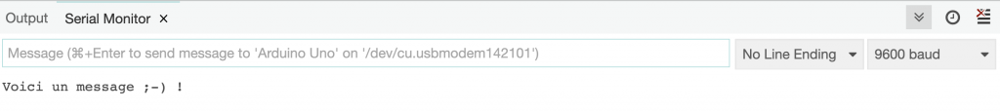
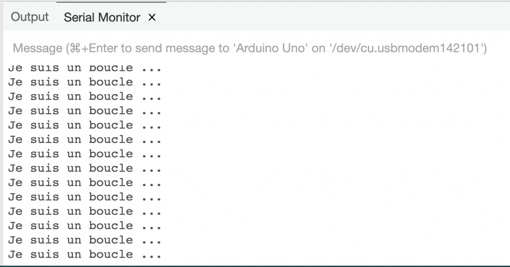
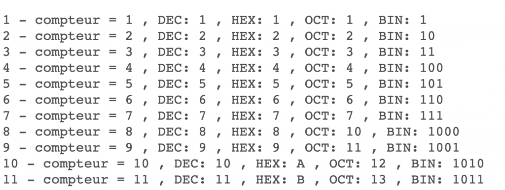
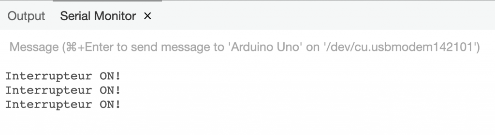
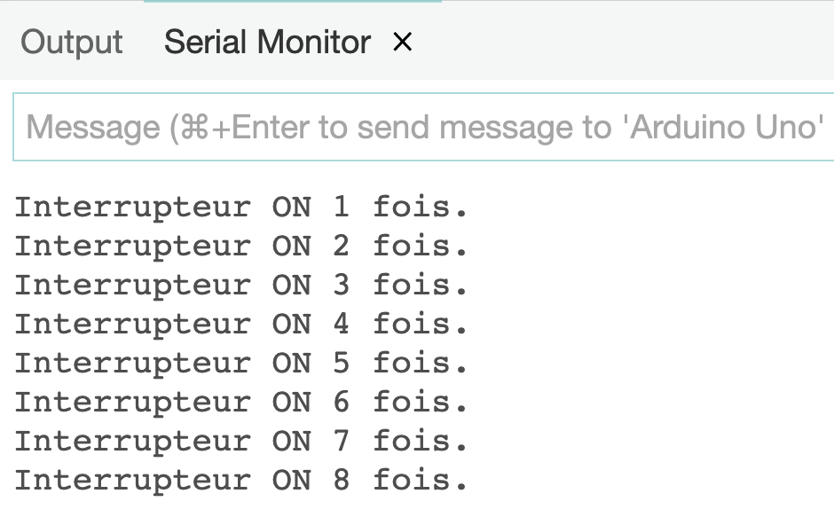
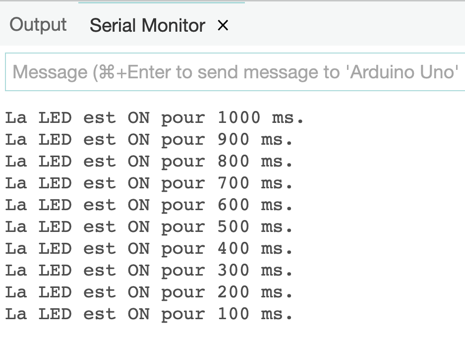

# Arduino – Serial.println() et digitalRead()

*Date: 19 janvier 2025*


---

## Contenu

* Afficher dans la console série
  + Serial.begin()
  + Serial.print()
  + Afficher un nombre en DEC, OCT, BIN et HEX
  + La MACRO AFFICHER
  + Utilisation de la librairie Streaming de Mikal Hart
  + Retour sur l'incrémentation d'une variable (++, +=, …)
  + Retour sur l'instruction '**if**'
* Utilisation d'une broche en mode d'entrée (lecture)
  + pinMode(noBroche, INPUT)
  + digitalRead()
* Utilisation d'un pushButton dans Wokwi
  + Utilisation d'une résistance pour forcer l'état à 0
* Gestion du relâchement d'un pushButton 
  + L'instruction 'while()'
  + Gestion du bruit d'un interrupteur (debounce)
* Gestion d'une permutation d'état d'un pushButton

---

## 1.1 – La fonction Serial.println(val)

L'IDE Arduino nous propose une console d'affichage qu'il est possible d'utiliser, via le protocole UART (COM[1..9] sous windows) pour afficher des messages et des états des éléments d'un projet.

Comme par exemple, afficher l'état ON/OFF d'un interrupteur.

Ces messages seront disponibles pendant l'étape de prototypage du projet.

La plaquette Arduino doit être connectée sur le port USB pour que cette fonction soit disponible.

---

## Voici la marche à suivre pour afficher des messages dans la console de 'débogage'

### 1.2 – Dans un projet, initialiser la vitesse du port de communication série (UART/COM) et afficher

```cpp
void setup() {
  // 1 - Ouvrir le port série à 9600 bps (bits par seconde):
  // Note: Sous PlatformIO, la vitesse du terminal est de 9600 Baud.
  // Il est possible de la changer, dans le fichier platformio.ini, avec la propriété monitor_speed = 115200. 
  Serial.begin(9600);

  // 2 - Afficher un message dans la console de débogage
  Serial.println("Début du programme");
  Serial.println("------------------\n");
  Serial.println("Voici un message ;-) !");
  delay(2000);
} // setup()
```

### 1.3 – Téléverser le projet vers l'Arduino puis afficher la console série




**NOTE**: Sous **platformIO**, utiliser les touches **CTRL+ALT+S** pour ouvrir la console série.

---

### 1.3.1 - Modification de la vitesse de transmission sous PlatformIO

Par défaut, la transmission série (UART/COM) entre la plaquette Arduino et le poste de travail est fixé à 9600 bauds.

À 9600 bauds, on transmet 9600 symboles par seconde. Dans les communications série simples (comme RS-232), un **symbole correspond généralement à un bit**, donc 9600 bauds ≈ 9600 bits par seconde (bps). En réalité, avec les bits de start, stop et parité, le débit effectif de données utiles est un peu inférieur.  En divisant par 10, on obtient une approximation du nombre de caractères (octets) transmis par seconde.

Donc à 9600 bauds, environ **960** caractères transmis par seconde.

Sous PlatformIO, il est possible de modifier la vitesse de transmission en la renseignant dans le fichier 'platformIO.ini':

```
# À inscrire dans le fichier 'platformIO.ini'
monitor_speed = 115200
```

Puis, ouvrir la communication dans l'application avec :

```
Serial.begin(115200);
```

À l'ouverture du terminal série, le message suivant sera affiché:

```
--- Terminal on COM7 | 115200 8-N-1
```

💡La transmission est maintenant d'environ 11520 octets à la seconde.

---

## 1.4 – Laboratoire


<br>

Programmer un projet qui affiche, dans la console série, le message suivant en boucle:



## 1.5 – Afficher le contenu d'une variable

```cpp
int compteur = 1;  // Je suis une variable de type 'entier signé' de portée globale.
// ------------------
void setup() {

  // 1 - Ouvrir le port série à 9600 bps:
  Serial.begin(9600);

  // 2 - Afficher un message sans changer de ligne
  Serial.print("La variable compteur vaut ");

  // 3 - Afficher la valeur de la variable et changer de ligne.
  Serial.println(compteur);                    

} // setup()
```

## 1.6 – Laboratoire


<br>

Incrémenter et afficher la valeur de la variable 'compteur' en boucle.

---

## 1.6.2 – Utilisation d'une Macro vide

Utilisation d'une Macro vide pour activer/désactiver les messages de la console.

```cpp
#define afficher(x)  Serial.println(x)
// #define afficher(x)

...

afficher("Afficher un message dans la console ...");
```

---

## 1.7 – Afficher un nombre dans une autre base que 10

```cpp
Serial.println(88, BIN); 

// Affiche: 1011000
```

---

## 1.8 – Voici un exemple complet d'affichage

```cpp
/*
  Fichier:      afficher-entier.ino
  Auteur:       Alain Boudreault
  Date:         2021.09.07
  Description:  Afficher un entier en base 2, 8, 10 et 16.
  --------------------------------------------------------
  M-A-J:        A.B.2022.06.14 - Ajout de l'opérateur de résolution de portée ::
*/

// Définition des constantes
#define UN_ENTIER     0b01010101    // le nombre '85', représenté en format binaire.
#define UNE_SECONDE   1000          // 1000 milli-secondes = 1 seconde
#define VITESSE_UART  9600

// Définition des variables globales
int compteur = 1;                 // la variable compteur est définie de façon globale

// ------------------
void setup() {
  // 1 - Ouvrir le port série à 9600 bps:
  Serial.begin(VITESSE_UART);
  // 2 - Afficher un message dans la console de débogage
  Serial.print("La variable compteur vaut ");
  Serial.println(compteur);
  Serial.println("============================\n\n");
} // setup()

// ------------------
void loop() {
  // Définition d'une variable locale à la fonction loop()
  int compteur = ::compteur++;  // Initialisation de la variable locale 'compteur' 
                                // à partir de la valeur de la variable globale 'compteur'

  // Afficher un entier en utilisant tous les formats possibles:
  Serial.print(compteur);  
  Serial.print(" - UN_ENTIER = ");  
  Serial.print(UN_ENTIER);       // Afficher en notation décimale
  Serial.print(" , DEC: ");  
  Serial.print(UN_ENTIER, DEC);  // Afficher en notation décimale
  Serial.print(" , HEX: ");   
  Serial.print(UN_ENTIER, HEX);  // Afficher en notation hexadécimale
  Serial.print(" , OCT: "); 
  Serial.print(UN_ENTIER, OCT);  // Afficher en notation octale
  Serial.print(" , BIN: "); 
  Serial.println(UN_ENTIER, BIN);  // Afficher en notation binaire
  delay(UNE_SECONDE);

} // loop()

// FIN du fichier
```

---

## 1.9 – Laboratoire


<br>

Modifier le projet précédent pour qu'il affiche, **en utilisant la librairie <Streaming.h>** la valeur (dans toutes les bases) de la variable 'compteur'.



## Rappel – Incrémenter une variable i

```cpp
i = i + 1;      // Augmenter la valeur de i de 1
i++;            // Augmenter la valeur de i de 1
i+=5;           // Augmenter la valeur de i de 5

i = i - 1;      // Diminuer la valeur de i de 1
i--;            // Diminuer la valeur de i de 1
i-=5;           // Diminuer la valeur de i de 5

if ( i++ == 2 ) // Tester si i = 2 puis augmenter la valeur de i de 1
if ( ++i == 2 ) // Augmenter la valeur de i de 1 puis tester si i = 2
```

---

## 1.10 – Streaming.h

Voici un exemple d'utilisation de la librairie <Streaming.h> de Mikal Hart pour l'affichage:

```cpp
#include <Arduino.h>
#include <Streaming.h>
#define VITESSE_SERIAL  9600

void setup() {
    Serial.begin(VITESSE_SERIAL);
    Serial << F("Début du programme ...\n");
    Serial << F("PI vaut : ") << PI << endl;
} // setup()

void loop() {
    static unsigned long i = 0;
    Serial << "i = " << ++i << endl; 
} // loop()
```

```ini
// Dépendance sous PlatformIO
lib_deps = mikalhart/Streaming @ ^1.0.0
```

**NOTE**: Cette technique fonctionne aussi pour les écrans LCD.

Référence sur [GitHub](https://github.com/janelia-arduino/Streaming) et [Arduino.cc](https://docs.arduino.cc/libraries/streaming/)

---

## 2 – Lecture de l'état d'une broche digitale, la fonction digitalRead(pin)

### 2.1 – La fonction digitalRead(pin)

La fonction `digitalRead(pin)` permet de lire l'état d'une GPIO digitale qui est programmée en mode lecture. Voici comment l'utiliser:

```cpp
/*
  Fichier:      lire-switch.ino
  Auteur:       Alain Boudreault
  Date:         2021.09.07
  Description:  Allumer la LED sur GPIO-03 à partir de l'état de la switch sur GPIO-02.

  Note:         ON = 1, OFF = 0
*/

// Les MACROs
#define LED       3 
#define SWITCH    2    

// Les variables globales
int etatBouton      = 0;

// Renseigner les GPIO
void setup() {
  pinMode(LED, OUTPUT);     // OUTPUT et INPUT sont des macros de l'IDE Arduino
  pinMode(SWITCH, INPUT);   // Renseigner la broche 'SWITCH' en mode d'entrée (INPUT)
} // setup()


void loop() {
  etatBouton = digitalRead(SWITCH);  // Lire l'état du bouton.  
                                     // digitalRead() retourne '1' si bouton appuyé, sinon '0'
  digitalWrite(LED, etatBouton);     // Utiliser l'état du bouton (1|0) pour Allumer/Éteindre la DEL
} // loop()
```

### 2.2 – Tester le projet

### 2.3 – Remplacer la fonction loop() par le code suivant

```cpp
void loop() {
  etatBouton = digitalRead(SWITCH);
  if (etatBouton == 1) { // Ou bien etatBouton == HIGH,  HIGH est une macro de l'IDE (HIGH|LOW)
    Serial.println("Interrupteur ON!");
  } 
  digitalWrite(LED, etatBouton); 
  delay(200);
} // loop()
```

### 2.4 – Tester le projet



---

## 2.4.5 – Rappel de l'instruction 'if'

```cpp
if ( condition ) {
 instructions si vrai
}

if ( condition ) {
 instructions si vrai
} else
{
  instructions si faux
}

if ( i == 2 )      // Attention au double == sinon la variable sera réaffectée par 2
if ( variable )    // Si variable = 0 alors faux sinon vrai
if ( fonction() )  // Si fonction = 0 alors faux sinon vrai
if ( 1 )           // Toujours vrai
```

---

## 2.5 – Laboratoire


<br>

Modifier le projet précédent pour qu'il affiche le nombre de fois que l'interrupteur a été appuyé.



---

## 2.6 – Voici un exemple complet et documenté

```cpp
/* 
   -----------------------------------------------------------------------
   Projet:         Introduction à Arduino
   Nom du fichier: allumer LED avec bouton (momentary) V1.ino
   Auteur:         Alain Boudreault, Robert Turenne
   Date:           2021.08.13
   -----------------------------------------------------------------------
   Description:    Petit programme qui allume la DEL intégrée au
                   module Arduino Uno sur une broche (pin). Un bouton est placé 
                   sur une autre broche
   -----------------------------------------------------------------------
   M-A-J: 
   AB2021.07.26 - Modification du délai ON/OFF
   RT-21.8.13   - Version avec bouton
   -----------------------------------------------------------------------
*/


// Les MACROs sont définies au début du programme, avant toutes fonctions!
// La convention dicte de les nommer avec des caractères MAJUSCULES
#define DEL_ROUGE 3       // La broche de la DEL du projet
//#define BOUTON_PIN    2 // La broche pour le bouton (voir plus bas pour la mise en commentaire)
#define ALLUMER   1
#define ETEINDRE  0
#define DELAI    100     // Le délai de transition entre ON/OFF de la DEL

/*
  faire attention au branchement des pin 2 et 3. Les connecteurs D ont accès à 2 pins en général.
  Celle qui est à l'extérieure est souvent celle qui sera connectée dans notre montagne. Ainsi, 
  le connecteur D2 présente les pin 2 et 3, mais la pin 2 est à l'extérieur.
*/

// Les variables et dans certains cas, les constantes, sont définies au début du programme, 
// après les macros, avant toute fonction.
// La convention est de commencer en minuscules et mettre un majuscule au début de chaque nouveau mot
// Notez qu'on peut aussi utiliser des constantes, similaires au #define, par exemple:
const int boutonPin = 2;
// On pourrait être confus quant à l'utilisation de la mémoire, limitée dans le Arduino, entre #define et "const int".
// mais dans la plupart des cas, l'utilisation de la mémoire est identique. 
// voir https://forum.arduino.cc/t/the-difference-between-define-and-const/65169/16 à partir de l'intervention #18
// ou https://www.baldengineer.com/const-vs-define-when-do-you-them-and-why.html
// Mais on doit absolument utiliser la notation Arduino pour les variables, par exemple:
int boutonEnfonce = 0; //indicateur pour  le bouton. = 1 si enfoncé

// DÉBUT du code -->

// Cette fonction sera exécutée une seule fois, au démarrage du programme.
// Elle sert à renseigner, entre autre, la fonction des différentes
// broches du MCU.
void setup()
{
  // TOUJOURS initialiser TOUTES LES PINS UTILISÉES
  // Note:  Elles conserveront leur état durant toute la durée de l'application, 
  //        incluant dans les autres fonctions.
  pinMode(DEL_ROUGE, OUTPUT); // LED Externe
  pinMode(boutonPin, INPUT);  // bouton

// Initialiser (préparer) le port série (avec le USB) à une certaine vitesse
// L'instruction indiquera au compilateur d'intégrer le code nécessaire (invisible pour nous)
// La vitesse (ici 9600 bps - bits par secondes) doit être la même sur la console
  Serial.begin(9600);
  Serial.println("Clignoter led externe avec bouton et console V1"); // Imprimer sur la console
}

// Cette section est exécutée en boucle pour toujours
void loop()
{
  //lecture de la pin digitale: les valeurs peuvent seulement être 0 ou 1
  boutonEnfonce = digitalRead(boutonPin); 

  if (boutonEnfonce == 1) // Ne pas oublier le double ==
  // Il est aussi possible d'écrire: 
  //  if (boutonEnfonce == HIGH), if (boutonEnfonce == TRUE), if (boutonEnfonce)
  {
    Serial.println("Bouton Enfoncé : ON !");
    delay(100); //délais avant d'allumer la LED
    digitalWrite(DEL_ROUGE, HIGH); 
    delay(100);
    digitalWrite(DEL_ROUGE, LOW);
  } else 
  {
    //Serial.print(boutonPese);
    digitalWrite(DEL_ROUGE, LOW);
  }
}
```

---

## 3 – Laboratoire de synthèse (durée 30 minutes)


<br>

Écrire un programme Arduino qui allume une LED connectée sur GPIO D7, une seconde, lorsque l'interrupteur connecté sur GPIO D4 est appuyé.

La LED doit s'allumer 1/10 de seconde de moins à chaque fois que l'interrupteur est appuyé.

La durée de l'état ON de la LED doit être affichée dans la console série.



---

### 3.0.2 – NOTE: Démonstration de l'utilisation d'un pushButton dans Wokwi

---

## 3.1 – Détection du relâchement du bouton poussoir (pushButton)

Dans les exemples précédents, nous avons utilisé un délai (delay(ms)) pour offrir à l'utilisateur une période de temps suffisante pour qu'il puisse relâcher le bouton et reprendre le programme.

Cette méthode insère des délais inutiles dans le programme et propose des temps d'attente arbitraires qui ne pourraient pas convenir à toutes les situations.

Il serait préférable de bloquer le programme jusqu'au relâchement de l'interrupteur.

---

### 3.1.1 – L'instruction 'while(test d'une condition){}'

L'instruction 'while' du langage C permet d'exécuter un bloc d'instruction tant que la condition testée est vraie.

Par exemple, le programme suivant va afficher le message '**Objet connecté**' dans la console à l'infini car la condition ( 1 == 1 ) sera toujours vraie.

```cpp
/*
    Cours:    Objets connectés
    Module:   L'instruction 'while( condition )'
    Auteur:   Alain Boudreault
    Date:     2022.09.12
    ------------------------------------------------------
    Description:  Présenter des exemples d'utilisation
                  de l'instruction while() du langage C

    Note:         Lorsqu'une condition est évaluée,
                  le langage C considère que vrai = 1 et
                                             faux = 0.

                  Donc, si nous écrivons if(1){}, le 'if'
                  sera toujours vrai.                                         
    ------------------------------------------------------
*/

void setup() {
  Serial.begin(9600);
  Serial.println("Démonstration de l'instruction while(condition)");

  // Exemple 01 - une boucle sans fin

  while ( 1 == 1 ) {
    Serial.println("Objet connecté");
    delay(250);
  } // while ( 1 == 1 )
  // Note:  1 == 1 sera toujours VRAI.  Vrai est égal à 1.
  // Il est alors possible d'écrire: while ( 1 ) et obtenir 
  // le même résultat.  Faire la modification et tester.
  // C propose aussi les mots clé 'true' pour 1 et 'false' pour zéro. 

  // Exemple 02 - une boucle tant que i < 5:
  int i = 0;
  while ( i < 5 ) {
    Serial.print(i);
    Serial.println(" est plus petit que 5");
    i++;
    delay(250);
  } // while ( 1 == 1 )
  // Note: Est-il possible de raccourcir le code précédent?

} //setup()

void loop() {
} // loop()
```

### Ce projet est disponible sur [Wokwi](https://wokwi.com/projects/342626183392789074)

---

## 3.1.2 – Attente jusqu'au changement d'état d'un bouton

Nous allons maintenant utiliser l'instruction while() pour attendre jusqu'à ce que le bouton soit passé de l'état appuyé (vaut 1) à relâché (vaut 0).

### 3.2 – Laboratoire

Écrire un programme qui compte le nombre de fois que le bouton sur D2 a été appuyé.

**Note**: Il faut faire le labo dans Wokwi. Démonstration de l'enseignant.

---

#### Solution

```cpp
#define BOUTON 2  // Le pushButton est sur D2

void setup() {
  // Un commentaire
  // Gérer un bouton de type push
  Serial.begin(9600);
  Serial.println("Tout va bien ;-)");
  pinMode(BOUTON, INPUT);
} // setup()

void loop() {
  static int nbFois = 0;                   // Exécuter cette ligne une seule fois
  byte etatBouton = digitalRead(BOUTON);   // Lecture de l'état du bouton (0 ou 1)

  if ( etatBouton == 1 ) {
      // Si vrai, afficher nbFois dans la console
      nbFois++;
      Serial.print("Bouton ON : ");
      Serial.println(nbFois);
      delay(50);                      // Élimination du bruit du bouton
      while ( digitalRead(BOUTON) );  // Attendre que le bouton soit relâché.
      delay(50);                      // Élimination du bruit du bouton
  } // if etatBouton == 1
  
} // loop()
```

### Ce projet est disponible sur [Wokwi](https://wokwi.com/projects/342607551952585300)

---

## 4 – Inversion de l'état de lecture d'une GPIO digitale (pullUp)

Lorsque nous utilisons une GPIO digitale en mode INPUT, il est essentiel de forcer un état stable, soit 0 ou soit 1 au niveau électrique.

Pour la plaquette de prototypage Arduino Uno, les états 0 et 1 correspondent à une tension électrique de 0 ou 5 volts.

Dans l'état ouvert de la GPIO digitale en mode INPUT, les états 0 et 1 ne sont pas garantis.

Pour les garantir, il faut forcer légèrement la GPIO soit vers le négatif (0) de l'alimentation soit vers le positif (1).

Le module Hat 'push Button' tire légèrement (grâce à une résistance) l'état de l'interrupteur, en mode ouvert, vers le côté négatif de l'alimentation, ce qui garantit que lorsque le bouton n'est pas appuyé, un signal 0 est envoyé vers la GPIO.

L'ATmega328P propose une fonction qui permet de tirer légèrement le signal d'entrée d'une GPIO en mode digitale vers le 1.

Avec l'activation de cette fonction, qui s'appelle pull up, un digitalRead() sur une GPIO où rien n'est connecté retournera la valeur 1 (HIGH).

Note: il n'y a pas de fonction inverse disponible (pulldown) sur cette puce. Il faudra alors utiliser une résistance externe, comme dans le cas du push Button de notre kit de laboratoire.

---

## 4.1 – Voici l'exemple d'un projet qui utilise la fonction pullup

```cpp
/*
  Programme:  Exemple d'une lecture GPIO avec PullUP
  Auteur:     Alain Boudreault
  Date:       2021.09.13
  Cible:      420-1C4 - objets connectés
  ------------------------------------------------------------
  Note: Ne pas connecter le push button pour tester le projet.

        Il faut l'insérer seulement une fois que l'application roule.
*/


void setup() {
  // Configurer le port série
  Serial.begin(9600);
  Serial.println("Debut du programme\n=========================\n");
  // Configurer la pin BOUTON en entrée et activer la résistance interne de type pull-up.
  pinMode(2, INPUT_PULLUP);
  // Configurer la pin DEL en sortie
  pinMode(3, 1);
}

void loop() {
  // Lire la valeur de l'interrupteur de type poussoir 
  int sensorVal = digitalRead(2);
  // Afficher son état
  Serial.println(sensorVal);

  // Note: Les valeurs des états de l'interrupteur seront inversées.
  // HIGH si ouvert, et LOW lorsqu'appuyé. 
  if (sensorVal == 1) {
    digitalWrite(3, 0);
  } else {
    digitalWrite(3, 1);
  }
  delay(200);
}
```

## 4.2 – Laboratoire


<br>

Remplacer les valeurs codées en dur par des macros et tester l'application.

```cpp
# Voici le nom des macros:
BOUTON        
DEL           
ON            
OFF           
VITESSE_UART
DELAI
```

---

## 5 – Détection d'un changement d'état

Parfois, il peut être utile de déterminer si nous passons d'un état de lecture vers un autre.

Par exemple, un 'push' sur un bouton pour allumer une DEL et un autre 'push' pour l'éteindre.

Voici justement un exemple de code qui fait exactement cela:

### 5.1 – Exemple d'une permutation bouton

```cpp
/*
    Fichier:  bouton-permutation.ino
    Auteur:   Alain Boudreault
    Date:     2021.09.17
    --------------------------------------------------------------------------
    Description: Exemple d'un projet qui tient compte de l'état précédent
                 du bouton momentané.

                 L'application allume la DEL à la première utilisation 
                 du bouton puis l'éteint à la suivante ...

    --------------------------------------------------------------------------
    M-A-J:    2022.09.12 - Ajout de code pour le relâchement du bouton.
                           Gestion du bruit du bouton
    --------------------------------------------------------------------------    
*/

// -----------------------------
// Les Macros
#define ON              HIGH
#define OFF             LOW
#define BROCHE_BOUTON   4
#define BROCHE_DEL      3
#define OUI             true
#define NON             false

// -----------------------------
// Les variables globales
bool etatDuBoutonAChange  = NON;
bool etatDeLaDEL          = OFF;         // État courant de la DEL (ON/OFF)


// -----------------------------
void setup()
{
  pinMode(BROCHE_BOUTON, INPUT);    
  pinMode(BROCHE_DEL, OUTPUT);
}

// -----------------------------
void loop()
{
  if (digitalRead(BROCHE_BOUTON))       // Lire le bouton
  {
    if (etatDuBoutonAChange == OUI)     // Si l'état du bouton a changé alors
    {
      etatDuBoutonAChange = NON;        // Réinitialiser l'état du bouton
      etatDeLaDEL = !etatDeLaDEL;       // Inverser l'état de la DEL (ON/OFF)
    }
    while(digitalRead(BROCHE_BOUTON));  // Attendre le relâchement du bouton
    delay(50);                          // Éliminer le bruit du bouton.
  
  }                                  
  else etatDuBoutonAChange = OUI;       // Sinon, indiquer que l'état du bouton a changé

  // Allumer ou éteindre la DEL
  digitalWrite(BROCHE_DEL, etatDeLaDEL); 
 
} // loop()
```

**Note**: L'explication du code précédent sera donnée en classe.

### Ce projet est disponible sur [Wokwi](https://wokwi.com/projects/342629470301061714)

---

## 5.2 – Laboratoire (durée 15 minutes)


<br>

Écrire un programme qui débute le clignotement (2 fois/sec) d'une DEL connectée à D7 lorsque le bouton connecté à D5 est appuyé une fois.

La DEL arrête de clignoter à la prochaine utilisation du bouton.

Le tout en boucle infinie.

---

## 6 – Détection des bonds d'état d'un interrupteur (debounce)

**Note**: Ce projet vient des exemples disponibles dans l'IDE Arduino.

```cpp
/*
  Debounce

  Each time the input pin goes from LOW to HIGH (e.g. because of a push-button
  press), the output pin is toggled from LOW to HIGH or HIGH to LOW. There's a
  minimum delay between toggles to debounce the circuit (i.e. to ignore noise).

  The circuit:
  - LED attached from pin 13 to ground
  - pushbutton attached from pin 2 to +5V
  - 10 kilohm resistor attached from pin 2 to ground

  - Note: On most Arduino boards, there is already an LED on the board connected
    to pin 13, so you don't need any extra components for this example.

  created 21 Nov 2006
  by David A. Mellis
  modified 30 Aug 2011
  by Limor Fried
  modified 28 Dec 2012
  by Mike Walters
  modified 30 Aug 2016
  by Arturo Guadalupi

  This example code is in the public domain.

  http://www.arduino.cc/en/Tutorial/Debounce
*/

// constants won't change. They're used here to set pin numbers:
const int buttonPin = 2;    // the number of the pushbutton pin
const int ledPin = 3;      // the number of the LED pin

// Variables will change:
int ledState = HIGH;         // the current state of the output pin
int buttonState;             // the current reading from the input pin
int lastButtonState = LOW;   // the previous reading from the input pin

// the following variables are unsigned longs because the time, measured in
// milliseconds, will quickly become a bigger number than can be stored in an int.
unsigned long lastDebounceTime = 0;  // the last time the output pin was toggled
unsigned long debounceDelay = 50;    // the debounce time; increase if the output flickers

void setup() {
  pinMode(buttonPin, INPUT);
  pinMode(ledPin, OUTPUT);

  // set initial LED state
  digitalWrite(ledPin, ledState);
}

void loop() {
  // read the state of the switch into a local variable:
  int reading = digitalRead(buttonPin);

  // check to see if you just pressed the button
  // (i.e. the input went from LOW to HIGH), and you've waited long enough
  // since the last press to ignore any noise:

  // If the switch changed, due to noise or pressing:
  if (reading != lastButtonState) {
    // reset the debouncing timer
    lastDebounceTime = millis();
  }

  if ((millis() - lastDebounceTime) > debounceDelay) {
    // whatever the reading is at, it's been there for longer than the debounce
    // delay, so take it as the actual current state:

    // if the button state has changed:
    if (reading != buttonState) {
      buttonState = reading;

      // only toggle the LED if the new button state is HIGH
      if (buttonState == HIGH) {
        ledState = !ledState;
      }
    }
  }

  // set the LED:
  digitalWrite(ledPin, ledState);

  // save the reading. Next time through the loop, it'll be the lastButtonState:
  lastButtonState = reading;
}

```

### Solution du laboratoire 4.2

```cpp
/*
  Programme:  Exemple d'une lecture GPIO avec PullUP
  Auteur:     Alain Boudreault
  Date:       2021.09.13
  Cible:      420-1C4 - objets connectés
  ------------------------------------------------------------
  Note: Ne pas connecter le push button pour tester le projet.

        Il faut l'insérer seulement une fois que l'application roule.
*/

#define BOUTON        2
#define DEL           3
#define ON            1
#define OFF           0
#define VITESSE_UART  9600
#define DELAI         200

void setup() {
  // Configurer le port série
  Serial.begin(VITESSE_UART);
  Serial.println("Debut du programme\n=========================\n");
  // Configurer la pin BOUTON en entrée et activer la résistance interne de type pull-up.
  pinMode(BOUTON, INPUT_PULLUP);
  // Configurer la pin DEL en sortie
  pinMode(DEL, OUTPUT);
}

void loop() {
  // Lire la valeur de l'interrupteur de type poussoir 
  int sensorVal = digitalRead(BOUTON);
  // Afficher son état
  Serial.println(sensorVal);

  // Note: Les valeurs des états de l'interrupteur seront inversées.
  // HIGH si ouvert, et LOW lorsqu'appuyé. 
  if (sensorVal == HIGH) {
    digitalWrite(DEL, OFF);
  } else {
    digitalWrite(DEL, ON);
  }
  delay(DELAI);
}

```

---

## Crédits

*Document rédigé par Alain Boudreault © 2021-2026*  
*Version 2025.12.11.1*  

*Contenu par [VE2CUY](http://ve2cuy.com/blog)*
