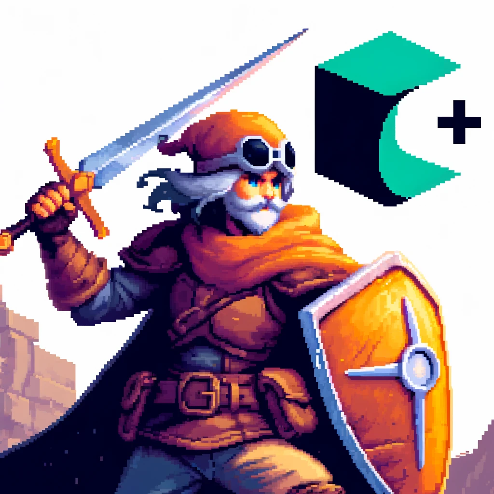

# Structures et énumération sous C

4 mars 2025



---

En C, une **struct** (ou structure) est un type de données qui permet de regrouper plusieurs variables sous un même nom, même si elles sont de types différents. C'est une sorte de conteneur qui permet d'organiser et de structurer des données de manière logique.

### Qu'est-ce qu'une struct ?

Imaginons qu'il soit nécessaire de créer un personnage dans un jeu vidéo. Ce personnage pourrait avoir plusieurs attributs : un **nom**, une **position** dans le jeu (x et y), une **santé**, et une **arme**.

Chaque attribut peut être d'un type différent : le nom sera une chaîne de caractères, la position sera composée de deux nombres (x et y), la santé sera un nombre entier et l'arme, une chaîne de caractères.

En utilisant une `struct`, il est possible de regrouper toutes ces informations dans un seul bloc de données.

### EXEMPLE – Définition d'une struct

La syntaxe pour définir une `struct` en C est la suivante :

```
struct Personnage {  
    char nom[50];     // nom du personnage, jusqu'à 49 caractères  
    int x, y;         // position du personnage dans le jeu (coordonnées)  
    int sante;        // santé du personnage  
    char arme[30];    // nom de l'arme  
};
```

Ici, une struct nommée `Personnage` est définie, regroupant quatre attributs : `nom`, `x`, `y`, `sante` et `arme`.

Chaque attribut peut être d'un type différent.

---

### Déclaration et utilisation d'une struct

Pour déclarer une variable de type `Personnage` et lui attribuer des valeurs, voici un exemple de code

```
// Définition de la struct Personnage
struct Personnage {
    char nom[50];     // nom du personnage, jusqu'à 49 caractères
    int x, y;         // position du personnage dans le jeu (coordonnées)
    int sante;        // santé du personnage
    char arme[30];    // nom de l'arme
};

void setup() {
    // Initialisation du moniteur série
    Serial.begin(9600);
    
    // Création et initialisation d'un personnage
    struct Personnage p1;

    // Assignation de valeurs aux attributs
    // Utilisation de méthodes simples pour la gestion de chaînes de caractères en Arduino
    strcpy(p1.nom, "Heros");  // Copie d'une chaîne dans le tableau 'nom'
    p1.x = 10;   // Position en X
    p1.y = 20;   // Position en Y
    p1.sante = 100;  // Santé maximale
    strcpy(p1.arme, "Epee");  // Nom de l'arme

    // Affichage des informations du personnage
    Serial.println("Informations du personnage :");
    Serial.print("Nom : ");
    Serial.println(p1.nom);
    Serial.print("Position : (");
    Serial.print(p1.x);
    Serial.print(", ");
    Serial.print(p1.y);
    Serial.println(")");
    Serial.print("Santé : ");
    Serial.println(p1.sante);
    Serial.print("Arme : ");
    Serial.println(p1.arme);
}

void loop() {
    // Pas de boucle continue nécessaire ici
}
```

**RÉSULTAT**:

```
Informations du personnage :
Nom : Heros
Position : (10, 20)
Santé : 100
Arme : Epee
```

Dans cet exemple :

* Une variable `p1` de type `Personnage` est déclarée.
* Les différents attributs de `p1` sont initialisés : le **nom**, la **position**, la **santé**, et **l'arme**.
* Ensuite, ces informations sont affichées à l'écran.

---

### Utilité des structures (struct) en C.

PAR EXEMPLE, dans un contexte des jeux vidéo, les `struct` sont utiles pour organiser les informations liées aux différents objets et entités du jeu.

Par exemple :

1. **Personnages** : Chaque personnage du jeu peut être représenté par une `struct` contenant ses attributs (nom, position, santé, etc.).
2. **Ennemis** : De même, les ennemis peuvent être représentés par des `struct` ayant des attributs comme la position, le type d'ennemi, les points de vie, etc.
3. **Objets du jeu** : Les objets comme des potions, des armes ou des trésors peuvent aussi être modélisés à l'aide de `struct` pour contenir leurs caractéristiques (type, valeur, quantité, etc.).

---

## Structure pour un ennemi avec utilisation de enum pour le type

```
// Définition de l'énumération pour les types d'ennemis
enum TypeEnnemi {
    GOBELIN,   // Le type d'ennemi est un gobelin
    DRAGON,    // Le type d'ennemi est un dragon
    SORCIER,   // Le type d'ennemi est un sorcier
    TROLL      // Le type d'ennemi est un troll
};

// Définition de la struct Ennemi
struct Ennemi {
    TypeEnnemi type;  // Type de l'ennemi, représenté par une énumération
    int x, y;              // Position dans le jeu
    int pointsDeVie;       // Points de vie de l'ennemi
};

void setup() {
    // Initialisation du moniteur série
    Serial.begin(9600);

    // Création et initialisation d'un ennemi
    struct Ennemi e1;

    // Assignation de valeurs aux attributs
    e1.type = GOBELIN;    // Le type de l'ennemi est un Gobelin
    e1.x = 50;            // Position X de l'ennemi
    e1.y = 60;            // Position Y de l'ennemi
    e1.pointsDeVie = 30;  // Points de vie de l'ennemi

    // Affichage des informations de l'ennemi
    Serial.println("Informations de l'ennemi :");
    Serial.print("Type : ");
    
    // Affichage du type d'ennemi en fonction de la valeur de l'énumération
    switch (e1.type) {
        case GOBELIN:
            Serial.println("Gobelin");
            break;
        case DRAGON:
            Serial.println("Dragon");
            break;
        case SORCIER:
            Serial.println("Sorcier");
            break;
        case TROLL:
            Serial.println("Troll");
            break;
        default:
            Serial.println("Inconnu");
            break;
    }

    Serial.print("Position : (");
    Serial.print(e1.x);
    Serial.print(", ");
    Serial.print(e1.y);
    Serial.println(")");
    Serial.print("Points de vie : ");
    Serial.println(e1.pointsDeVie);
}

void loop() {
    // Pas de boucle continue nécessaire ici
}
```

```
Informations de l'ennemi :
Type : Gobelin
Position : (50, 60)
Points de vie : 30
```

---

## Laboratoire 


<br>

Modifier l'exemple précédent pour remplacer les propriétés `int x, y;` de la structure `Ennemi` par une structure `Position`.  En tenir compte lors de l'affichage.

---

## Utilisation d'un tableau de structures

Voici un exemple qui utilise un tableau de **personnages** ainsi qu'une fonction pour ajouter de nouveaux personnages.

De plus, nous utiliserons un type ***enum*** pour renseigner l'arme du personnage.

De plus, la compilation conditionnelle est utilisée pour déterminer la langue des armes.

```
#include <Arduino.h>

#define FRANCAIS  1
#define ANGLAIS   2
#define ESPAGNOL  3

#define LANGUE ESPAGNOL

#if (LANGUE == FRANCAIS)
#define TEXTE_EPEE          "Épée"           // Description pour EPEE
#define TEXTE_BATON_MAGIQUE "Bâton magique"  // Description pour BATON_MAGIQUE
#define TEXTE_ARC           "Arc"            // Description pour ARC
#define TEXTE_HACHE         "Hache"          // Description pour HACHE
#endif

#if (LANGUE == ANGLAIS)
#define TEXTE_EPEE          "Sword"          // Description pour EPEE
#define TEXTE_BATON_MAGIQUE "Magic staff"    // Description pour BATON_MAGIQUE
#define TEXTE_ARC           "Bow"            // Description pour ARC
#define TEXTE_HACHE         "Axe"            // Description pour HACHE
#endif

#if (LANGUE == ESPAGNOL)
#define TEXTE_EPEE          "Espada"          // Description pour EPEE
#define TEXTE_BATON_MAGIQUE "Bastón mágico"   // Description pour BATON_MAGIQUE
#define TEXTE_ARC           "Arco"            // Description pour ARC
#define TEXTE_HACHE         "Hacha"           // Description pour HACHE
#endif

// Définition de l'énumération pour les armes
enum Arme {
    EPEE,          // Épée
    BATON_MAGIQUE, // Bâton magique
    ARC,           // Arc
    HACHE          // Hache
};

// Définition de la struct Personnage
struct Personnage {
    char nom[50];     // Nom du personnage
    int x, y;         // Position dans le jeu
    int sante;        // Santé du personnage
    enum Arme arme;   // Arme du personnage (utilisation de l'énumération)
};

// Taille maximale du tableau de personnages
#define MAX_PERSONNAGES 10  

// Table de chaînes de caractères pour décrire les armes
const char* descriptionsArmes[] = {
    TEXTE_EPEE,
    TEXTE_BATON_MAGIQUE,
    TEXTE_ARC,
    TEXTE_HACHE
};

// Fonction pour ajouter un nouveau personnage
int ajouterPersonnage(Personnage personnages[], int nbPersonnages, const char* nom, int x, int y, int sante, enum Arme arme) {
    if (nbPersonnages < MAX_PERSONNAGES) {
        // Ajouter un nouveau personnage dans le tableau
        strcpy(personnages[nbPersonnages].nom, nom);
        personnages[nbPersonnages].x = x;
        personnages[nbPersonnages].y = y;
        personnages[nbPersonnages].sante = sante;
        personnages[nbPersonnages].arme = arme; // Assignation de l'arme
        nbPersonnages++;  // Incrémenter le nombre de personnages
    } else {
        Serial.println("Erreur : Tableau de personnages plein !");
    }

    return nbPersonnages; // Retourner le nouveau nombre de personnages
}

// Fonction pour afficher les informations des personnages
void afficherPersonnages(Personnage personnages[], int nbPersonnages) {
    for (int i = 0; i < nbPersonnages; i++) {
        Serial.print("Nom \t\t: ");
        Serial.println(personnages[i].nom);
        Serial.print("Position \t: (");
        Serial.print(personnages[i].x);
        Serial.print(", ");
        Serial.print(personnages[i].y);
        Serial.println(")");
        Serial.print("Santé \t\t: ");
        Serial.println(personnages[i].sante);
        
        // Utiliser la table de chaînes pour afficher la description de l'arme
        Serial.print("Arme \t\t: ");
        Serial.println(descriptionsArmes[personnages[i].arme]);

        Serial.println();
    }
}

void setup() {
    // Initialisation du moniteur série
    Serial.begin(9600);
    
    // Déclaration d'un tableau de personnages
    struct Personnage personnages[MAX_PERSONNAGES]; 
    int nbPersonnages = 0; // Initialisation du nombre de personnages

    // Ajouter quelques personnages
    nbPersonnages = ajouterPersonnage(personnages, nbPersonnages, "Héros", 10, 20, 100, EPEE);
    nbPersonnages = ajouterPersonnage(personnages, nbPersonnages, "Mage", 15, 25, 80, BATON_MAGIQUE);
    nbPersonnages = ajouterPersonnage(personnages, nbPersonnages, "Archer", 30, 40, 90, ARC);

    // Afficher les informations de tous les personnages
    afficherPersonnages(personnages, nbPersonnages);
}

void loop() {
    // Pas de boucle continue nécessaire ici
}
```

RÉSULTAT:

```
Nom             : Héros
Position        : (10, 20)
Santé           : 100
Arme            : Espada

Nom             : Mage
Position        : (15, 25)
Santé           : 80
Arme            : Bastón mágico

Nom             : Archer
Position        : (30, 40)
Santé           : 90
Arme            : Arco
```

---


## Crédits

**Document rédigé par Alain Boudreault © 2021-2026**
**Version 2025.02.26.01 - Révision 2026.02.15.1**

*Contenu par [VE2CUY](http://ve2cuy.com/blog)*