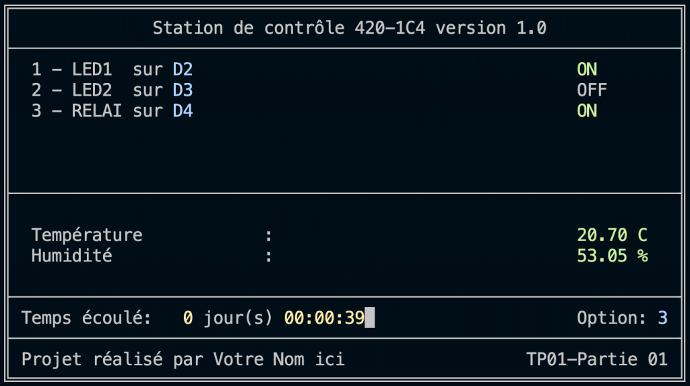
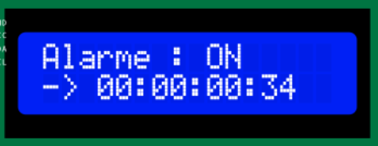
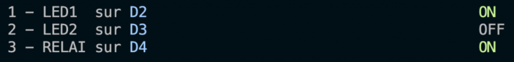
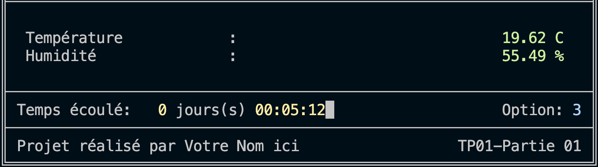
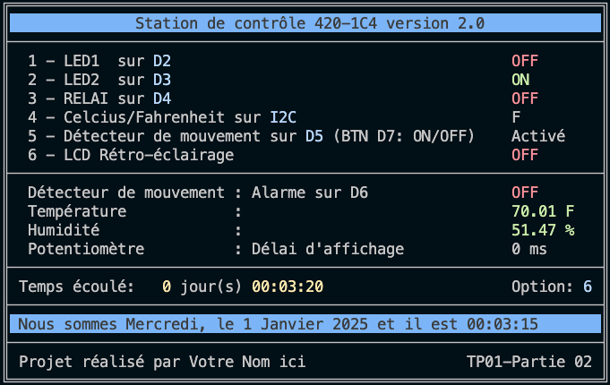
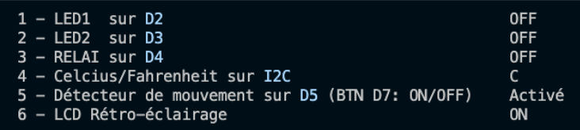
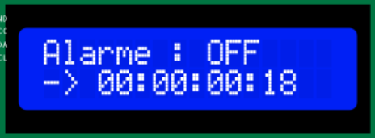
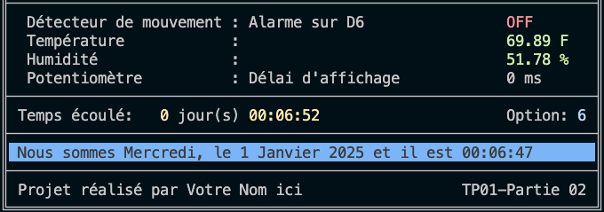

# LE SYSTÈME DE SURVEILLANCE H26


# Énoncé du TP01.2026 – Version 1.0

---

## Le travail pratique numéro 1 sera réalisé en deux étapes:

## Partie 01, 15%, à remettre à la semaine 6 – 5 mars 
## Partie 02, 15%, à remettre à la semaine 8 – 19 mars

---

## 1. Partie 01 – Remise semaine 06 – 5 mars, 16h00.

**En utilisant un Arduino UNO, avec les modules groves suivants:**

* **LED1** sur D2
* **LED2** sur D3
* **Relai** sur D4
* **Capteur** de température (**SHT31**) sur I2C -> [notes de cours](https://ve2cuy.com/420-1c4/index.php/grove-module-humidite-et-temperature/)
* **RGB\_LCD** sur I2C -> [notes de cours](https://ve2cuy.com/420-1c4/index.php/grove-module-lcd-rgb-i2c/)
* Le moniteur série à **4800** bauds

**Écrire une application pour Arduino UNO, en utilisant VS Code et PlatformIO, qui affiche l'écran suivant dans la console série (serial monitor):**



**Et l'écran suivant sur le LCD:**



---

**NOTE**: Les options 1 à 3, affichées sur la console, sont des actions qui peuvent être lancées à partir du clavier pour contrôler certains modules du système.

Par exemple, pour allumer ou éteindre la LED sur D2 il suffira d'appuyer sur la touche 1 du clavier.


```cpp
// Astuce: Saisie d'une touche du clavier à partir de la console série

if (Serial.available()) {      // Si un octet disponible sur le port Serial
    commande = Serial.read();  // Lecture d'un octet (touche clavier)
    
    // Traitement de la commande ...
    if (commande == '1') alors allumer/éteindre DEL1;
}
```

---

## Démonstration de l'application

[Vidéo de démonstration](https://ve2cuy.com/420-1c4/wp-content/uploads/2025/02/420-1c4.tp01-partie01.mov)

---

## Détails et actions des options du menu (Items 1 à 3)

L'application doit permettre la saisie de caractères à partir du terminal série. Cette saisie, permet l'exécution de certaines fonctions de l'application. Les options sont identifiées par des numéros au début des lignes de l'interface. Par exemple, le '3 -' dans '3 – RELAI' indique qu'il est possible de contrôler le relai en appuyant sur la touche '3' du clavier.

**NOTE**: Assurez-vous que le focus est dans la fenêtre du terminal série avant d'appuyer sur une touche.

Donc, étant donné le menu suivant,



1. LED1 sur D2
   * Permet d'allumer/Éteindre la DEL connectée sur D2
   * Au bout de la ligne, il faut afficher l'état: **ON** ou **OFF**
     + **Sous forme de « toggle », permutation de l'état.**
2. LED2 sur D3
   * Permet d'allumer/Éteindre la DEL connectée sur D3
   * Au bout de la ligne, il faut afficher l'état: **ON** ou **OFF**
3. RELAI D4
   * Permet d'allumer/Éteindre le RELAI connecté sur D4
   * Au bout de la ligne, il faut afficher l'état: **ON** ou **OFF**

**NOTE**: **ON** doit-être affiché en **vert** et OFF en **rouge**.

👉 **ÉLÉMENTS PRESCRITS OBLIGATOIRES:**

Il faut programmer les fonctions suivantes pour l'affichage des états ON/OFF et de température/Humidité.

```cpp
void afficherOnOff(int posX, int posY, bool on = true);
void afficherTemperatureEtHumidite(int posX, int posY);
```

---

## Détails des modules (appareils) de contrôle

* Capteur de température, connecté sur le port I2C
  + Lecture de la température et de l'humidité pour affichage dans la deuxième partie de l'écran du moniteur série.
* LCD, connecté sur le port I2C
  + Sert à afficher le message 'Alarme: ON' sur la première ligne
  + Le temps écoulé depuis le démarrage de l'arduino en JOURS:HR:MM:SEC


---

## Détails des éléments de la deuxième partie de l'écran



* **Température**: Il faut afficher la température retournée par le capteur, suivi de ' C'
* **Humidité** : Il faut afficher l'humidité retournée par le capteur, suivi de ' %'
* **Temps écoulé**: Il faut afficher le temps écoulé en utilisant le format: 0 jours(s) 00:00:00
  + 👉 **ÉLÉMENT PRESCRIT OBLIGATOIRE**: Utiliser la fonction ***snprintf()***.
  + **NOTE**: Il y a un point boni pour la gestion du **(s)** à jour. Voir la grille de correction.
* **Option**: Il faut afficher la touche saisie du clavier.
* **Projet réalisé par**: Il faut inscrire votre Nom

---

## Remise

Remettre, via LEA, les fichiers suivants de votre projet:

* Les codes source (fichiers .cpp)
* Les fichiers d'entête (fichiers .h – les votre)
* Le fichier platformio.ini

---

## Grille de correction de la partie 01

### Critères de performance

* Les directives du devis doivent-être respectées.
* Le code source doit-être bien documenté.
* Le code source doit-être optimisé.
  + Par de répétitions inutiles: utilisez des fonctions.
* Le projet doit-être fonctionnel.
* Le projet doit-être livré à temps.

| Item | Description | Pondération |
| --- | --- | --- |
| 1 | Bloc commentaires d'entête, documentation du code, noms significatifs pour const, MACROs, variables, fonctions, … | 1,75 |
| 2 | Constantes, MACROs et inclusions dans le fichier projet.h. | 1 |
| 3 | Normalisation (pas de répétition), utilisation de const et/ou MACRO et optimisation du code. | 1,5 |
| 4 | Instructions de garde dans les fichiers d'entête | 0,5 |
| 5 | Programmation des fonctions afficherOnOff() et afficherTemperatureEtHumidite(). | 1,5 |
| 6 | Saisie des options du menu à partir du clavier et affichage de la sélection. | 1 |
| 7 | Utilisation correcte de la fonction snprintf(). | 1 |
| 8 | Affichage des éléments; ON/OFF, temps, C et %, couleurs, gestion du curseur. | 2 |
| 9 | Contrôle des modules LEDs, Relai et affichage sur le LCD: temps écoulé. | 2 |
| 10 | Vitesse du port série (UART) à 4800. | 0,25 |
| 11 | Remise des fichiers du projet: main.cpp, projet.h, platformIO.ini. | 0,5 |
| 12 | Fonctionnalité du projet et respect du devis. | 2 |
| **POINT BONI** | Utilisation de l'opérateur ternaire dans la fonction snprintf() pour afficher 's' à jour seulement si nbJour > 1. Par exemple, 1 jour 12:23:01, 2 jours 23:59:59 | 1 |
|  |  |  |
|  | Total | 16 /15 |

---

# Partie 02 – Remise – 19 mars, 16h00


---

**En utilisant un Arduino UNO, avec les modules groves suivants:**

* **LED1** sur D2
* **LED2** sur D3
* **Relai** sur D4
* **Détecteur de mouvement** sur D5 -> [notes de cours](https://ve2cuy.com/420-1c4/index.php/detecteur-de-mouvements/)
* **Piézo** (buzzer) sur D6 -> [notes de cours](https://ve2cuy.com/420-1c4/index.php/buzzer-et-rgb-led-stick/)
* **Bouton** sur D7 pour controller le détecteur de mouvement
* **Potentiomètre** sur **A0** -> [notes de cours](https://ve2cuy.com/420-1c4/index.php/arduino-analogread/)
* **Capteur** de température (**SHT31**) sur I2C -> [notes de cours](https://ve2cuy.com/420-1c4/index.php/grove-module-humidite-et-temperature/)
* **RGB\_LCD** sur I2C -> [notes de cours](https://ve2cuy.com/420-1c4/index.php/grove-module-lcd-rgb-i2c/)
* **Un module RTC** pour la section '**Nous sommes ..**.'

**Écrire une application pour Arduino UNO, en utilisant VS Code et PlatformIO, qui affiche l'écran suivant dans la console série (serial monitor):**



**Et l'écran suivant sur le LCD:**


---

**NOTE**: Les options 1 à 6, affichés sur la console, sont des actions qui peuvent être lancées à partir du clavier pour contrôler certains modules du système.

Par exemple, pour allumer ou éteindre la LED sur D2 il suffira d'appuyer sur la touche 1 du clavier.


```cpp
// Astuce: Saisie d'une touche du clavier à partir de la console série

if (Serial.available()) {      // Si un octet disponible sur le port Serial
    commande = Serial.read();  // Lecture d'un octet (touche clavier)
    
    // Traitement de la commande ...
    if (commande == '1') alors allumer/éteindre DEL1;
}
```

---

## Démonstration

[Vidéo de démonstration](https://ve2cuy.com/420-1c4/wp-content/uploads/2025/02/420-1c4-tp01-partie02.mov)

---

## Détails et actions des options du menu (Items 1 à 6)



1. LED1 sur D2
   * Permet d'allumer/Éteindre la DEL connectée sur D2
   * Au bout de la ligne, il faut afficher l'état: **ON** ou **OFF**
2. LED2 sur D3
   * Permet d'allumer/Éteindre la DEL connectée sur D3
   * Au bout de la ligne, il faut afficher l'état: **ON** ou **OFF**
3. RELAI D4
   * Permet d'allumer/Éteindre le RELAI connecté sur D4
   * Au bout de la ligne, il faut afficher l'état: **ON** ou **OFF**
4. Celcius/Fahrenheit sur I2C
   * Permet de préciser l'unité d'affichage de la température entre F et C
   * Au bout de la ligne, il faut afficher l'unité d'affichage de la température: **C** ou **F**
5. Détecteur de mouvement sur D5
   * Permet d'activer ou désactiver le traitement du détecteur de mouvement.
   * Au bout de la ligne, il faut afficher **activé** ou **désactiver**.
   * Sur la première ligne du **LCD**, il faut afficher: **Alarme: ON/OFF**
6. LCD Rétro-éclairage
   * Permet d'activer ou désactiver le rétro-éclairage du LCD
   * Au bout de la ligne, il faut afficher l'état: **ON** ou **OFF**
   * **Astuce**: l*cd.setRGB(255,255,255); lcd.setRGB(0,0,0);*

---

## Détails des modules (appareils) de contrôle

* **Bouton** sur D7
  + Permet d'activer ou désactiver le traitement du détecteur de mouvement.
  + Au bout de la ligne, il faut afficher: **activé** ou **désactiver**.
  + **NOTE**: Ce bouton à la même fonction que l'**item 5** du menu. Il permet à l'utilisateur d'activer ou de désactiver le détecteur de mouvement sans passer par la console.
  + Sur la première ligne du **LCD**, il faut afficher: **Alarme: ON/OFF**



* Détecteur de mouvement sur **D5**
  + Si le traitement du détecteur de mouvement est activé et qu'un mouvement est détecté, il faut changer la couleur de fond du LCD pour **rouge** et afficher l'écran qui suit cette liste.
    - Le système d'alarme doit sonner le **Piezo** (buzzer) sur **D6**.
    - Le programme doit attendre que le détecteur de mouvement soit retourné à l'état **OFF** puis:
      * Arrêter le Piezo
      * Rétablir l'écran du LCD
      * Reprendre le programme


* Capteur de température
  + Lecture de la température et de l'humidité pour affichage dans la deuxième partie de l'écran du moniteur série.
* Potentiomètre sur A0
  + Sert à renseigner le délai de la boucle principale : 0 à 1023 ms.
* Piezo (buzzer)
  + Sert à stresser votre entourage 😉 lorsqu'un mouvement est détecté.

---

## Détails des éléments de la deuxième partie de l'écran



* Détecteur de mouvement : Alarme sur D6
* Température :
* Humidité :
* Potentiomètre : Délai d'affichage
* Temps écoulé: 0 jours(s) 00:00:00 —— Option: 9
* Affichage du jour, mois, année et de l'heure courante.
* Projet réalisé par Votre Nom ici TP01 —– Partie 02

---

## Remise

Remettre, via LÉA, le dossier complet de votre projet:

---

## Grille de correction de la partie 02

| Item | Description | Pondération |
| --- | --- | --- |
| 1 | Respect du devis | 3 |
| 2 | Fonctionnalité | 8 |
| 3 | Normalisation | 4 |
|  |  |  |
|  | Total | 15/15 |

---

## Crédits

**Document rédigé par Alain Boudreault © 2021-2026**
**Version 2025.03.15.01 - Révision 2025.12.12.1**

*Contenu par [VE2CUY](http://ve2cuy.com/blog)*