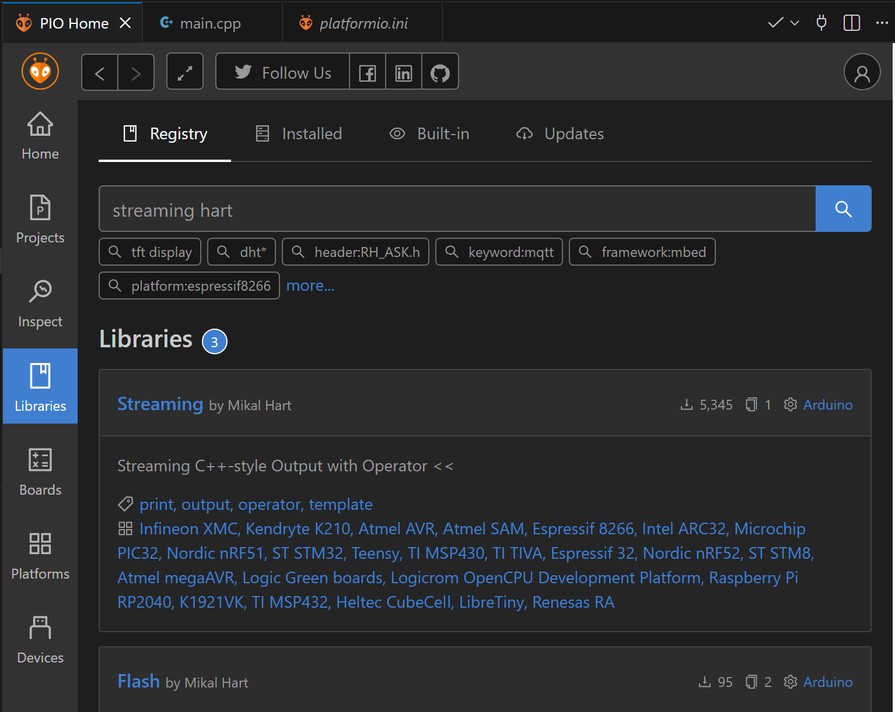
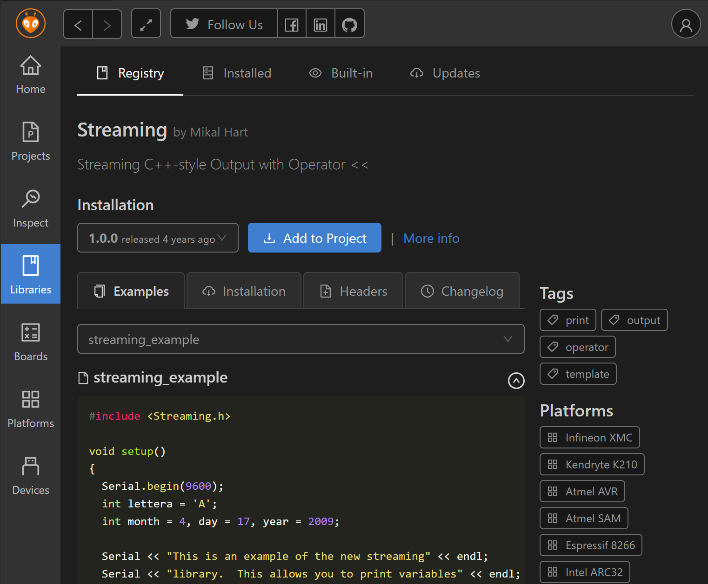
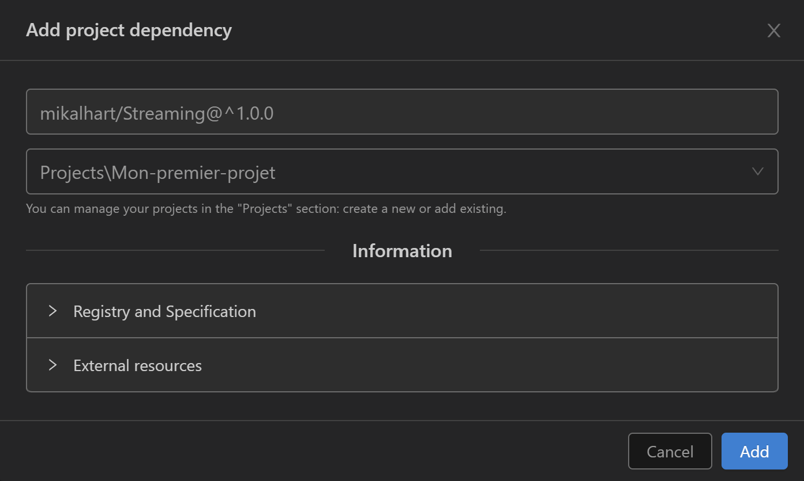
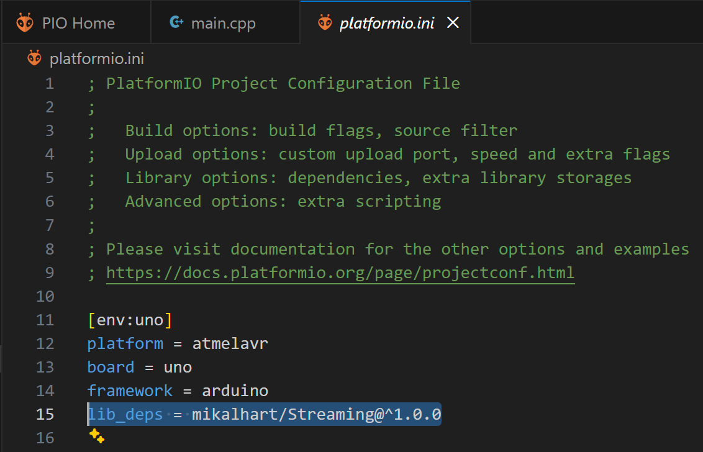

# Utilisation de librairies

## 1 - Les librairies : Qu'est-ce que c'est et pourquoi les utiliser?

### 1.1 - Définition et rôle des librairies

Une **librairie** (ou bibliothèque logicielle) est un ensemble de code pré-écrit et testé qui fournit des fonctionnalités réutilisables. Dans le contexte Arduino et PlatformIO, les librairies permettent de:

#### **1. Réutiliser du code existant**
Plutôt que de tout programmer à partir de zéro, les librairies fournissent des solutions éprouvées pour des tâches courantes. Par exemple:
- Communiquer avec un capteur de température
- Afficher du texte sur un écran LCD
- Se connecter à un réseau WiFi
- Contrôler des servomoteurs

#### **2. Simplifier le développement**
Les librairies cachent la complexité technique et offrent une interface simple. Par exemple, pour lire un capteur DHT22:

**Sans librairie** (complexe):
```cpp
// Des centaines de lignes de code pour gérer:
// - Le protocole de communication spécifique
// - Les timings précis en microsecondes
// - La conversion des données brutes
// - La gestion des erreurs
// - Les calculs de température et humidité
```

**Avec librairie** (simple):
```cpp
#include <DHT.h>
DHT capteur(PIN, DHT22);
float temperature = capteur.readTemperature();
float humidite = capteur.readHumidity();
```

#### **3. Gagner du temps**
Au lieu de passer des heures (voire des jours) à comprendre un protocole de communication ou un composant électronique, vous pouvez utiliser une librairie et vous concentrer sur la logique de votre application.

#### **4. Éviter les erreurs**
Les librairies populaires sont:
- **Testées** par des milliers d'utilisateurs
- **Debuggées** au fil du temps
- **Documentées** avec des exemples
- **Maintenues** par la communauté

#### **5. Bénéficier de l'expertise**
Les librairies sont souvent écrites par des experts qui connaissent parfaitement le matériel ou le protocole concerné. Vous bénéficiez de leur expertise sans avoir à tout apprendre.

### 1.2 - Types de librairies

#### **Librairies matérielles**
Permettent de contrôler des composants électroniques:
- `DHT sensor library`: Capteurs de température/humidité
- `Adafruit NeoPixel`: LEDs RGB programmables
- `LiquidCrystal`: Écrans LCD
- `Servo`: Contrôle de servomoteurs
- `Wire`: Communication I2C
- `SPI`: Communication SPI

#### **Librairies de communication**
Facilitent les échanges de données:
- `WiFiEsp`: Connexion WiFi avec ESP8266
- `ArduinoJson`: Manipulation de données JSON
- `PubSubClient`: Protocole MQTT
- `HTTPClient`: Requêtes HTTP

#### **Librairies utilitaires**
Ajoutent des fonctionnalités au langage:
- `Streaming`: Utilisation de l'opérateur `<<` pour Serial
- `Time`: Gestion du temps et des dates
- `ArduinoSTL`: Structures de données C++ (vector, map, etc.)
- `CRC`: Calculs de sommes de contrôle

#### **Librairies système**
Déjà incluses avec Arduino:
- `Arduino.h`: Fonctions de base (pinMode, digitalWrite, etc.)
- `Serial`: Communication série
- `EEPROM`: Lecture/écriture de la mémoire permanente

### 1.3 - Structure d'une librairie

Une librairie typique contient:

```
MaLibrairie/
├── src/
│   ├── MaLibrairie.h      // Déclarations (interface)
│   └── MaLibrairie.cpp    // Implémentation
├── examples/              // Exemples d'utilisation
│   └── exemple_basique.ino
├── keywords.txt           // Coloration syntaxique
├── library.properties     // Métadonnées
└── README.md             // Documentation
```

**Le fichier .h (header)** déclare ce que la librairie peut faire:
```cpp
class MaLibrairie {
  public:
    void initialiser();
    int lireValeur();
    void ecrireValeur(int valeur);
};
```

**Le fichier .cpp** contient l'implémentation réelle du code.

### 1.4 - Installer une librairie supplémentaire:









**Avantages du gestionnaire de librairies PlatformIO:**
- Recherche rapide parmi des milliers de librairies
- Informations détaillées (documentation, exemples, compatibilité)
- Installation en un clic
- Gestion automatique des versions et dépendances
- Pas besoin de télécharger et copier manuellement les fichiers
- Les librairies sont automatiquement compilées avec votre projet

### 1.5 - Comment choisir une bonne librairie?

Critères à considérer:

1. **Popularité**: Nombre de téléchargements et d'étoiles GitHub
2. **Maintenance**: Date de la dernière mise à jour
3. **Documentation**: Présence d'exemples et d'explications claires
4. **Compatibilité**: Support de votre carte (Arduino Uno, ESP32, etc.)
5. **Licence**: Vérifier que vous pouvez l'utiliser dans votre projet
6. **Dépendances**: Moins une librairie a de dépendances, mieux c'est
7. **Taille**: Important si vous avez peu de mémoire
8. **Avis**: Commentaires et retours d'expérience des utilisateurs

---

### 1.6 - Exemple pratique : La librairie Streaming

La librairie **Streaming** est un excellent exemple de librairie utilitaire qui améliore l'expérience de développement.

**Problème**: Avec Arduino standard, afficher plusieurs valeurs demande plusieurs instructions:
```cpp
Serial.print("Temperature: ");
Serial.print(temperature);
Serial.print(" C, Humidite: ");
Serial.print(humidite);
Serial.println(" %");
```

**Solution**: Avec Streaming, on utilise l'opérateur `<<` comme en C++:
```cpp
Serial << "Temperature: " << temperature << " C, Humidite: " << humidite << " %" << endl;
```

C'est plus **concis**, plus **lisible** et plus **proche du C++ standard**.

### 1.7 - Remplacer le code source de main.cpp par et tester l'application:

```cpp
#include <Arduino.h>
#include <Streaming.h>

void setup() {
  Serial.begin(9600);
  Serial << "Bonjour le Monde!" << endl;
}

void loop() {
}
```

**Explication du code:**
- `#include <Streaming.h>`: Inclusion de la librairie Streaming
- La librairie **Streaming** permet d'utiliser l'opérateur `<<` pour afficher dans le port série, rendant le code plus lisible et proche du C++ standard
- `endl` est équivalent à `\n` et force l'envoi immédiat du message
- Cette syntaxe est plus élégante et ressemble au `cout` du C++ standard

**Avantages de cette approche:**
- Code plus compact et lisible
- Moins d'erreurs de syntaxe (oubli de guillemets, virgules)
- Style de programmation moderne
- Facilite l'affichage de variables mixées avec du texte

### 1.8 - Créer sa propre librairie locale

Pour des fonctionnalités spécifiques à votre projet, vous pouvez créer une librairie locale dans le dossier `lib/`:

```
mon_projet/
└── lib/
    └── MesUtilitaires/
        ├── MesUtilitaires.h
        └── MesUtilitaires.cpp
```

**Exemple de librairie personnalisée:**

**MesUtilitaires.h:**
```cpp
#ifndef MES_UTILITAIRES_H
#define MES_UTILITAIRES_H

#include <Arduino.h>

class MesUtilitaires {
  public:
    static void clignoterLED(int pin, int fois);
    static float convertirCelsiusVersF(float celsius);
};

#endif
```

**MesUtilitaires.cpp:**
```cpp
#include "MesUtilitaires.h"

void MesUtilitaires::clignoterLED(int pin, int fois) {
  for(int i = 0; i < fois; i++) {
    digitalWrite(pin, HIGH);
    delay(200);
    digitalWrite(pin, LOW);
    delay(200);
  }
}

float MesUtilitaires::convertirCelsiusVersF(float celsius) {
  return (celsius * 9.0 / 5.0) + 32.0;
}
```

**Utilisation dans main.cpp:**
```cpp
#include <Arduino.h>
#include "MesUtilitaires.h"

void setup() {
  pinMode(13, OUTPUT);
  MesUtilitaires::clignoterLED(13, 5);
}

void loop() {
  // ...
}
```

### 1.9 - Gestion des versions de librairies

Dans PlatformIO, vous pouvez spécifier la version exacte d'une librairie dans `platformio.ini`:

```ini
lib_deps = 
    mikem/Streaming @ ^1.0.0          # Accepte 1.x.x (mises à jour mineures)
    bblanchon/ArduinoJson @ 6.21.3    # Version exacte
    adafruit/DHT sensor library       # Dernière version disponible
    https://github.com/user/lib.git   # Depuis un dépôt Git
```

**Symboles de version:**
- `@1.0.0`: Version exacte
- `@^1.0.0`: Compatible avec 1.x.x (pas 2.0.0)
- `@~1.0.0`: Compatible avec 1.0.x uniquement
- Sans symbole: Dernière version

**Pourquoi spécifier une version?**
- **Reproductibilité**: Le projet compile de la même façon dans le futur
- **Stabilité**: Évite les bugs introduits par de nouvelles versions
- **Compatibilité**: Certaines versions peuvent casser l'API

### 1.10 - Dépendances entre librairies

Certaines librairies dépendent d'autres librairies. PlatformIO gère automatiquement ces dépendances.

**Exemple**: La librairie `Adafruit GFX Library` est nécessaire pour utiliser `Adafruit SSD1306`:

```ini
lib_deps = 
    adafruit/Adafruit SSD1306    # Installera automatiquement Adafruit GFX
```

PlatformIO détecte et installe automatiquement `Adafruit GFX Library` et `Adafruit BusIO` qui sont requises.

### 1.11 - Résumé : Pourquoi les librairies sont essentielles

| Aspect | Sans librairie | Avec librairie |
|--------|---------------|----------------|
| **Temps de développement** | Des heures/jours pour comprendre le matériel | Quelques minutes pour intégrer |
| **Complexité du code** | Des centaines de lignes | Quelques lignes simples |
| **Fiabilité** | Erreurs fréquentes au début | Code testé par la communauté |
| **Maintenance** | Tout corriger soi-même | Bénéficier des corrections |
| **Documentation** | Lire les datasheets techniques | Exemples prêts à l'emploi |
| **Évolution** | Tout réécrire pour chaque amélioration | Mises à jour automatiques |

**En résumé**: Les librairies sont comme des outils dans une boîte à outils. Vous **pourriez** construire chaque outil à la main, mais c'est beaucoup plus efficace d'utiliser des outils existants et de vous concentrer sur votre projet principal!

---

## Crédits

**Document rédigé par Alain Boudreault © 2021-2026**

**Version 2025.12.14.01**

*Contenu par [VE2CUY](http://ve2cuy.com/blog)*