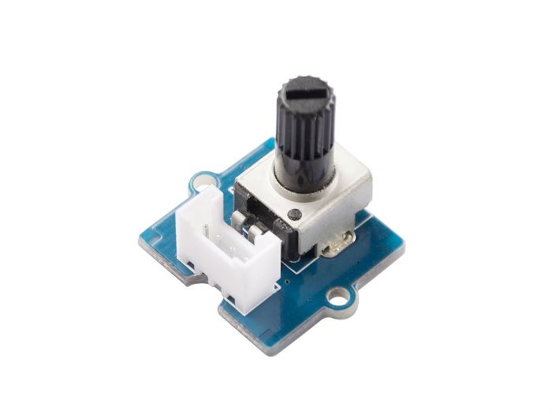

# Arduino – AnalogRead

*Date: 13 septembre 2021*

## 1 – Lecture d'une valeur analogique, analogRead()

L'Arduino Uno permet la lecture d'une valeur analogique à partir des broches A0..A5.

Ce type d'entrée permet de lire la position, par exemple, du potentiomètre (contrôle de volume ou d'intensité) d'un gradateur pour une lumière dans une pièce de la maison.

Pour l'exemple suivant, nous aurons besoin de connecter le module Grove 'Potentiomètre' au connecteur A0 du Hat Grove.

**Note**: Les entrées analogiques de l'ATMEGA328P ont une résolution de 10 bits. C'est-à-dire qu'une valeur entre 0 et 1023 sera retournée lors de la lecture d'un senseur analogique.





### 1.1 – Exemple d'une lecture du potentiomètre

```cpp
/* 
   --------------------------------------------------------------------------
   Projet:         Introduction à Arduino, la broche analogique.
   Nom du fichier: digitalRead.ino
   Auteur:         Alain Boudreault
   Date:           2022.09.10
   ---------------------------------------------------------------------------
   Description:    Petit programme qui lit la valeur d'un module analogique
                   (potentiomètre) et affiche la valeur dans la console série
   ---------------------------------------------------------------------------
   M-A-J:          2022.09.14 - Nom des constantes en caractères majuscules.
                   2025.03.03 - Ajout de Arduino.h + délai d'affichage
   ---------------------------------------------------------------------------
*/
#include <Arduino.h>

//**********************************
// Les constantes
//**********************************
const int BROCHE_DU_SENSEUR     = A0;    // La broche du potentiomètre
const int BROCHE_DE_LA_DEL      = 3;     // La broche de la DEL.
const int VITESSE_UART          = 9600;  // Vitesse de la console série
const int DELAI_AFFICHAGE       = 150;  

//**********************************
void setup() {
  pinMode(BROCHE_DE_LA_DEL, OUTPUT);
  Serial.begin(VITESSE_UART);
} // setup()

//**********************************
void loop() {
  int valeurDuPotentiometre = 0;     
  // Lire et afficher la valeur du potentiomètre
  // NOTE: Les broches analogiques n'ont pas à être initialisées.
  valeurDuPotentiometre = analogRead(BROCHE_DU_SENSEUR);
  Serial.print("Valeur du pot: ");
  Serial.println(valeurDuPotentiometre);
  // Ajout d'un délai pour ne pas saturer le moniteur série
  delay(DELAI_AFFICHAGE);
} // loop()

//****** FIN DU FICHIER
```

### 1.2 – Tester l'exemple

**ATTENTION** à la position de l'interrupteur de tension sur le Grove-Hat. Assurez-vous qu'il est à la position 5 volts. L'ATmega328P utilise cette tension pour déterminer la valeur limite d'entrée d'une broche analogique. À la position 3.3 volts, la valeur maximum sera autour de 710.

---

## 1.3 – Laboratoire – Clignoter une DEL en fonction du potentiomètre


<br>

Il faut faire clignoter la **DEL** connectée sur **D3** en utilisant la valeur du **potentiomètre**.

Par exemple:

* Si le potentiomètre vaut 500 alors la DEL est **ON** 500ms puis **OFF** 500ms
* Si le potentiomètre vaut 150 alors la DEL est **ON** 150ms puis **OFF** 150ms

**ATTENTION**: La solution est affichée à la section suivante. Si possible, résistez à la tentation de la consulter avant d'avoir tenté un essai 😊.

---

### 1.3S – Solution du laboratoire 1.3

```cpp
#include <Arduino.h>

// Les constantes
const int BROCHE_DU_SENSEUR     = A0;    // La broche du potentiomètre
const int BROCHE_DE_LA_DEL      = 3;     // La broche de la DEL.
const int VITESSE_UART          = 9600;

//**********************************
void setup() {
  pinMode(BROCHE_DE_LA_DEL, OUTPUT);
  Serial.begin(VITESSE_UART);
} // setup()

//**********************************
void loop() {
  int valeurDuPotentiometre = analogRead(BROCHE_DU_SENSEUR);

  Serial.print("Valeur du pot: ");
  Serial.println(valeurDuPotentiometre);
  
  // Allumer/éteindre la DEL en utilisant la valeur du potentiomètre
  digitalWrite(BROCHE_DE_LA_DEL, HIGH);
  delay(valeurDuPotentiometre);
  digitalWrite(BROCHE_DE_LA_DEL, LOW);
  delay(valeurDuPotentiometre);

} // loop()

//****** FIN DU FICHIER
```

---

## 2 – Laboratoire (durée 15 minutes)


<br>

Modifier le code source de l'exemple précédent pour que la DEL clignote seulement si la valeur du potentiomètre est comprise entre 200 et 800. Sinon, la DEL doit demeurer éteinte.

Il faut définir les valeurs limites avec des constantes (const int), c'est-à-dire, il ne faut pas coder **200** et **800** en dur dans votre code.

---

## 3 – 👉 Laboratoire (durée 30 minutes)

Écrire un programme qui démarre le clignotement d'une **DEL** si le bouton poussoir est appuyé une fois et qui arrête le clignotement de la **DEL** à la prochaine utilisation du bouton poussoir.

La vitesse de clignotement est renseignée par la valeur du potentiomètre.

**IMPORTANT**: Ne pas utiliser une solution bloquante pour le clignotement, ce qui aura comme effet de perdre des événements du bouton.

👉 Il ne faut pas que la **DEL** reste allumée si elle ne clignote pas.

**INDICE**: Voir [permutation bouton](http://ve2cuy.com/420-1c4/index.php/arduino-serial-printlnval-et-digitalread/#permutationbouton)

---

Voir la section 4.2 – La fonction `map(value, fromLow, fromHigh, toLow, toHigh)`

---

## 4 – Pulse Width Modulation (PWM), la fonction analogWrite()

Il est possible de simuler un signal de sortie de type analogique pour par exemple varier l'intensité d'une DEL ou bien la vitesse d'un moteur.

Cette simulation est obtenue en variant la durée de l'état allumé et de l'état éteint.

Voici un graphe de démonstration:


Référence: [Arduino.cc](https://www.arduino.cc/en/Tutorial/Foundations/PWM)

La fonctionnalité PWM est obtenue grâce à la fonction **analogWrite(0..255)**.

**NOTE**: Sur [Arduino Uno](https://www.arduino.cc/reference/fr/language/functions/analog-io/analogwrite/), PWM est disponible seulement sur les broches **3, 5, 6, 9, 10 et 11**.

---

### 4.1 – Varier l'intensité d'une DEL grâce à PWM – version 01

```cpp
#include <Arduino.h>

#define BROCHE_DEL      3         // LED sur pin 3
#define DELAI           20
#define UNE_SECONDE     1000

void setup() {
  pinMode(BROCHE_DEL, OUTPUT);    // Broche de la DEL en mode OUTPUT
} // setup()

void loop() {
    static byte intensiteDEL = 255;

    analogWrite(BROCHE_DEL, intensiteDEL); // Allumer la DEL avec le mode PWM
    intensiteDEL--;               // Diminuer la valeur d'intensité de la DEL

    if (intensiteDEL == 0) {      // Si intensité de la DEL est = 0 alors remettre à 255
      intensiteDEL = 255;
      delay(UNE_SECONDE / 2);     // Laisser la DEL éteinte pendant 1/2 sec.
    } // if (intensiteDEL == 0)

    delay(DELAI); // Ralentir un peu la variation d'intensité de la DEL.
} // loop()
```

### 4.1 – Varier l'intensité d'une DEL grâce à PWM – version 02 (optimisée)

```cpp
int ledPin        = 3;         // LED sur pin 3
int intensiteDEL  = 255;
int delai         = 20;

void setup() {
  pinMode(ledPin, OUTPUT);    // Broche de la DEL en mode OUTPUT
}

void loop() {
    analogWrite(ledPin, --intensiteDEL);
    if (!intensiteDEL) { 
      intensiteDEL = 255;
      delay(500); // Laisser la DEL éteinte pendant 1/2 sec.
    }
    delay(delai); // Ralentir un peu la variation d'intensité de la DEL.
}
```

---

### 4.2 – La fonction map()

Il peut être parfois utile de ramener une plage de valeurs, par exemple [0..1023] vers une autre plage de valeurs, par exemple [0..255].

Si nous voulions contrôler l'intensité d'une DEL, en utilisant PWM, par un potentiomètre connecté à une source analogique, il faudrait concilier alors les deux plages de valeurs.

La librairie de développement Arduino propose la fonction map() pour adresser cette situation.

### 4.3 – Syntaxe de la fonction map()

```cpp
map(value, fromLow, fromHigh, toLow, toHigh)
```

### Paramètres

* `value`: le nombre à convertir  
* `fromLow`: la valeur minimum de l'étendue à convertir  
* `fromHigh`: la valeur maximum de l'étendue à convertir  
* `toLow`: la valeur minimum de l'étendue désirée  
* `toHigh`: la valeur maximum de l'étendue désirée

---

### 4.4.a – Exemple d'utilisation de la fonction map() – version Serial.print

```cpp
/*
    Fichier:  fn-map-println.ino
    Auteur:   Alain Boudreault
    Date:     2021.09.17
    --------------------------------------------------------------------------
    Description: Exemple d'une conversion des valeurs d'une entrée digitale
                 comprises entre 0..1023 vers une plage de valeurs
                 comprises entre 0..255.

                 Les valeurs converties sont affichées dans le terminal série
                 en utilisant Serial.print()
    --------------------------------------------------------------------------
    M-A-J:       2025.03.03 - Ajout de Arduino.h
    --------------------------------------------------------------------------    
*/

#include <Arduino.h>

// Définition des constantes
const int brocheDuSenseur  = A0;      // Sélection de la broche du potentiomètre
const int vitesseUART      = 19200;   // Vitesse du port de communication série

// Les variables globales
int valeurDuPotentiometre = 0;

// ---------------------------------------
// Initialisation des paramètres de départ
// ---------------------------------------
void setup() {
  Serial.begin(vitesseUART);
  Serial.print("Programme: fn-map-print.ino\n");
  Serial.print("Auteur:    Alain Boudreault\n");
  Serial.print("----------------------------\n");
  Serial.print("---- Début du programme ----\n");
  Serial.print("----------------------------\n\n");
} // setup()

// -------------------------------------
// Fonction principale de l'application
// -------------------------------------
void loop() {

  // Boucler sur la prochaine ligne tant que la valeur du Pot n'aura pas changé de plus de 1/1023. 
  while (abs(valeurDuPotentiometre - analogRead(brocheDuSenseur)) < 2);
  
  // Lire et stocker la valeur du potentiomètre
  // NOTE: Les broches analogiques n'ont pas à être initialisées.
  valeurDuPotentiometre = analogRead(brocheDuSenseur);
  
  // Convertir la plage des valeurs
  int valeurConvertieDuPotentiometre = map(valeurDuPotentiometre, 0, 1023, 0, 255);
  
  // Afficher les résultats en utilisant Serial.print()
  Serial.print("Valeur du pot avant conversion: ");
  Serial.print(valeurDuPotentiometre);
  Serial.print(" après conversion: ");
  Serial.println(valeurConvertieDuPotentiometre);
   
  // Ajout d'un délai pour ne pas saturer le moniteur série
  delay(500);
} // loop()
```

---

### Couvrir la section suivante seulement après avoir fait le module LCD

---

### 4.4.b – Exemple d'utilisation de la fonction map() – version IO Stream

```cpp
/*
    Fichier:  fn-map-stream.ino
    Auteur:   Alain Boudreault
    Date:     2021.09.17
    --------------------------------------------------------------------------
    Description: Exemple d'une conversion des valeurs d'une entrée digitale
                 comprises entre 0..1023 vers une plage de valeurs
                 comprises entre 0..255.

                 Les valeurs converties sont affichées dans le terminal série
                 en utilisant les Streams C++ (librairie de Mikal Hart)
    --------------------------------------------------------------------------
    M-A-J:       2025.03.03 - Ajout de Arduino.h
    --------------------------------------------------------------------------    
*/

#include <Arduino.h>
// https://github.com/janelia-arduino/Streaming
#include <Streaming.h>

// Définition des constantes
const int brocheDuSenseur  = A0;      // Sélection de la broche du potentiomètre
const int vitesseUART      = 19200;   // Vitesse du port de communication série

// Les variables globales
int valeurDuPotentiometre = 0;

// ---------------------------------------
// Initialisation des paramètres de départ
// ---------------------------------------
void setup() {
  Serial.begin(vitesseUART);
  Serial << "Programme: fn-map-stream.ino" << endl;
  Serial << "Auteur:    Alain Boudreault"  << endl;
  Serial << "----------------------------" << endl;
  Serial << "---- Début du programme ----" << endl;
  Serial << "----------------------------" << endl << endl;
} // setup()

// -------------------------------------
// Fonction principale de l'application
// -------------------------------------
void loop() {

  // Boucler sur la prochaine ligne tant que la valeur du Pot n'aura pas changé de plus de 1/1023. 
  while (abs(valeurDuPotentiometre - analogRead(brocheDuSenseur)) < 2);
  
  // Lire et stocker la valeur du potentiomètre
  // NOTE: Les broches analogiques n'ont pas à être initialisées.
  valeurDuPotentiometre = analogRead(brocheDuSenseur);
  
  // Convertir la plage des valeurs
  int valeurConvertieDuPotentiometre = map(valeurDuPotentiometre, 0, 1023, 0, 255);
  
  // Afficher les résultats en utilisant les Streams C++
  Serial << "Valeur du pot avant conversion: " << valeurDuPotentiometre
         << " après conversion: " << valeurConvertieDuPotentiometre << endl;
   
  // Ajout d'un délai pour ne pas saturer le moniteur série
  delay(500);
} // loop()
```

### 4.4.c – Exemple d'utilisation de la fonction map() – version sprintf()

```cpp
/*
    Fichier:  fn-map-sprintf.ino
    Auteur:   Alain Boudreault
    Date:     2021.09.17
    --------------------------------------------------------------------------
    Description: Exemple d'une conversion des valeurs d'une entrée digitale
                 comprises entre 0..1023 vers une plage de valeurs
                 comprises entre 0..255.

                 Les valeurs converties sont affichées dans le terminal série
                 en utilisant la fonction sprintf()
    --------------------------------------------------------------------------
    M-A-J:       2025.03.03 - Ajout de Arduino.h
    --------------------------------------------------------------------------    
*/

#include <Arduino.h>

// Définition des constantes
const int brocheDuSenseur  = A0;      // Sélection de la broche du potentiomètre
const int vitesseUART      = 19200;   // Vitesse du port de communication série

// Les variables globales
int valeurDuPotentiometre = 0;
char chaine[80];

// ---------------------------------------
// Initialisation des paramètres de départ
// ---------------------------------------
void setup() {
  Serial.begin(vitesseUART);
  Serial.print("Programme: fn-map-print.ino\n");
  Serial.print("Auteur:    Alain Boudreault\n");
  Serial.print("----------------------------\n");
  Serial.print("---- Début du programme ----\n");
  Serial.print("----------------------------\n\n");
} // setup()

// -------------------------------------
// Fonction principale de l'application
// -------------------------------------
void loop() {

  // Boucler sur la prochaine ligne tant que la valeur du Pot n'aura pas changé de plus de 1/1023. 
  while (abs(valeurDuPotentiometre - analogRead(brocheDuSenseur)) < 2);
  
  // Lire et stocker la valeur du potentiomètre
  // NOTE: Les broches analogiques n'ont pas à être initialisées.
  valeurDuPotentiometre = analogRead(brocheDuSenseur);
  
  // Convertir la plage des valeurs
  int valeurConvertieDuPotentiometre = map(valeurDuPotentiometre, 0, 1023, 0, 255);
  
  // Afficher les résultats en utilisant sprintf()
  sprintf(chaine, "Valeur du pot avant conversion: %d, après conversion: %d", 
          valeurDuPotentiometre, valeurConvertieDuPotentiometre);
  Serial.println(chaine);
   
  // Ajout d'un délai pour ne pas saturer le moniteur série
  delay(500);
} // loop()
```

Référence: [sprintf()](http://www.cplusplus.com/reference/cstdio/sprintf/), [format](http://www.cplusplus.com/reference/cstdio/printf/)

**NOTE**: Pour des raisons de performance et d'optimisation de la mémoire, la fonction *sprintf()* dans Arduino ne supporte pas les nombres réels (float). Une solution est disponible [ici](https://www.e-tinkers.com/2020/01/do-you-know-arduino-sprintf-and-floating-point/).


## 4.5 – Laboratoire (durée 15 minutes)


<br>

Écrire un programme qui permet de varier l'intensité d'une DEL connectée sur D6 à partir d'un potentiomètre connecté sur A2.

**Note**: Il faut ramener les valeurs du potentiomètre entre 0 et 255.

---

## 5 – Varier l'intensité d'une DEL avec une boucle 'for'

**Rappel** – Instruction 'for'

```cpp
for (int variable; condition tant que vrai; modification de la variable) inst; ou {bloc}

// Par exemple:

// Voici une boucle de 10 itérations (0 à 9)
for (int i=0; i < 10; i++) {}
```

### 5.1 – Voici un exemple complet d'une boucle 'for'

```cpp
void setup() {
  Serial.begin(9600);
  Serial.println("Debut du programme\n");

  // Boucle 1
  Serial.println("BOUCLE DE 0 A 9");
  for (int i = 0; i < 10; i++) {
    Serial.print(i);
    Serial.println(" - Yo!");
  }

  // Boucle 2
  Serial.println("\n\nBOUCLE DE 10 A 1");
  for (int i = 10; i > 0; i--) {
    Serial.print(i);
    Serial.println(" - Yo!");
  }
}

void loop() {
}
```

---

### 5.2 – Varier l'intensité d'une DEL en utilisant une boucle 'for'

```cpp
// Varier l'intensité d'une DEL, connectée sur D3, en utilisant une boucle 'for'
#include <Arduino.h>

int ledPin = 3; 

void setup() {
  // Rien à faire ici
  Serial.begin(9600);
}

void loop() {
  // Allumer graduellement la DEL en pas de 5 
  Serial.println("Allumer graduellement la DEL en pas de 5");
  for (int intensite = 0; intensite < 255; intensite += 5) {
    analogWrite(ledPin, intensite);
    delay(30);
  }

  // Éteindre graduellement la DEL en pas de 5 
  Serial.println("Éteindre graduellement la DEL en pas de 5");
  for (int intensite = 255; intensite >= 0; intensite -= 5) {
    analogWrite(ledPin, intensite);
    delay(30);
  }

  // delay(500); // Maintenir la DEL éteinte 0,5 sec.
}
```

### 5.3 – Tester l'application

---

## Références

[Référence C++ de la librairie Arduino](https://www.arduino.cc/reference/fr/)

---

## Crédits

*Document rédigé par Alain Boudreault © 2021-2026*  
*Version 2025.03.03.1 - Révision 2025.12.11.1*  

*Contenu par [VE2CUY](http://ve2cuy.com/blog)*