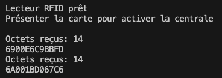
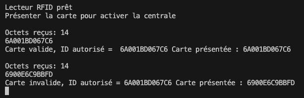

# Capteur RFID de Grove

25 mars 2025


---

Voici un exemple de code qui affiche, dans la console moniteur, le numéro d'identification d'une clé RFDI (à droite sur les photos) déposée sur un capteur (à gauche sur les photos).

```cpp
/*
  Auteur: Alain Boubreault
  Date:   2025.03.25
  ----------------------------------------------------------------
  Exemple d'utilisation du capteur RFID de Grove.
  Ce capteur est connecté sur le port série 1 (RX1, TX1) de l'Arduino Mega.
  Le code ci-dessous permet de lire les données de la carte RFID et de les afficher dans le moniteur série.
  Le code est basé sur l'exemple fourni par Seeed Studio pour le capteur RFID de Grove.
  https://wiki.seeedstudio.com/Grove-125KHz_RFID_Reader/
  ----------------------------------------------------------------
  Si vous approchez une carte RFID du capteur, vous devriez voir les données de la carte s'afficher dans le moniteur série.
  */
#include <Arduino.h>
#include <SoftwareSerial.h>
#include "Streaming.h"

#define portRFID      Serial1   // Le capteur RFID est connecté sur le port série 1 (RX1, TX1) de l'Arduino Mega
#define VITESSE_UART  9600      // Vitesse de communication avec le capteur RFID et la console de débogage
void clearBufferArray();

unsigned char buffer[64];       // tableau pour stocker les données reçues du capteur RFID
int count = 0;                  // compteur pour le nombre d'octets reçus du capteur RFID
// ----------------------------------------------------------------
void setup()
{
    portRFID.begin(VITESSE_UART);       // Le capteur RFID fonctionne à 9600 bauds
    Serial.begin(VITESSE_UART);         // La console de débogage fonctionne à 9600 bauds
    Serial << "\nLecteur RFID prêt\nPrésenter la carte pour activer la centrale\n";
}

// ----------------------------------------------------------------
void loop()
{
    // Le lecteur RFID envoie des données sur le port série 1 ?
    if (portRFID.available())              
    {   delay(100); // Attendre un peu pour laisser le temps aux données d'arriver
        while(portRFID.available())               // Lire les données reçues
        {
            buffer[count++] = portRFID.read();  // Les données reçues sont stockées dans le tableau buffer
            if(count == 64)break;
        } // fin de while
        Serial << "\nOctets reçus: " << count << endl;
        Serial.write(buffer+1, count-2);          // Afficher les données reçues sans le premier et le dernier octet
        clearBufferArray();                       // Vide le tampon de réception
        count = 0;                                // Réinitialiser le compteur
    }
} // fin de loop

// ----------------------------------------------------------------
// fonction pour vider le tampon de réception des messages du RFDI
void clearBufferArray()                
{
    // Initialiser le tableau buffer avec des zéros
    for (int i=0; i<count; i++)
    {
        buffer[i]=0;
    }                  
} // fin de clearBufferArray
```



Dans la capture d'écran précédente, il y a 12 octets d'affichés parce que le premier et le dernier octet ont été enlevés du traitement.

```cpp
Serial.write(buffer+1, count-2);
```

---

Dans le cadre d'une validation du RFID:



---

###### Document rédigé par Alain Boudreault (aka: VE2CUY) – 2025.03.25

Contenu par VE2CUY