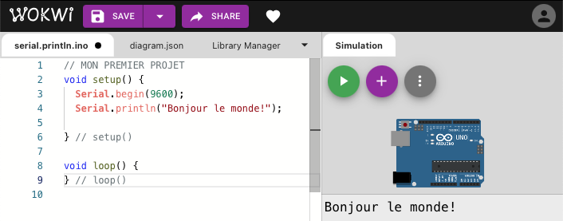
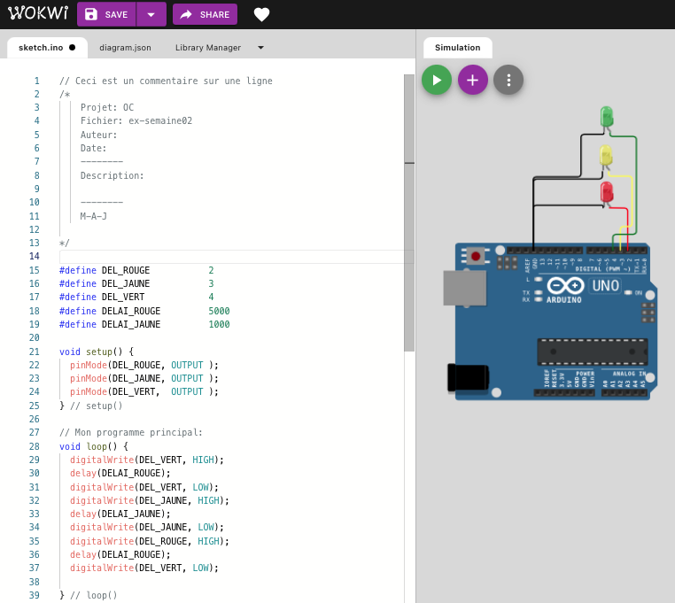
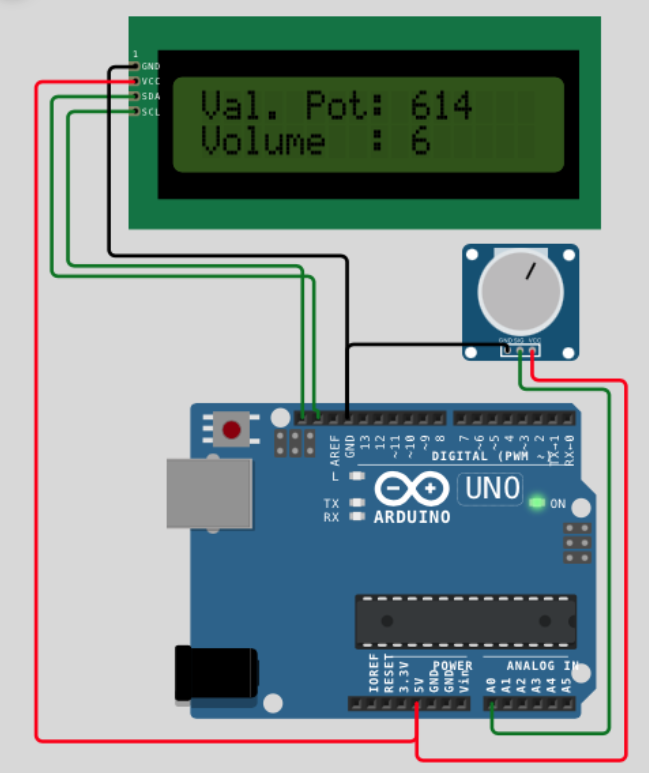
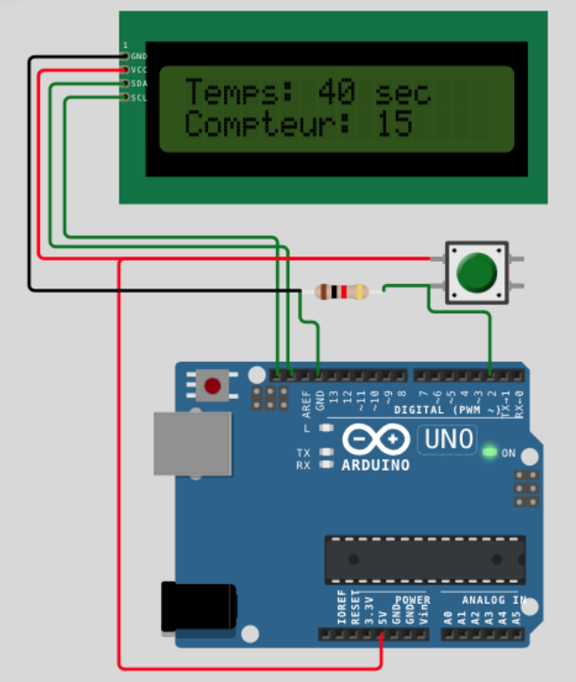
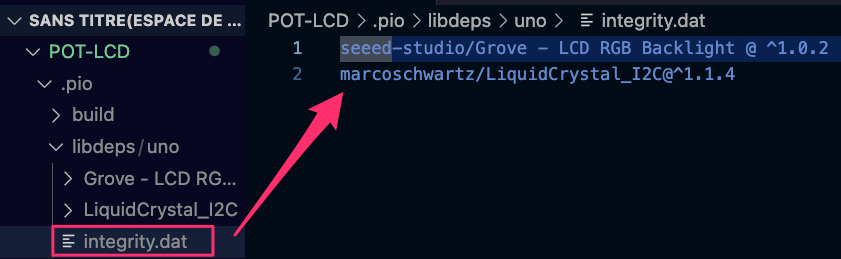

# Copier/Coller et projets Wokwi

### A – Les copier/coller

### B – Les projets sur Wokwi

### C – Erreurs et solutions

---

## A- Les copier/coller

## A.1 – Arduino – Stub de départ

```c
#include <Arduino.h>

/*
  Commentaires d'entête
*/

void setup() {
} // setup()

void loop() {
} // loop()

// Sous Arduino IDE, la fonction main() est abstraite.
// Son implémentation ressemble à :
void main() {
  init();
  setup();
  for(;;){
    loop();
  }
}
```

---

## A.2 – Configuration d'un 'snippet' C++ dans VS-Code pour le 'stub' Arduino de départ: (fichier cpp.json) F1-> snippet …

```json
{
"Arduino code de départ" : {
		"prefix" : "stub",
		"body" : [
			"/*",
			"   Projet:  $TM_DIRECTORY",
			"   Fichier: $TM_FILENAME",
			"   Auteur:  ",
			"   Date:    $CURRENT_YEAR-$CURRENT_MONTH-$CURRENT_DATE $CURRENT_HOUR:$CURRENT_MINUTE:$CURRENT_SECOND",
			"-----------------------------------------------",
			"   Description:",
			"",
			"-----------------------------------------------",
			"   M-A-J:",
			"*/",
			"",
			"#include <Arduino.h>",
			"#define VITESSE_UART 9600",
			"",
			"void setup() {",
			" Serial.begin(VITESSE_UART);",
			" Serial.println(F(\"Début du programme ...\"));",
			"} // setup()",
			"",
			"void loop() {",
			"} // loop()",
			"",
			"// FIN DU FICHIER"
		]
	},
"Arduino main.h" : {
		"prefix" : "main_h",
		"body" : [	
			"#ifndef main_h",
			"#define main_h",
			"",
			"#endif"
		]
	}		
}
```

Référence: [Snippets in Visual Studio Code](https://code.visualstudio.com/docs/editor/userdefinedsnippets)

---

## A.3 – Lier une librairie Installée, à un projet dans PatformIO:

* Naviguer vers PlatformIO->Libraries->Installed
* Sélectionner la librairie désirée puis choisir l'onglet: Installation
* Des indications seront affichées pour la modification du fichier platformio.ini. Par exemple;
  + lib\_deps = seeed-studio/Grove – LCD RGB Backlight @ ^1.0.2

---

## A.4 – Boite

```
┌──────────────────────────────────────────────────────────────────┐
│                                                                  │      
├──────────────────────────────────────────────────────────────────┤      
│                                                                  │      
│                                                                  │      
│                                                                  │      
├──────────────────────────────────────────────────────────────────┤      
│                                                                  │      
└──────────────────────────────────────────────────────────────────┘
```

## A.5 – Séquence ANSI

| Couleur | Avant plan | Arrière plan |
| --- | --- | --- |
| Défaut | Esc[0m |  |
| Noir | Esc[30m | Esc[40m |
| Rouge | Esc[31m | Esc[41m |
| Vert | Esc[32m | Esc[42m |
| Jaune | Esc[33m | Esc[43m |
| Blue | Esc[34m | Esc[44m |
| Magenta | Esc[35m | Esc[45m |
| Cyan | Esc[36m | Esc[46m |
| Gris pale | Esc[37m | Esc[47m |
| Gris foncé | Esc[90m | Esc[100m |
| Rouge clair | Esc[91m | Esc[101m |
| Vert clair | Esc[92m | Esc[102m |
| Jaune clair | Esc[93m | Esc[103m |
| Bleu clair | Esc[94m | Esc[104m |
| Magenta clair | Esc[95m | Esc[105m |
| Cyan clair | Esc[96m | Esc[106m |
| Blanc clair | Esc[97m | Esc[107m |
| Gras | Esc[1m |  |
| Souligné | Esc[4m |  |
| Non souligné | Esc[24m |  |
| Texte inversé | Esc[7m |  |
| Texte non inversé | Esc[27m |  |

Voici un exemple d'utilisation:

```c
// Note: Pour le monitor de PlatformIO, ajouter la directive 
// suivante dans le fichier ini.
// Cela activera l'interprétation des séquences ANSI

monitor_filters = direct 

// ---------------------------------------------------------------------------------------
// Exemple sans librairie
   Serial.print("\033[91m");  // Séquence ANSI pour afficher du texte en rouge.
   Serial.println("Je suis du texte rouge clair");
   Serial.print("\033[97m");  // Séquence ANSI pour afficher du texte en blanc.
   Serial.println("Je suis du texte blanc clair");

// Exemple avec la librairie ANSI de RobTillaart
   ansi.foreground(ansi.white  + ansi.bright);
   ansi.println("Je suis du texte blanc clair");
   ansi.foreground(ansi.red + ansi.bright);
   ansi.println("Je suis du texte rouge clair");

// Exemple avec l'opérateur ternaire
   Serial << (1 == 1 ? "\033[92m" : "\033[93m");
   Serial << "couleur de 1 == 1\n";
```

Voici un exemple fonctionnel:

```c
#include <Arduino.h>
#include "ansi.h"
#include <Streaming.h>

#define ANSI_ROUGE          "\033[31m"
#define ANSI_VERT           "\033[32m"
#define ANSI_BLEU           "\033[34m"
#define ANSI_JAUNE          "\033[33m"
#define ANSI_BLANC          "\033[0m"
#define CURSEUR_ON          "\033[?25h"
#define CURSEUR_OFF         "\033[?25l"

ANSI ansi(&Serial);

void setup() {
  Serial.begin(9600);
  ansi.clearScreen();
  Serial << CURSEUR_OFF << ANSI_BLANC;
  Serial << (F("╔══════════════════════════════════════════════════════╗\n"));
  Serial << (F("║      Exemple d'affiche avec séquences ANSI.          ║\n"));
  Serial << (F("╟──────────────────────────────────────────────────────╢\n"));
  Serial << (F("║                                                      ║\n"));
  Serial << (F("║                                                      ║\n"));
  Serial << (F("║ millis() =                                           ║\n"));
  Serial << (F("╚══════════════════════════════════════════════════════╝\n")); 
   ansi.gotoXY(3, 4);
  Serial << ANSI_ROUGE << "Je suis ROUGE";
  ansi.gotoXY(3, 5);
  Serial << ANSI_VERT << "Je suis VERT";
} // setup()

void loop(){
  ansi.gotoXY(14, 6);
  Serial << (millis() < 10000 ? ANSI_BLEU : ANSI_JAUNE) << millis();
} // loop()
```

Ce qui va produire ceci:


[Référence complète (en anglais)](https://gist.github.com/fnky/458719343aabd01cfb17a3a4f7296797)

---

## A.6 – Fonction pour afficher une boite

```c
void setup(){
// ************************************************************
   // Définir la largeur et la hauteur de la boîte
   int largeur = 50;  // Exemple de largeur
   int hauteur = 18;  // Exemple de hauteur

   // Définir combien de lignes horizontales simples à imprimer
   int nbLignesHorizontales = 2;

   // Définir les numéros des lignes où les lignes horizontales simples doivent être imprimées
   int lignesHorizontales[] = {4, 14};

   // Appeler la fonction pour afficher la boîte avec les lignes horizontales simples spécifiées
   afficherBoite(largeur, hauteur, nbLignesHorizontales, lignesHorizontales);
} // setup()

// ************************************************************
// Fonction: afficherBoite()
// Auteur: Alain Boudreault

void afficherBoite(int largeur, 
                   int hauteur, 
                   int nbLignesHorizontales, 
                   int lignesHorizontales[]
                  )

// ************************************************************
 {
  // Afficher la première ligne (coin supérieur gauche, lignes horizontales doubles)
  Serial.print("╔");
  for (int i = 0; i < largeur - 2; i++) {
      Serial.print("═");
  }
  Serial.println("╗");

  // Afficher les lignes intermédiaires (lignes verticales)
  for (int i = 1; i < hauteur - 1; i++) {
      int ligneImprimee = 0;

      // Vérifier si la ligne courante est une ligne à afficher avec une ligne horizontale simple
      for (int j = 0; j < nbLignesHorizontales; j++) {
          if (i == lignesHorizontales[j]) {
              // Afficher une ligne horizontale simple avec jointure
              Serial.print("╟");
              for (int k = 0; k < largeur - 2; k++) {
                  Serial.print("─");
              }
              Serial.println("╢");
              ligneImprimee = 1;
              break;
          }
      }

      if (!ligneImprimee) {
          // Si aucune ligne horizontale simple n'a été imprimée, afficher une ligne verticale avec des espaces
          Serial.print("║");
          for (int j = 0; j < largeur - 2; j++) {
              Serial.print(" ");
          }
          Serial.println("║");
      }
  }

  // Afficher la dernière ligne (coin inférieur gauche, lignes horizontales doubles)
  if (hauteur > 1) {
      Serial.print("╚");
      for (int i = 0; i < largeur - 2; i++) {
          Serial.print("═");
      }
      Serial.println("╝");
  }
} // afficherBoite()
```


---

## 1 – Afficher dans la console série

```c
void setup() {
  // Note: Sous PlatformIO, la vitesse du terminal est de 9600 Baud.
  // Il est possible de la changer, dans le fichier platformio.ini,  avec la propriété monitor_speed = 115200. 
  Serial.begin(9600);
  Serial.print("Bonjour le ");
  Serial.println("monde!");
}
```

---

## 2 – Afficher un nombre en binaire et hexadécimal:

```c
void setup() {
  unsigned int unNombre = 99;
  Serial.begin(9600);
  Serial.print("unNombre affiché en binaire: ");
  Serial.println(unNombre, BIN);
  Serial.print("unNombre affiché en hexadécimal: ");
  Serial.println(unNombre, HEX);
}
```

---

## 3 – Augmenter la valeur d'une variable de 5

```c
uneVariable+=5;
```

---

## 4 – Diminuer la valeur d'une variable de 47

```c
uneVariable-=47;
```

---

## 5 – Renseigner une broche digitale en mode de sortie (OUTPUT) et y appliquer un signal 'ALLUMER' (HIGH)

```c
pinMode(noBroche, OUTPUT);
digitalWrite(noBroche, HIGH);  // Allume la DEL connectée à la broche noBroche
```

---

## 6 – Renseigner une broche digitale en mode d'entrée/lecture (INPUT) et lire son état

```c
pinMode(pinPushButton, INPUT);
etatPushButton = digitalRead(pinPushButton, HIGH);  // Placer l'état du pushButton dans etatPushButton
```

---

## 7 – Attendre que le pushButton soit relâché avant de continuer

```c
 if (digitalRead(BROCHE_BOUTON))        // Si bouton appuyé alors
  {
    // ... traitement ...
    while(digitalRead(BROCHE_BOUTON));  // Attendre le relâchement du bouton
    delay(50);                          // Éliminer le bruit du bouton.  
  }
```

---

## 7.1 – Bouton, compteur et relai

```c
/*
    Nos premiers pas avec un bouton interrupteur
    Lorsqu'appuyé, le bouton vaut 1 sinon, il vaut 0.
*/

#include <Arduino.h>
#include <Streaming.h>
#define LED             4
#define BOUTON          3
#define RELAI           2
#define VITESSE_SERIAL  9600

void setup() {
    Serial.begin(VITESSE_SERIAL);
    Serial << F("Début du programme ...\n");
    pinMode(LED, OUTPUT);
    pinMode(RELAI, OUTPUT);
    pinMode(BOUTON, INPUT);
    digitalWrite(LED,HIGH);
} // setup()

void loop() {
    static unsigned long i = 0;
    if (digitalRead(BOUTON)) {
      Serial << "Bouton appuyé " << ++i << " fois" << endl; 
      digitalWrite(RELAI, HIGH);
      while(digitalRead(BOUTON)); // tant que BOUTON appuyé
      delay(50);  // Debounce
      digitalWrite(RELAI, LOW);
    } // if
} // loop()
```

---

## 8 – Utilisation de la mémoire: char[] vs String vs F()

```c
/*
    Projet:  
    Auteur: Alain Boudreault
    Date:   2025.01.22
    --------------------------------------------------------------
    Description:

    Démonstration de l'utilisation de la mémoire RAM/Flash 
    entre une déclaration de type char[] et String
    RAM : 218, Flash: 1546  -> char[]
    RAM : 234, Flash: 2878  -> String

    Utilisation de la Macro F() -> Chaine en Mem Flash
    RAM : 188, Flash: 1560  -> char[]
    --------------------------------------------------------------
    Advanced Memory Usage is available via 
    "PlatformIO Home > Project Inspect"
    RAM:   [=         ]   9.2% (used 188 bytes from 2048 bytes)
    Flash: [          ]   4.8% (used 1560 bytes from 32256 bytes)
*/

#include <Arduino.h>
#define MESSAGE "abcdef"

#define TESTER_F
//#define STRING

#ifndef TESTER_F
  #ifdef STRING
    String msg = MESSAGE;
  #else
    char msg[] = MESSAGE;
  #endif
#endif

int i = 50;

void setup() {
   Serial.begin(115200);
#ifndef TESTER_F
   Serial.println("Début du programme...");
   Serial.println(msg);
#else   
   Serial.println(F("Début du programme..."));
   Serial.println(F(MESSAGE));
#endif   
}

void loop() {
}
```

---

## 8.1 – Tableau de chaines de caractères

```c
const char* messages[] = {  "Éteint",                // 0
                            "Allumé",                // 1
                            "Température élevée",    // 2
                            "Message 04",            // 3
                            "Message 05",            // 4 
                            "Message 06",            // 5
                            "Message 07",            // 6
                            "Message 08",            // 7
                            "Message 09",            // 8
                            "Mouvement détecté!!"    // 9
                      };
```

---

## 8.2 – Fonction retournant une chaine de caractères

```c
const char * obtenirJourSemaine(int jourSemaine){
  switch (jourSemaine){
    case 0: return "Dimanche";
    case 1: return "Lundi";
    case 2: return "Mardi";
    case 3: return "Mercredi";
    case 4: return "Jeudi";
    case 5: return "Vendredi";
    case 6: return "Samedi";
    default: return "Erreur";
  }
} // obtenirJourSemaine()
```

---

## 9 – Conversion d'un 'float' en chaine de caractères

```c
float fPI = PI;  // sous Arduino, float == double.
char
    szStr[30],
    szF[6]; // Prévoir de la place pour le point, le signe (-) et le car de fin \0.
    
void setup( void )
{
    Serial.begin(115200);
    // dtostrf(float_value, min_largeur, nombres_apres_decimale, tableau_de_car)
    dtostrf( fPI, 4, 2, szF );
    sprintf( szStr, "PI est égal à %s", szF ); // Voir la fn snprintf()
    Serial.println( szStr );
    
}//setup
```

---

## 10.1 – Utilisation d'une MACRO pour l'affichage au terminal

```c
#ifdef DEBUG
#define AFFICHER(x) Serial.print(x)
#else
#define AFFICHER
#endif

// Utilisation:
AFFICHER("Un message ...\n");
```

10.2 – Exemple d'une MACRO avec un nombre variable de paramètres:

```c
#define AFFICHER(...)  Serial.print(__VA_ARGS__)

// Utilisation:
AFFICHER(255, HEX);
AFFICHER("Test");
```

---

## 11 – Exemple de contenu du fichier platformio.ini

```ini
; PlatformIO Project Configuration File
;
;   Build options: build flags, source filter
;   Upload options: custom upload port, speed and extra flags
;   Library options: dependencies, extra library storages
;   Advanced options: extra scripting
;
; Please visit documentation for the other options and examples
; https://docs.platformio.org/page/projectconf.html

[env:uno]
platform      = atmelavr
board         = uno
framework     = arduino
monitor_speed = 115200
debug_tool    = avr-stub

build_flags   =  -felide-constructors -std=c++0x

;debug_port = SERIAL_PORT
;debug_port = /dev/cu.usbmodem834201

; platform_packages = 
;	toolchain-atmelavr@~3.70300.220127
; GDB stub implementation
;lib_deps =
;    jdolinay/avr-debugger @ ~1.5
```

---

## 12 – lcd\_rgb – Variation de **RED**

```c
/*
  Projet:  C:\Users\alin_\Documents\PlatformIO\Projects\Projet02\src
  Fichier: main.cpp
  Auteur:  
  Date:    2025-01-28 17:06:27
-----------------------------------------------
  Description:

-----------------------------------------------
  M-A-J:
*/

#include "main.h"

rgb_lcd ecran;

void setup() {
  Serial.begin(VITESSE_UART);
  Serial.println(F("Début du programme ..."));
  ecran.begin(16,2);
} // setup()

void loop() {
  ecran.clear();
  ecran.print("Variation de RED");
  for (int i = 255; i > 0; i-=10)
    { 
      ecran.setRGB(i,0,0);
      ecran.setCursor(0,1);
      ecran.print("i = ");
      ecran.setCursor(4,1);
      ecran.print("   ");
      ecran.setCursor(4,1);
      ecran.print(i);
      AFFICHER(i);AFFICHER("\n");
      delay(UN_COURT_MOMENT);
    }
} // loop()

// FIN DU FICHIER
```

```c
// main.h
#ifndef main_h
    #define main_h
    #define DEBUG
    #include <Arduino.h>
    #define VITESSE_UART 9600
    #include "rgb_lcd.h"
    #define UN_COURT_MOMENT  100

    #ifdef DEBUG
        #define AFFICHER(...)  Serial.print(__VA_ARGS__)
    #else 
        #define AFFICHER
    #endif
#endif
```

---

## 13 – lcd\_rgb : Défilement de caractères:

```c
#include <Arduino.h>
#include "rgb_lcd.h"

rgb_lcd ecran;  // Déclaration de l'objet de contrôle du LCD 

void uneFonctionAmusante();
void setup() {
  ecran.begin(16,2);
  ecran.print("Coucou");
}

void loop() {
  static long unsigned int i = 1;
  ecran.clear();
  ecran.print("i = ");
  ecran.print(i++);
  delay(500);
  uneFonctionAmusante();
}

void uneFonctionAmusante(){
    
    ecran.setCursor(0, 0);  // Curseur à la position (0,0)

    // Afficher 0 à 9:
    for (int thisChar = 0; thisChar < 10; thisChar++) {
        ecran.print(thisChar);
        delay(50);
    } // for

    ecran.setCursor(16, 1); // Curseur à la position (16,1):
    ecran.autoscroll();     // Activer le défilement
    // Afficher 0 à 9:
    for (int thisChar = 0; thisChar < 10; thisChar++) {
        ecran.print(thisChar);
        delay(50);
    }
    ecran.noAutoscroll();   // Desactiver le défilement
    ecran.clear();          // Effacer l'écran:
} // uneFonctionAmusante
```

---

## 14 – Des exemples de la directive #pragma

```c
#pragma once // Directive de garde

#pragma message "Ce message va apparaitre à la compilation!"

#pragma message "Compilation du fichier " __FILE__ " ..."

//
#define DO_PRAGMA(x) _Pragma (#x)
#define TODO(x) DO_PRAGMA(message ("TODO - " #x))
...
TODO(Penser à corriger ceci...)

// Traiter un fichier d'entête comme un fichier système:
#ifndef MA_LIBRAIRIE_H
#define MA_LIBRAIRIE_H
#pragma GCC system_header
void uneFonction();
#endif

// Ce qui va permettre d'utiliser la syntaxe suivant:
#include <ma_librairie.h>  // au lieu de "ma_librairie.h"
// Note, sous GCC, les deux syntaxes sont interchangeables.
```

La directive `#pragma` est la méthode spécifiée par la norme C pour fournir des informations supplémentaires au compilateur, au-delà de ce qui est exprimé dans le langage lui-même. Les formes de cette directive (couramment appelées *pragmas*) spécifiées par la norme C commencent par le préfixe `STDC` (macro qui vaut 1). Un compilateur C est libre d'attribuer n'importe quelle signification aux autres pragmas. La plupart des pragmas définis et supportés par GNU ont un préfixe `GCC`.

C99 a introduit l'opérateur `_Pragma`. Cette fonctionnalité résout un problème majeur avec `#pragma` : étant une directive, elle ne peut pas être générée par l'expansion d'une macro. `_Pragma` est un opérateur, similaire à `sizeof` ou `defined`, et peut être intégré dans une macro.

[Référence](https://gcc.gnu.org/onlinedocs/cpp/Pragmas.html) et [ici](https://gcc.gnu.org/onlinedocs/gcc-3.3.6/cpp/Standard-Predefined-Macros.html)

**NOTE**: GNU ne recommande pas l'utilisation de Pragma.

---

## 15 – Utilisation de sizeof()

```c
    char buffer[8];
    Serial << "Size of char       : " << sizeof(char) << " octet(s)" << endl;
    Serial << "Size of int        : " << sizeof(int) << " octet(s)" << endl;
    Serial << "Size of long int   : " << sizeof(long int) << " octet(s)" << endl;
    Serial << "Size of float      : " << sizeof(float) << " octet(s)" << endl;
    Serial << "Size of double     : " << sizeof(double) << " octet(s)" << endl;
    Serial << "Size of pointer    : " << sizeof(void *) << " octet(s)" << endl;
    Serial << "Size of buffer[8]  : " << sizeof(buffer) << " octet(s)" << endl;

// Ces instructions, roulant sur un Arduino Uno (MCU 8 bits), vont afficher :

Size of char       : 1 octet(s)
Size of int        : 2 octet(s)
Size of long int   : 4 octet(s)
Size of float      : 4 octet(s)
Size of double     : 4 octet(s)
Size of pointer    : 2 octet(s)
Size of buffer[8]  : 8 octet(s)
```

---

## 16 – millis() -> Jours-heures:minutes:sec.centieme

```c
#include <Arduino.h>
#include <rgb_lcd.h>

#define SECONDES_PAR_JOUR    86400
#define SECONDES_PAR_HEURE   3600
#define SECONDES_PAR_MINUTE  60
#define CENTIEME_PAR_SECONDE 100
#define LCD_NB_COLONNE       16
#define LCD_NB_LIGNE         2

rgb_lcd ecran;

void setup() {
    ecran.begin(LCD_NB_COLONNE, LCD_NB_LIGNE);
} // setup()

void loop() {
   char temps[17] = ""; // Longueur d'une ligne du LCD + un (0 pour fin de chaine)

   unsigned long lesMillis  = millis();
   unsigned long secondes   = lesMillis / 1000;
   unsigned long sec100     = lesMillis / 10 ;

   int jours    = secondes / SECONDES_PAR_JOUR;
   secondes     %= SECONDES_PAR_JOUR;
   byte heures  = secondes / SECONDES_PAR_HEURE;
   secondes     %= SECONDES_PAR_HEURE;
   byte minutes = secondes / SECONDES_PAR_MINUTE;
   secondes     %= SECONDES_PAR_MINUTE;
   sec100       %= CENTIEME_PAR_SECONDE; 
 
   snprintf(temps, sizeof(temps), "%03dj %02d:%02d:%02lu.%02lu", jours, heures, minutes, secondes, sec100);
   ecran.setCursor(0,0);
   ecran.print(temps);

} // loop()
```

## 17 – Utilisation de pointeurs

```c
int a = 10, b = 20;
cout << "Avant l'échange: a = " << a << ", b = " << b << endl;
echagerValeurs(&a, &b);
cout << "Après l'échange: a = " << a << ", b = " << b << endl;

// Exemple de fonction pour échanger les valeurs de deux variables en utilisant des pointeurs
void echagerValeurs(int * ptrA, int * ptrB) {
  int temp = *ptrA;
  *ptrA = *ptrB;
  *ptrB = temp;
} // echangerValeurs
```

---

## 17.1 – Pointeurs et références sur des 'string'

```c
// Exemple avec des pointeurs
void echangerStrings(std::string * ptrA, std::string * ptrB) {
  cout << "Adresse de ptrA " << ptrA << " et Adresse de ptrB " << ptrB << endl;
  std::string temp = *ptrA;
  *ptrA = *ptrB;
  *ptrB = temp;
} // echangerStrings

// Exemple avec des références (surcharge de la fonction echangerString)
// Les paramètres seront automatiquement 'caster' en pointeurs
void echangerStrings(std::string &ptrA, std::string &ptrB) {
  std::string temp = ptrA;
  ptrA = ptrB;
  ptrB = temp;
} // echangerStrings

// Exemples d'utilisation:
std::string strA = "Bonjour", strB = "Salut";
cout << "Avant l'échange: strA = " << strA << ", strB = " << strB << endl;
echangerStrings(&strA, &strB); // Utilise la première définition de la fonction
cout << "Après l'échange: strA = " << strA << ", strB = " << strB << endl;
echangerStrings(strA, strB);   // Utilise la deuxième définition de la fonction
cout << "Après l'échange: strA = " << strA << ", strB = " << strB << endl;
```

Ce qui va afficher:

```
Avant l'échange: strA = Bonjour, strB = Salut
Adresse de ptrA 0x16b122a48 et Adresse de ptrB 0x16b122a30
Après l'échange: strA = Salut, strB = Bonjour
Après l'échange: strA = Bonjour, strB = Salut
```

---

## 20 – Transmetteur via UART ou broches digitales

```c
/*
 Code du transmetteur - sur le MEGA
 Note: Relier deux Arduino via le port D6
*/

#include <SoftwareSerial.h>
#include "rgb_lcd.h"
#include "Streaming.h"

#define UART_RX             6
#define UART_TX             7
#define UART_VITESSE        9600
#define MAX_NB_ALEATOIRE    99
#define UNE_SECONDE         1000
#define LCD_DEUXIEME_LIGNE  1
#define LCD_NB_LIGNE        2
#define LCD_NB_COL          16

#define UART_MEGA
#ifdef UART_MEGA
   #define portSerieTransmetteur Serial3
#else
  SoftwareSerial portSerieTransmetteur(UART_RX, UART_TX); // RX, TX
#endif

rgb_lcd lcd;  // Déclaration de l'objet de contrôle du LCD 

void setup() {
  Serial.begin(UART_VITESSE); // port natif utilisé pour le débogage
  Serial.println("Démarrage du transmetteur...");
  lcd.begin(LCD_NB_COL,LCD_NB_LIGNE);
  lcd.print("Transmetteur");
  // Initialiser le port serie 'SoftwareSerial'
  portSerieTransmetteur.begin(UART_VITESSE);
} // setup()

void loop() {
   // Transmettre un code à chaque seconde  
   // générer un nombre entre 0 et MAX_NB_ALEATOIRE - 1
   byte unCode = random(MAX_NB_ALEATOIRE); 
   portSerieTransmetteur.write(unCode);
   Serial << "Envoi du code suivant: " << unCode << endl;
   lcd.setCursor(0, LCD_DEUXIEME_LIGNE);
   lcd << "Envoi de: " << unCode;
   delay(UNE_SECONDE);
} // loop()
```

---

---

## B – Les projets sur Wokwi

1 – [Serial.println()](https://wokwi.com/projects/340719193452184147)

[](https://wokwi.com/projects/340719193452184147)

---

2 – [Clignoter une DEL (broche 13)](https://wokwi.com/projects/342633299140674132)

[](https://wokwi.com/projects/342633299140674132)

---

3 – [Clignoter trois DELs – Lumières de circulation](https://wokwi.com/projects/341435633034592850)

[](https://wokwi.com/projects/341435633034592850)

---

4 – [Conversion de base (10,2,8,16) sur un écran LCD](https://wokwi.com/projects/340722670823801427)

[](https://wokwi.com/projects/340722670823801427)

---

5 – [Lecture de l'état d'un pushButton](https://wokwi.com/projects/341337322410738258)

[](https://wokwi.com/projects/341337322410738258)

---

6 – [Attendre qu'un pushButton soit relâché avant que le programme reprenne](https://wokwi.com/projects/342965838174749267)

[](https://wokwi.com/projects/342965838174749267)

---

[7 – Solution DOC11.3.5 – Afficher valeur POT sur LCD](https://wokwi.com/projects/343893684389937748)

[](https://wokwi.com/projects/343893684389937748)

---

[8 – Solution DOC11.3.6 – LCD + Temps qui passe + compteur bouton](https://wokwi.com/projects/343892046296121940)

[](https://wokwi.com/projects/343892046296121940)

---

## C – Erreurs et solutions

### C.1 – Erreur avec les librairies sous PlatformIO

```
Dans une de ces situations:

Link Error:
Resolving Uno dependencies…
Removing unused dependencies…

1 - SemanticVersionError: Invalid simple spec: '^0.0.0-alpha+sha.39f236ea18'
2 - SemanticVersionError: Invalid simple block '^2.0.6;'
```

**Solution**: Effacer le contenu du fichier .pio/libdeps/integrity.dat

